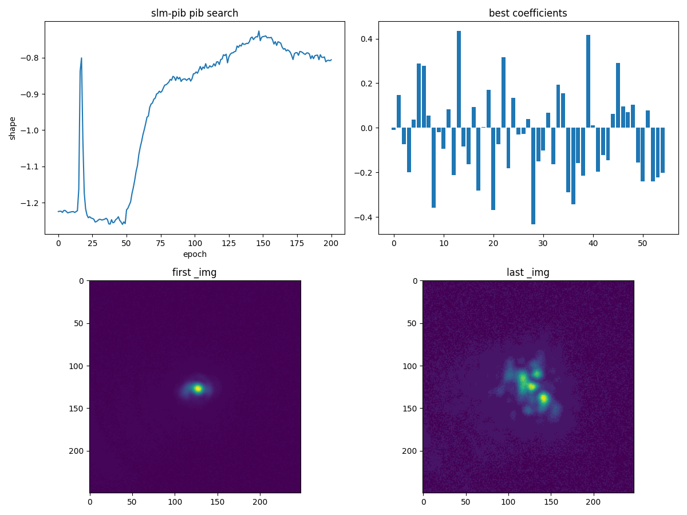

# SLM-Zernike 整形优化器报告 (slm_zernike_shaping)

**生成时间**: 2026-09-26 16:31:40

**Fully offline** — 本报告由 `scripts/generate_slm_zernike_shaping_report.py` 离线生成, 仅读取 `slm_zernike_shaping` 优化器以 `debug=True` 保存的 PKL/JSON 调试产物, 不打开任何硬件。

## 1. 产物格式

每个运行对应一个产物目录:

```
<debug_dir>/debug/slm_zernike_shaping_<objective>_<ts>/<ts>/
  ├── slm_zernike_shaping_<objective>_<ts>_<ts>.pkl   # {epoch: record}
  ├── slm_zernike_shaping_<objective>_<ts>_<ts>.json  # 配置 payload
  └── slm_zernike_shaping_<objective>_<ts>_<ts>.png   # 运行期汇总图
```

PKL 记录的键来自优化器的 `_DEBUG_SCALAR_KEYS` / `_DEBUG_IMG_KEYS` / `_DEBUG_1D_KEYS` (`_img` 远场帧, `_c` Zernike 系数向量) 以及跨目标指标 `m_shape / m_energy / m_rmse / m_roi_pib / m_pib / m_pib7 / m_rms_pib / m_rms_t / m_ee / m_brt`; 优化目标自身还有一个以目标命名的列 (如 `rmse_out` / `pib` / `shape`)。本脚本全部按键读取并以 `.get()` 兜底, 缺失的图会被跳过而不是报错。

## 2. 运行 `run0` (目录 `20260926_163121`)

### 2.1 运行配置 (JSON sidecar)

| 项目                      | 值                                                                          |
| ------------------------- | --------------------------------------------------------------------------- |
| objective 优化目标        | `rmse_out`                                                                |
| target_shape 目标形状     | `square`                                                                  |
| target_size 目标尺寸 (px) | `50.0`                                                                    |
| epochs 迭代数             | `100`                                                                     |
| algorithm 搜索族          | `spgd`                                                                    |
| optimizer_type 梯度更新器 | `adamod`                                                                  |
| delta SPGD 扰动幅度       | `0.5`                                                                     |
| w_outside 框外能量权重    | `1.0`                                                                     |
| r_bucket 半径桶 (px)      | `0.0`                                                                     |
| cam_type 相机后端         | `daheng`                                                                  |
| cam_size 开窗 (px)        | `250`                                                                     |
| 产物目录                  | `data\debug\slm_zernike_shaping_rmse_out_20260926_163121\20260926_163121` |
| 记录条数                  | 101 (epoch 0..100)                                                          |

### 2.2 目标函数结果

- **最优 `rmse_out` = 0.532817, 出现在 epoch 3** (该目标为**最小化**)
- 初始值 0.536862 → 末值 0.665692 (未改善); 最优相对初始 0.0040449
- 优化器内部跟踪的 `best_<objective>` 未写入调试产物 (`_DEBUG_SCALAR_KEYS` 不含该键), 故最优值由本脚本从目标列重算。


### 2.3 解读

- 左图是本次运行真正优化的目标列 `rmse_out` (最小化), 红星标出全局最优 epoch; 右图是同一批记录里交叉记录的全部 `m_*` 指标, 便于观察各指标是否同向变化。
- Zernike 系数图给出逐模式演化与 `‖_c‖₂` 范数: 范数持续增长说明搜索仍在推动相位偏离初始值, 范数饱和则表示该自由度已到边界。
- 远场帧按 first / best / last 三联对比 (统一灰度标度), 直观显示目标框内的能量分布如何随迭代变化。

## 2. 运行 `run1` (目录 `20260926_162917`)

### 2.1 运行配置 (JSON sidecar)

| 项目                      | 值                                                                         |
| ------------------------- | -------------------------------------------------------------------------- |
| objective 优化目标        | `rms_pib`                                                                |
| target_shape 目标形状     | `square`                                                                 |
| target_size 目标尺寸 (px) | `50.0`                                                                   |
| epochs 迭代数             | `100`                                                                    |
| algorithm 搜索族          | `spgd`                                                                   |
| optimizer_type 梯度更新器 | `adamod`                                                                 |
| delta SPGD 扰动幅度       | `0.5`                                                                    |
| w_outside 框外能量权重    | `1.0`                                                                    |
| r_bucket 半径桶 (px)      | `0.0`                                                                    |
| cam_type 相机后端         | `daheng`                                                                 |
| cam_size 开窗 (px)        | `250`                                                                    |
| 产物目录                  | `data\debug\slm_zernike_shaping_rms_pib_20260926_162917\20260926_162917` |
| 记录条数                  | 101 (epoch 0..100)                                                         |

### 2.2 目标函数结果

- **最优 `rms_pib` = 0.623688, 出现在 epoch 66** (该目标为**最大化**)
- 初始值 0.614717 → 末值 0.585336 (未改善); 最优相对初始 0.00897115
- 优化器内部跟踪的 `best_<objective>` 未写入调试产物 (`_DEBUG_SCALAR_KEYS` 不含该键), 故最优值由本脚本从目标列重算。


### 2.3 解读

- 左图是本次运行真正优化的目标列 `rms_pib` (最大化), 红星标出全局最优 epoch; 右图是同一批记录里交叉记录的全部 `m_*` 指标, 便于观察各指标是否同向变化。
- Zernike 系数图给出逐模式演化与 `‖_c‖₂` 范数: 范数持续增长说明搜索仍在推动相位偏离初始值, 范数饱和则表示该自由度已到边界。
- 远场帧按 first / best / last 三联对比 (统一灰度标度), 直观显示目标框内的能量分布如何随迭代变化。

## 3. 结论

1. **完全离线可复现**: 本报告只依赖 `debug=True` 写出的 PKL/JSON, 任何一次 `slm_zernike_shaping` 运行 (仿真或硬件) 的产物都能重新出报告, 无需再上硬件。
2. **目标方向不假设**: 优化器的 `objective_mode` 决定了 `pib`/`shape`/`roi_pib`/`rms_pib`/`avg_radiu` 是最大化而 `radiu`/`rmse`/`rmse_out` 是最小化; 报告按该约定标注并计算最优 epoch, 避免把最小化目标误读为最大化。
3. **缺键不崩**: 所有记录键均以 `.get()` 读取, 缺 `objective_keys` 的 bundle 会回退到 JSON 里的 `objective`, 再回退到候选列, 全部缺失时只跳过对应图并告警。

## 4. SPGD

> uv run -m ao_shaping.runners.slm_pib_runner spgd -c "max" --target_shape square --target_size 50 --delta 0.0005 --exposure_time_ms 1.2 --show -e 200 --zernike_radius 480 -n 9 --debug --lr 0.5


