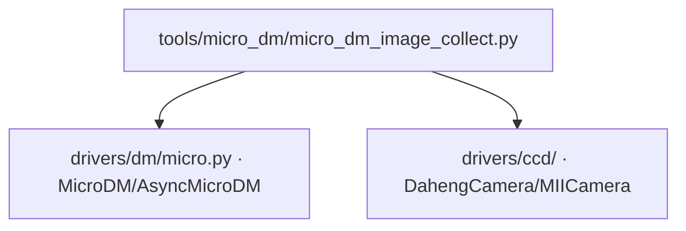

# Micro-DM 逐单元图像采集 (micro_dm_image_collect)

> **生成脚本**: [`scripts/generate_micro_dm_image_collect_report.py`](../../scripts/generate_micro_dm_image_collect_report.py)
> **复现命令**: `python scripts/generate_micro_dm_image_collect_report.py`
> **运行环境**: 硬件实测 (需 R50Power Micro-DM + 相机)

## 1. 这条工具做什么

对 Micro-DM (R50Power 控制器阵列) 逐单元施加电压，采集远场光斑图像，用于响应矩阵构建、影响函数测量、光学系统标定。

## 2. 调用关系



## 3. 采集流程

1. **加载布线映射**：`libs/micro_drive1300/wiring_map.json` (IP → 控制器 ID → 通道 → 物理位置)
2. **遍历单元**：按 39×39 网格坐标 或 按控制器通道顺序
3. **施加电压**：目标单元施加 `test_voltage`，其余单元 0V
4. **稳定等待**：`--settle-time` (默认 0.5s)
5. **采集图像**：读取 `n_frames` 帧平均，保存
6. **可选**：差分采集 (测试电压 - 基线 0V)

## 4. 数据目录结构

```
data/md_test/
├── md_img/                          # 原始灰度图像
│   └── 192.168.0.{101~126}/         # 按 IP 分组
│       └── 192.168.0.{ip}-{seq:03d}.png
├── md_img-100v_processed/diff/      # 100V 差分图像 (FFT 去条纹)
│   └── 192.168.0.{ip}/{ip}-{seq:03d}_cx{X}_cy{Y}.png
└── md_img-100v_gif/                 # GIF 动画 (逐通道)
```

**映射关系**：网格坐标 (row, col) → CSV/Excel → IP 组 + 序号 → 图像文件

详细说明见：`data/md_test/README.md`

## 5. 主要选项

| 选项 | 说明 | 默认值 |
|------|------|--------|
| `--ips` | 控制器 IP 列表 (逗号分隔) | 全部 (从 wiring_map 读取) |
| `--test-voltage` | 测试电压 (V) | 100.0 |
| `--base-voltage` | 基线电压 (V, 差分用) | 0.0 |
| `--n-frames` | 每单元平均帧数 | 10 |
| `--settle-time` | 电压施加后稳定等待 (s) | 0.5 |
| `--exposure-ms` | 相机曝光 (ms) | 10.0 |
| `--cam-id` | 相机 ID | 0 |
| `--cam-type` | 相机类型 (daheng/miicam) | daheng |
| `--output-dir` | 输出根目录 | data/md_test |
| `--grid-order` | 遍历顺序 (grid/channel) | grid |
| `--make-gif` | 生成逐通道 GIF 动画 | False |
| `--fft-destripe` | FFT 去条纹处理差分图 | False |

## 6. 示例

```bash
# 全量采集 (所有控制器，39x39 网格序)
python -m ao_shaping.tools.micro_dm.micro_dm_image_collect --test-voltage 100 --n-frames 10

# 指定控制器，通道序遍历
python -m ao_shaping.tools.micro_dm.micro_dm_image_collect --ips 192.168.0.101 --grid-order channel

# 差分采集 + FFT 去条纹 + 生成 GIF
python -m ao_shaping.tools.micro_dm.micro_dm_image_collect --test-voltage 100 --base-voltage 0 \
    --fft-destripe --make-gif
```

## 7. 关键实现细节

### 布线映射
- `wiring_map.json` 定义：控制器 IP、ID、50 通道每个的物理标签、网格坐标 (x,y)
- 支持 `(x, y)` 双向查询通道信息
- 支持 `(ip_suffix, payload_position)` 反查物理位置

### 容错连接
- `open()` 允许个别控制器连接失败，记录 warning 后继续
- 仅当全部失败时抛出异常

### 连接状态检查
- `get_connection_status()` 返回所有控制器 ping 可达性 + TCP 连接状态

## 8. 单独运行

```bash
python -m ao_shaping.tools.micro_dm.micro_dm_image_collect [OPTIONS]
```