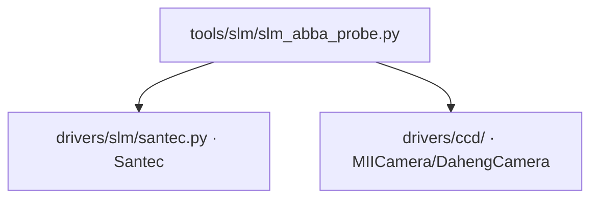

# SLM ABBA 探针 (slm_abba_probe)

> **生成脚本**: [`scripts/generate_slm_abba_probe_report.py`](../../scripts/generate_slm_abba_probe_report.py)
> **复现命令**: `python scripts/generate_slm_abba_probe_report.py`
> **运行环境**: 硬件实测 (需 SLM + 相机)

## 1. 这条工具做什么

**稠密随机相位是否可分辨**。ABBA (`+ - - +`) 消一阶漂移并先量本底。`verdict=unusable` 时**不要去测转移矩阵**。

## 2. 调用关系



## 3. ABBA 协议原理

标准 SPGD 用 `(+δ) - (-δ)` 差分估梯度，但**慢漂移** (线性/低频) 会污染差分：
```
J(t+δ) - J(t-δ) = [真梯度] + [漂移(t+δ) - 漂移(t-δ)]
```
若漂移近似线性：`漂移(t) ≈ v·t`，则 `漂移(t+δ) - 漂移(t-δ) ≈ 2v·δ` → **引入与真梯度同量级的偏置**。

ABBA 序列：`+δ, -δ, -δ, +δ` (四帧)
```
ABBA差分 = [J(+δ)₁ - J(-δ)₁] - [J(-δ)₂ - J(+δ)₂]
         = 4δ·g + [漂移₁ - 漂移₂ - 漂移₃ + 漂移₄]
```
若漂移在 4 帧内线性：`漂移项 = v(t₁ - t₂ - t₃ + t₄) = 0` **完美抵消一阶漂移**。

## 3. 测量流程

1. **本底量测**：遮光/平场，读取 `n_dark_frames` 帧暗噪声
2. **ABBA 扫描**：
   - 生成稠密随机相位场 (全像素高斯白噪声，std = `probe_std`)
   - 执行 ABBA 序列：`+probe, -probe, -probe, +probe`
   - 计算 ABBA 差分帧
   - 计算差分帧 SNR = `mean(diff) / std(diff)`
3. **对照**：同相位场跑标准 `(+ -)` SPGD，对比 SNR
4. **判据**：
   - `verdict=usable`：ABBA SNR 显著优于标准 SPGD，且绝对 SNR > 阈值
   - `verdict=unusable`：ABBA 无优势或 SNR 过低，**不要去测转移矩阵/响应矩阵**

## 4. 主要选项

| 选项 | 说明 | 默认值 |
|------|------|--------|
| `--exposure-ms` | 相机曝光时间 (ms) | 3.0 |
| `--cam-id` | 相机 ID | 0 |
| `--cam-type` | 相机类型 (miicam/daheng) | daheng |
| `--slm-number` | SLM 设备编号 | 1 |
| `--slm-wavelength` | SLM 波长 (nm) | 1064 |
| `--probe-std` | 探针相位标准差 (rad) | 1.0 |
| `--n-abba-repeats` | ABBA 序列重复次数 | 20 |
| `--n-dark-frames` | 暗帧数 | 50 |
| `--bucket-radius` | 桶半径 (像素) | 20 |
| `--snr-threshold` | 可用判定 SNR 阈值 | 3.0 |

## 5. 示例

```bash
python -m ao_shaping.tools.slm.slm_abba_probe --exposure-ms 3.0
```

## 6. 输出

- 控制台打印：暗噪声统计、ABBA vs 标准 SPGD SNR 对比、verdict
- 可选 `--output` 保存 JSON/NPZ

## 7. 关键决策

| Verdict | 含义 | 后续动作 |
|---------|------|----------|
| `usable` | 稠密随机相位可分辨，ABBA 有效抑制漂移 | 可进行响应矩阵标定、矩阵闭环 |
| `unusable` | 面板分辨率不足或漂移过大，**不要测转移矩阵** | 改用 Zernike 低阶优化 (`slm-pib`, `rms-zernike`) |

## 8. 上机前必跑顺序 (不可反)

```
slm_drift_probe → slm_floor_probe → slm_abba_probe
```

完整流程见 [`docs/slm/pre_run_characterization.md`](../slm/pre_run_characterization.md)。