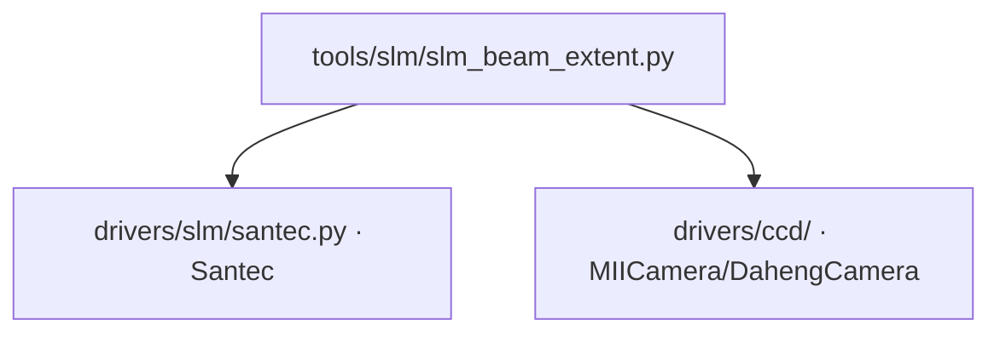

# SLM 光斑范围测量 (slm_beam_extent)

> **生成脚本**: [`scripts/generate_slm_beam_extent_report.py`](../../scripts/generate_slm_beam_extent_report.py)
> **复现命令**: `python scripts/generate_slm_beam_extent_report.py`
> **运行环境**: 硬件实测 (需 SLM + 相机)

## 1. 这条工具做什么

半平面随机相位边界扫描测光斑中心/半径。实测 r=450 px @ (960,600)。

## 2. 调用关系



## 3. 测量原理

- SLM 逐行/逐列加载半平面随机相位 (一半随机相位、一半平场)
- 远场光斑能量随遮挡边界移动而变化
- 通过拟合边缘响应曲线 (误差函数/正弦积分函数) 确定光斑边界
- 双轴扫描 (X 轴 + Y 轴) 得到圆形光斑的中心与半径

## 3. 测量流程

1. 选择扫描轴 (`--axis x` 或 `--axis y`)
2. 在面板坐标范围内均匀采样 `n_steps` 个边界位置
3. 每位置下发半平面随机相位，读取 CCD 帧，计算桶内能量
4. 拟合 S 形边缘响应曲线，提取 50% 能量点 → 边界位置
5. 两轴边界取中点为中心，半径为到边界距离

## 4. 主要选项

| 选项 | 说明 | 默认值 |
|------|------|--------|
| `--axis` | 扫描轴 (x/y) | x |
| `--exposure-ms` | 相机曝光时间 (ms) | 3.0 |
| `--cam-id` | 相机 ID | 0 |
| `--cam-type` | 相机类型 (miicam/daheng) | daheng |
| `--slm-number` | SLM 设备编号 | 1 |
| `--slm-wavelength` | SLM 波长 (nm) | 1064 |
| `--n-steps` | 扫描步数 | 20 |
| `--step-range` | 扫描范围 (面板像素, 相对中心) | 600 |
| `--n-frames` | 每步平均帧数 | 3 |
| `--r-bucket` | 桶半径 (像素) | 20 |

## 5. 示例

```bash
# X 轴扫描
python -m ao_shaping.tools.slm.slm_beam_extent --axis x --exposure-ms 3.0

# Y 轴扫描
python -m ao_shaping.tools.slm.slm_beam_extent --axis y --exposure-ms 3.0
```

## 6. 输出

- 控制台打印：拟合边界位置、光斑中心 (面板坐标)、半径
- 可选 `--output` 保存 NPZ (含原始曲线、拟合参数、中心/半径)

## 7. 台架几何 (不得重新推导)

- 实测光斑中心 (960, 600)、半径 450 面板 px
- **panel↔camera 轴互换 90°**
- 焦面尺度 `shift_px ≈ 7600/period`

详见 [`report/slm/model_in_loop_bench_calibration.md`](../../report/slm/model_in_loop_bench_calibration.md)。