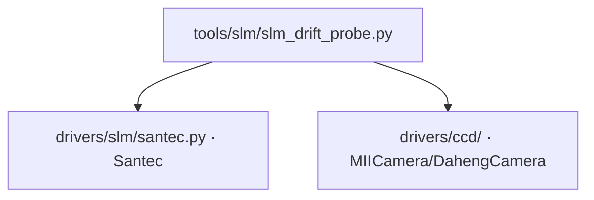

# SLM 漂移探针 (slm_drift_probe)

> **生成脚本**: [`scripts/generate_slm_drift_probe_report.py`](../../scripts/generate_slm_drift_probe_report.py)
> **复现命令**: `python scripts/generate_slm_drift_probe_report.py`
> **运行环境**: 硬件实测 (需 SLM + 相机)

## 1. 这条工具做什么

**平场漂移 + 曝光阶梯线性**。用区域范数判漂移 (**不用峰值** — 实测同设置两次运行峰值读到 100 与 23，而 box sum 稳到 0.2%)。判据 `monotonic`/`non_monotonic`/`saturated`。

## 2. 调用关系



## 3. 测量流程

### 3.1 平场漂移测量
1. 下发平场相位，等待稳定
2. 连续读取 `n_drift_frames` 帧 (默认 100 帧，间隔 `frame_interval`)
3. 每帧计算：全帧均值、桶内和 (box sum)、桶外 RMS、峰值
4. **判据**：
   - `monotonic`：桶内和单调变化 (漂移)
   - `non_monotonic`：桶内和震荡 (噪声主导)
   - `saturated`：峰值触及饱和

### 3.2 曝光阶梯线性测量
1. 固定平场相位
2. 曝光从 `exp_min` 到 `exp_max` 扫描 `n_exp_steps` 级
3. 每级读取 `n_frames_per_exp` 帧平均
4. 绘制桶内和 vs 曝光曲线，拟合线性度
5. **判据**：R² > 0.99 → 线性良好

## 4. 主要选项

| 选项 | 说明 | 默认值 |
|------|------|--------|
| `--exposure-ms` | 基础曝光时间 (ms) | 3.0 |
| `--cam-id` | 相机 ID | 0 |
| `--cam-type` | 相机类型 (miicam/daheng) | daheng |
| `--slm-number` | SLM 设备编号 | 1 |
| `--slm-wavelength` | SLM 波长 (nm) | 1064 |
| `--n-drift-frames` | 漂移测量帧数 | 100 |
| `--frame-interval` | 帧间隔 (s) | 0.1 |
| `--bucket-radius` | 桶半径 (像素) | 20 |
| `--exp-min` | 曝光扫描最小值 (ms) | 0.1 |
| `--exp-max` | 曝光扫描最大值 (ms) | 10.0 |
| `--n-exp-steps` | 曝光扫描步数 | 10 |
| `--n-frames-per-exp` | 每曝光级平均帧数 | 3 |

## 5. 示例

```bash
python -m ao_shaping.tools.slm.slm_drift_probe --exposure-ms 3.0
```

## 6. 输出

- 控制台打印：漂移时序图、曝光线性曲线、判定结果
- 可选 `--output` 保存 CSV/JSON/NPZ

## 7. 关键发现 (红线)

1. **峰值不可靠** —— 同一设置峰值 100 vs 23，box sum 稳定 0.2%
2. **必须用区域范数 (box sum) 判漂移**，不能用峰值
3. **曝光线性是光路健康的关键指标** —— 非线性说明有饱和、非线性响应或背景漂移

## 8. 上机前必跑顺序 (不可反)

```
slm_drift_probe → slm_floor_probe → slm_abba_probe
```

完整流程见 [`docs/slm/pre_run_characterization.md`](../slm/pre_run_characterization.md)。