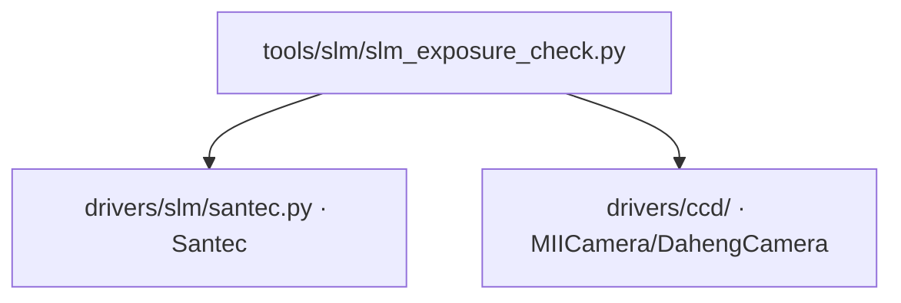

# SLM 曝光检查 (slm_exposure_check)

> **生成脚本**: [`scripts/generate_slm_exposure_check_report.py`](../../scripts/generate_slm_exposure_check_report.py)
> **复现命令**: `python scripts/generate_slm_exposure_check_report.py`
> **运行环境**: 硬件实测 (需 SLM + 相机)

## 1. 这条工具做什么

相机自动曝光状态 + 固定设置下漂移 (区分"相机漂移"与"SLM 保留上次图案")。

## 2. 调用关系



## 3. 测量原理

- **自动曝光检测**：固定 SLM 图案 (平场)，连续读取 N 帧，观察相机是否自动调整曝光/增益 (帧均值/峰值是否收敛到目标亮度)
- **漂移区分**：
  - 先读"平场" (实际可能是上一轮残留散斑)
  - 下发真平场，等待稳定
  - 再读平场
  - 对比两次"平场"读数：若差异大 → SLM 保留上次图案；若相近 → 相机自身漂移
- **实测陷阱**：同一 3 ms 设置两次运行峰值读到 100 与 23，而 box sum 稳到 0.2% —— **不用峰值判漂移，用区域范数**

## 4. 测量流程

1. 读取初始帧 (可能含残留图案) → 记录统计量
2. 下发平场相位，等待 `--settle-s`
3. 连续读取 `n_frames` 帧平场
4. 计算逐帧统计：均值、峰值、桶内和、桶外 RMS
5. **判据**：
   - `monotonic`：统计量单调收敛 → 相机自动曝光在工作
   - `non_monotonic`：统计量震荡 → 无自动曝光或不稳定
   - `saturated`：峰值触及饱和 → 曝光过大

## 5. 主要选项

| 选项 | 说明 | 默认值 |
|------|------|--------|
| `--exposure-ms` | 相机曝光时间 (ms) | 3.0 |
| `--cam-id` | 相机 ID | 0 |
| `--cam-type` | 相机类型 (miicam/daheng) | daheng |
| `--slm-number` | SLM 设备编号 | 1 |
| `--slm-wavelength` | SLM 波长 (nm) | 1064 |
| `--n-frames` | 连续读取帧数 | 30 |
| `--settle-s` | 平场下发后稳定等待 (s) | 1.0 |
| `--bucket-radius` | 桶半径 (像素) | 20 |

## 6. 示例

```bash
python -m ao_shaping.tools.slm.slm_exposure_check --exposure-ms 3.0
```

## 7. 输出

- 控制台打印：逐帧统计量时序图、判定结果 (monotonic/non_monotonic/saturated)、残留图案检测结果
- 可选 `--output` 保存 CSV/JSON

## 8. 关键发现 (红线)

1. **SLM 保留上次显示的图案** —— 下发平场**之前**读到的"平场"其实是上一轮的散斑
2. **峰值不可靠** —— 同一设置两次运行峰值 100 vs 23，box sum 稳定 0.2%
3. **必须用区域范数 (box sum) 判漂移**，不能用峰值