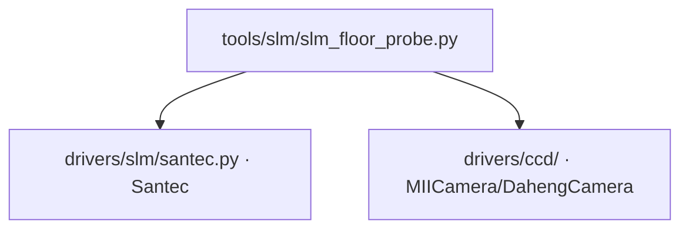

# SLM 本底探针 (slm_floor_probe)

> **生成脚本**: [`scripts/generate_slm_floor_probe_report.py`](../../scripts/generate_slm_floor_probe_report.py)
> **复现命令**: `python scripts/generate_slm_floor_probe_report.py`
> **运行环境**: 硬件实测 (需 SLM + 相机)

## 1. 这条工具做什么

**测量本底 + 稳定时间 + SNR-vs-K**。回答噪声是读噪声 (`noise_limited`) 还是漂移 (`drift_limited`); 后者说明降 delta 无用，要改稳定判据或改用 ABBA。稳定时间由采样拟合，替代固定 sleep。

## 2. 调用关系



## 3. 测量流程

### 3.1 本底测量
1. 遮光 (或 SLM 全 0 相位 + 物理遮光)
2. 连续读取 `n_dark_frames` 帧
3. 计算暗帧统计：均值、标准差、逐像素时序标准差图
4. **读噪声估计**：像素时序标准差中位数 → `σ_read`

### 3.2 稳定时间测量
1. 下发平场相位
2. 高频连续读帧 (间隔 `sample_interval`，如 50ms)
3. 计算逐帧桶内和时序
4. 拟合指数衰减模型：`A(t) = A∞ + (A₀ - A∞) * exp(-t/τ)`
5. **稳定时间** = `3τ` (衰减到 95%) 或 `5τ` (99%)

### 3.3 SNR vs K (扰动幅度扫描)
1. 固定平场，SPGD 扰动 `δ = K * δ_base` (K = 0.1, 0.2, ..., 2.0)
2. 每个 K 运行 `n_epochs_per_k` 轮 SPGD
3. 记录每轮梯度信噪比：`SNR = |g| / std(g_noise)`
4. 绘制 SNR-K 曲线，找最优 K

## 4. 判据

| 判据 | 含义 | 对策 |
|------|------|------|
| `noise_limited` | 读噪声主导，SNR 随 K 单调上升 | 可继续降 delta、增大平均帧数 |
| `drift_limited` | 漂移主导，SNR 随 K 先升后降/平台 | **降 delta 无用**，需改稳定判据或改用 ABBA |

## 5. 主要选项

| 选项 | 说明 | 默认值 |
|------|------|--------|
| `--exposure-ms` | 相机曝光时间 (ms) | 3.0 |
| `--cam-id` | 相机 ID | 0 |
| `--cam-type` | 相机类型 (miicam/daheng) | daheng |
| `--slm-number` | SLM 设备编号 | 1 |
| `--slm-wavelength` | SLM 波长 (nm) | 1064 |
| `--n-dark-frames` | 暗帧数 | 50 |
| `--sample-interval` | 稳定时间采样间隔 (s) | 0.05 |
| `--n-stability-frames` | 稳定时间测量帧数 | 200 |
| `--k-min/--k-max/--k-steps` | K 扫描范围与步数 | 0.1 / 2.0 / 10 |
| `--n-epochs-per-k` | 每 K 运行轮数 | 20 |
| `--bucket-radius` | 桶半径 (像素) | 20 |

## 6. 示例

```bash
python -m ao_shaping.tools.slm.slm_floor_probe --exposure-ms 3.0
```

## 7. 输出

- 控制台打印：暗帧统计、稳定时间拟合曲线、SNR-K 曲线、判定结果
- 可选 `--output` 保存 CSV/JSON/NPZ

## 8. 上机前必跑顺序 (不可反)

```
slm_drift_probe → slm_floor_probe → slm_abba_probe
```

完整流程见 [`docs/slm/pre_run_characterization.md`](../slm/pre_run_characterization.md)。