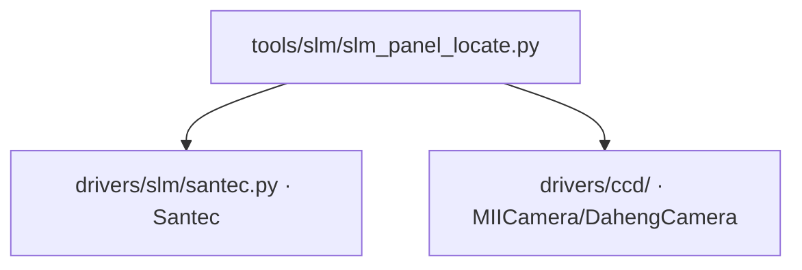

# SLM 面板定位 (slm_panel_locate)

> **生成脚本**: [`scripts/generate_slm_panel_locate_report.py`](../../scripts/generate_slm_panel_locate_report.py)
> **复现命令**: `python scripts/generate_slm_panel_locate_report.py`
> **运行环境**: 硬件实测 (需 SLM + 相机)

## 1. 这条工具做什么

面板坐标上定位光斑中心。相机 0 阶**不是**面板坐标 (两轴互换 90°，尺度差 >10 倍)。

## 2. 调用关系



## 3. 测量原理

- SLM 加载已知相位图案 (如闪耀光栅或倾斜斜坡)
- 通过光斑在相机上的位置变化，反推面板坐标系下的光斑中心
- **关键**：相机坐标 (row, col) ≠ 面板坐标 (x, y)
  - 两轴互换 90°：相机 row ↔ 面板 y，相机 col ↔ 面板 x
  - 尺度差 >10 倍：相机像素 ~2.2µm，面板像素 8µm

## 4. 测量流程

1. 平场相位，记录 0 阶相机坐标 `(r0, c0)`
2. 加载 X 方向倾斜斜坡，记录位移 `Δc_x`
3. 加载 Y 方向倾斜斜坡，记录位移 `Δr_y`
4. 结合台架几何标定，换算面板坐标中心

## 5. 主要选项

| 选项 | 说明 | 默认值 |
|------|------|--------|
| `--exposure-ms` | 相机曝光时间 (ms) | 3.0 |
| `--period` | 光栅/斜坡周期 (SLM px) | 64 |
| `--cam-id` | 相机 ID | 0 |
| `--cam-type` | 相机类型 (miicam/daheng) | daheng |
| `--slm-number` | SLM 设备编号 | 1 |
| `--slm-wavelength` | SLM 波长 (nm) | 1064 |
| `--n-frames` | 平均帧数 | 5 |

## 6. 示例

```bash
python -m ao_shaping.tools.slm.slm_panel_locate --exposure-ms 3.0
```

## 7. 输出

- 控制台打印：相机坐标中心、面板坐标中心、轴映射关系
- 可选 `--output` 保存 JSON

## 8. 台架几何 (不得重新推导)

- 面板光斑中心 (960, 600)、半径 450 px
- **panel↔camera 轴互换 90°**
- 焦面尺度 `shift_px ≈ 7600/period`

详见 [`report/slm/model_in_loop_bench_calibration.md`](../../report/slm/model_in_loop_bench_calibration.md)。