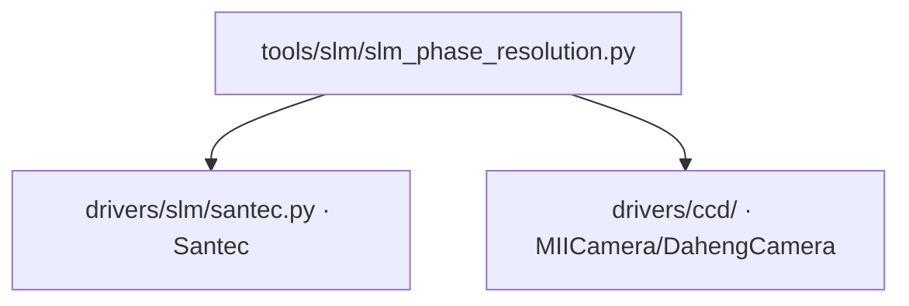

# SLM 相位分辨率测量 (slm_phase_resolution)

> **生成脚本**: [`scripts/generate_slm_phase_resolution_report.py`](../../scripts/generate_slm_phase_resolution_report.py)
> **复现命令**: `python scripts/generate_slm_phase_resolution_report.py`
> **运行环境**: 硬件实测 (需 SLM + 相机)

## 1. 这条工具做什么

比较逐像素随机相位与光滑 Zernike 相位，判定面板**等效相位分辨率**。

## 2. 调用关系



## 3. 测量原理

- **逐像素随机相位**：每个 SLM 像素独立随机相位 (高空间频率)
- **光滑 Zernike 相位**：低阶 Zernike 多项式 (低空间频率)
- 两者下发到 SLM，测量远场散斑对比度 / 光斑展宽
- **判据**：若逐像素随机相位产生的散斑对比度显著高于 Zernike 相位，说明面板能分辨像素级相位；否则面板有效分辨率低于像素级

## 4. 测量流程

1. 生成逐像素随机相位图 (高斯白噪声，标准差 π rad)
2. 生成光滑 Zernike 相位 (defocus + astigmatism，RMS 约 1 rad)
3. 交替下发两种相位，各读取 `n_frames` 帧平均
4. 计算远场散斑对比度 (标准差/均值) 或光斑半径
5. **判定**：对比度比 > threshold 或展宽比 > threshold → 面板分辨像素级相位

## 5. 主要选项

| 选项 | 说明 | 默认值 |
|------|------|--------|
| `--exposure-ms` | 相机曝光时间 (ms) | 3.0 |
| `--cam-id` | 相机 ID | 0 |
| `--cam-type` | 相机类型 (miicam/daheng) | daheng |
| `--slm-number` | SLM 设备编号 | 1 |
| `--slm-wavelength` | SLM 波长 (nm) | 1064 |
| `--n-frames` | 每种相位平均帧数 | 10 |
| `--zernike-rms` | Zernike 相位 RMS (rad) | 1.0 |
| `--random-std` | 随机相位标准差 (rad) | 3.14 |

## 6. 示例

```bash
python -m ao_shaping.tools.slm.slm_phase_resolution --exposure-ms 3.0
```

## 7. 输出

- 控制台打印：随机相位散斑对比度、Zernike 相位散斑对比度、比值、判定结果
- 可选 `--output` 保存 JSON/NPZ

## 8. 决策指导

| 结果 | 含义 | 后续路线 |
|------|------|----------|
| 面板分辨像素级相位 | 可用 `slm-gsnet` / `slm-gs-refine` / `slm-model-in-loop` (freeform 分支) | 自由相位整形 |
| 面板不分辨像素级相位 | 仅能用 Zernike 低阶模式 | `slm-pib` / `rms-zernike` / `ga-zernike` |