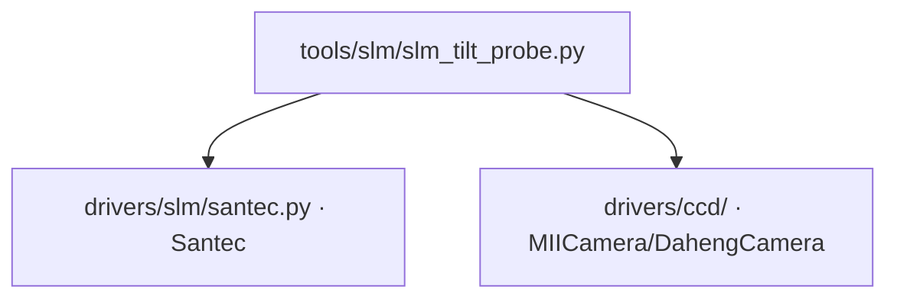

# SLM 倾斜探针 (slm_tilt_probe)

> **生成脚本**: [`scripts/generate_slm_tilt_probe_report.py`](../../scripts/generate_slm_tilt_probe_report.py)
> **复现命令**: `python scripts/generate_slm_tilt_probe_report.py`
> **运行环境**: 硬件实测 (需 SLM + 相机)

## 1. 这条工具做什么

**判定面板是否真的在调制** (倾斜斜坡)。比光栅可靠：光斑位移只取决于斜坡周期，与衍射效率无关。曾推翻过一次"面板冻结"假故障。

## 2. 调用关系



## 3. 测量原理

- SLM 加载线性相位斜坡：`φ(x) = 2π * x / period`
- 远场光斑发生位移：`Δx = f * λ / (d_SLM * period)`
- **关键优势**：位移量只依赖几何参数 (f, λ, d_SLM, period) 和相位斜率，**不依赖衍射效率**
- 即使面板效率极低、衍射级微弱，只要有相位调制，光斑就会位移
- 对比：光栅法依赖 +1 级衍射效率，效率低时信号淹没在噪声中

## 4. 测量流程

1. 设置基线：平场相位，记录 0 阶位置 `x0`
2. 加载正斜坡 (周期 `period`)，记录位置 `x+`
3. 加载负斜坡 (周期 `-period`)，记录位置 `x-`
4. 计算位移：`Δx = (x+ - x-) / 2`
5. **判据**：`|Δx| > threshold` (通常 > 3 px) → 面板在调制

## 5. 主要选项

| 选项 | 说明 | 默认值 |
|------|------|--------|
| `--exposure-ms` | 相机曝光时间 (ms) | 3.0 |
| `--period` | 斜坡周期 (SLM 像素) | 64 |
| `--cam-id` | 相机 ID | 0 |
| `--cam-type` | 相机类型 (miicam/daheng) | daheng |
| `--slm-number` | SLM 设备编号 | 1 |
| `--slm-wavelength` | SLM 波长 (nm) | 1064 |
| `--n-frames` | 平均帧数 | 5 |
| `--settle-s` | 稳定等待 (s) | 0.5 |

## 6. 示例

```bash
# 基础判定面板是否在调制
python -m ao_shaping.tools.slm.slm_tilt_probe --exposure-ms 3.0

# 大恒相机，自定义斜坡周期
python -m ao_shaping.tools.slm.slm_tilt_probe --cam-type daheng --period 32 --exposure-ms 1.5
```

## 7. 输出

- 控制台打印：基线位置、正斜坡位置、负斜坡位置、位移量、判定结果
- 可选 `--output` 保存 JSON 结果

## 8. 台架几何 (不得重新推导)

- 光斑中心 (960, 600)、半径 450 面板 px
- **panel↔camera 轴互换 90°**
- 焦面尺度 `shift_px ≈ 7600/period` (两条独立路线一致到 0.5%)

详见 [`report/slm/model_in_loop_bench_calibration.md`](../../report/slm/model_in_loop_bench_calibration.md)。