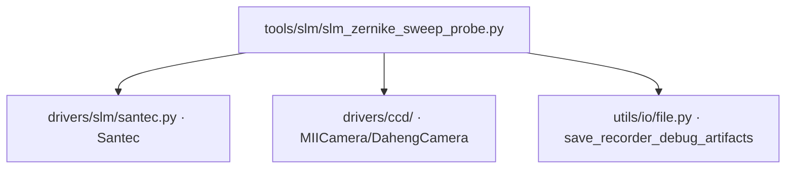

# SLM Zernike 扫描探针 (slm_zernike_sweep_probe)

> **生成脚本**: [`scripts/generate_slm_zernike_sweep_probe_report.py`](../../scripts/generate_slm_zernike_sweep_probe_report.py)
> **复现命令**: `python scripts/generate_slm_zernike_sweep_probe_report.py`
> **运行环境**: 硬件实测 (需 SLM + 相机)

## 1. 这条工具做什么

**光滑 Zernike 扫描探针**：ramp + tilt + defocus + astig + coma + spherical 共 42 点，逐点稳定判据读帧，落盘 npz + Recorder (含相位与 CCD 帧)。`--no-hw` 只打印采集计划。

这是 `scripts/model_in_loop_hw_runbook.py --stage sweep` 的采集内核来源。

## 2. 调用关系



## 3. 扫描模式 (42 点)

| 类别 | 模式 | Noll 索引 | 幅度范围 | 步数 |
|------|------|-----------|----------|------|
| Ramp | X ramp | - | -π ~ π | 5 |
| Ramp | Y ramp | - | -π ~ π | 5 |
| Tilt | Tip | 2 | -0.5 ~ 0.5 rad | 5 |
| Tilt | Tilt | 3 | -0.5 ~ 0.5 rad | 5 |
| Defocus | Defocus | 4 | -1.0 ~ 1.0 rad | 5 |
| Astig | Astig 0° | 5 | -0.5 ~ 0.5 rad | 3 |
| Astig | Astig 45° | 6 | -0.5 ~ 0.5 rad | 3 |
| Coma | Coma X | 7 | -0.3 ~ 0.3 rad | 3 |
| Coma | Coma Y | 8 | -0.3 ~ 0.3 rad | 3 |
| Spherical | Spherical | 11 | -0.5 ~ 0.5 rad | 5 |

## 3. 稳定判据

每个点下发相位后，连续读帧直到：
- 连续 2 帧桶内能量相对变化 < `settle_tol` (默认 1%)
- 或达到 `--settle-max-wait-s` (默认 5s) 超时

丢弃未稳定帧，仅保存稳定后的帧。

## 4. 主要选项

| 选项 | 说明 | 默认值 |
|------|------|--------|
| `--exposure-ms` | 相机曝光时间 (ms) | 3.0 |
| `--cam-id` | 相机 ID | 0 |
| `--cam-type` | 相机类型 (miicam/daheng) | daheng |
| `--slm-number` | SLM 设备编号 | 1 |
| `--slm-wavelength` | SLM 波长 (nm) | 1064 |
| `--pupil-center` | 瞳孔中心 (面板坐标 'x,y') | 960,600 |
| `--zernike-radius` | Zernike 孔径半径 (面板 px) | 450 |
| `--settle-tol` | 稳定判据相对容差 | 0.01 |
| `--settle-max-wait-s` | 最大稳定等待 (s) | 5.0 |
| `--n-frames` | 稳定后保存帧数 | 3 |
| `--no-hw` | 只打印采集计划，不开设备 | False |
| `-o, --output` | 输出目录 | data/debug/slm_zernike_sweep_<ts> |

## 5. 示例

```bash
# 只打印采集计划 (先跑这个确认)
python -m ao_shaping.tools.slm.slm_zernike_sweep_probe --no-hw

# 完整硬件扫描
python -m ao_shaping.tools.slm.slm_zernike_sweep_probe --exposure-ms 3.0 \
    --pupil-center 960,600 --zernike-radius 450
```

## 6. 输出契约

- `data/debug/slm_zernike_sweep_<ts>/`：
  - `records.pkl`：Recorder 结构 `{epoch: record}`，含相位 (raw 弧度)、CCD 帧、模式元数据
  - `records.json`：sidecar，含完整配置
  - `sweep_plan.json`：扫描计划 (42 点列表)
  - 逐模式 NPZ：`mode_<noll>_amp_<val>.npz` (相位 + 稳定帧)

## 7. 共用内核

`slm_bench_probe.py` 是此工具与 drift/floor/abba 探针共用的纯测量内核 (设备由参数传入，可脱机单测)。