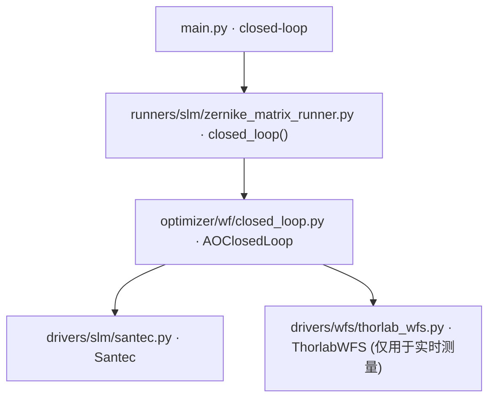

# 闭环波前优化 (closed-loop)

> **生成脚本**: [`scripts/generate_closed_loop_report.py`](../../scripts/generate_closed_loop_report.py)
> **复现命令**: `python scripts/generate_closed_loop_report.py`
> **运行环境**: 离线 (纯源码静态分析; 不开设备)

## 1. 这条命令做什么

基于已保存的 Zernike 响应矩阵进行闭环波前优化。回放已标定的响应矩阵，不再需要实时 WFS 测量来构建矩阵。

## 2. 调用关系



## 3. 控制律 (`--control-law`)

| 控制律 | 说明 | 关键参数 |
|--------|------|----------|
| `pid` | PID 控制 | `kp`, `ki`, `kd` |
| `leaky` (默认) | 泄漏积分器 | `gain`, `leak` |
| `qg` | 准高斯控制 | `gain` |
| `lqg` | 线性二次高斯 | - |
| `mpc` | 模型预测控制 | - |
| `adaptive` | 自适应控制 | - |

## 4. 算法流程

1. **加载响应矩阵**：读取 `--load-file` 指定的 `.h5` 文件 (含 `response_matrix`, `pseudo_inverse`)
2. **初始化控制器**：根据 `--control-law` 创建控制实例
3. **闭环循环** (`max_iter` 次)：
   - WFS 测量当前波前 Zernike 系数
   - 计算误差：`e = target - measured` (target 默认全零)
   - 控制律计算修正量：`Δc = control_law(e)`
   - 施加修正：`c_new = c_old + Δc`
   - SLM 下发新相位 (`generate_zernike_phase` → `create_phase_from_array`)
   - 可选：`--cancel-tile` 去除 WFS tip/tilt 测量
   - 检查收敛：RMS < `rms_target`
4. **输出**：最终系数、收敛历史

## 5. 主要选项

| 选项 | 说明 | 默认值 |
|------|------|--------|
| `--load-file` | 已保存的响应矩阵 .h5 文件路径 (**必需**) | - |
| `--output` | 结果保存路径 | load-file 同目录 |
| `--control-law` | 控制律 (pid/leaky/qg/lqg/mpc/adaptive) | leaky |
| `--gain` | 控制增益覆盖 | 控制律依赖 |
| `--leak` | 泄漏因子覆盖 | - |
| `--kp/--ki/--kd` | PID 增益 | - |
| `--dt` | 采样周期 [s] | 0.067 |
| `--rms-target` | 目标 RMS [λ] | 0.05 |
| `--max-iter` | 最大迭代次数 | 100 |
| `--delay-steps` | 延时补偿步数 | 1 |
| `--cancel-tile/--no-cancel-tile` | 测量时去除 WFS tip/tilt | False |
| `--display/--no-display` | 显示实时 pygame 显示 | False |
| `--debug` | 启用调试模式 | False |

## 6. 关键实现细节

### 响应矩阵使用
- 标定时：`R = ∂WFS/∂Zernike` (WFS 响应对 Zernike 系数的雅可比)
- 闭环时：`Δc = R⁺ · e` (用伪逆解算所需 Zernike 修正)
- **单位链**：WFS 返回 µm → `um_to_waves()` → λ → ×2π → rad → SLM

### 控制律细节

**Leaky Integrator (默认)**：
```
c[k+1] = c[k] + gain * (e[k] - leak * c[k])
```
- `gain`：积分增益
- `leak`：泄漏因子 (防止积分饱和，典型 0.01~0.1)

**PID**：
```
c[k+1] = c[k] + kp*e[k] + ki*Σe + kd*(e[k]-e[k-1])
```

### 延时补偿 (`--delay-steps`)
- 系统固有延时 (SLM 刷新 + WFS 曝光 + 传输) ≈ 1-2 帧
- `--delay-steps 1` (默认) 用前一帧误差补偿当前帧

## 7. 示例

```bash
DEBUG=1 python src/ao_shaping/main.py closed-loop --load-file data/zm.h5 --control-law leaky --max-iter 50

# 使用 PID 控制
python src/ao_shaping/main.py closed-loop --load-file data/zm.h5 --control-law pid --kp 0.5 --ki 0.01 --kd 0.1 --max-iter 100
```

## 8. 输出契约

- `data/closed_loop/<日期>/` 或 `--output` 指定目录：
  - 闭环历史 CSV (每轮 RMS、残差、控制量)
  - 最终 Zernike 系数 NPY
  - 最终相位 NPY (raw 弧度)
- `--debug`：逐轮 WFS 帧、控制器内部状态、Recorder pkl

## 9. 单独运行

```bash
python -m ao_shaping.runners.slm.zernike_matrix_runner closed-loop [OPTIONS]
```

## 10. 与 zernike-matrix 的区别

| 项 | `zernike-matrix` | `closed-loop` |
|----|------------------|---------------|
| 阶段 | 标定 (测量响应矩阵) | 闭环控制 (使用响应矩阵) |
| WFS 用途 | 测量每个模式的响应 | 实时测量误差反馈 |
| SLM 用途 | 加载正负扰动模式 | 加载控制律计算的修正相位 |
| 前置条件 | 无 | 必需已有响应矩阵文件 |
| 迭代性质 | 开环扫描 | 闭环反馈 |