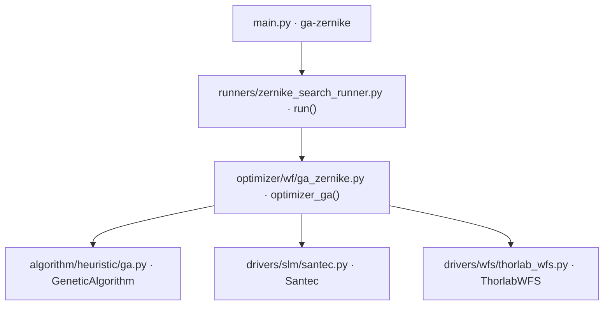

# 遗传算法 Zernike 优化 (ga-zernike)

> **生成脚本**: [`scripts/generate_ga_zernike_report.py`](../../scripts/generate_ga_zernike_report.py)
> **复现命令**: `python scripts/generate_ga_zernike_report.py`
> **运行环境**: 离线 (纯源码静态分析; 不开设备)

## 1. 这条命令做什么

基于遗传算法 (GA) 搜索最优 Zernike 系数组合，以 WFS 测量 RMS 为适应度。适合无梯度/多峰搜索场景。

## 2. 调用关系



## 3. 算法流程

1. **初始化**：打开 SLM 与 WFS，设置波长、瞳孔参数
2. **种群初始化**：随机生成 `population_size` 个个体 (Zernike 系数向量)
3. **进化循环** (`n_generations` 代)：
   - **适应度评估**：每个个体下发 SLM，读 WFS 计算 RMS (越小越好)
   - **选择**：锦标赛选择 (tournament_size)
   - **交叉**：概率 `crossover_prob` 进行交叉
   - **变异**：概率 `mutation_prob` 进行高斯变异
   - **精英保留**：保留 `elite_count` 个最优个体
4. **早停**：最优 RMS < `early_stop_threshold`
5. **输出**：最优系数、进化历史

## 4. 主要选项

| 选项 | 说明 | 默认值 |
|------|------|--------|
| `-d, --dir` | 数据保存根目录 | data |
| `--population-size` | 种群大小 | 50 |
| `--n-generations` | GA 迭代代数 | 2000 |
| `--crossover-prob` | 交叉概率 | 0.7 |
| `--mutation-prob` | 变异概率 | 0.15 |
| `--tournament-size` | 锦标赛选择大小 | 3 |
| `--elite-count` | 精英个体数量 | 2 |
| `-n, --n-max` | 最大 Zernike 径向阶数 | 4 |
| `-w, --wavelength` | SLM 波长 (nm) | 532 |
| `--wfs-res` | WFS 分辨率 | 1024 |
| `--pupil-diameter` | WFS 瞳孔直径 | 4.6 |
| `-c, --pupil-center` | 瞳孔中心坐标 | (0,0) |
| `--early-stop-threshold` | 早停 RMS 阈值 | 0.01 |
| `--slm-number` | SLM 设备编号 | 1 |
| `--remove-tilt` | 去除波前倾斜 | False |
| `--shift-x/--shift-y` | SLM X/Y 方向偏移 (像素) | 0 |
| `--show` | 显示优化历史 | False |

## 5. 遗传算法实现细节

- **编码**：实值编码，每个基因 = 一个 Zernike 系数 (Noll 4 到 N_max 对应的模式)
- **交叉**：模拟二进制交叉 (SBX) 或混合交叉
- **变异**：高斯扰动，标准差自适应
- **选择**：锦标赛选择，保持选择压力
- **精英策略**：每代保留最优个体直接进入下一代

## 6. 适用场景

- 目标函数多峰、非凸、梯度不可得
- 搜索空间大，梯度法易陷入局部最优
- 硬件噪声大，梯度估计不可靠

## 7. 输出契约

- `data/ga_zernike/<日期>/`：进化历史 CSV (每代最优/平均/最差 RMS)、最优系数 NPY、最优相位 NPY (raw 弧度)
- `--show`：实时绘制适应度曲线
- `--debug`：逐代种群快照、Recorder pkl

## 8. 单独运行

```bash
python -m ao_shaping.runners.zernike_search_runner [OPTIONS]
```

## 9. 与 greedy-zernike 的区别

| 项 | `ga-zernike` | `greedy-zernike` |
|----|--------------|------------------|
| 算法 | 遗传算法 (全局种群搜索) | 贪婪局部搜索 (单轨迹) |
| 搜索能力 | 全局，易跳出局部最优 | 局部，依赖初始点 |
| 并行度 | 种群并行评估 | 串行 |
| 适用场景 | 多峰、无梯度、大搜索空间 | 单峰、有梯度信息、精细调优 |