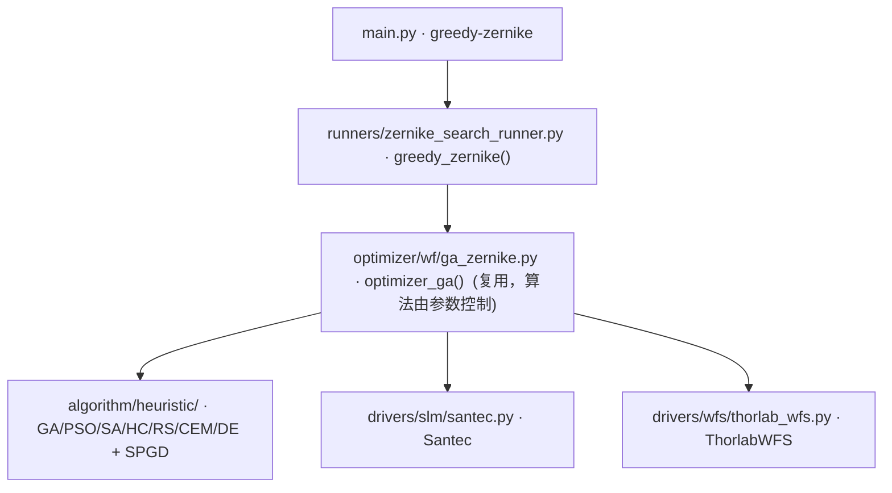

# Zernike 波前优化器 - 贪婪局部搜索 (greedy-zernike)

> **生成脚本**: [`scripts/generate_greedy_zernike_report.py`](../../scripts/generate_greedy_zernike_report.py)
> **复现命令**: `python scripts/generate_greedy_zernike_report.py`
> **运行环境**: 离线 (纯源码静态分析; 不开设备)

## 1. 这条命令做什么

使用贪婪局部搜索算法进行 Zernike 波前校正。支持多种内部搜索算法 (SPGD/GA/PSO/SA/HC/RS/CEM/DE)。

## 2. 调用关系



## 3. 算法流程

1. **随机初始化**：生成 `n_init` 个随机初始位置 (Zernike 系数向量)
2. **选取最优**：评估所有初始位置，选取 RMS 最小者作为起始点
3. **迭代搜索** (`epochs` 轮)：
   - 采样 `n_directions` 个随机扰动方向
   - 评估当前位置 + `n_directions` 个候选位置 (共 `n_directions+1` 个)
   - 选择 RMS 最小的候选作为新位置
   - 扰动幅度按 `perturbation_scale` 缩放
4. **重复**直到收敛或达到最大迭代次数

## 4. 内部搜索算法 (`--algorithm`)

| 算法 | 说明 | 适用场景 |
|------|------|----------|
| `spgd` (默认) | 随机并行梯度下降，中心差分估梯度 | 连续空间、有梯度信息 |
| `ga` | 遗传算法 (微型种群) | 多峰、离散/混合空间 |
| `pso` | 粒子群优化 | 连续空间、全局搜索 |
| `sa` | 模拟退火 | 多峰、可接受概率跳出局部最优 |
| `hc` | 爬山算法 | 单峰、贪婪单步改进 |
| `rs` | 随机搜索 | 基线对比、无先验 |
| `cem` | 交叉熵方法 | 连续空间、分布采样 |
| `de` | 差分进化 | 连续空间、种群进化 |

## 5. 主要选项

| 选项 | 说明 | 默认值 |
|------|------|--------|
| `-e, --epochs` | 优化迭代次数 | 2000 |
| `-n, --n-max` | Zernike 最大阶数 | 4 |
| `-r, --wfs_res` | WFS 分辨率 | 1024 |
| `-p, --pupil_diameter` | 瞳孔直径 | 2.7 |
| `-c, --pupil_center` | 瞳孔中心坐标 | (0,0) |
| `-t, --early_stop_threshold` | 早停阈值 | 0.12 |
| `--wavelength` | SLM 波长 (nm) | 532 |
| `--slm-number` | SLM 设备编号 | 1 |
| `--remove-tilt` | 移除波前测量中的倾斜项 | False |
| `--n-init` | 初始随机位置数量 | 10 |
| `--n-directions` | 每次迭代的随机方向数量 | 5 |
| `--perturbation-scale` | 扰动幅度缩放因子 | 5.0 |
| `--algorithm` | 内部搜索算法 (spgd/ga/pso/sa/hc/rs/cem/de) | spgd |
| `--pop_size` | 种群规模 (ga/pso/cem/de 时使用) | 算法默认值 |

## 6. 示例

```bash
DEBUG=1 python src/ao_shaping/main.py greedy-zernike --n-init 20 --n-directions 8

# 使用 PSO 内部搜索
python src/ao_shaping/main.py greedy-zernike --algorithm pso --pop_size 30 --epochs 1000

# 使用模拟退火
python src/ao_shaping/main.py greedy-zernike --algorithm sa --epochs 5000
```

## 7. 输出契约

- `data/greedy_zernike/<日期>/`：优化历史 CSV (每轮 RMS、当前系数)、最优系数 NPY、最优相位 NPY (raw 弧度)
- `--show`：显示优化历史图
- `--debug`：逐轮候选评估详情、Recorder pkl

## 8. 单独运行

```bash
python -m ao_shaping.runners.zernike_search_runner greedy-zernike [OPTIONS]
```

## 9. 与 ga-zernike 的区别

| 项 | `ga-zernike` | `greedy-zernike` |
|----|--------------|------------------|
| 算法 | 遗传算法 (全局种群搜索) | 贪婪局部搜索 (单轨迹) |
| 搜索能力 | 全局，易跳出局部最优 | 局部，依赖初始点 |
| 并行度 | 种群并行评估 | 串行 (但可多起点) |
| 适用场景 | 多峰、无梯度、大搜索空间 | 单峰、有梯度信息、精细调优 |
| 可配置性 | 固定 GA | 8 种内部算法可选 |