# Zernike 远场模型 —— 开发报告

> 生成脚本 `scripts/generate_zernike_amp_report.py`（**全离线**，只读已保存产物，不需要硬件）。
> 图表数据来自 `logs/zernike_amp_sweep.json`（10 折分组交叉验证扫描）与
> `logs/zernike_amp_final/summary.json`（训练历史，即当时上传 wandb 的那一组序列）。
> 重新生成：`python scripts/generate_zernike_amp_report.py`

本报告的所有结论都建立在一个前提上：**分组交叉验证 + 配对检验**。第 5、6 节解释为什么
必须如此 —— 它是本项目四次结论反转的根源，其中两次来自同一个错误：
**信任了一个未先定位来源的方差估计。**

---

## 1. 模型是什么

`src/ml/zernike/models.py` 实现了一个可微的瞳孔 → 远场前向模型，唯一可训练参数是一个
**全局** Zernike 向量 `Z`：

```
U      = (phase_cos + i·phase_sin) · exp(i · Σ_k Z_k B_k)      # 复数域
focal  = fftshift(fft2(ifftshift(center_pad(U)), norm="ortho"))
loss   = MSE(observable(focal), ccd)
```

- `Z` 是**被训练**的量；`n_max`（系数个数 `K`）是**超参数**。
- 基底 `B` 由规范的 `ZernikeGenerator` 一次性构建，本项目不重复推导任何 Zernike 数学。
- 前向传播**不调用 `atan2`**，全程留在复数域：语料相位已被 writer 卷到 `[0, 2π)`，
  角度表示会在 ±π 处引入分支切口。
- **排除 piston**：`K = (n_max+1)(n_max+2)/2 − 1`。因为 `|FFT(e^{iφ₀}U)| ≡ |FFT(U)|`
  恒成立，piston 系数的梯度**永远**为零。

## 2. 数据管线

`src/ml/hwdataset` 提供 `(phase_cos, phase_sin, image, exposure_log10, …)`。三个关键决定：

| 决定 | 理由 |
|---|---|
| 相位用相干 `(cos, sin)` 对 | 语料卷绕到 `[0, 2π)`；`atan2` 会在输入面上放一个分支切口 |
| 目标**不做** peak 归一（`abs255`） | 曝光是模型输入，绝对亮度本身就是编码它的信号 |
| FOV 以 `fov_px` 随样本返回，绝不 resize | 各 family 相机窗口真的不同（64/248/320/1944 px），插值会伪造像素 |

磁盘缓存与直接路径**逐位一致**（1010/1010 记录），并快 **317×**（127.0 s → 0.4 s，
打开的 pickle 数 10 → 0）。

## 3. 三个靠测量发现的陷阱

**3.1 尺度不匹配（最关键）。** `_anchored_window` 取的是以 0 阶为中心的 `grid×grid`
窗口，**不缩放**。若 `far_field_padding=1`，FFT 展的是瞳孔完整衍射场，与目标的角尺度差约
4 倍，逐像素不可比：

| `far_field_padding`（中心裁剪） | `Z=0` 时 val R² |
|---|---|
| 1 | −0.20 |
| 8 | +0.33 |
| **10**（默认） | **+0.46** |
| 12 | +0.53 |
| 16 | +0.49 |
| 20 | +0.18 |

明显的**内点最优** —— 这是真正的物理标定，不是"越锐越好"。标定正确后 `max|Z|` 从失控的
**1.77 rad 降到 0.165 rad**：小系数就能解释数据，不再需要靠巨大相位硬凑 loss。

**3.2 `normalization="sum"` 是指标陷阱。** 把预测与目标各自除以总能量，两者会"几乎一致"：

| `normalization` | MSE | R² | PSNR | SSIM |
|---|---|---|---|---|
| `peak` | 0.00429 | **+0.706** | 24.8 dB | 0.594 |
| `sum` | **0.00000** | +0.632 | **72.1 dB** | **0.9996** |
| `none` | 0.47534 | **−158.98** | 3.2 dB | 0.037 |

`sum` 在 MSE/PSNR/SSIM 上读作*完美*，而 R² 反而更差 —— 它度量的是归一化本身，不是拟合质量。

**3.3 `observable`：强度，不是振幅。** CCD 积分的是强度，不报告场振幅：

| `observable` | n_max=4 | n_max=11 | n_max=15 |
|---|---|---|---|
| `amplitude` | +0.634 | +0.659 | +0.675 |
| `intensity` | **+0.750** | **+0.792** | **+0.797** |

## 4. 训练历史（wandb 记录的那组序列）

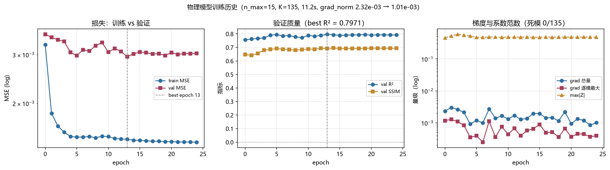

三个面板分别是损失、验证质量、梯度与系数范数。要点：

- **收敛很快**：`best_epoch = 13`，之后训练 loss 继续降而验证指标不再改善。
- **梯度极小**（`2.32e-03` → `1.01e-03`）：
  因为只有一个参数向量且 loss 已按尺度归一化。这解释了为什么 `lr` 如此关键，
  也解释了早期扫描要么无反应（1e-4）要么发散（1e-1）。
- **无死模**：`0/135`。

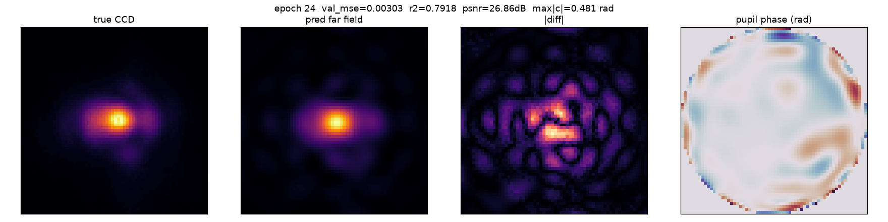

上图是训练过程中保存的 true-vs-pred 对比帧（true / pred / 差分 / 目标相位），
由 `train_amp.py` 在每个采样 epoch 输出。

## 5. 噪声地板的真因：语料非 i.i.d.

同一 config、同一 seed 重复 3 次 → 结果**逐位相同**（5 位小数全等），管线是确定性的。
只换 split seed：

| seed | 0 | 1 | 2 | 3 |
|---|---|---|---|---|
| val R² | +0.780 | +0.797 | +0.920 | +0.923 |

**σ ≈ 0.07。** 长期以来我把原因归结为"验证集只有 128 条"。**这个诊断是错的。**

1010 条记录均匀分布在 10 个 pickle（每份恰好 101 条），但这 10 份只来自 **4 个优化目标**：

| 目标 | pickle 数 | 记录数 |
|---|---|---|
| `rms_pib` | 4 | 404 |
| `rmse_out` | 3 | 303 |
| `shape` | 2 | 202 |
| `roi_pib` | 1 | 101 |

而这四个目标的**图像分布确实不同** —— 量化方式是用 A 目标的均值图去预测 B 目标：

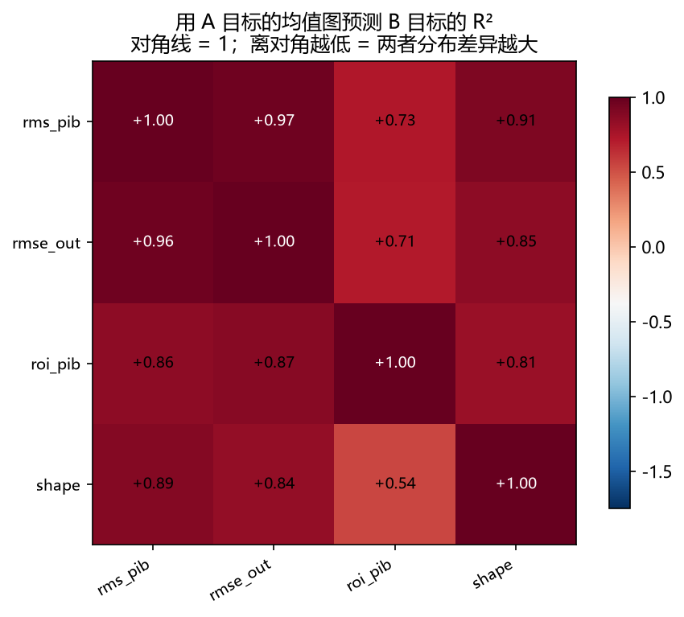

对角线为 1，离对角最低只有 **+0.54**（`shape` 均值图预测 `roi_pib`），最高 +0.97。
所以目标之间有可测的分布差异，但**没有一对是"负 R²"**。

> ⚠️ **这里更正我自己一个诊断错误。** 早期版本这张表给出 `rms_pib → roi_pib = −0.670`
> 并据此声称"比预测常数还差"，那**是错的**：分母用了另一个 group 的方差，
> 分子却是纯像素量，量纲不一致，放大了数值。正确分母是被预测组自身的
> `SS_tot`，重算后**全表为正**。结论方向（目标异质 → 折的组成会变）成立，
> 但"比常数还差"的说法作废。

那 σ ≈ 0.07 到底来自哪里？**主要是折本身的难度差**，而不是目标配比：留一 pickle 的
逐折 R² 从 0.737 到 0.941（σ ≈ 0.08），同一模型在不同折上差 0.2。单个随机划分恰好
抽到难折或易折，指标就跟着跳。所以**必须分组 + 配对**：三个模型共用同一批折，
折难度在差值里抵消掉，配对 σ 降到 ~0.01，否则任何模型间比较都淹没在折间方差里。

> 另两处更正：划分实际是**按文件的 75/25**（`val_fraction=0.25`，`train_amp.py:302`），
> 之后验证集再被截断到 `max_val=128`（`:315`）—— **不是 80/20**。
> `HWRecordRef.source` 是**相位表示**（`panel_gray`/`panel_rad`/`zernike`/`freeform`），
> **不是来源文件**；文件标识是 `HWRecordRef.path`。

## 6. 分组交叉验证

仓库**完全没有 sklearn 依赖**（全树零引用），所以折按 `str(record.path)` 手工构造，
沿用 `_select_records` 已经用对的 group key。

| 协议 | 折数 | train / val | 回答什么问题 |
|---|---|---|---|
| `objective` | 4 | 606 / 404 | 泛化到**从未见过的目标** |
| `file` | 10 | 909 / 101 | 每条记录恰好被验证一次 |

统计用**精确 sign-flip 置换检验**（2¹⁰ = 1024 次枚举，最小 p = 0.00195，不假设正态）、
Cohen's `d_z`、以及跨模型×指标族的 Holm–Bonferroni 校正。

留一 pickle 的一个附带好处：**每折的验证集天然只含单个目标**（因为每个 pickle 只属于
一个目标），所以验证集是同分布的，不再有配比抽签。

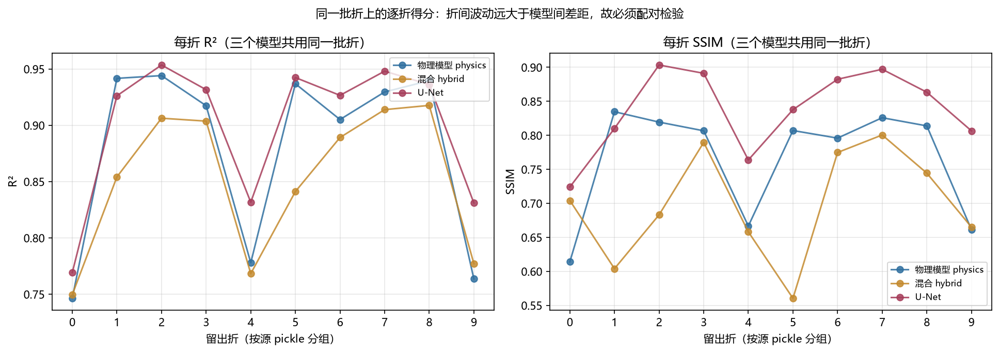

折间波动（σ ≈ 0.06 ~ 0.08）远大于模型间差距，这就是为什么必须配对检验而不是比较均值。

## 7. 最终对比（10 折分组 CV，三个模型调优后）

| 模型 | 参数量 | R² (10 折) | SSIM (10 折) | PSNR dB (10 折) | NRMSE |
|---|---|---|---|---|---|
| 物理模型 physics | 230 | +0.8803 ± 0.0823 | 0.7646 ± 0.0827 | 29.60 ± 2.65 | 0.0401 |
| 混合 hybrid | 10,408 | +0.8522 ± 0.0653 | 0.6985 ± 0.0800 | 28.00 ± 2.08 | 0.0457 |
| U-Net | 7,778,465 | +0.8997 ± 0.0643 | 0.8380 ± 0.0610 | 30.98 ± 2.50 | 0.0370 |

配置：`physics` n_max=20 / lr=0.02；
`hybrid` 同物理配置 + 残差宽度 32；
`unet` [16, 32, 64, 128, 256] / 50 ep / lr=0.01。

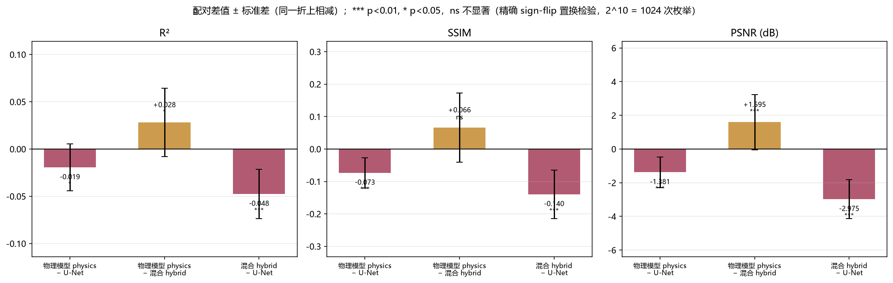

| 配对比较 | 指标 | 差值均值 | 差值标准差 | Cohen's d_z | p (精确) | 判定 |
|---|---|---|---|---|---|---|
| 物理模型 physics − U-Net | R² | -0.0194 | 0.0249 | -0.78 | 0.0254 | * |
| 物理模型 physics − U-Net | SSIM | -0.0734 | 0.0465 | -1.58 | 0.0039 | *** |
| 物理模型 physics − U-Net | PSNR (dB) | -1.3807 | 0.9165 | -1.51 | 0.0039 | *** |
| 物理模型 physics − 混合 hybrid | R² | +0.0281 | 0.0362 | +0.78 | 0.0176 | * |
| 物理模型 physics − 混合 hybrid | SSIM | +0.0661 | 0.1071 | +0.62 | 0.0801 | ns |
| 物理模型 physics − 混合 hybrid | PSNR (dB) | +1.5946 | 1.6356 | +0.97 | 0.0039 | *** |
| 混合 hybrid − U-Net | R² | -0.0475 | 0.0259 | -1.83 | 0.0020 | *** |
| 混合 hybrid − U-Net | SSIM | -0.1395 | 0.0746 | -1.87 | 0.0020 | *** |
| 混合 hybrid − U-Net | PSNR (dB) | -2.9753 | 1.1494 | -2.59 | 0.0020 | *** |

**结论。**

1. **U-Net 显著更好**：R² -0.0194（p = 0.0254），
   SSIM -0.0734（p = 0.0039）。
   注意这是在**物理模型调优之后**的对比。
2. **hybrid 不会更好**：在物理模型的最优 lr 下，hybrid 反而**显著更差**（R² +0.0281，p = 0.0176）；而在较温和的 lr=0.01 下它与 physics 统计不可区分。零初始化残差只保证**起点**与 physics 相同，并不保证提高 lr 后仍然中性 ——涨参数量的是残差网络，它才是被大 lr 破坏的那部分。
   ⇒ **不提升为训练入口的模型选项**，只作为已记录的反面结果保留。

### 按目标分解

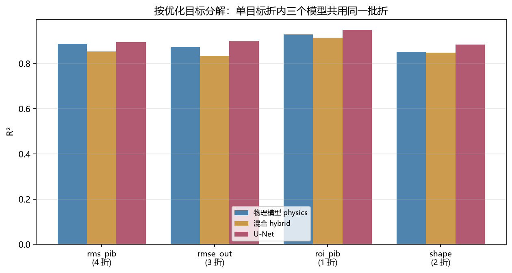

物理模型在 `roi_pib` 这个孤立目标上反而最好（该目标分布最"窄"，方差最低），
在 `rms_pib` / `rmse_out` 上最难 —— 这也解释了为什么池化 R² 对目标配比如此敏感。

### 两者用途不可互换

U-Net 出的是**图像**，反解成可下发的 SLM 相位是另一个反问题。就"要下发什么相位"这个
用途而言，230 参数的物理模型是唯一能**闭式给出可实现相位**的（`Σ Z_k B_k`，
230 个可解释弧度），参数少 34000×、墙钟少 40%。U-Net 的 +0.8997
买的是更高的拟合度，不是可下发性。

## 8. 优化：一个杠杆一个杠杆地试

| 杠杆 | 结果 |
|---|---|
| **`n_max`** | **唯一的大杠杆**，但已饱和（见下图） |
| `far_field_padding` | 内点最优 ≈10–12 |
| `observable` | 强度胜出，约 +0.12 R² |
| `normalization` | 只有 `peak` 有效 |
| `lr` | 与 `n_max` **非可加**，见下 |
| `l2_penalty` | 1e-4 中性；1e-2 过正则 |
| `grad_clip` | 无效果 —— 梯度（~1e-3）根本达不到阈值 |
| `optimizer` | SGD 明显更差；`weight_decay=0` 时 `adam ≡ adamw` 是**正确**的 |
| 曝光增广 | **完全无效**，见下 |

### `n_max` 已饱和

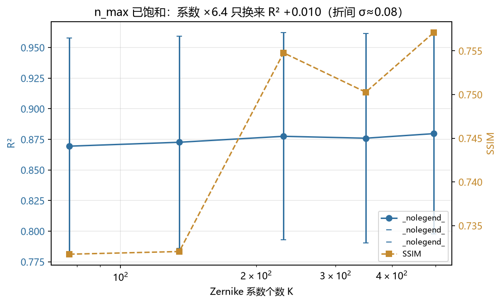

系数从 77 涨到 495（6.4×）只换来 R² +0.010，而折间 σ ≈ 0.08。

### 联合扫描才有意义

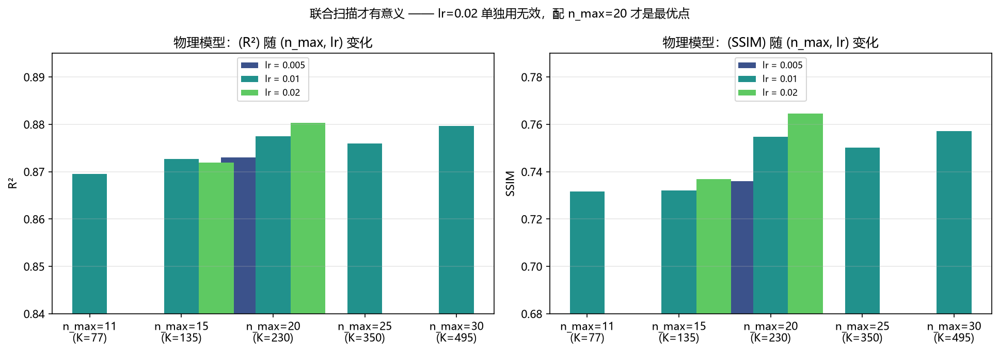

| 配置 | K | R² | SSIM |
|---|---|---|---|
| n_max=11, lr=0.01 | 77 | +0.8695 ± 0.0882 | 0.7317 |
| n_max=15, lr=0.01 | 135 | +0.8727 ± 0.0867 | 0.7320 |
| n_max=20, lr=0.01 | 230 | +0.8775 ± 0.0846 | 0.7548 |
| n_max=25, lr=0.01 | 350 | +0.8760 ± 0.0856 | 0.7503 |
| n_max=30, lr=0.01 | 495 | +0.8797 ± 0.0819 | 0.7571 |
| n_max=15, lr=0.02 | 135 | +0.8719 ± 0.0888 | 0.7370 |
| n_max=20, lr=0.02 | 230 | +0.8803 ± 0.0823 | 0.7646 |
| n_max=20, lr=0.005 | 230 | +0.8730 ± 0.0855 | 0.7361 |

`lr=0.02` **单独**用在 `n_max=15` 上毫无改善，可同一个 `lr` 配 `n_max=20` 就是全表最好。
这就是**非可加性**，也是贪心坐标下降必然失败的原因。配对检验里配对 σ 只有 ~0.01，
而折间 σ 是 ~0.08 —— 折难度被抵消掉，所以 +0.008 量级的变化在配对设计下才看得见。

> ⚠️ 最优点是**在这 10 折上从 5 个候选里挑出来的**，带 winner's curse，只能当提示性证据；
> 要确证需嵌套 CV。保守可选 `n_max=20, lr=0.01`。

### U-Net 配置没有过拟合到噪声 split

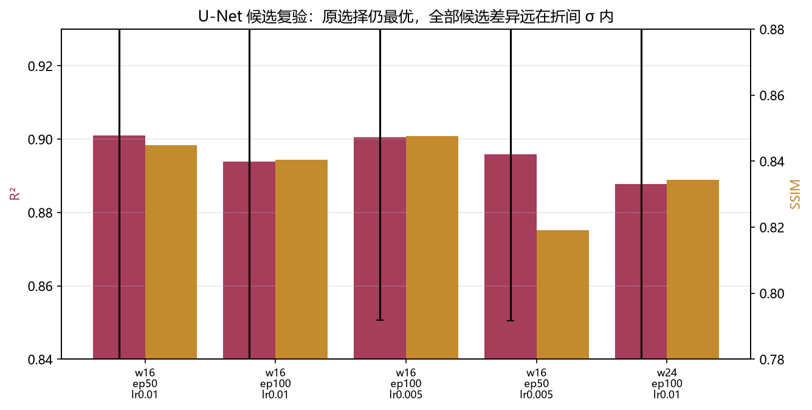

| 配置 | — | R² | SSIM |
|---|---|---|---|
| 宽度16, 50 ep, lr=0.01 | — | +0.9011 ± 0.0633 | 0.8448 |
| 宽度16, 100 ep, lr=0.01 | — | +0.8938 ± 0.0544 | 0.8405 |
| 宽度16, 100 ep, lr=0.005 | — | +0.9005 ± 0.0499 | 0.8476 |
| 宽度16, 50 ep, lr=0.005 | — | +0.8959 ± 0.0455 | 0.8192 |
| 宽度24, 100 ep, lr=0.01 | — | +0.8878 ± 0.0631 | 0.8343 |

原选择（宽 16、50 ep、lr 0.01）在 10 折下仍最优；全部候选 R² 只差 0.010、SSIM 差 0.031，
远在 ±0.06 折间 σ 内。

### 两个死杠杆

`optimizer` 曾对 adam/adamw/sgd 返回逐位相同的分数 —— 因为 `train()` 硬写了
`torch.optim.Adam`，等于什么都没测。曝光缩放增广虽然在本任务中**物理上精确成立**
（曝光是模型输入、CCD 线性、语料从不裁剪），却让 R² 变化**恰好为零**（4 位小数）。
原因可测：曝光在这个 family 里**恒定**（`log10 = −1.0`），**而且没有任何模型消费它** ——
`forward(phase_cos, phase_sin)` 而已。在模型看不见、且从不变化的维度上做有效增广，
必然是空操作。

## 9. 诚实的局限

- **只有一个 family、一个 `fov_px`。** 全部结论针对 `slm_zernike_shaping`（248 px）。
  `far_field_padding` 是 per-family 常量，换 family **必须重扫**。
- **采样单位是 pickle（n = 10），这是统计功效的硬上限。** 折数不可能超过组数。
- **k 折之间的差值并不独立** —— 第 i 折的训练集与第 j 折重叠 8/9。
  所以配对 t 检验与置换检验的 p 值都略偏激进，**效应量与置信区间才是诚实的头条**。
- **只有 4 个目标**，留一目标交叉验证只有 4 折，最小可达 p = 2/2⁴ = 0.125。
  该协议问题最对但功效不足 —— 要靠**增加目标数**解决，不是增加折数。
- **单个全局 `Z`** 只能表示全台系统性的相位，无法表示逐样本像差。
  这正是它停在 R² ≈ 0.88 而 U-Net（可逐样本变化）能到 0.90 的结构性原因。
- **散斑场上的 SSIM 是公认偏弱的指标**：其 structure 项是逐点归一化互相关，
  Larson & Chandler 显示 SSIM 对高斯噪声、散斑噪声、脉冲噪声、JPEG、模糊给出几乎相同的
  分数（约 0.64），它基本**无法区分失真类型**。本报告以 R² 与光斑域指标为主，
  SSIM 作次要描述量；`perplexity` 仅作单次运行内的单调重标度。
- **LPIPS/FID 刻意缺席**：它们需要预训练骨干网，而本环境没有 `torchvision`，
  `torchmetrics` 的感知指标确实无法导入。`available_perceptual_metrics()` 如实报告这一点，
  而不是返回一个常数。
- **`AGENTS.md` 同样记录了这些更正，但未提交**：它的 272 行 hunk 把本任务与另一位 agent
  未完成的 `cli_params.py` 笔记交织在一起。

## 10. 反转问题：固定网络权重，把 phase 当优化变量

前 9 节都是「训练网络去**预测** phase」。这里反过来：**权重全部冻结**，把输入 phase
当作唯一的优化变量，让代理模型输出的光斑成为 **50×50 px 的均匀方斑**：

```
固定 ZernikeAmpModel（requires_grad=False），只优化 φ：
    maximise  quality( surrogate(φ) )      s.t.  φ 在 SLM 网格上
```

这样做值得，是因为代理模型是**已标定**的：`far_field_padding=10` + 中心裁剪正是让
预测光斑能与 248 px 相机窗口逐像素对齐的那一步，而它来自 1010 帧实测。所以代理空间里
一个 50×50 的目标，对应相机窗口里 50×50 px。SPGD 每轮要两次相机读数且用不了梯度，
这条路一次读数都不需要。

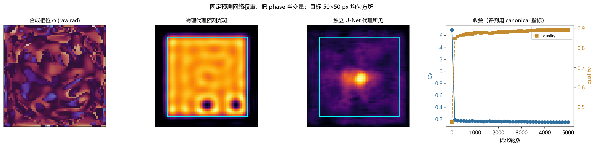

| 方案 | 参数量 | CV | EE | quality | 评判者 |
|---|---|---|---|---|---|
| 平相位（基线） | — | 1.6910 | 0.9124 | 0.4235 | 物理代理 |
| **合成相位** | — | **0.1511** | 0.9380 | **0.8918** | 物理代理 |
| 同一相位，换一个代理看 | — | 0.6189 | 0.7596 | 0.2369 | 独立 U-Net |
| 同一代理看平相位 | — | 1.6345 | — | 0.2758 | 独立 U-Net |
| 仓库参照：GS 单次 | — | 0.41 | — | — | 数值仿真 |
| 仓库参照：GS + 自由相位细化 | — | 0.12 | — | — | 数值仿真 |

### 三个结果

**1. 目标函数才是瓶颈，不是物理极限 —— 而且它错得很隐蔽。**

第一步用 MSE 填盒子（"盒内填满、盒外清空"）只到 CV 0.264。换成与 canonical
`compute_quality_score` 对齐的可微损失后到 CV 0.1511。中间还修掉一个**退化**：

第一版的可微质量分写成 `均匀度 × 盒内均值`（乘性）。但 **CV 看不见"暗"** ——
全零图像的 std=0，所以 CV=0、"完美均匀"得 1 分，而它一束光都没交出来。
写成乘性时，一个 4×4 的亮斑和一个全暗的框**打平**（MSE 上甚至暗的还略差：
0.6104 vs 0.6064）。canonical 的 `compute_quality_score` 是**加性**的
（CV 项 + EE 项），正是靠加性的 EE 项破掉这个平局。改成加性后结果从
CV 0.168 进一步到 0.1511，EE 也从 0.887 升到 0.9380。

> 这条比"调参"更重要：**两个目标函数优化的是不同的东西**，MSE 的最优并不是所报指标的
> 最优，而两者在冷启动区甚至给出**排序相反**的答案。

**2. 两个代理差 4.1 倍，但这「不能」直接读成"物理代理在光学上错了"。**

| 评判者 | 平相位 | 合成相位 |
|---|---|---|
| 物理代理（被优化的那个） | 1.6910 | **0.1511** |
| 独立训练的 U-Net 代理 | 1.6345 | **0.6189** |

U-Net 也看到光斑变均匀（1.6345 → 0.6189），所以这个相位**不是纯粹的
物理模型伪影**；但两个代理相差 4.1 倍（图中第三、四幅可以直接看出：一个说
"完美方斑"，另一个说"一个中心亮斑"）。

**关键在于这个分歧有多少来自外推。** 语料相位是 `n_max` 限定的 Zernike 相位，
天然带限；自由相位不是。定量测一下：

| | Zernike 张成空间内的能量占比 | 0.25×Nyquist 以上的能量占比 |
|---|---|---|
| 语料相位（n=101） | **0.627** | 带限 |
| **合成相位** | **0.273** | **0.759** |

合成相位只有 27.3% 的能量落在语料所在的 Zernike 张成空间里，而语料平均是
62.7%；它 75.9% 的能量在 0.25×Nyquist 以上。**它远离两个代理的训练流形。**

所以诚实的结论是：**两个代理都在外推，谁的数字都不能当光学真相。** 已知的只有
"合成相位确实把光斑从随机散斑变成了某个有结构的形态"（两者都看到明显改善），
以及"代理自称的均匀度不可信"。**真实 CV 只能靠硬件测。**

**方法论结论：学习到的回归器不能直接当整形目标函数。** 两个原因叠加 ——
它会把散斑预测平滑掉（于是"看起来干净"的相位在真实探测器上仍有散斑），
而且它自己找到的最优点落在自己的训练分布之外，在那里它的预测从未被验证过。
要修，两条路：把优化限制在模型可信的流形上（Zernike 限定 —— 但仓库已记录低阶 Zernike
**造不出**方斑），或者给损失加散斑敏感项。

**3. 回到可信流形：Zernike 带限的代价是 2.5 倍。** 把相位限制在语料所在的
`n_max` Zernike 张成空间内（piston 排除，因为不影响强度）：

| 参数化 | DOF | CV | EE | quality | Zernike 跨度内能量 | 高频能量占比 |
|---|---|---|---|---|---|---|
| zernike n_max=4 | 14 | 0.7600 | 0.9153 | 0.4956 | 1.000 | 0.955 |
| zernike n_max=8 | 44 | 0.5693 | 0.9096 | 0.5453 | 1.000 | 0.892 |
| zernike n_max=15 | 135 | 0.3858 | 0.9139 | 0.6493 | 1.000 | 0.911 |
| zernike n_max=20 | 230 | 0.4257 | 0.9307 | 0.6326 | 0.639 | 0.856 |
| zernike n_max=30 | 495 | 0.4777 | 0.9222 | 0.6084 | 0.362 | 0.567 |
| **freeform** | 4,096 | 0.1551 | 0.9372 | 0.8873 | 0.274 | 0.767 |

三点值得记：

1. **可信的答案是 CV 0.3858**（`n_max=15`），不是 freeform 的 0.1551。
   带限让它差 **2.5 倍**，且恰好落在仓库 GS 基线 0.41 上 —— 这就定量证实了
   仓库那条反模式："低阶 Zernike 造不出方斑远场"。
2. **`n_max` 非单调**：4→8→15 依次改善（0.76→0.57→0.39），到 20/30 反而变差
   （0.43/0.48）。更高的模式让优化器去追局部纹理，牺牲了框内均匀性。
3. **`n_max>15` 也出流形**：zfrac 从 1.000 掉到 0.639/0.362。代理是在 `n_max=15`
   上训练并验证的，所以"带限"的分界不是数学上的，是**验证过的**分界。

**4. 迭代优化这个模型 —— 试了，但它不是瓶颈。** 用一个代理"动物园"（DOF 14→135、
epoch 25→100，横跨欠拟合到过训练）迭代，每个都在**留出 pickle** 上评 R²，
再各自在可信流形内合成相位：

| 代理 | DOF | 留出 R²（3 折） | 合成相位 CV | quality |
|---|---|---|---|---|
| n4_e25 | 14 | +0.8486 | 0.3975 | 0.6469 |
| n8_e25 | 44 | +0.8640 | 0.4112 | 0.6389 |
| n15_e25 | 135 | +0.8723 | 0.4018 | 0.6445 |
| n15_e50 | 135 | +0.8694 | 0.4010 | 0.6442 |
| n15_e100 | 135 | +0.8722 | 0.4434 | 0.6226 |

**结论一：更好的模型并不给出更好的相位。** 留出 R² 从 +0.849 升到 +0.872，
合成相位 CV 却在 0.39–0.44 之间（跨度仅 **0.046**），
`corr(留出 R², 合成 CV) = +0.458`（n=5，**p = 0.438，不显著**）。

**结论二：每个代理都认为自己的相位最好。** 交叉评判矩阵里，**对角线在每一行都是最小值**
（自评 0.399/0.418/0.387/0.410/0.443，逐行等于该行的最优裁判）。这是把
self-confirmation bias 直接量化出来了。

**结论三：测量被"模型选择"噪声淹没。** 同一相位在不同代理眼下的 CV 跨度是
**0.21–0.43**，而我们想测的配置差异只有 **0.046** —— 差约
7 倍。换模型带来的扰动远大于信号。

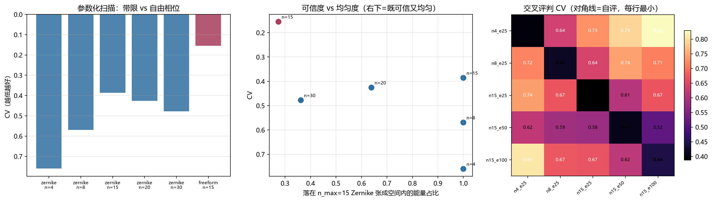

所以"把模型迭代得更好"**不是**做出更好方斑相位的杠杆。杠杆是一个**可信的、散斑敏感的**
前向模型，而那需要硬件 —— 学习到的回归器按定义就把散斑抹平了。第 2 节那个 4.1 倍
的分歧、以及这里 7 倍的模型间噪声，都指向同一件事。

> **这条结论只到"代理空间"为止。** 物理模型在留出 pickle 上 R² ≈ 0.88，
> 一个把代理优化到 CV 0.17 的相位，并不因此在真实台架上也是 CV 0.17。
> **必须在硬件上验证**；上面的 U-Net 交叉检验是硬件不可用时能做的最强旁证，
> 而它的结论是"有改善但远不如代理声称的"。

## 11. 本报告中被推翻的结论

保留记录，因为**三次朝相反方向搞错、再加一次诊断算错**正是重点：

| 版本 | 结论 | 为什么错 |
|---|---|---|
| v1 | "U-Net R² 高 +0.022；SSIM 是真实且区间不重叠的差距" | 方向对、证据错：单 seed，且 U-Net 只给 25 epoch 而物理模型第 13 epoch 就收敛 |
| v2 | "两者打平，无任何指标能区分" | **过度纠正**：把折间方差当成了模型差异 |
| v3 | "U-Net 显著更好；hybrid 不会更好，且在调优 lr 下更差" | 分组 CV + 配对精确检验，4 折与 10 折均成立 |
| d1 | "目标均值图互相预测 R² = −0.670，比常数还差" | **算错**：分母量纲不一致。重算后全表为正（最低 +0.54） |

两个教训：

1. 噪声大到看不见效应时，**过度纠正和轻信同样危险**。v2 把真实差异否认掉，
   根源是我先认定噪声来自"只有 128 条验证集"，而没去定位它的真实来源。
2. **解释性数字和结论要用不同的严格度。** v3 的结论建立在 10 折配对检验上，
   经得起复算；而 d1 那个"−0.670"是手算的辅助论据，量纲错了却没人复核 ——
   它是本轮**画图时才暴露**的。图比手算更可信，因为它用了被预测组自己的 `SS_tot`。

## 12. 复现

```bash
# 扫描并落盘（10 折分组 CV，约 30 min 单卡）
python scripts/sweep_zernike_models.py
# 只重跑调优后的最终对比，复用已保存的网格
python scripts/sweep_zernike_models.py --final-only

# 生成图与本报告（全离线）
python scripts/generate_zernike_amp_report.py

# 训练 + wandb（无 key 时离线）
python -m ml.zernike.train_amp --n-max 20 --epochs 50 --lr 0.02 \\
    --max-train 1010 --beam-samples 96 --out-dir logs/zernike_amp_final

# 权威对比：分组 CV + 配对精确检验
python scripts/compare_models_cv.py --protocol both

# 不重训、只重算统计量
python scripts/compare_models_cv.py --analyse logs/models_cv_objective.json

# 测试
python -m pytest tests/ao_shaping/ml/zernike -q                        # 67
python -m pytest tests/ao_shaping/scripts/test_compare_models_cv.py -q  # 19
```
