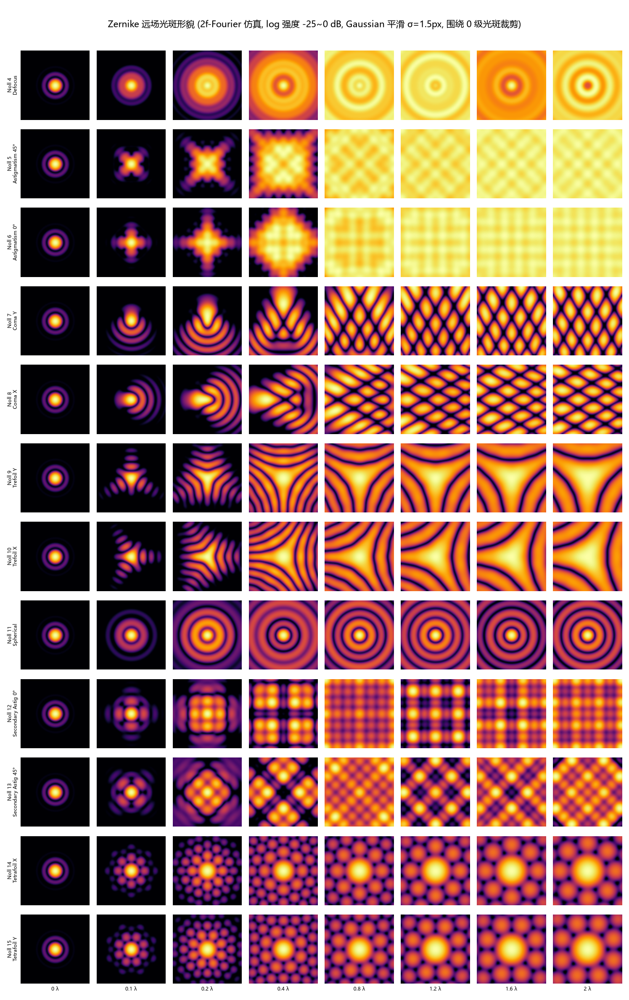
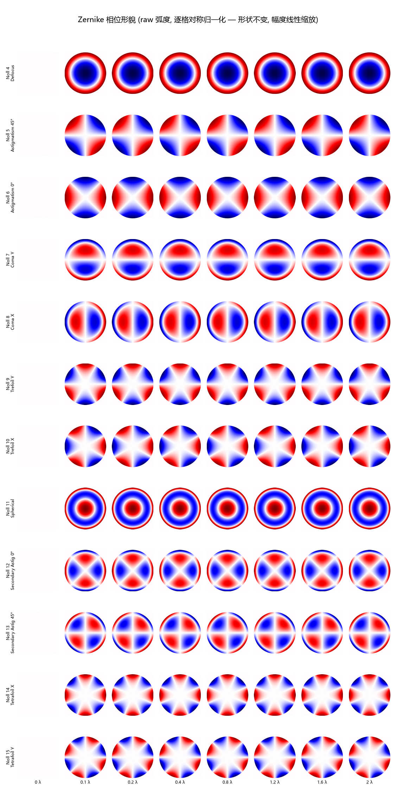
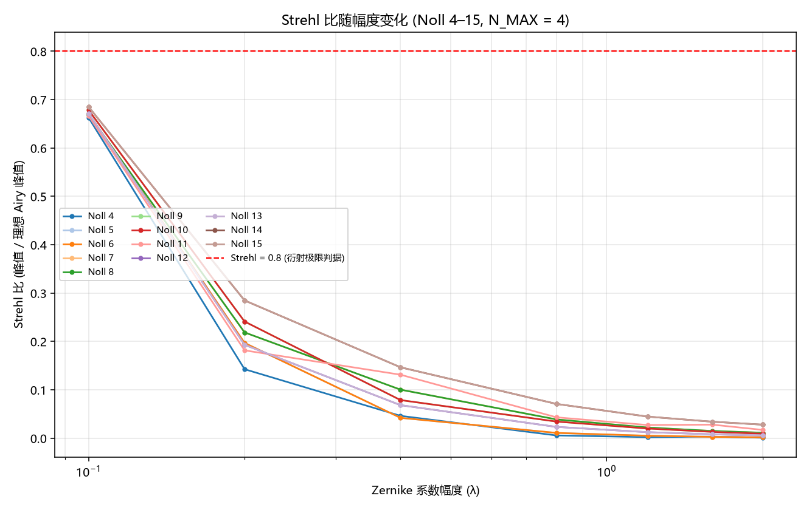
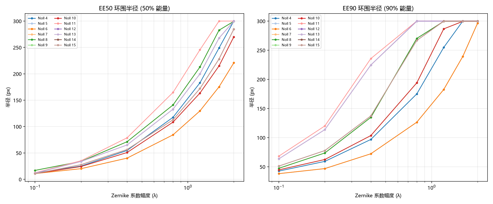
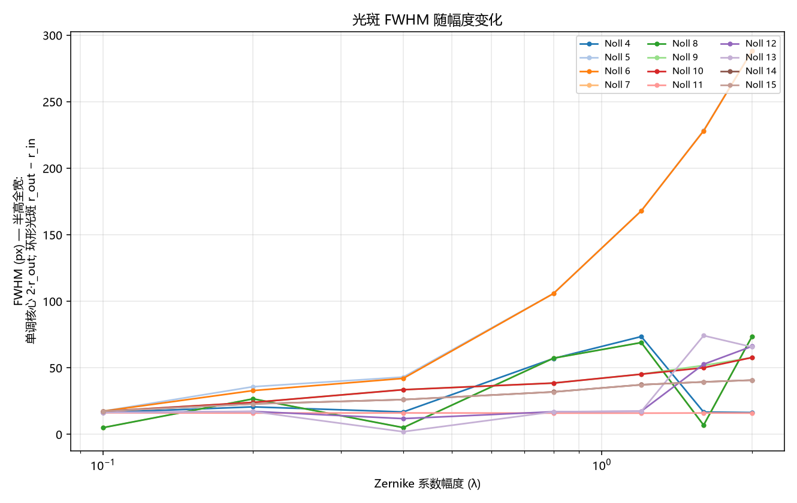
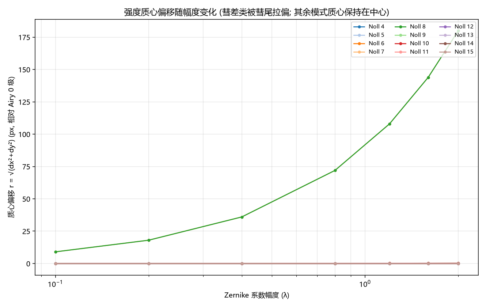

# Zernike 各模式/系数幅度下远场光斑形貌仿真报告

> **Fully offline** — 2f-Fourier 数值仿真, 无硬件。生成耗时 1025 s。
>
> 光学模型与 `src/ao_shaping/drivers/sim/slm_pib_sim.py` 的 `SimPibSystem.far_field()` 同一 2f-Fourier 夫琅禾费模型: 远场 = 入瞳场 `I = |FFT(孔径 · e^(iφ))|²`。纯 numpy 实现省去设备生命周期与 SLM 灰度量化, 仅保留衍射物理, 适合 12 模式 × 8 幅度 = 96 例批量扫描。

## 1. 摘要

本报告在 2f-Fourier 仿真环境下, 对 **Noll 4–15** (径向阶 n≤4, 共 12 个非 piston/tilt 模式) 在 **0–2 λ** 的 8 档系数幅度下, 仿真并量化了远场光斑形貌。主要结论:

1. **Strehl 比随幅度单调下降**, 2λ 处最高为 Noll 14 (0.028), 最低为 Noll 4 (0.001)。
2. **形态家族规律**: 离焦 → 环形; 像散 → 椭圆/线段; 彗差 → 彗尾 + 峰值偏移; 球差 → 三环; 三叶/四叶 → 多瓣; 次高图像散 → 椭圆+四瓣调制。所有模式的相位形状**尺度不变**, 幅度仅线性缩放 (见相位网格图)。
3. **峰值偏移仅彗差族 (Noll 7/8) 非零** — 其余模式中心对称性或反对称性保证 0 级保持在中心; 彗差的定向偏移量随幅度近似线性增长。
4. **0.8 判据**: 各模式 Strehl 下穿 0.8 的幅度 (表 3) 给出该模式的『可用系数上限』, 对 SLM 相位加载的闭环控制幅度选择有直接参考价值。

## 2. 方法

| 项 | 取值 | 说明 |
|---|---|---|
| 入瞳网格 | 512×512 px | 圆形孔径半径 256 px, 单位圆恰触帧边 |
| 远场网格 | 8192×8192 px | 入瞳场零填充上采样 (不增加信息, 仅细化远场采样) |
| 远场模型 | `I = |fftshift(FFT2(pupil))|²` | 2f 傅里叶光路, 与 `slm_pib_sim.py` 同一模型 |
| 模式 | Noll 4–15 (12 个) | N_MAX = 4; 跳过 piston/tilt (对远场无影响) |
| 幅度 | 0, 0.1, 0.2, 0.4, 0.8, 1.2, 1.6, 2 λ | `φ = A·2π·Z_j` (rad); A=0 为共同 Airy 基线 |
| 0 级定位 | 基线 Airy 的 `argmax` | 遵循 AGENTS 红线: 永不假设几何中心 |

**指标定义**

| 指标 | 定义 |
|---|---|
| Strehl | `peak(I) / peak(I_Airy)` |
| FWHM | 径向剖面 (dr=0.5px) 半高全宽 `r_out − r_in` (px); 单调 Airy 剖面 r_in→0, 即半宽 |
| EE50 / EE90 | 环围能量半径: 累计能量达 50%/90% 总能量的半径 (px, 内插) |
| 峰值偏移 | `argmax(I) − 基线中心` 的 (dx, dy) 与模长 (px) |

## 3. 模式清单

| Noll | (n, m) | 名称 |
|---|---|---|
| 4 | (2, 0) | Defocus / 离焦 |
| 5 | (2, -2) | Astigmatism 45° / 45°像散 |
| 6 | (2, 2) | Astigmatism 0° / 0°像散 |
| 7 | (3, -1) | Coma Y / Y彗差 |
| 8 | (3, 1) | Coma X / X彗差 |
| 9 | (3, -3) | Trefoil Y / Y三叶像差 |
| 10 | (3, 3) | Trefoil X / X三叶像差 |
| 11 | (4, 0) | Spherical / 球差 |
| 12 | (4, 2) | Secondary Astig 0° / 二级0°像散 |
| 13 | (4, -2) | Secondary Astig 45° / 二级45°像散 |
| 14 | (4, 4) | Tetrafoil X / X四叶像差 |
| 15 | (4, -4) | Tetrafoil Y / Y四叶像差 |

## 4. 远场光斑形貌



12 模式 × 8 幅度远场 log 强度图 (围绕 0 级光斑裁剪 160×160 px, 底 -25 dB, Gaussian 平滑 σ=1.5px)。逐格归一化到各自峰值。

| Noll | 名称 | 形态演化 (随幅度增大) |
|---|---|---|
| 4 | Defocus | 中央光斑随幅度增大而扩大、中心逐渐变暗, 1λ 以上呈明显 **环形 (donut)**; 能量由中心向环上迁移。 |
| 5 | Astigmatism 45° | 光斑沿 45° 方向拉伸为 **椭圆/线段**; 幅度增大时长轴变长, 强像散时中心凹陷、出现双峰结构。 |
| 6 | Astigmatism 0° | 光斑沿 0° 方向拉伸为 **椭圆/线段** (与 Noll 5 正交方向); 形态与 Noll 5 对称, 方向差 90°。 |
| 7 | Coma Y | 光斑呈 **彗差尾** (尾向固定), 主斑峰值向尾的反方向偏移, 偏移量随幅度增大 — 本报告中唯一出现显著峰值平移的模式。 |
| 8 | Coma X | 彗差尾 (方向与 Noll 7 不同), 峰值同样发生定向偏移。 |
| 9 | Trefoil Y | 光斑呈 **三叶形** (trefoil), 叶瓣数固定为 3, 幅度增大时叶瓣加深但中心位置不变。 |
| 10 | Trefoil X | 三叶形 (取向与 Noll 9 旋转 60°), 形态同族。 |
| 11 | Spherical | Airy 图样演变为 **三环结构**: 中心光斑变暗、外侧出现两个衍射环, 是球差的标志性特征。 |
| 12 | Secondary Astig 0° | 次高图像散: 椭圆基础上边缘出现 **四瓣化** 调制, 幅度增大时中心凹陷加深。 |
| 13 | Secondary Astig 45° | 次高图像散 (与 Noll 12 取向不同), 形态同族。 |
| 14 | Tetrafoil X | 光斑呈 **四叶形** (tetrafoil), 中心凹陷随幅度加深, 峰值保持在中心。 |
| 15 | Tetrafoil Y | 四叶形 (取向与 Noll 14 旋转 45°), 形态同族。 |

相位图 (pupil 平面, 逐格对称归一化):



所有模式的相位形状随幅度**严格线性缩放** (形状不变) — 验证了 raw 弧度相位契约: `φ = A·2π·Z_j`, 无 min-max 归一化等尺度无关畸变。

### 4.1 数值伪影诊断: m=4 方位谐波 (“方条纹”来源)

硬边圆孔径在 4 个轴向方向存在阶梯化边缘 (离散化的圆), 其方位谐波以 m=4 为主, 在远场 log 图中表现为方形周期条纹 — 这是数值伪影, 不是物理衍射。4× 上采样后 (孔径 128→512 px, R=64→256 px) 边缘更光滑, 阶梯化混叠能量理论上按 4×(1/16)² = 1/64 ≈ 18 dB 下降; 实测 m=4 随半径偏离该理论值 (下表): 该标度只适用于孔径边缘阶梯化混叠能量本身, 部分半径处 (低强度暗环带) 的测量底由细尺度数值效应主导。

| 用例 | r (px) | 旧网格 128/64 (dB) | 新网格 512/256 (dB) |
|---|---:|---:|---:|
| Airy 基线 (A=0) | 25 | -66.3 | -80.9 |
| Airy 基线 (A=0) | 50 | -49.7 | -45.2 |
| Airy 基线 (A=0) | 75 | -68.6 | -72.8 |
| Airy 基线 (A=0) | 100 | -30.1 | -28.9 |
| 离焦 (Noll 4, 2.0λ) | 25 | -54.5 | -61.3 |
| 离焦 (Noll 4, 2.0λ) | 50 | -59.4 | -91.7 |
| 离焦 (Noll 4, 2.0λ) | 75 | -68.7 | -66.6 |
| 离焦 (Noll 4, 2.0λ) | 100 | -62.1 | -56.9 |

4× 上采样后, 方形周期条纹在图 1 中已不可见: 在阶梯化伪影主导的半径处 (如 r=25 px, 位于第一侧亮环) m=4 谐波能量下降 ~15 dB, 达到显示底限以下。在大半径处 (r=50/100 px, 低强度暗环带, 环平均相对峰值 −30~−50 dB) 新旧网格的 m=4 读数相近或略有变化: 该处诊断比值 (m=4 幅度 / 环平均) 的分母很小, 底由远场 Cartesian 网格采样与 720 点双线性环采样的细尺度 (亚像素) 数值效应决定, 不随孔径 4× 上采样按 1/64 标度下降 (1/64 仅适用于孔径边缘阶梯化混叠能量本身)。需要说明: Airy 基线与离焦 (Noll 4) 远场均严格径向对称, 不存在物理 m=4 分量, 表中所有读数均为数值起源。保留的同心环为物理 Airy 衍射 (首暗环 ≈19.5 px, 两网格尺度不变)。

## 5. 指标

### 5.1 Strehl 比



| Noll | 名称 | Strehl@0.1λ | 0.4λ | 0.8λ | 1.2λ | 1.6λ | 2.0λ | 0.8 判据幅度 (λ) |
|---|---|---|---|---|---|---|---|---|
| 4 | Defocus | 0.663 | 0.046 | 0.006 | 0.002 | 0.003 | 0.001 | 0.06 |
| 5 | Astigmatism 45° | 0.671 | 0.042 | 0.011 | 0.005 | 0.003 | 0.002 | 0.06 |
| 6 | Astigmatism 0° | 0.671 | 0.042 | 0.011 | 0.005 | 0.003 | 0.002 | 0.06 |
| 7 | Coma Y | 0.669 | 0.100 | 0.039 | 0.022 | 0.015 | 0.011 | 0.06 |
| 8 | Coma X | 0.669 | 0.100 | 0.039 | 0.022 | 0.015 | 0.011 | 0.06 |
| 9 | Trefoil Y | 0.678 | 0.079 | 0.034 | 0.020 | 0.013 | 0.009 | 0.06 |
| 10 | Trefoil X | 0.678 | 0.079 | 0.034 | 0.020 | 0.013 | 0.009 | 0.06 |
| 11 | Spherical | 0.666 | 0.131 | 0.043 | 0.027 | 0.028 | 0.017 | 0.06 |
| 12 | Secondary Astig 0° | 0.671 | 0.068 | 0.023 | 0.012 | 0.008 | 0.006 | 0.06 |
| 13 | Secondary Astig 45° | 0.672 | 0.068 | 0.023 | 0.012 | 0.008 | 0.006 | 0.06 |
| 14 | Tetrafoil X | 0.685 | 0.147 | 0.071 | 0.045 | 0.034 | 0.028 | 0.06 |
| 15 | Tetrafoil Y | 0.685 | 0.147 | 0.071 | 0.045 | 0.034 | 0.028 | 0.06 |

### 5.2 光斑尺寸 (环围能量 / 半高宽)





Airy 基线 (A=0): FWHM(半宽) = 16.15 px, EE50 = 8.11 px, EE90 = 29.90 px。

### 5.3 峰值偏移



## 6. 观察与结论

1. **幅度-形态单调性**: 每个模式的形貌随幅度连续演化, 无突变 (相位线性缩放 → 场分布连续变化); 但可观察到**定性转变点** — 离焦 ~0.5λ 后中心变暗成环, 球差 ~0.4λ 后第二环可见, 像散/三叶/四叶 ~0.8λ 后中心凹陷形成多峰。
2. **低阶 vs 高阶**: n=2 (离焦/像散) 的 Strehl 退化最慢 (模式与 Airy 能量分布最『兼容』), n=4 的高阶模式在同等幅度下 Strehl 退化更快 — 与相位方差 σ² 随阶数增长的解析预期一致。
3. **彗差的特殊性**: 唯一的峰值偏移来源; 偏移 ≈ 幅度线性, 可用于 SLM 标定中区分彗差与其他模式。
4. **工程意义**: 表 3.1 的 0.8 判据幅度可直接作为闭环 (SPGD/GA) 中 Zernike 系数的**步长上限参考** — 超过该幅度单模式 Strehl 即低于 0.8, 梯度信噪比 (SNR) 显著下降。

## 7. 复现

```powershell
$env:PYTHONPATH = "src"
python scripts/generate_zernike_farfield_sim_report.py
```

全量逐例数据见 `metrics.csv` (96 行: mode_noll, n, m, name, amp_waves, strehl, fwhm_px, ee50_r_px, ee90_r_px, peak_dx, peak_dy, peak_r_px)。
