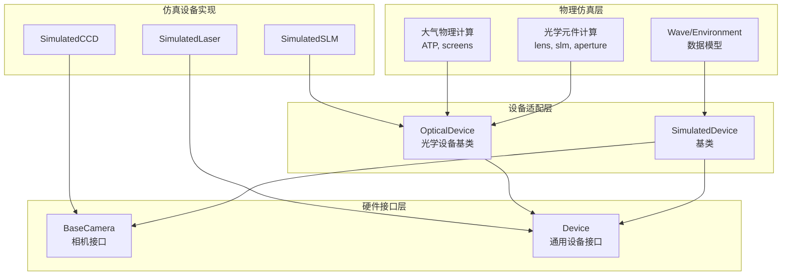

# 仿真设备迁移架构设计方案

## 1. 架构概述

### 1.1 设计目标

将 `src/sim/digitaltwin` 中的设备仿真代码按照 `src/ao_shaping/drivers` 的 Device 基类模式封装，迁移到 `drivers` 文件夹下，同时保持向后兼容性和功能完整性。

### 1.2 核心挑战

- `Device` 基类是为**真实硬件**设计的，假设存在连接/断开操作
- `digitaltwin` 模块包含**三类不同性质**的代码：
  1. 基础数据模型（Wave, Environment）
  2. 光学设备仿真（CCD, Laser, SLM, Optics）
  3. 大气物理仿真（ATP, Phase Screens）

### 1.3 解决方案：分层架构

采用**分层适配**策略：
- **物理仿真层**：保留核心数值计算逻辑
- **设备适配层**：包装为 Device 兼容的仿真设备

---

## 2. 目标目录结构

```
src/ao_shaping/drivers/
├── sim/                              # 仿真设备目录 (新建)
│   ├── __init__.py
│   ├── base.py                       # 仿真设备基类
│   ├── wave.py                       # 波动数据模型 (从 digitaltwin/base.py)
│   ├── environment.py                # 环境参数模型 (从 digitaltwin/base.py)
│   ├── ccd/
│   │   ├── __init__.py
│   │   └── simulated_ccd.py          # 仿真相机 (继承 BaseCamera)
│   ├── laser/
│   │   ├── __init__.py
│   │   └── simulated_laser.py        # 仿真激光器
│   ├── optics/
│   │   ├── __init__.py
│   │   ├── simulated_slm.py          # 仿真 SLM
│   │   ├── lens.py                   # 透镜
│   │   ├── aperture.py                # 光阑
│   │   ├── polarizer.py              # 偏振片
│   │   └── wave_plate.py             # 波片
│   └── atmos/                         # 大气物理仿真
│       ├── __init__.py
│       ├── screens.py                # 相位屏 (从 screens.py)
│       ├── atp.py                   # 大气传输 (从 atp.py)
│       └── params.py                 # 参数计算 (从 params.py)
│
├── (existing)
├── ccd/
├── dm/
├── slm/
└── ...
```

---

## 3. 仿真设备基类设计

### 3.1 SimulatedDevice 基类

```python
# drivers/sim/base.py

from abc import ABC, abstractmethod
from typing import Any, Optional
import numpy as np

from ao_shaping.drivers.device_base import Device, DeviceState, DeviceType

class SimulatedDevice(Device):
    """仿真设备基类
    
    继承自 Device 基类，添加仿真特有功能：
    - 数值计算核心
    - 配置参数管理
    - 仿真状态控制
    """
    
    def __init__(self, device_id: str = ""):
        super().__init__(device_id)
        self._simulation_enabled = True
    
    # ========== Device 基类抽象方法 ==========
    
    def open(self) -> None:
        """打开仿真设备"""
        self._set_state(DeviceState.READY)
    
    def close(self) -> None:
        """关闭仿真设备"""
        self._set_state(DeviceState.DISCONNECTED)
    
    def is_connected(self) -> bool:
        """检查连接状态"""
        return self._state == DeviceState.READY
    
    def get_hardware_info(self) -> dict[str, Any]:
        """获取硬件信息（仿真模式返回模拟信息）"""
        return {
            "device_type": "simulation",
            "model": self.__class__.__name__,
            "simulation": True
        }
    
    # ========== 仿真特有方法 ==========
    
    @abstractmethod
    def compute(self, *args, **kwargs):
        """执行仿真计算"""
        pass
    
    def reset(self) -> None:
        """重置仿真状态"""
        pass
    
    def set_seed(self, seed: int) -> None:
        """设置随机种子（用于可重复仿真）"""
        pass
```

### 3.2 光学设备专用基类

```python
# drivers/sim/base.py (继续)

class OpticalDevice(SimulatedDevice):
    """光学设备仿真基类"""
    
    def __init__(self, device_id: str = ""):
        super().__init__(device_id)
        self.wavelength: float = 1064.0  # nm
        self._input_wave = None
    
    @abstractmethod
    def process(self, wave):
        """处理波动场"""
        pass
    
    def set_input(self, wave) -> None:
        """设置输入波动场"""
        self._input_wave = wave
    
    def get_output(self):
        """获取输出波动场"""
        return self._output_wave
```

---

## 4. 具体设备映射

### 4.1 仿真相机 (CCD)

```python
# drivers/sim/ccd/simulated_ccd.py

from ao_shaping.drivers.ccd.base import BaseCamera
import numpy as np

class SimulatedCCD(BaseCamera):
    """仿真相机
    
    继承 BaseCamera 接口，内部使用数值仿真计算
    """
    
    device_type = "SIMULATED_CCD"
    
    def __init__(self, resolution=(1024, 1024), noise_level=5.0):
        super().__init__()
        self._resolution = resolution
        self._noise_level = noise_level
    
    # 实现 BaseCamera 抽象方法...
    
    def get_numpy_image(self, n_sample=1, skip_first=True) -> np.ndarray:
        """获取仿真图像"""
        # 调用 digitaltwin 的 CCD 计算逻辑
        return self._simulate_capture()
```

### 4.2 仿真激光器 (Laser)

```python
# drivers/sim/laser/simulated_laser.py

from ao_shaping.drivers.sim.base import SimulatedDevice, OpticalDevice
import numpy as np

class SimulatedLaser(OpticalDevice):
    """仿真激光器
    
    继承 Device 基类，实现激光器仿真
    """
    
    device_type = DeviceType.LASER
    manufacturer = "Simulation"
    model = "Simulated Laser"
    
    def __init__(self, power=100, wavelength=1064):
        super().__init__()
        self.power = power
        self.wavelength = wavelength
    
    def compute(self):
        """生成激光波动场"""
        # 调用 digitaltwin 的 laser.py 逻辑
        return self._generate_laser_beam()
```

### 4.3 仿真 SLM

```python
# drivers/sim/optics/simulated_slm.py

from ao_shaping.drivers.sim.base import OpticalDevice
import numpy as np

class SimulatedSLM(OpticalDevice):
    """仿真空间光调制器
    
    继承光学设备基类
    """
    
    def __init__(self, resolution=(1920, 1080)):
        super().__init__()
        self._resolution = resolution
        self._phase_pattern = None
    
    def set_phase(self, phase: np.ndarray) -> None:
        """设置相位图"""
        self._phase_pattern = phase
    
    def process(self, wave):
        """施加相位调制"""
        # 调用 digitaltwin 的 optics.py SLM 逻辑
        return self._apply_phase(wave)
```

---

## 5. 大气物理仿真模块

### 5.1 模块设计

大气物理仿真作为独立模块，但可以与仿真设备集成：

```python
# drivers/sim/atmos/screens.py

from sim.digitaltwin import screens as dt_screens

class ThermalScreen:
    """热晕相位屏 - 保留原始数值计算"""
    
    def __init__(self, dist, env, solve_mode='FFT_non_Isobaric'):
        self._screen = dt_screens.ThermalScreen(dist, env, solve_mode)
    
    def compute(self, wave):
        """计算相位屏对波动场的影响"""
        return self._screen.out(wave)

class TurbulentScreen:
    """湍流相位屏"""
    
    def __init__(self, dist, env, harmonic=1):
        self._screen = dt_screens.TurbulentScreen(dist, env, harmonic)
    
    def compute(self, wave):
        return self._screen.out(wave)
```

### 5.2 ATP 传输

```python
# drivers/sim/atmos/atp.py

from sim.digitaltwin import atp as dt_atp

class ATMTransport:
    """大气传输仿真"""
    
    def __init__(self, env_init, prop_dist, layers):
        self._atp = dt_atp.ATP(env_init, prop_dist, layers)
    
    def propagate(self, wave):
        """传输波动场"""
        self._atp.out(wave)
        return wave
```

---

## 6. 迁移优先级

| 优先级 | 模块 | 理由 |
|--------|------|------|
| P0 | `sim/base.py` | 核心基类，先行创建 |
| P1 | `sim/ccd/simulated_ccd.py` | 与现有 BaseCamera 集成 |
| P1 | `sim/laser/simulated_laser.py` | 新增设备类型 |
| P2 | `sim/optics/simulated_slm.py` | 复用现有 SLM 驱动结构 |
| P2 | `sim/atmos/` | 大气物理独立模块 |
| P3 | 其他光学元件 | 低优先级 |

---

## 7. 导入兼容方案

### 7.1 保留原导入路径

```python
# sim/digitaltwin/__init__.py

# 兼容性导入 - 指向新的 drivers.sim 模块
import warnings
warnings.warn(
    "sim.digitaltwin is deprecated, use ao_shaping.drivers.sim",
    DeprecationWarning
)

from ao_shaping.drivers.sim.ccd import SimulatedCCD
from ao_shaping.drivers.sim.laser import SimulatedLaser
# ...
```

---

## 8. Mermaid 架构图



---

## 9. 实施建议

1. **渐进式迁移**：不要一次性迁移所有代码，每次迁移一个模块
2. **保持测试**：为每个迁移的类编写单元测试
3. **文档更新**：更新 AGENTS.md 和 INTERFACE_DOCS.md
4. **向后兼容**：保留原导入路径，使用 DeprecationWarning

---

*文档版本：v1.0*
*创建日期：2026-03-11*
