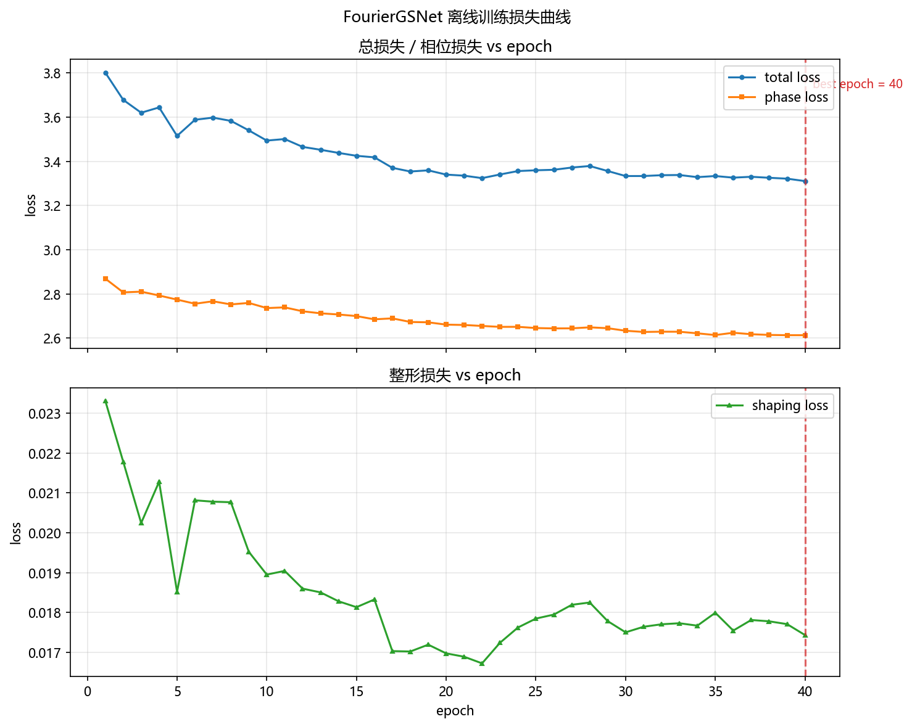
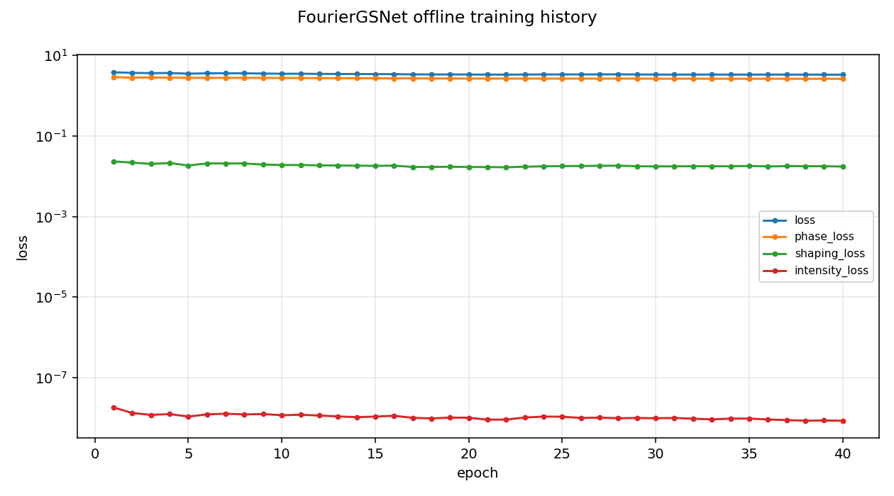
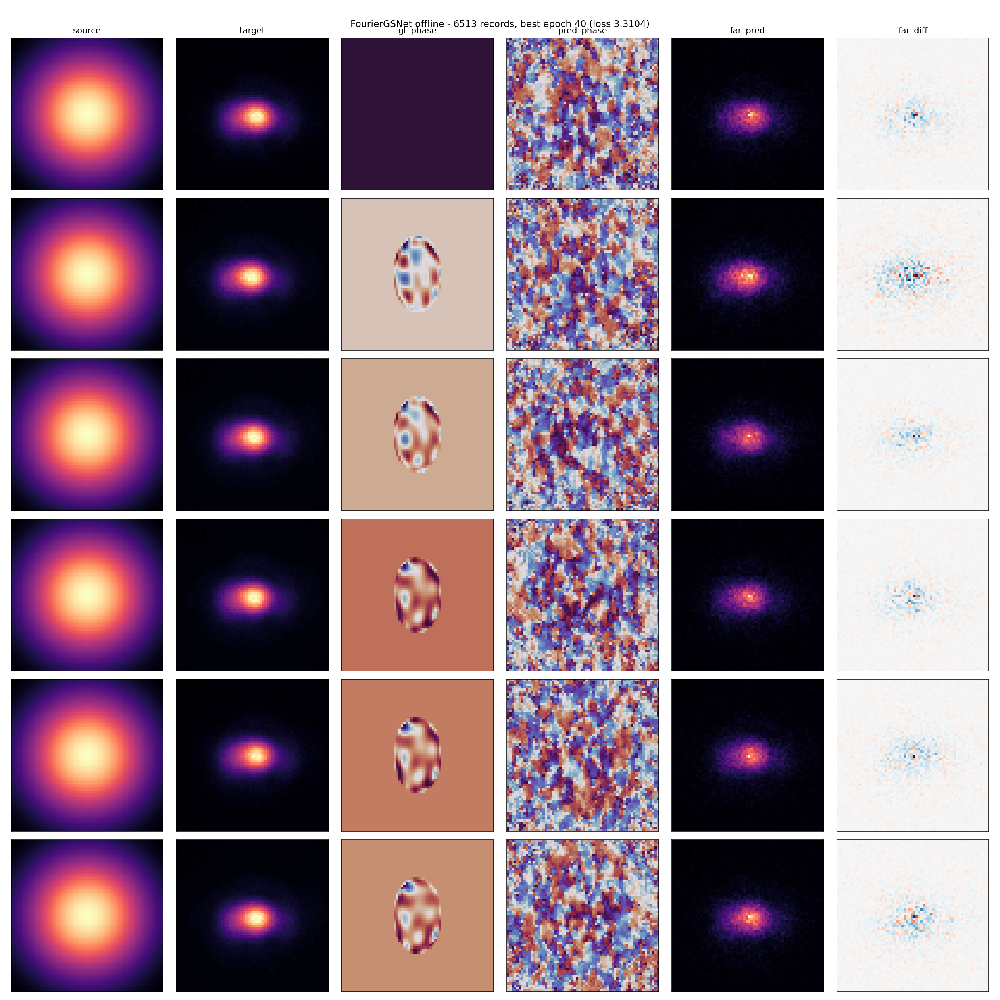

# FourierGSNet 离线训练报告

<!-- provenance:start -->
> **生成脚本**: [`scripts/generate_gsnet_offline_report.py`](../../../scripts/generate_gsnet_offline_report.py)
> **复现命令**: `python scripts/generate_gsnet_offline_report.py`
> **运行环境**: 离线
> **说明**: 读 data/gsnet_train/run-*/summary.json
<!-- provenance:end -->

**生成时间**: 2026-09-30 04:21:28
**数据来源**: `data/gsnet_train/run-20260929_225847`

**Fully offline** — 本报告由 `scripts/generate_gsnet_offline_report.py` 离线生成, 仅读取该次训练已保存的 `summary.json` / `comparison.png` / `train_history.png`, **不导入 torch, 不打开任何硬件, 不访问网络**。

## 1. 训练配置

| 参数 | 值 |
|---|---|
| 训练轮数 (epochs) | 40 |
| 批大小 (batch_size) | 16 |
| 学习率 (lr) | 0.0003 |
| 相位损失权重 (w_phase) | 1.0000 |
| 整形损失权重 (w_shaping) | 40 |
| 网络层数 (num_layers) | 10 |
| 基础通道数 (base_channels) | 32 |
| 网格 (grid) | 64 |
| 可训练参数量 | 7344650 |
| 训练记录数 (n_records) | 6513 |
| 评估样本数 (n_samples) | 6513 |
| 计算设备 | cuda |
| 随机种子 (seed) | 0 |
| 对比样本数 (n_compare) | 6 |

## 2. 收敛概览

| 指标 | 值 |
|---|---|
| 实际记录 epoch 数 | 40 |
| 配置 epoch 数 | 40 |
| best_epoch | 40 |
| best_loss | 3.3104 |
| 首 epoch 总损失 | 3.8014 |
| 末 epoch 总损失 | 3.3104 |
| 总损失下降 | 0.4911 |
| 训练墙钟时间 (s) | 17925.2 |
| 平均每 epoch (s) | 448.1 |

损失趋势: 共 40 个 epoch, 总损失 3.8014 → 3.3104 (下降 0.4911, 12.9185%), 记录到的最低总损失 3.3104 出现在 epoch 40 (红色虚线)。

## 3. 评估指标

| 键 | 含义 | 值 |
|---|---|---|
| phase_mae | 相位平均绝对误差 (rad) | 1.4161 |
| far_correlation | 远场强度 Pearson 相关系数 | 0.9805 |
| far_rmse | 远场强度 RMSE | 8.745e-05 |
| uniformity_cv | 均匀度变异系数 (std/mean) | 1.8805 |
| encircled_energy | 环围能量 | 0.9957 |

**指标解读** (基于上述实测值, 非预设结论):

- **远场相关系数 0.9805**: 该值接近 1, 说明预测图与真值图的**整体强度分布形状**高度一致。但 Pearson 相关只衡量线性相似度 —— 它对亮度缩放与少量离群像素不敏感, **不能**据此断言整形质量优秀。
- **均匀度变异系数 CV = 1.8805**: **很差** (标准差已超过均值, 目标区域内存在明显暗区/强离群点)。CV 为 ROI 内标准差/均值, 理想平顶应趋近 0, 因此这是本次训练**最需要改进**的指标。
- **环围能量 0.9957**: 绝大部分能量已进入目标区。
- **相位 MAE 1.4161 rad**: 相位重建的平均绝对误差; 其大小需与目标波前的动态范围比较后才有意义。
- **远场 RMSE 8.745e-05**: 归一化强度上的均方根误差。

> 结论: 相关性高说明**形状**学到了, 但 `uniformity_cv` 明显偏大说明**均匀性**尚未达标 —— 二者不可互相替代。

## 4. 损失曲线



## 5. 训练历史图



## 6. 预测光斑 vs 真值对比

下面为训练结束时从数据集抽取的 **6** 个样本的**预测光斑 vs 真值对比** (由训练脚本保存, 此处原样复制):



## 7. 产物清单

| 产物 | 路径 (摘自 summary.json) |
|---|---|
| summary.json | data\gsnet_train\run-20260929_225847\summary.json |
| comparison.png | data\gsnet_train\run-20260929_225847\comparison.png |
| train_history.png | data\gsnet_train\run-20260929_225847\train_history.png |
| checkpoint (*.pt) | data\gsnet_train\run-20260929_225847\fourier_gsnet_best.pt |

本报告另生成:

| 生成文件 | 说明 |
|---|---|
| report.md | 本文件 |
| figures/loss_curves.png | 由 summary.json 的 training.history 重绘 (双面板, 共享 x 轴, 标注 best_epoch) |
| figures/comparison_pred_vs_gt.png | run 目录 comparison.png 的副本 |
| figures/train_history.png | run 目录 train_history.png 的副本 |

## 8. 复现命令

本次训练的数据来源为两个 glob (由 `summary.json` 的 `resolved.roots` 记录):

- `data/debug/slm_zernike_*`
- `data/debug/slm_pib_*`

```bash
python src/ao_shaping/main.py slm-gsnet train \
    --epochs 40 \
    --batch-size 16 \
    --lr 0.0003 \
    --grid 64 \
    --num-layers 10 \
    --base-channels 32 \
    --w-phase 1.0 \
    --w-shaping 40.0 \
    --num-workers 0 \
    --device cuda \
    --n-compare 6 \
    --seed 0
```

配置快照 (摘自 `summary.json` 的 `config`):

```json
{
  "base_channels": 32,
  "batch_size": 16,
  "device": "cuda",
  "epochs": 40,
  "grid": 64,
  "lr": 0.0003,
  "max_samples": 0,
  "n_compare": 6,
  "num_layers": 10,
  "num_workers": 0,
  "out_dir": "",
  "roots": "",
  "seed": 0,
  "w_phase": 1.0,
  "w_shaping": 40.0,
  "wandb_entity": "",
  "wandb_mode": "offline",
  "wandb_name": "",
  "wandb_project": "gsnet-offline-train"
}
```

> **数据 roots 说明**: 默认扫描 `data/debug/slm_zernike_*` (SLM Zernike PIB 整形
> debug 产物) 与 `data/debug/slm_pib_*` (SLM 方形/ROI 整形 debug 产物) 两类目录,
> 合并后作为 GSNet 的监督训练语料。

> **入口说明**: 训练由 `main.py` 的 Click 子命令 `slm-gsnet train` 驱动。
> `ao_shaping/runners/gsnet_train.py` 只是库模块 (无 `__main__`、无 Click 命令),
> 因此 `python -m ao_shaping.runners.gsnet_train` **不是**有效调用方式。
> 运行前需设置 `PYTHONPATH=src;libs` (Windows: `$env:PYTHONPATH = "src;libs"`)。

---

本报告由 `scripts/generate_gsnet_offline_report.py` 离线生成。
