# hwdataset 语料分布与特征分析

<!-- provenance:start -->
> **生成脚本**: [`scripts/generate_hwdataset_corpus_report.py`](../../scripts/generate_hwdataset_corpus_report.py)
> **复现命令**: `python scripts/generate_hwdataset_corpus_report.py`
> **数据/关联脚本**: [`scripts/analyze_hwdataset_distributions.py`](../../scripts/analyze_hwdataset_distributions.py)
> **运行环境**: 离线
> **说明**: data/debug 硬件调试语料的纯元数据统计 (14 张图, 含 4 张数组级分布图); 只读 hw_index_cache.json 与 data/debug/**/*.json, .pkl 仅取元数据; §10/§11 的数组级实测另读 analyze_hwdataset_distributions.py 预产的 distribution_stats.json (该文件缺失时两节降级为提示, 10 张元数据图不受影响, 两阶段复现命令见报告 §14)。§1.1 的「全量重建是否改变结论」交叉核对需另加 --full-index <扫描过全部 pkl 的索引.json>
<!-- provenance:end -->

## 摘要

本报告**只**读取 `data/hw_index_cache.json`、`data/debug/**/*.json` 与 `report/hwdataset_corpus/distribution_stats.json` (后者由 `scripts/analyze_hwdataset_distributions.py` 预先分层物化产生) 三个来源, `data/debug` 下的 `.pkl` 一律只做 `Path.stat()` 元数据检查 (不打开 / 不反序列化 / 不 mmap), 也不 import `ml.hwdataset`。所有数字均在运行时统计, 无硬编码。

- **索引已陈旧**: 索引缓存覆盖磁盘 261/468 个 pkl (55.8%); 另有 207 个 pkl 未进索引 (其中 203 个比缓存更新, 4 个比缓存旧)。任何以该缓存为输入的结论都只覆盖 11,393 条记录, 不覆盖当前磁盘全量。
- **家族与相位表示完全共线**: 7 个家族中有 7 个只对应单一 `source` (占记录 100.0%)。因此「表示方式的差异」与「家族/台架/目标的差异」在本语料内**无法解耦**。
- **采集条件跨台架不一致**: 曝光 9 个取值、跨 2.90 个数量级 (0.1000–80 ms); 视场代理量 (sidecar 记录值) 覆盖 3 个不同键名, Zernike 指令孔径半径取值 3 种而重建端固定为 300 px。
- **监督标签覆盖不足**: sidecar 目标字段 `objective` 仅覆盖 3,651/11,393 条 (32.0%), 缺失 7,742 条 (68.0%)。
- **文件级记录密度极不均匀**: 261 个已索引 pkl 的记录数均值 43.7、中位数 6, 最大/最小 = 183.2×, 必须按文件分组读取。
- **数组级分布差异 (实测, §10)**: 分层物化 252 条记录后, 家族间差异在尺度无关指标上依然显著 —— 90% 能量环围半径/FOV 跨 0.0131–0.1484, 中心窗能量跨 0.359–1.000, 256-bin 熵跨 1.15–3.94 bits, 相位展宽跨 0.005–1.00 rad。逐条消解方案见 §11。

## 1. 索引新鲜度

索引缓存写入时间 2026-10-02 12:37:25; 磁盘 468 个 pkl 的 mtime 跨度 2026-09-23 17:58:29 → 2026-10-06 16:04:16。

| pkl mtime | 索引状态 | pkl 数 | 占磁盘 | 主要家族 |
|---|---|---|---|---|
| 不晚于索引缓存 | 已在索引中 | 261 | 55.8% | model_in_loop_hw_collect×140, slm_pib×53, model_in_loop_hw_sweep×47, slm_zernike_shaping×10 |
| 不晚于索引缓存 | 未进索引 | 4 | 0.9% | slm_pib_online×3, bench_stability×1 |
| 晚于索引缓存 | 已在索引中 | 0 | 0.0% | - |
| 晚于索引缓存 | 未进索引 | 203 | 43.4% | model_in_loop_hw_collect×154, model_in_loop_hw_sweep×43, slm_pib×3, 20261006_154719×1 |

缓存自身的账面口径是 `files_scanned=265` / `files_usable=261` (差 4 个不可用文件)。注意 `excluded` 的两个键**单位不同**: `missing_phase`=48, `no_records`=3 —— 记录级计数与文件级计数混在同一张字典里, 不能直接相加或用来对账 `files_scanned - files_usable`。

未进索引的 pkl 按家族分布:

| 家族 | 未索引 pkl 数 | 占未索引 |
|---|---|---|
| model_in_loop_hw_collect | 154 | 74.4% |
| model_in_loop_hw_sweep | 43 | 20.8% |
| slm_pib_online | 3 | 1.4% |
| slm_pib | 3 | 1.4% |
| bench_stability | 1 | 0.5% |
| 20261006_154719 | 1 | 0.5% |
| 20261006_154800 | 1 | 0.5% |
| 20261006_155204 | 1 | 0.5% |

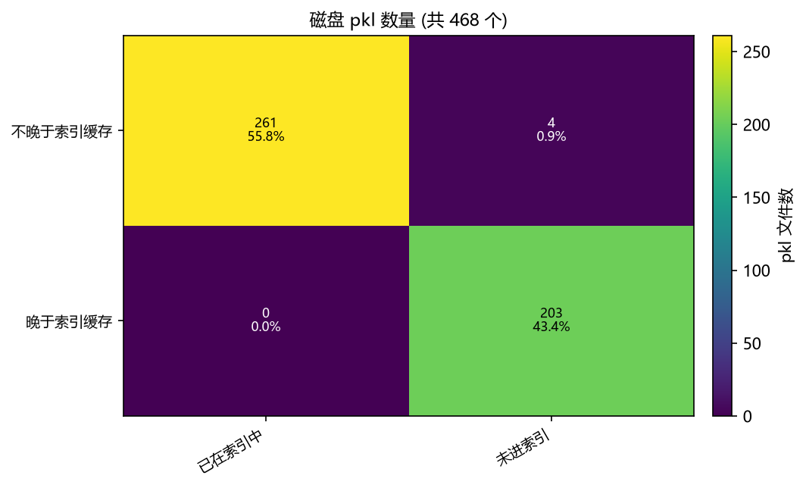


> 本节未做「全量重建」交叉核对。若要复核陈旧性是否影响结论, 用 `--full-index <全量索引.json>` 重新生成。

> 家族解析一致性自检: 本脚本本地实现的前缀优先级与 `ml/hwdataset/index.py` 比对, 11,393 条记录中不一致 **0** 条。

## 2. 家族规模与样本不平衡

| 家族 | 已索引记录 | 占记录 | 已索引文件 | 磁盘 pkl | 磁盘体积 (GiB) |
|---|---|---|---|---|---|
| slm_pib | 7,866 | 69.0% | 53 | 56 | 34.84 |
| model_in_loop_hw_sweep | 1,423 | 12.5% | 47 | 90 | 31.45 |
| slm_zernike_shaping | 1,010 | 8.9% | 10 | 10 | 0.06 |
| model_in_loop_hw_collect | 776 | 6.8% | 140 | 294 | 14.02 |
| slm_pib_online | 192 | 1.7% | 8 | 11 | 0.03 |
| slm_gsnet_square | 114 | 1.0% | 2 | 2 | 0.40 |
| sim_calib_abba | 12 | 0.1% | 1 | 1 | 0.14 |
| 20261006_154719 | 0 | 0.0% | 0 | 1 | 8.056e-07 |
| 20261006_154800 | 0 | 0.0% | 0 | 1 | 6.156e-07 |
| 20261006_155204 | 0 | 0.0% | 0 | 1 | 6.156e-07 |
| bench_stability | 0 | 0.0% | 0 | 1 | 0.20 |

磁盘 pkl 总体积 87,114,923,048 B (0.08 TiB)。注意「记录数」与「磁盘体积」排序并不一致 —— 体积由 pkl 内的原始画面主导, 与该文件产出多少条记录无关, 所以用体积当样本量代理会失真。

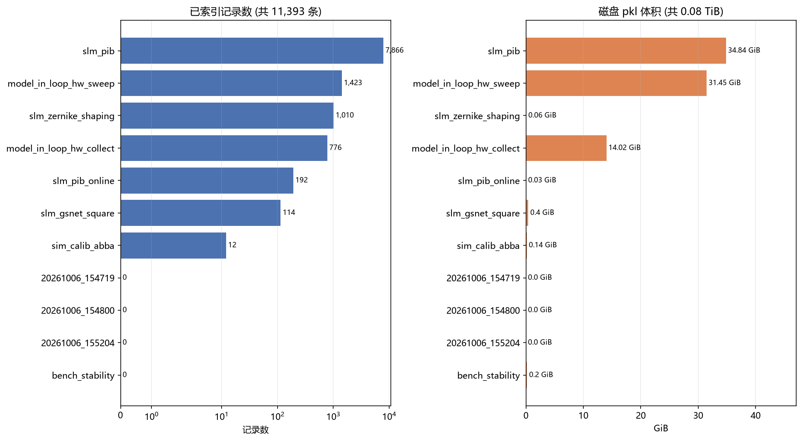

按「单文件记录数」分箱的密度分布 (分母 = 已索引 pkl 数):

| 单文件记录数 | 文件数 | 占已索引文件 |
|---|---|---|
| 4 | 32 | 12.3% |
| 6 | 108 | 41.4% |
| 11 | 5 | 1.9% |
| 12 | 1 | 0.4% |
| 17 | 4 | 1.5% |
| 23 | 6 | 2.3% |
| 25 | 1 | 0.4% |
| 27 | 4 | 1.5% |
| 31 | 4 | 1.5% |
| 33 | 27 | 10.3% |
| 41 | 2 | 0.8% |
| 43 | 2 | 0.8% |
| 45 | 1 | 0.4% |
| 49 | 2 | 0.8% |
| 55 | 1 | 0.4% |
| 61 | 8 | 3.1% |
| 81 | 1 | 0.4% |
| 85 | 1 | 0.4% |
| 101 | 25 | 9.6% |
| 121 | 2 | 0.8% |
| 132 | 1 | 0.4% |
| 151 | 6 | 2.3% |
| 190 | 1 | 0.4% |
| 201 | 11 | 4.2% |
| 290 | 1 | 0.4% |
| 301 | 2 | 0.8% |
| 345 | 1 | 0.4% |
| 733 | 1 | 0.4% |

28 个不同取值说明「每个文件读一次」的成本本身不均匀 —— 单文件体量由 pkl 内原始画面主导, 与该文件产出多少条记录无关, 所以按记录数做样本量代理会失真。

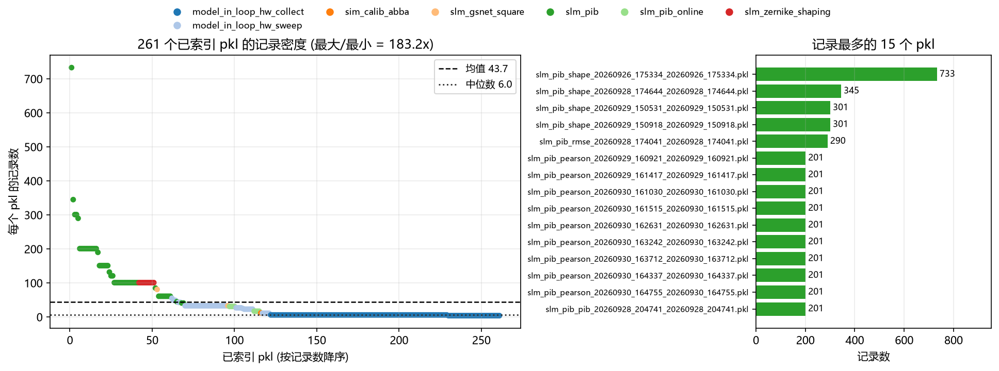

## 3. 相位表示与家族完全共线

| 家族 | 记录数 | freeform | panel_gray | panel_rad | zernike |
|---|---|---|---|---|---|
| slm_pib | 7,866 | - | 7,866 (100.0%) | - | - |
| model_in_loop_hw_sweep | 1,423 | - | - | 1,423 (100.0%) | - |
| slm_zernike_shaping | 1,010 | - | - | - | 1,010 (100.0%) |
| model_in_loop_hw_collect | 776 | - | - | 776 (100.0%) | - |
| slm_pib_online | 192 | - | - | - | 192 (100.0%) |
| slm_gsnet_square | 114 | 114 (100.0%) | - | - | - |
| sim_calib_abba | 12 | 12 (100.0%) | - | - | - |
| 20261006_154719 | 0 | - | - | - | - |
| 20261006_154800 | 0 | - | - | - | - |
| 20261006_155204 | 0 | - | - | - | - |
| bench_stability | 0 | - | - | - | - |

**这是本语料最重要的结构性事实**: 7/7 个家族只出现单一 `source`, 交叉格全为 0。`source` 与「家族 / 台架 / 优化目标」是同一个自变量的别名, 所以任何跨 `source` 的对比都同时换了台架与目标, **不能**读作「哪种相位表示更好」。

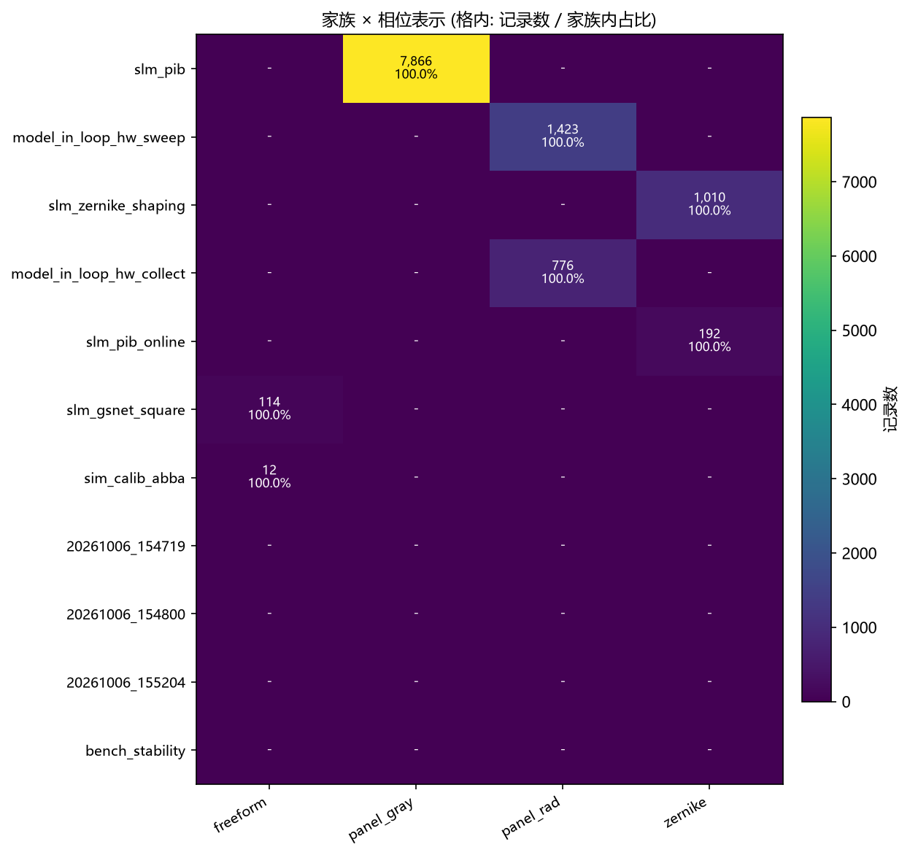

## 4. 曝光分布

| 曝光 (ms) | 记录数 | 占比 |
|---|---|---|
| 0.1000 | 2,551 | 22.4% |
| 0.4000 | 12 | 0.1% |
| 1.1000 | 1,836 | 16.1% |
| 1.2000 | 4,160 | 36.5% |
| 1.3000 | 1,003 | 8.8% |
| 1.5000 | 631 | 5.5% |
| 2.0000 | 202 | 1.8% |
| 3.0000 | 363 | 3.2% |
| 80 | 635 | 5.6% |
| (未标注) | 0 | 0.0% |

曝光跨 2.90 个数量级。曝光是模型的**输入**特征, 且目标里保留了编码它的绝对亮度 (未做 peak 归一), 所以这些差异是真实的协变量, 不是可以直接平均掉的噪声。但不同曝光取值**几乎完全按家族分层** (见第 3 节共线性), 跨家族比较亮度时不做曝光归一会直接被曝光差主导 —— 本报告因此不做跨家族亮度比较。

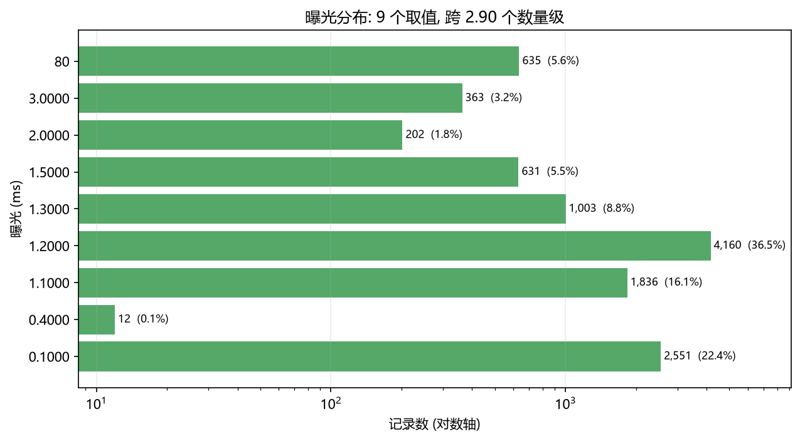

## 5. 视场与口径异质性

| sidecar 键 | 值 | 记录数 | 占比 |
|---|---|---|---|
| region | 256 | 363 | 3.2% |
| region | 32 | 1,836 | 16.1% |
| region | (未标注) | 9,194 | 80.7% |
| cam_size | 250 | 1,051 | 9.2% |
| cam_size | 320 | 2,567 | 22.5% |
| cam_size | (未标注) | 7,775 | 68.2% |
| far_field_size | 256 | 1,836 | 16.1% |
| far_field_size | 4096 | 363 | 3.2% |
| far_field_size | (未标注) | 9,194 | 80.7% |

这些是 sidecar 里**各 writer 自己写的**像素数 (`region` / `cam_size` / `far_field_size`), 不是标定过的物理视场。三者量纲都是 px 但口径不同(半宽 / 窗口边长 / 补零后画幅), 因此同一个数值在不同家族下并不代表同一角度。已知 `fov_px` 随样本返回正是为了**按 family 分头训练/过滤**, 而不是全局 resize (全局缩放会破坏 0 级对齐)。

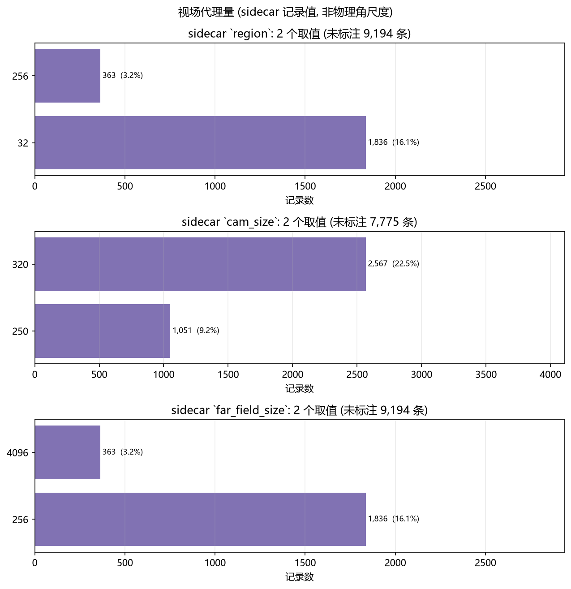

## 6. Zernike 孔径半径与重建口径不一致

| sidecar `zernike_radius` (px) | 记录数 | 占比 | 相对固定重建半径 |
|---|---|---|---|
| 200 | 1,836 | 16.1% | 0.67× |
| 450 | 363 | 3.2% | 1.50× |
| 480.0 | 2,608 | 22.9% | 1.60× |
| (未标注) | 6,586 | 57.8% | - |

**口径错配的方向与直觉相反。** 重建端 (`ml/hwdataset/records.py:1056`) 的 `zernike_coeffs_to_panel(radius=config.zernike_radius)` 只在 `PhaseSource.ZERNIKE` 分支被调用, 而 `config.zernike_radius` 默认取 `_ZERNIKE_APERTURE_RADIUS = 300`。把这条路径与实际记录交叉核对后:

| 分组 | 记录数 | 携带 sidecar `zernike_radius` | 是否走 Zernike 重建分支 |
|---|---|---|---|
| `source=zernike` (进入重建) | 1,202 | **0** (0.0%) | 是 |
| `source=panel_gray` / `panel_rad` (不进入) | 10,191 | 4,807 | 否 |

也就是说: **恰好是那 1,202 条真正需要孔径半径的记录, 一条都没有记录半径**, 而记下了半径的 3 个家族 (`model_in_loop_hw_collect`, `model_in_loop_hw_sweep`, `slm_pib`) 走的是「读入已存面板」路径, 根本不碰这个常量。后果是这个 300 px 对它所管辖的记录**无法用 sidecar 交叉校验** —— 相对已记录值的偏差只是0.67×/1.50×/1.60× (不是数量级差异), 但方向不可验证。

> ⚠️ `records.py:133-138` 的注释把 300 的依据写成「the sidecars of the Zernike families record `zernike_radius=480`」。按上面的交叉核对, **这句注释与数据不符**: 记录 `zernike_radius=480` 的是 `panel_gray` 家族, 而 `source=zernike` 的家族恰好一个都没有该字段。这属于**代码注释缺陷**, 建议与本报告一并复核。

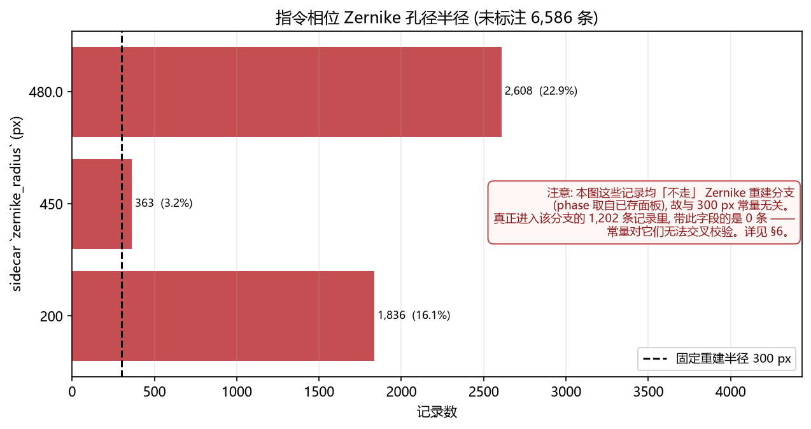

## 7. 优化目标标签覆盖不足

| sidecar `objective` | 记录数 | 占比 |
|---|---|---|
| pearson | 2,559 | 22.5% |
| rms_pib | 404 | 3.5% |
| rmse_out | 303 | 2.7% |
| shape | 284 | 2.5% |
| roi_pib | 101 | 0.9% |
| (未标注) | 7,742 | 68.0% |

目标字段只覆盖 32.0% 的记录, 缺失 68.0%。这直接限制了按目标分层的结论: 缺失不是「随机缺失」, 而是**成族缺失** —— 早期家族 (如 `slm_pib`) 根本没有这个字段。所以「按优化目标分层比较」在本语料上**不可行**, 缺失族无法作为对照组使用。

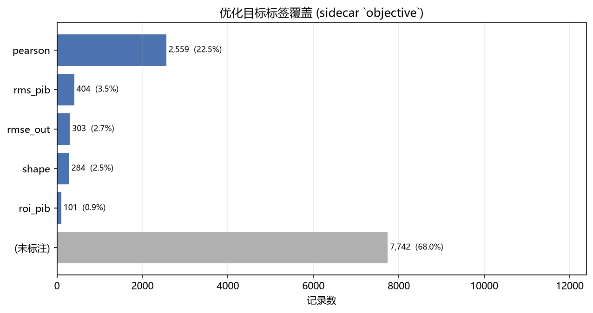

## 8. Zernike 阶数与自由度跨度

| `n_terms` | 反推 `n_max` | 反推 `freeform_grid` | 记录数 | 占比 |
|---|---|---|---|---|
| 0 | - | - | 2,199 | 19.3% |
| 3 | - | - | 402 | 3.5% |
| 10 | - | - | 201 | 1.8% |
| 15 | T4 | - | 1,006 | 8.8% |
| 36 | T7 | - | 192 | 1.7% |
| 45 | - | - | 368 | 3.2% |
| 55 | - | - | 3,365 | 29.5% |
| 66 | - | - | 1,387 | 12.2% |
| 78 | T11 | - | 2,147 | 18.8% |
| 576 | - | 24x24 | 126 | 1.1% |

`n_terms` 必须**按 source 分层读**, 否则会把两种不可比的量混在一根轴上:

| `source` | `n_terms` 取值 | 记录数 | 该值的含义 |
|---|---|---|---|
| `zernike` | 15, 36, 78 | 1,202 | Noll 系数向量长度, 即**实际自由度** (三角数, 随 `n_max` 增长) |
| `freeform` | 576 | 126 | 控制网格边长平方 = 24x24 = 576 个**独立网格点** |
| `panel_gray` | 3, 10, 15, 45, 55, 66, 78 | 7,866 | ⚠ 该源下相位取自 `_phase` 灰度面板, `_c` **未被使用** —— 此处的 `n_terms` 不代表该记录的有效自由度 |
| `panel_rad` | 0 | 2,199 | 相位已是整块弧度面板, 无系数向量 (`n_terms`=0) |

在**真正决定自由度**的两个源之间, 跨度是 15–78 (Zernike 侧, 随 `n_max` 变化) 对 576 (freeform 侧 24x24 网格), 约 7× —— 这才是建模时的真实量级差距。若把 `panel_gray` 的 `n_terms` 也当自由度, 会误以为存在 0–78 的连续范围。


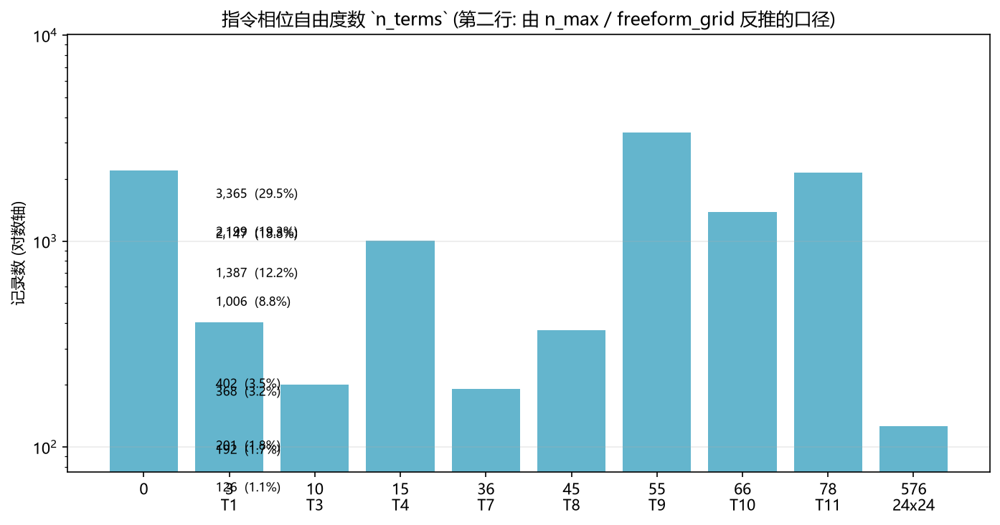

## 9. sidecar 元数据完整度

- 已索引记录中 sidecar 为字典: 11,393 条, 为空/缺失: 0 条
- 记录实际匹配到的键: **58** 个; 全部磁盘 sidecar JSON 出现的键: **89** 个; 其中**仅存于磁盘、未被任何已索引记录匹配**: **31** 个
- 仅存于磁盘的键: `config`, `created`, `format_version`, `freeform_radius`, `grid`, `image_mode`, `multi_signals`, `multi_snrs`, `n_dof`, `n_records`, `n_skipped`, `noise_mean`, `noise_mean_j`, `panel_center`, `panel_radius`, `panel_resolution`, `roi_fraction`, `seed`, `sigma`, `sigma_floor`, `sigma_j`, `signals`, `single_signals`, `single_snrs`, `slm_max_gray`, `snr_by_delta`, `source`, `status`, `thresholds`, `verdict`, `verdicts`

| sidecar 键 | 匹配记录数 | 占已索引记录 |
|---|---|---|
| `epochs` | 8,241 | 72.3% |
| `delta` | 7,477 | 65.6% |
| `cam_type` | 5,817 | 51.1% |
| `lr` | 5,750 | 50.5% |
| `zernike_radius` | 4,807 | 42.2% |
| `slm_number` | 4,807 | 42.2% |
| `slm_wavelength` | 4,807 | 42.2% |
| `cam_id` | 4,807 | 42.2% |
| `objective` | 3,651 | 32.0% |
| `target_shape` | 3,618 | 31.8% |
| `target_size` | 3,618 | 31.8% |
| `cam_size` | 3,618 | 31.8% |
| `n_eval_frames` | 2,800 | 24.6% |
| `max_roi_energy_loss` | 2,608 | 22.9% |
| `exposure_time_ms` | 2,608 | 22.9% |
| `center` | 2,608 | 22.9% |
| `noise_gate_k` | 2,608 | 22.9% |
| `optimizer_type` | 2,409 | 21.1% |
| `algorithm` | 2,378 | 20.9% |
| `stage` | 2,199 | 19.3% |
| `bench` | 2,199 | 19.3% |
| `pupil_center_panel` | 2,199 | 19.3% |
| `collect_disc` | 2,199 | 19.3% |
| `defocus_rad` | 2,199 | 19.3% |
| `exposure_ms` | 2,199 | 19.3% |
| `frames_per_point` | 2,199 | 19.3% |
| `region` | 2,199 | 19.3% |
| `far_field_size` | 2,199 | 19.3% |
| `method` | 2,199 | 19.3% |
| `note` | 2,199 | 19.3% |
| `array_keys` | 2,199 | 19.3% |
| `mode_codes` | 2,122 | 18.6% |
| `axis_codes` | 2,122 | 18.6% |
| `show` | 1,944 | 17.1% |
| `n_points` | 1,423 | 12.5% |
| `sweep_tilt_rad` | 1,423 | 12.5% |
| `sweep_defocus_rad` | 1,423 | 12.5% |
| `sweep_astig_rad` | 1,423 | 12.5% |
| `fold_ratio` | 1,399 | 12.3% |
| `n_max` | 1,399 | 12.3% |
| `w_outside` | 1,010 | 8.9% |
| `r_bucket` | 1,010 | 8.9% |
| `sweep_ramps_panel_px` | 1,008 | 8.8% |
| `sweep_coma_rad` | 814 | 7.1% |
| `sweep_spherical_rad` | 814 | 7.1% |
| `n_probes` | 776 | 6.8% |
| `camera_zero_order` | 776 | 6.8% |
| `pop_size` | 733 | 6.4% |
| `rows` | 192 | 1.7% |
| `applied` | 192 | 1.7% |
| `stalled` | 192 | 1.7% |
| `fold` | 192 | 1.7% |
| `noise` | 192 | 1.7% |
| `objective_key` | 192 | 1.7% |
| `best_objective` | 192 | 1.7% |
| `final_c` | 192 | 1.7% |
| `name` | 114 | 1.0% |
| `target_side` | 114 | 1.0% |

覆盖率最高的键也远未饱和, 说明 sidecar schema **随家族各自演化**。「仅存于磁盘」的 31 个键是那些**未进索引**的文件独有的 (主要是第 1 节的 203 个新文件) —— 它们不是「索引丢了字段」, 而是重建索引后才会出现, 现在还无法核对。

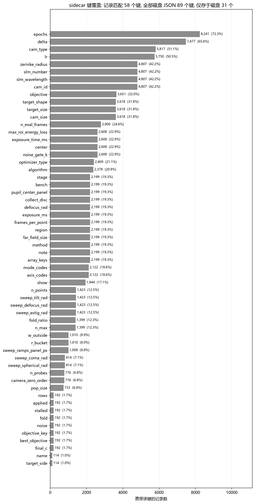

## 10. 图像/相位级分布差异 (实测)

以上各节全部来自**元数据** (索引 + sidecar), 回答的是「记录了多少、怎么标注」。本节回答另一个问题: **把记录真正物化成 64×64 的相位 phasor 与远场图像之后, 各家族在数组层面差多少?** 数据来自 `distribution_stats.json` ——对 252 条记录 (每家族 ≤40 条, seed=42, 触及 112 个 pkl, 运行 89.5 s) 用 canonical `Materialiser` (`grid=64`, `abs255`) 物化后统计。物化路径与训练 DataLoader **逐位一致** (同一 `Materialiser`)。

> ⚠️ **口径**: `abs255` 保留绝对亮度 (未做 peak 归一), 所以**跨家族的亮度差异 ≈ 曝光差异, 不是光学差异**。只有尺度无关量 (`d90_ratio` / `central_energy` / `entropy256` / `phase_coh_mean`) 可以跨家族直接比。**表中无后缀的列 (帧均亮度/帧 CV/d90/FOV/中心窗/熵/相干度/展宽) 均为中位数 (median), 不是均值**; 中位对 `slm_pib` 这类内部异质家族更稳 (其相位展宽 p10≈0 会把均值拖到中位之下)。同家族内 p10/p50/p90 的宽度反映的是该家族**内部**的记录间差异 (不同目标/迭代步), 与家族间差异是两回事, 不要混读。

| 家族 | n | 曝光 (ms) | 帧均亮度 | 帧 CV | d90/FOV | 中心窗能量 | 熵 (bits) |
|---|---|---|---|---|---|---|---|
| model_in_loop_hw_collect | 40 | 1.10 | 0.0120 | 5.116 | 0.1484 | 1.000 | 1.16 |
| model_in_loop_hw_sweep | 40 | 1.1–3.0 (中位 1.1) | 0.0125 | 5.103 | 0.1328 | 1.000 | 1.15 |
| sim_calib_abba | 12 | 0.40 | 0.0216 | 2.053 | 0.0131 | 0.780 | 3.00 |
| slm_gsnet_square | 40 | 1.5–80.0 (中位 1.5) | 0.0159 | 0.649 | 0.0177 | 0.359 | 3.11 |
| slm_pib | 40 | 0.1–80.0 (中位 1.2) | 0.0141 | 1.798 | 0.0984 | 0.671 | 2.58 |
| slm_pib_online | 40 | 1.20 | 0.0231 | 1.984 | 0.1028 | 0.772 | 3.22 |
| slm_zernike_shaping | 40 | 0.10 | 0.0363 | 2.116 | 0.1028 | 0.768 | 3.94 |

| 家族 | 相干度 (中位) | 相干度 (max) | 相位展宽 (中位) | 相位展宽 (p10–p90) |
|---|---|---|---|---|
| model_in_loop_hw_collect | 0.9437 | 1.0000 | 0.2235 | 0.2179–0.3162 |
| model_in_loop_hw_sweep | 0.9506 | 1.0000 | 0.3081 | 0.1894–0.8775 |
| sim_calib_abba | 0.9434 | 1.0000 | 0.4606 | 0.4584–0.4619 |
| slm_gsnet_square | 0.8980 | 1.0000 | 1.0003 | 0.9923–1.0008 |
| slm_pib | 0.9471 | 1.0000 | 0.6610 | 0.0827–0.9978 |
| slm_pib_online | 0.9537 | 1.0000 | 0.0049 | 0.0007–0.0868 |
| slm_zernike_shaping | 0.9518 | 1.0000 | 0.1597 | 0.0077–0.3852 |

**读法 (数组层面确认了哪些元数据结论, 又补了什么):**

1. **亮度 ≈ 曝光, 不是光学。** 帧均亮度从 `slm_zernike_shaping` 的 0.0363 到 `model_in_loop_hw_collect` 的 0.0120 跨约一个数量级, 与各自曝光同比例变化 ——证实 §4 的判断: 不除曝光的跨家族亮度比较量的是曝光本身。

2. **光斑尺寸必须按 FOV 归一才可比。** 原始 d90 从 9.5 px (`model_in_loop_hw_collect`, 64 px 窗口) 到 34.5 px (`slm_gsnet_square`, 1944 px 窗口) 看似差数倍, 但除以各自 FOV 后 d90/FOV = 0.1484 vs 0.0177 —— 反而是 `model_in_loop` 家族的**相对**光斑更大。不做归一的「谁的光斑大」问题没有答案, 这正是 `fov_px` 随样本返回的原因。

3. **相位表示差异在数组里同样可见。** `slm_gsnet_square` 相位展宽 ≈ 1.00 rad (近满幅自由相位), `slm_pib_online` ≈ 0.005 rad (近平场); 而 `phase_coh_mean` 全家族都很高 (填充区是 `cos=0, sin=0` 的零相量, 不是未定义相位)。

4. **纹理差异是真实的协变量。** 256-bin 熵从 1.16 (`model_in_loop_hw_collect`, 单点聚焦, 像素分布极集中) 到 3.94 (`slm_zernike_shaping`, 散斑/整形态); 帧 CV 从 0.65 (`slm_gsnet_square`, 均匀方斑) 到 5.12 (`model_in_loop_hw_collect`, 高斯型焦点) ——同一个「远场」在不同家族里是**不同种类的图**, 一个全局归一化或 loss 无法同时服务。

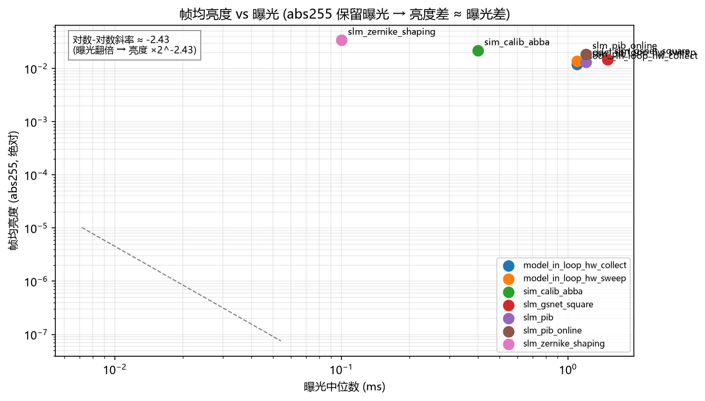
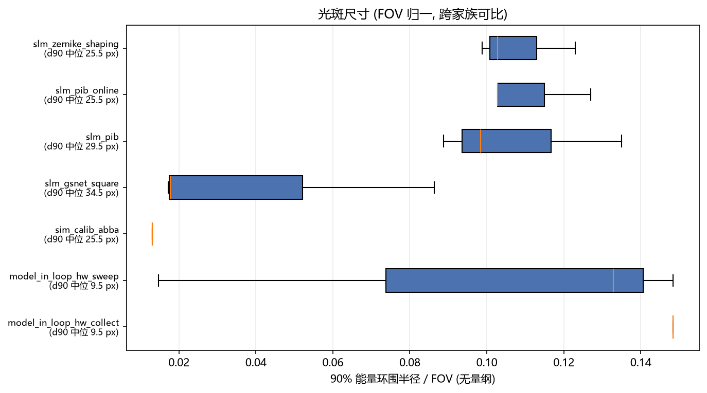
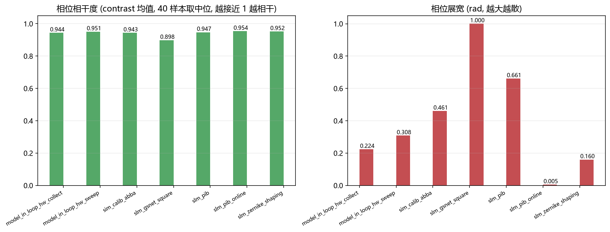
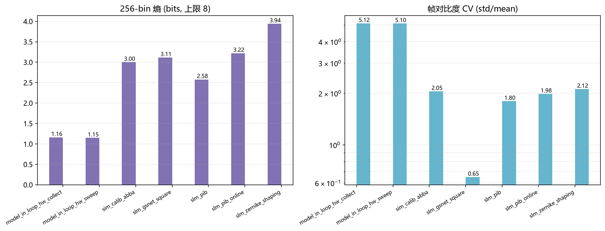

## 11. 如何用数据处理方法消解分布差异

按「差异来源 → 消解手段 → 边界」逐条对应 (手段与 §10 的实测一一对应):

| 差异 (§10 实测) | 消解手段 | 边界 / 不能消解的部分 |
|---|---|---|
| 亮度 ≈ 曝光 (跨家族 10×) | 曝光走**输入**特征 `exposure_log10` (index 级 log10+标准化); 若目标是曝光无关, 用 **peak 归一** 后再比。 | **禁用 sum 归一** (只度量归一化本身, R² 反而更差, 见 `report/zernike_phase2amp`); abs255 语料里曝光与家族共线, 归一化后家族信号仍在其余维度。 |
| FOV 口径不一 (d90 3.6× 是假象) | **按家族分组** (家族↔fov 在本语料 1:1) 分别训练/评估; 跨家族比较只用 `d90_ratio` / `central_energy` 等**无量纲**量。 | 全局 resize **禁止** (破坏 0 阶对齐); 无法造出单一物理角尺度 ——sidecar 只有 writer 自记 px, 没有标定过的角尺度。 |
| 相位表示差异 (展宽 40×) | 输入恒为 phasor `(cos, sin)` (无 arctan2 分支切口, 现有契约); Zernike 系数→136 维零填充可加, 但表示与家族共线, 增益有限。 | `slm_pib_online` 近平场 vs `slm_gsnet_square` 满幅自由相位是**任务本质**差异 (在线微调 vs 自由相位整形), 数据处理消不掉。 |
| 纹理差异 (熵 3×, CV 8×) | 家族/文件级分层采样与加权 (小家族上采样); `FileGroupedSampler` 保文件级独立 (现有)。 | 家族间样本比 350× (11k 记录里 `slm_gsnet_square` 仅 126 条索引记录), 加权只能缓解偏差, 不能替代数据。 |
| 文件内相关 (同 pkl 记录高度相关) | 按**文件**分组 CV / 按文件配对 (现有 `FileGroupedSampler` + paired 统计的既有纪律)。 | 逐记录独立样本假设无效 ——任何 p 值/置信区间必须按文件配对 (见 §12 不可断言第 4 条)。 |
| 目标标签缺失 (成族) | 无 — 缺失的 sidecar 字段无法事后重建。 | 按优化目标分层的结论在本语料**结构上不可行**; 补数据只能靠重跑采集 (带 `objective` 字段)。 |

**综合结论**: 能消解的差异 (曝光、FOV 口径、表示、采样偏差) 都有明确的现有工具 (`exposure_log10` / 家族分组 + 无量纲指标 / phasor 输入 / 分层 + 文件分组), 而且 `ml/hwdataset` 的默认契约已经实现了其中大部分 ——问题从来不是「缺工具」, 而是**使用者**跨家族比较时忘了这些前提。不能消解的差异 (任务本质的相位结构、目标标签缺失、文件内相关)只能靠**改采集** (统一曝光/FOV/标签) 解决, 数据处理层无解。

## 12. 本语料可以断言 / 不可断言

**可以断言 (描述性, 由本报告的元数据统计直接支撑):**

1. 索引缓存已陈旧, 只覆盖当前磁盘 pkl 的一部分, 重建索引会改变样本集。
2. 家族与 `source` 完全共线, 记录数在家族间高度不均衡。
3. 曝光 / 视场代理量 / Zernike 指令孔径半径都跨家族不一致, 属真实协变量。
4. 每个 pkl 的记录数极不均匀, 必须按文件分组读取。

**不可断言 (本语料结构上不支持):**

1. ❌ 「`panel_gray` vs `zernike` 哪种表示更好」—— 与家族/台架/目标完全混淆。
2. ❌ 任何**物理**角尺度或跨家族统一视场口径 —— sidecar 只有各 writer 自记的 px。
3. ❌ 按优化目标分层的结论 —— 目标标签成族缺失, 无合法对照组。
4. ❌ 逐记录显著性检验 / p 值 / 置信区间 —— 记录不是独立样本, 同文件内高度相关。
5. ❌ 未做曝光归一的跨家族亮度比较 —— 亮度由曝光差主导。
6. ❌ 模型优劣排名 —— 噪声地板 (折间 σ) 大于多数待比较的差异, 见 `report/zernike_phase2amp/`。

## 13. 与既有文档记载的差异

| 项 | 既有文档记载 | 本次运行时统计 | 说明 |
|---|---|---|---|
| pkl 总数 | 996 文件 / 265 pkl | 468 pkl (265 旧 + 203 新) | 文档口径是索引建立时的快照, 当前磁盘已增长 |
| 已索引文件 | 261 | 261 (账面) / 261 (磁盘实测命中) | 一致 |
| 已索引记录 | 11,393 | 11,393 | 一致 |
| 语料体积 | 65.88 GB | 81.13 GiB (87,114,923,048 B) | 文档的 65.88 GB 恰为**缓存 mtime 之前**那 265 个 pkl 的体积和 (65.88 GB), 不含新增文件 |
| 家族数 | 7 | 已索引 7, 磁盘 11 | 多出的 1 个是 `bench_stability` (1 个 pkl, 42 条记录全部因缺相位被排除, 故记录数为 0); 注意 collect/sweep **本身已进索引**, 只是各有一半新文件未进 |
| 曝光取值 | 6 个 | 9 个 (0.1000–80 ms) | `index.py` 文档字符串里的 6 值清单已过时; 9 个值**全部**出现在已索引的 11,393 条内, 与新文件无关 |
| ROI 半径 | 固定 500 px | 重建固定 300 px, sidecar 指令半径 200/450/480.0 px | 文档给的是重建端固定值, 与指令端记录值不是同一口径 |

以上差异**全部**是语料/索引状态变化, 不是代码回归; 但任何引用旧数字的文档或结论在重建索引后都需要复核。

## 14. 复现

```bash
# 第一阶段: 分层物化 252 条记录, 统计数组级分布 (~90 s, 需 pkl 可读)
python scripts/analyze_hwdataset_distributions.py

# 第二阶段: 渲染本报告 (元数据 + 上面的 JSON, 不碰 pkl)
python scripts/generate_hwdataset_corpus_report.py
```

- 数据源: `data/hw_index_cache.json` (version 2, roots `['data\\debug']`), `data/debug/**/*.json`
- 元数据源: `(data/debug/**/*.pkl)` 共 468 个, 仅 `Path.stat()`
- 数组级源: `report/hwdataset_corpus/distribution_stats.json` (由 `analyze_hwdataset_distributions.py` 分层物化 252 条记录产生; 缺失时 §10/§11 降级为提示, 10 张元数据图不受影响)
- 图: `report/hwdataset_corpus/figures/` 共 14 张 PNG (含 4 张数组级分布图, 仅在上一步成功时生成)
- 运行环境: Python 3.14.7, matplotlib 3.11.0, numpy 2.4.6
- 生成时间: 2026-10-07 03:13:09
