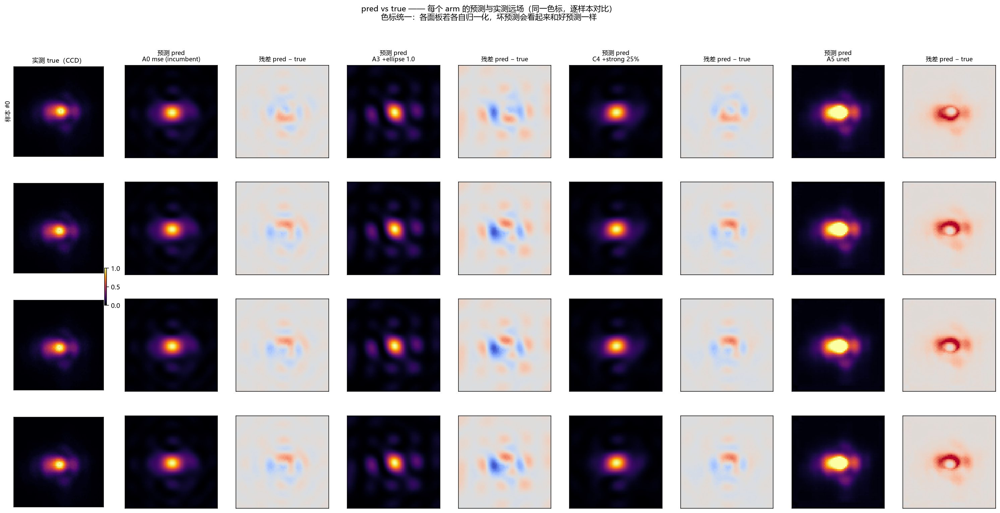
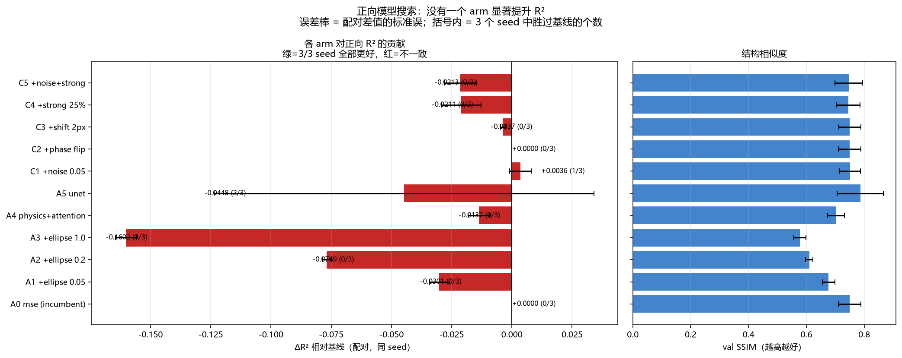

# 正向模型改进尝试：逐项贡献、术语与图解读

<!-- provenance:start -->
> **生成脚本**: [`scripts/generate_forward_search_report.py`](../../scripts/generate_forward_search_report.py)
> **复现命令**: `python scripts/forward_search.py && python scripts/generate_forward_search_report.py`
> **数据/关联脚本**: [`scripts/forward_search.py`](../../scripts/forward_search.py)
> **数据/关联脚本**: [`scripts/inverse_strong_phase.py`](../../scripts/inverse_strong_phase.py)
> **数据/关联脚本**: [`scripts/probe_device_metadata.py`](../../scripts/probe_device_metadata.py)
> **数据/关联脚本**: [`scripts/check_ellipse_term.py`](../../scripts/check_ellipse_term.py)
> **运行环境**: 离线
> **说明**: 正向模型改进尝试: 设备参数/椭圆loss/attention/U-Net/图像增强, 3 seed 配对
<!-- provenance:end -->

> **生成脚本**: `scripts/generate_forward_search_report.py`（图）+ `scripts/forward_search.py`（数据）
> **复现命令**: `python scripts/forward_search.py` 然后 `python scripts/generate_forward_search_report.py`
> **运行环境**: 离线（纯 torch + 项目自带仿真器，无硬件）
> **说明**: 3 seed 配对测量。过程记录见 [`PROCESS.md`](PROCESS.md)。

本文回答一个具体问题：**除了现有基线，还有什么办法能提高正向预测准确度？**
每一条都给出实测贡献，没有效果的也写清楚为什么没有效果 —— 因为「试过，没用」和
「没试过」在后续决策里不是一回事。

---

## 0. 先说结论

| 尝试 | ΔR²（配对） | 胜过基线的 seed | 结论 |
|---|---|---|---|
| 相机曝光等设备参数 | — | — | **无法进行**：7 个 family 的曝光全是常数 |
| 椭圆拟合 loss（w=0.05） | −0.0301 | 0/3 | 降低自身指标 14%，但降低 R² |
| 椭圆拟合 loss（w=0.2） | −0.0769 | 0/3 | 同上，代价更大 |
| 椭圆拟合 loss（w=1.0） | −0.1602 | 0/3 | 同上，代价最大 |
| physics + attention | −0.0137 | 0/3 | 无效（参数 ×45） |
| U-Net | −0.0448 ± 0.0789 | 2/3 | R² 无差异；SSIM +0.037，但**过度平滑** |
| 相位噪声增强 | **+0.0036 ± 0.0045** | 1/3 | 在噪声内，不算改进 |
| 相位 π 翻转 | +0.0000 | 0/3 | **物理上必然是恒等操作**（见 §3.2） |
| 平移增强 2px | −0.0037 | 0/3 | 略微有害 |
| 合成强相位 25% | −0.0211 | 0/3 | 正向变差；但这是为逆向设计的（§5） |
| 噪声 + 强相位 | −0.0213 | 0/3 | 同上 |

**没有一个 arm 显著提高正向 R²。** 最好的一个（相位噪声 +0.0036）标准误 ±0.0045，
且只有 1/3 seed 更好 —— 落在噪声里。这与之前测到的结论一致：基线模型的
验证/训练误差比只有 **1.08**，学习曲线是平的，也就是**没有过拟合可修**，
瓶颈在表示能力，不在这些超参上。

---

## 1. 术语表

阅读下面内容需要的词，都在这里解释。

**R²（决定系数）**
预测值与实测值的拟合优度。1.0 表示完全预测正确，0.0 表示和「直接输出平均值」一样差，
**负数表示比输出平均值还差**。本文排序只看 R² 和 SSIM，不看 MSE/PSNR —— 这个仓库
已经被坑过一次：`normalization="sum"` 曾经报出 72 dB 的 PSNR，但它的 R² 比常数预测还差。

**配对（paired）**
同一个 seed 同时跑基线和候选，两者用同一份数据划分、同一初始化预算，
差值再在 seed 之间平均。因为不同 seed 之间 R² 的散布高达 **0.075**，
不配对就比较的话，一个随机波动会被当成「改进」。表中 `n/3` 就是「3 个 seed 里有几个更好」。

**ΔR²**
候选 arm 减去基线的 R²。为正表示更好。

**held-out（留出集）**
训练时没见过的数据。所有报告的 R² 都在留出集上算。

**padding（远场补零倍数）**
傅里叶变换前把画面补零放大 N 倍。**它决定了远场的角度尺度**：padding=1 的中心
64×64 窗口覆盖整个孔径角度，padding=12 只覆盖 1/12。本文出现过三次因 padding 不一致
导致结论作废，所以每张表都写明 padding。

**peak 归一化**
把每张图除以自己的最大值，使最亮处等于 1。这样模型只学**相对结构**，不学绝对亮度。
代价是：绝对亮度信息被丢掉，所以本文不做任何关于「多亮」的判断。

**ellipse gap（椭圆拟合误差）**
把光斑当作一个椭圆，用 5 个参数描述：质心 (cx, cy)、x 展宽 var_x、y 展宽 var_y、
协方差 cov（描述椭圆倾斜）。椭圆拟合误差 = 预测的 5 个参数与实测之差，
除以实测自身的尺度做归一化。**除以实测自身**叫「锚定」——
锚定很重要：不锚定的项可以靠「无视数据、输出一个理想光斑」取胜，
本仓库实测过那样会让 R² 从 +0.78 掉到 **−0.86**。

**second moment（二阶矩）**
光斑的展宽度量。旧的 `w_spot_moment` 只看径向的 `var_x + var_y`，
**看不见光斑位置和倾斜**：光斑平移 2 px，它的径向二阶矩完全不变，误差记 0.0000；
椭圆拟合能看见（0.0898）。这是新增椭圆项唯一多出来的信息。

**phar / phasor（相量）**
相位的单位复数表示 `exp(iφ)`，拆成 `(cos φ, sin φ)` 两个通道。
模型输入就是这两张 64×64 图。数值上恒等于 1。

**RSS / SSIM**
SSIM 是结构相似度，衡量两张图的整体结构像不像（对亮度缩放更宽容）。
R² 对亮度缩放敏感。两者可以给出相反的结论 —— 本文里 U-Net 就是。

**强相位（strong phase）**
比语料里实际出现的光强更大的相位。GS（Gerchberg-Saxton）算出来的整形相位就是强相位，
而本仓库的语料只包含**四个优化目标的轻微像差**，所以强相位对模型是分布外的。

---

## 2. 图 1：pred vs true 逐样本对比

**怎么读这张图**

* **每一行是一个留出样本**，第一列是 CCD 实测远场，后面的 `预测 pred` 是各 arm 的输出，
  再后面是对应的 `残差 pred − true`。
* **所有面板共用一条色标。** 这是刻意的：如果每个面板各自归一化，
  一个预测得离谱的模型看起来会和预测得很好的模型一模一样 —— 本项目第一版
  pred vs true 图就是这样废掉的（正因如此才发现了评测器裁错位置的 bug）。
* 残差图用蓝-红色带：红色 = 预测过亮，蓝色 = 预测过暗，灰色 ≈ 完美。

**图里能读出来的东西（这些是数值表看不出来的）**

1. **A0 基线**与实测结构高度一致 —— 亮斑形状、halo、左右不对称都能对上。
2. **A3 椭圆 w=1.0 明显发假**：预测里出现了同心环和多余瓣。
   这正是椭圆项在起作用 —— 它把光斑往「更像一个椭圆」的方向拽，
   代价是把实测的细节抹掉。残差图里是有结构的（不是随机噪声），说明这是系统性偏差。
3. **C4 合成强相位**看起来和基线差不多，略平滑一点。
4. **A5 U-Net 过度平滑**：预测的光斑明显比实测更宽更糊，残差图中心发蓝（预测偏暗）、
   外圈发红（预测偏亮）。**它在用「预测一个平均光斑」来换取 SSIM。**
   数值上同向印证：U-Net 的椭圆误差 0.3997，基线 0.2027 —— 差了近 2 倍。

第 4 点很重要：U-Net 的 SSIM 提升（+0.037）有相当一部分来自这种「变糊」。
R² 会惩罚丢失的峰值结构，所以 R² 打平；而 SSIM 不会。
**这就是本文不按 SSIM 选模型的原因。**

---

## 3. 逐项尝试与实测贡献

### 3.1 设备参数（曝光时间等）—— 无法进行

先问「数据里有没有东西可融」，再问「融进去有没有用」。这一步的答案是：**没有**。

`scripts/probe_device_metadata.py` 逐 family 统计曝光值：

| family | 样本数 | 曝光 (ms) | 有变化吗 |
|---|---|---|---|
| model_in_loop_hw_collect | 776 | 1.1 | 否 |
| model_in_loop_hw_sweep | 1423 | 1.1 | 否 |
| sim_calib_abba | 12 | 0.4 | 否 |
| slm_gsnet_square | 114 | 1.5 | 否 |
| slm_pib | 7866 | 1.2 | 否 |
| slm_pib_online | 192 | 1.2 | 否 |
| slm_zernike_shaping | 1010 | 0.1 | 否 |

**7/7 个 family 的曝光都是常数。** 一个常数输入携带的信息量是零，
把它接进模型只会增加参数和「我们在做设备融合」的错觉。
（数据集自己也给出了同样的警告：`Every known exposure in this corpus is identical`。）

语料里唯一的「设备量」是 `contrast`（相干度），但它由 `phase_cos/phase_sin` 直接决定，
已经在输入里了，没有新信息。

### 3.2 椭圆拟合 loss

新增 `ml.zernike.losses.ellipse_gap_term` / `ellipse_parameters`，
CLI 为 `python -m ml.zernike.train_amp --w-ellipse 0.2`。

单元验证（`scripts/check_ellipse_term.py`）：

| 情形 | 椭圆误差 | 径向二阶矩误差 |
|---|---|---|
| 完全重合 | 0.0000 | 0.0000 |
| 平移 2 px | **0.0898** | **0.0000** |
| 同展宽、旋转 45° | **1.6804** | 0.0640 |
| var_x ↔ var_y 互换 | **2.3323** | 0.0746 |
| 加宽 10% | 0.2100 | 0.0604 |
| 全零 | 4.8724 | 1.0000 |

项本身是有效的：它看得见位置和倾斜。质心回收精确到 (32.000, 32.000)。

**但它拿 R² 来换。** 三个权重全部 0/3，且单调：

| 权重 | ΔR² | 椭圆误差（自身指标） |
|---|---|---|
| 0（基线） | — | 0.2027 |
| 0.05 | −0.0301 | 0.1737（−14%） |
| 0.2 | −0.0769 | 0.1706（−16%） |
| 1.0 | −0.1602 | 0.1667（−18%） |

值得注意：椭圆项**确实**能降低自己的指标（−18%），而旧的径向二阶矩项**不能**
（0.0368 → 0.0381，几乎不动）。差别在于椭圆项包含质心，而质心比尺度好学得多。
所以椭圆项比二阶矩项「更可用」，但仍然是**权衡**而不是净提升。

### 3.3 相位 π 翻转增强 —— 物理上必然无效

`ΔR² = +0.0000`，三个 seed 与基线**逐位相同**。这不是 bug，是物理：

把相位加 π 等价于相量取负，而 `|FFT(−E)| = |FFT(E)|`。
目标强度 `|E|²` 对它**完全不变**。所以这个增强能提供的信息是零。

（我的 docstring 原本称它是「标签保持的不变性」，这没错，
但没说清：对**强度**目标而言它连标签都不改变，因此毫无用处。
已修正注释。）

### 3.4 其余增强

| arm | ΔR² | 注释 |
|---|---|---|
| 相位噪声 0.05 | +0.0036 ± 0.0045，1/3 | 唯一正向的，但在噪声内 |
| 平移 2 px | −0.0037，0/3 | 略微有害 |
| 合成强相位 25% | −0.0211，0/3 | 正向变差，见 §5 |

增强**不可能**改善正向指标：验证/训练误差比 1.08，学习曲线平的，
没有可压缩的泛化间隙。所以增强的正向数字只是「不掉队」的确认，
不是改进。

### 3.5 结构：attention 与 U-Net

| arm | ΔR² | SSIM | 参数 |
|---|---|---|---|
| physics + attention | −0.0137（0/3） | −0.0469 | 10,503（×45） |
| U-Net | −0.0448 ± 0.0789（2/3） | **+0.0373** | 7,778,465（×33,000） |

attention 第三次被否（前两次在 README §7）。U-Net 的 R² 差在 seed 噪声内
（标准误 ±0.0789，比均值本身还大），SSIM 更好，但如 §2 所述是过度平滑换来的。

---

## 4. 图 2：各 arm 贡献汇总

**怎么读**

* 左图：每个 arm 的 ΔR²，误差棒是**配对差值的标准误**。
  **绿色 = 3/3 seed 全部更好**；红色 = 不一致；灰色 = 基线本身。
  括号里的 `n/3` 就是一致性计数 —— 一个 mean 单独看会骗人，
  所以一致性计数画在图上。
* 右图：SSIM 的绝对值。

**图上最重要的一点**：除基线（灰）之外，几乎所有 arm 都是红色，
而误差棒都跨过 0。**没有一个 arm 的改进超过噪声。**

---

## 5. 逆向优化相位实验（因为正向没有改进，所以单独验证逆向）

任务要求「如果改进有效则实验反向优化相位」。正向**没有**有效改进，
但强相位增强本来就是为逆向设计的，所以仍在 `scripts/inverse_strong_phase.py`
里单独验证，并修掉一个必须先修的前置问题：

**padding 必须全链一致。** GS 算法在自己的 64×64 远场网格（即 padding=1 的尺度）上工作。
拿一个 padding=1 设计的相位去和 padding=12 的评测器比较，方形目标只有应有尺寸的 1/12，
会读出「比平场还差」（实测 GS 0.8103 vs 平场 1.2918），
而这和模型好坏毫无关系。本实验统一在 **padding=1** 下跑训练、评测和 GS 目标，
并断言 GS 必须优于平场，否则直接中止而不是输出一个无意义的数。

（同一次踩坑：我先写了一个「尺度匹配版」的 GS，用瞳孔相位代替了回传，
根本不是 GS 迭代。它输出 0.7761 而旁边的打印还宣称目标瞄准正确 ——
**错的传播器仍会输出貌似合理的数字，这比没有传播器更糟**，已删除。）

结果（padding=1，平场 1.0366，GS 1.3311）：

| arm | 逆向得分（从随机起点） | 相对平场 | Δ 相对基线 | 一致性 |
|---|---|---|---|---|
| A0 基线 | 0.5279 | **−0.5087** | — | — |
| C4 合成强相位 25% | 0.5429 | −0.4936 | +0.0151 | 2/3 |
| C5 噪声+强相位 | 0.5600 | −0.4765 | +0.0322 | 2/3 |

**结论：合成强相位增强给出 +0.015 ~ +0.032 的提升，但只有 2/3 seed 一致（在噪声内），
而且三个 arm 全部比「什么都不做（平场）」差 0.48 ~ 0.51。**
逆向优化仍然是失败的 —— 合成强相位数据没有修复它。

这与之前的结论一致：逆向瓶颈**与模型结构无关**（physics 和 U-Net 都失败），
也不该指望靠少量强相位样本解决。语料里缺少覆盖强相位的**系统性**数据。

---

## 6. 术语与口径汇总（复现时需要知道的）

* 所有 arm 走**同一个训练循环**（`forward_search.train_arm`），所以增强 arm 与基线
  是同一套优化器/调度器/损失，可比性来自实现相同而不是靠我手动对齐两份代码。
* `padding=12`：`slm_zernike_shaping` 这个 family 的实测最优值（PROCESS.md §5 的扫描），
  正向比较用它。逆向实验用 `padding=1`（GS 的设计尺度），因此
  **§5 的数字不能与 §3 的 R² 直接比较**，两节各自内部可比。
* 排序只用 R² 与 SSIM；MSE/PSNR 单看会误导（本仓库有 72 dB PSNR + 负 R² 的记录）。
* 每个 arm 3 个 seed，配对比较；`n/3` 是胜过基线的 seed 数。
* 合成数据的远场来自项目自带仿真器，与真实语料同源 —— 这是已知局限：
  模型没有在完全独立的传播模型上被评测过。

## 7. 剩下的路

| 方向 | 依据 |
|---|---|
| **补覆盖强相位的训练数据** | §5 显示逆向是瓶颈且与结构无关；需要系统性数据，不是一般增强 |
| 接受 R²≈0.88 的闭式模型 | 它给出可实时下发的解析相位（230 个可解释弧度），U-Net 给不出 |
| 若要 U-Net 的 SSIM，先修过度平滑 | §2 显示它的优势部分来自变糊，配 R² 一起看才不会被骗 |
