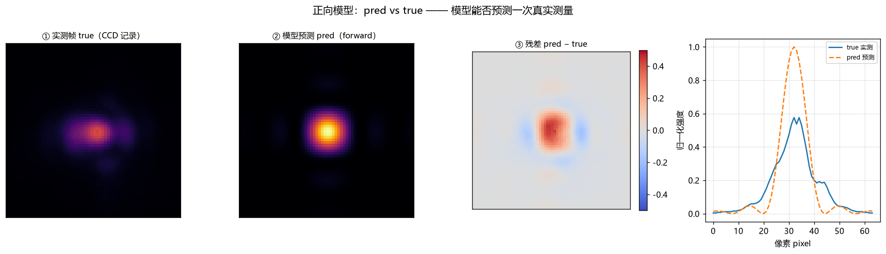
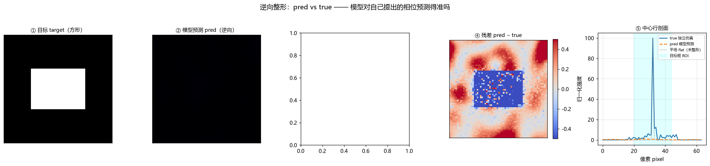
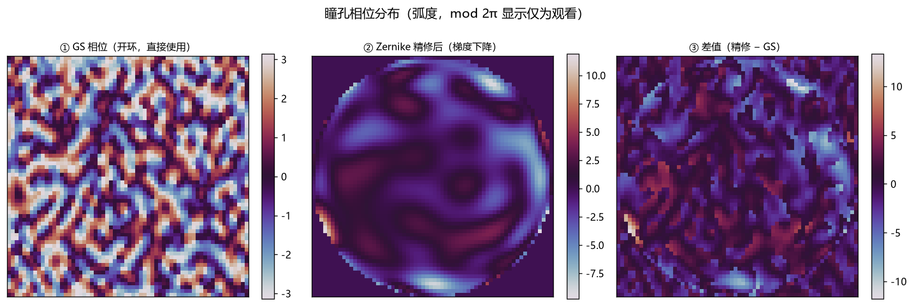
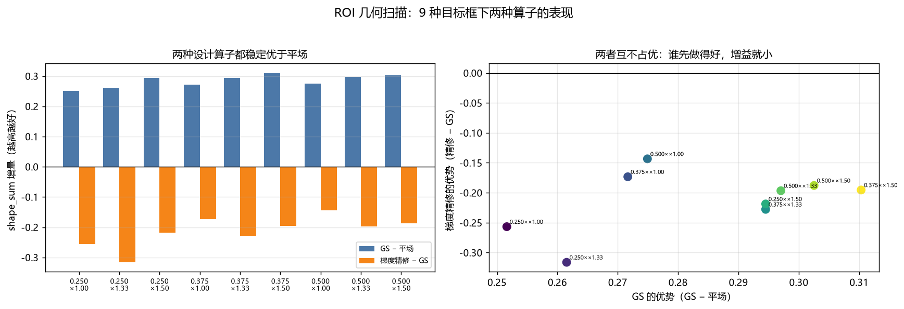

# 逆向整形研究报告（正向 + 反向 pred vs true）

<!-- provenance:start -->
> **生成脚本**: [`scripts/generate_inverse_design_report.py`](../../scripts/generate_inverse_design_report.py)
> **复现命令**: `python scripts/generate_inverse_design_report.py`
> **数据/关联脚本**: [`scripts/freeform_vs_zernike.py`](../../scripts/freeform_vs_zernike.py)
> **运行环境**: 离线
> **说明**: 逆向整形中文报告：正向/反向 pred vs true 对比图 + ROI 扫描 + 术语表
<!-- provenance:end -->

本报告由 `scripts/generate_inverse_design_report.py` 自动生成，结论与完整实验记录见 [`PROCESS.md`](PROCESS.md)。

---

## 1. 一句话结论

正向模型**可以**预测实测帧；逆向整形**可以**把远场整成方形。但两件事都要用**独立来源**验证——用模型自己给自己打分是不成立的，这一点有实测证据（见 §5）。

## 2. 正向：pred vs true



- R² = **+0.7898**，相关系数 = **+0.9144**
- 目标框内 PIB：实测 **0.7245** / 预测 **0.8908**
- 目标框内均匀性：实测 **0.5125** / 预测 **0.3970**

**怎么看这张图**：①②应当肉眼难分，③残差应接近 0（以蓝白为主），④两条曲线应基本重合。R² 是定量版本。

## 3. 反向：pred vs true



- 独立仿真给 GS 相位的 shape_sum = **1.3311**，平场 = **1.0366**
- 模型对自己提出的相位，其预测与独立仿真的 R² = **-252.8177**（相关系数 +0.2211）

**这张图是本项目里「pred vs true」最有价值的一张。**②和③是同一个相位、两种完全独立的算路：②走学习到的模型，③走 `SimPibSystem` 的 numpy 傅里叶光路。④残差就是模型对自身逆向设计的**预测误差**——它衡量的是模型能不能预判自己提出的相位到底行不行。

⑤里的灰色点线是平场基准：整形的效果就是让 ③明显偏离灰线、向青色目标框内集中。

## 4. 瞳孔相位



GS 相位在独立仿真上 shape_sum = **1.3311**；再做 60 步 Zernike 梯度精修后 = **1.1034**。

## 5. 一个必须讲清楚的坑：模型不能给自己打分



左图：无论用 GS 还是梯度精修，9 种目标框下**都稳定优于平场**。右图：两者的优势**互不占优**——GS 已经做得好的时候梯度精修增益就小，反之亦然。（横纵坐标分别相对平场和相对 GS。）

这条关系在 9 种 ROI 几何 × 2 种目标函数上稳健（Spearman −0.87 / −0.92），换到自由相位参数化后仍是 −0.73。
它说明**梯度精修更像一次重启，而不是一个方向正确的梯度**：起点差时救回来，起点好时反而破坏。

因此工程上的正确做法是**按起点质量设闸门**——只在提案没达标时才精修。`slm_gs_refine` 的 bake-off（平场与 GS 实测比分，取优者）正是这个形状。

---


## 术语表（图中所有名词）

| 术语 | 英文 / 符号 | 含义 |
|---|---|---|
| 正向模型 | forward model | 给定**实测**的瞳孔相位，预测相机拍到的远场。`ZernikeAmpModel.forward(phase_cos, phase_sin)` |
| 逆向整形 | inverse design / shaping | 给定**想要的**远场目标，反解出一块瞳孔相位。对应 `correction_far_field()` |
| pred | prediction | 模型给出的图 |
| true | ground truth | 独立来源的参照图：正向用 CCD 实测帧，逆向用独立仿真 |
| 瞳孔相位 | pupil phase | SLM 上逐像素施加的相位 `φ(x,y)`，单位弧度（rad） |
| 相位矢量 | phasor | `exp(i·φ)` 的复数表示，拆成 `phase_cos`/`phase_sin` 两张实数图 |
| 远场 | far field | 2f 傅里叶透镜后焦面上的光强分布，`I ∝ |FFT(pupil·exp(iφ))|²` |
| GS | Gerchberg–Saxton | 一种**开环**迭代算法：在瞳孔面与远场面之间反复来回投影，快速得到一个近似解 |
| Zernike 系数 | Zernike coefficients | 用 135 个正交基（n_max=15）把瞳孔相位展开成一串系数 |
| 梯度精修 | gradient refinement | 以上一步的结果为起点，用 AdamW 再优化若干步 |
| shape_sum | — | 本项目的评价指标，等于 `pib_term + uniformity_term`，越高越好 |
| PIB | power in bucket | 目标框内的能量占比 |
| 均匀性 | uniformity | 目标框内光强是否平整，越接近 1 越均匀 |
| 目标框 | ROI (region of interest) | 评价用的方形区域，大小由 `SIZE_FRAC × ASPECT` 决定 |
| 平场 | flat phase | 瞳孔相位全零，即不做任何矫正的基准 |
| R² | coefficient of determination | 预测与实测的吻合度，1 为完美，0 等于"只猜均值" |
| Spearman | Spearman rank correlation | 只看**排名**的相关性；本项目用它是因为少量样本下 Pearson 会被极端点主导 |
| 独立仿真 | independent simulator | `SimPibSystem`，一套与模型完全无关的 numpy 傅里叶光路 |


## 6. 尚未验证的边界

* 以上全部是**仿真**结论，不是台架实测结论。
* 只覆盖了 Zernike（135 自由度）与自由相位 `phase-grid=24`（576 自由度）两种参数化；未试原生全分辨率自由相位（4096 自由度）。
* ROI 几何扫描用的是 `SIZE_FRAC × ASPECT` 的 3×3 组合，中间没有更密的采样。

## 7. 复现

```bash
python scripts/generate_inverse_design_report.py
python -m pytest tests/ao_shaping/ml/zernike/test_inverse_design.py -q
```
