# 电压测试

<!-- provenance:start -->
> **生成脚本**: 人工撰写，无生成脚本
> **运行环境**: 硬件
> **说明**: 微驱动器频率测试记录；images/freq_test/ 为同期截图
<!-- provenance:end -->

使用114控制器全部单元

* 0V
* 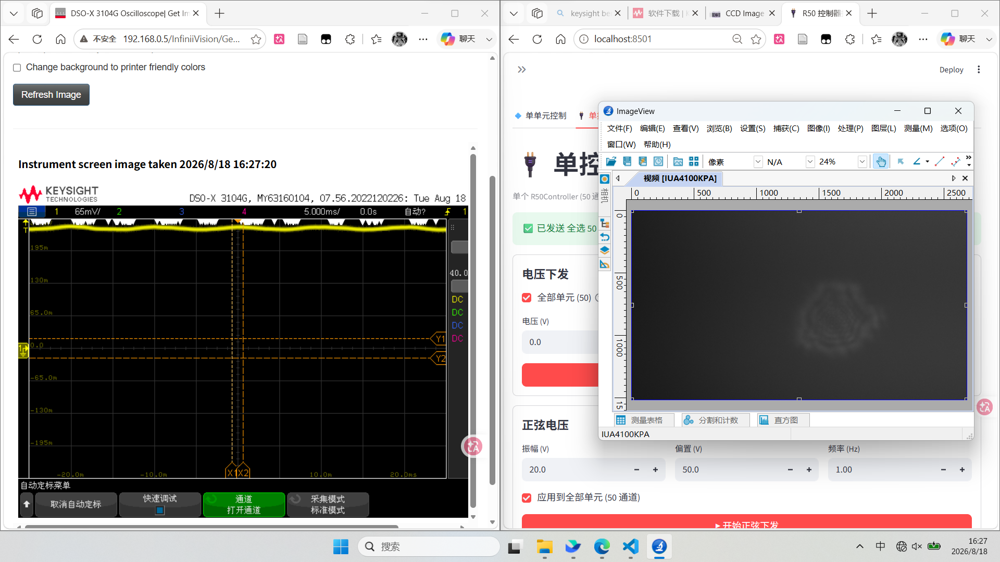
* 50V
* 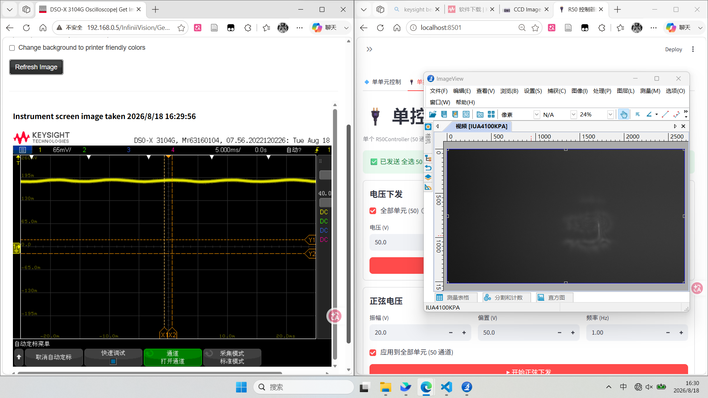
* 80V
* 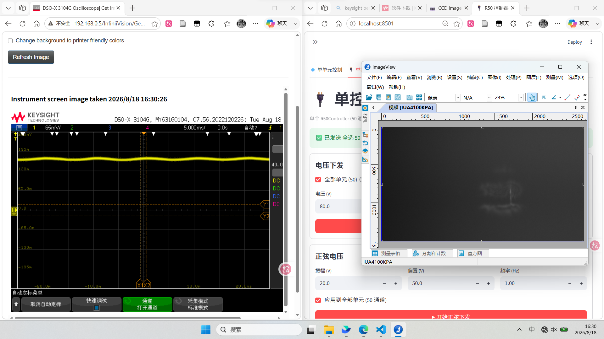
* 100V
* 

# 频率测试

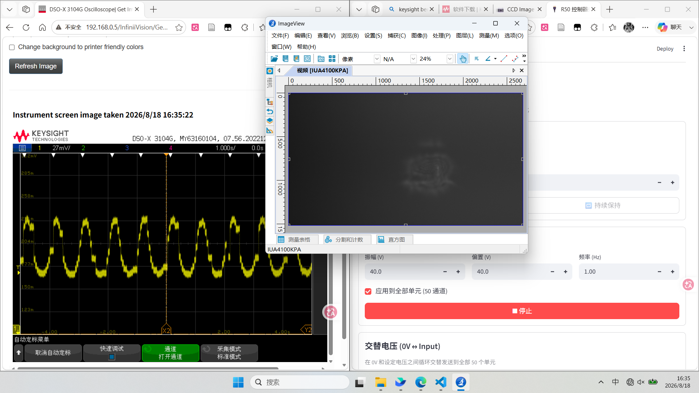

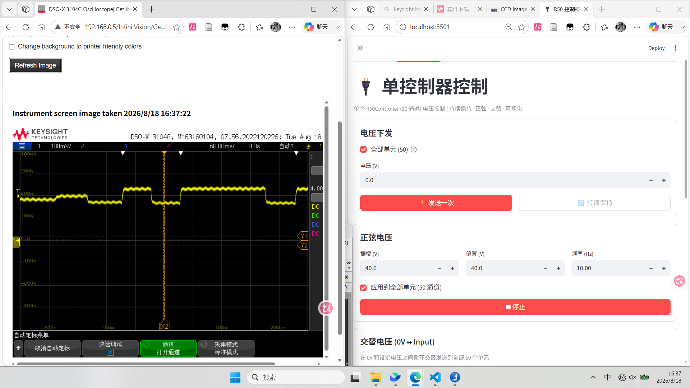

---

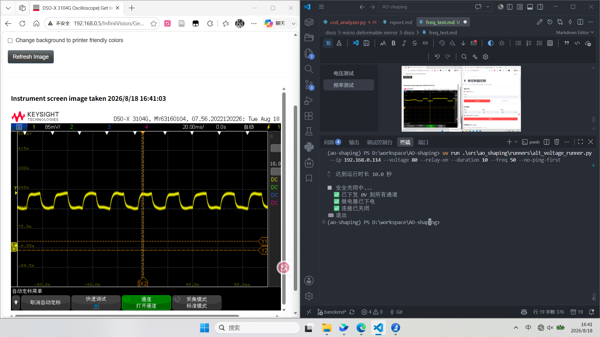

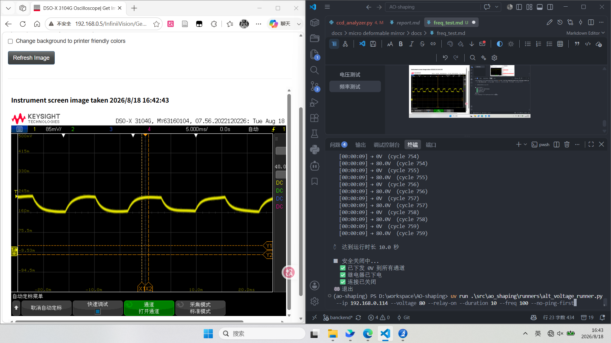

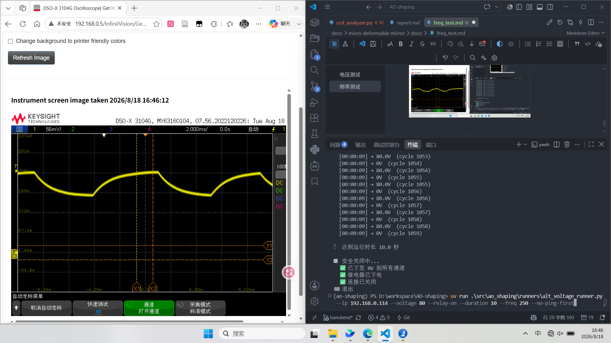

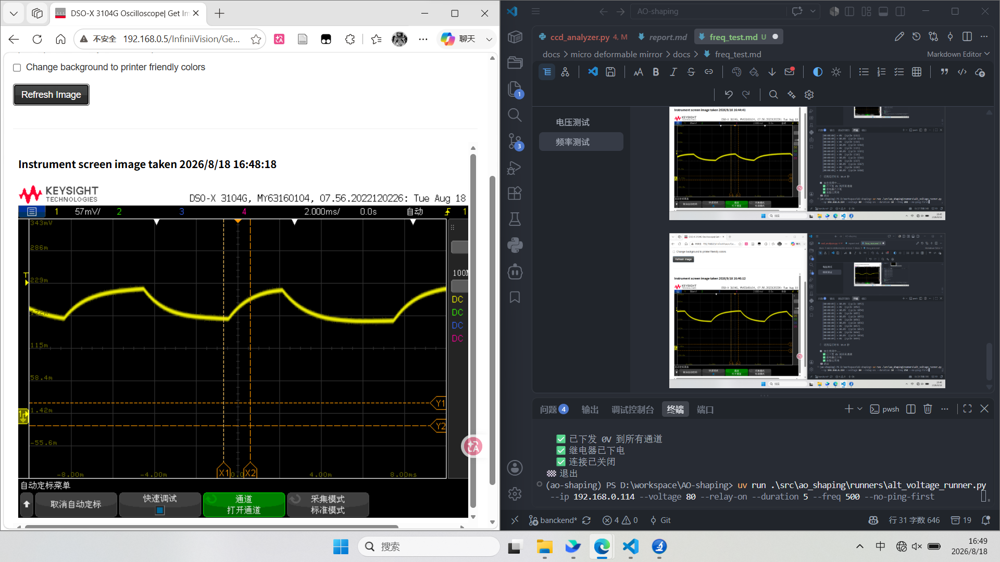

1000hz出现异常

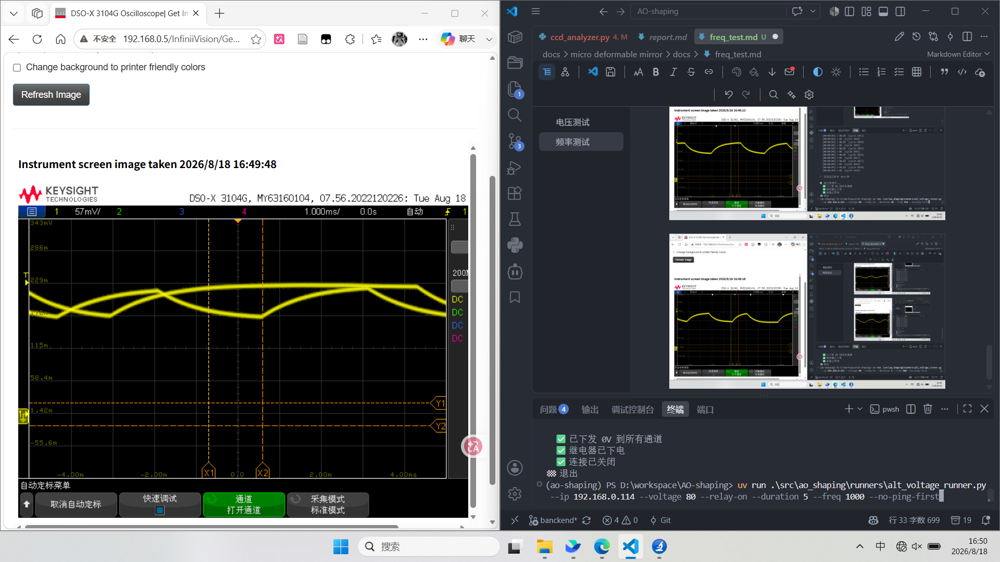

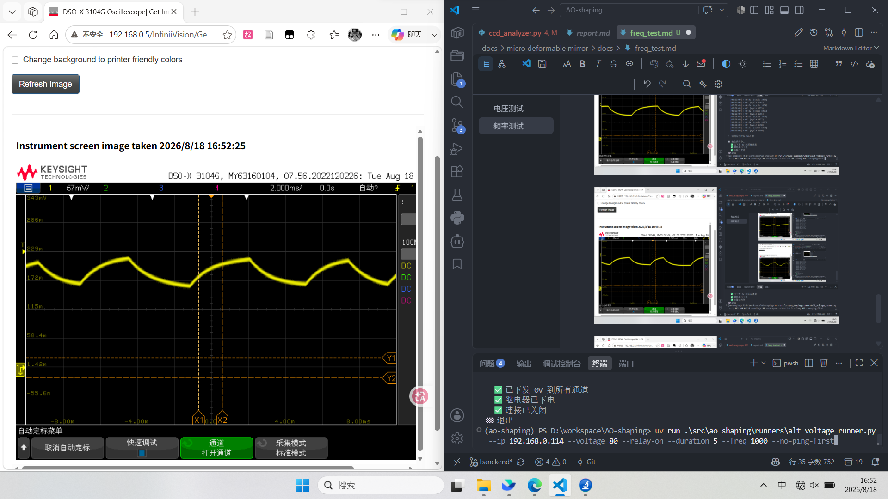
