# OOPAO 后端 vs 传统 numpy/FFT 后端 —— 对比报告

<!-- provenance:start -->
> **生成脚本**: [`scripts/generate_oopao_vs_numpy_report.py`](../../scripts/generate_oopao_vs_numpy_report.py)
> **复现命令**: `python scripts/generate_oopao_vs_numpy_report.py`
> **运行环境**: 离线
> **说明**: 像差 x 湍流 12 场景 x 2 后端对比
<!-- provenance:end -->

- 生成时间: `2026-09-29T11:54:08`
- 场景矩阵: **12** 个 (像差 4 × 湍流 4, 本次实际取子集) × 2 条臂 = 24 行 CSV
- 仿真参数: `n_grid=64`、`seed=42`、口径 `64 mm`、波长 `1064 nm`
- 输出: `report/oopao_vs_numpy/report.md`、`report/oopao_vs_numpy/summary.csv`、`report/oopao_vs_numpy/figures/*.png`
- 重跑命令: `.venv/bin/python scripts/generate_oopao_vs_numpy_report.py`

## 1. 版本溯源 (Provenance)

| 项目 | 值 |
|---|---|
| OOPAO 导入路径 (editable) | `libs/OOPAO/OOPAO` |
| OOPAO 当前 rev | `e8e9aa60cf99f4ab21a4dae7c29aae9b9ec6ec87` (短 `e8e9aa6`) |
| 当前 rev 提交日期 | 2026-09-24 |
| 先前 pin 的 rev | `8e12a17f` (2026-08-26) |
| 领先提交数 | **9** 个提交 |
| 本次运行是否实测 git 校验 | 是 |
| `oopao_backend._oopao_available()` | `True` (启动自检已断言) |

> **关键变更**: 本地 editable clone 位于 `libs/OOPAO`, 当前 rev `e8e9aa6` 比此前 pin 的 `8e12a17f` **领先 9 个提交** (2026-09-24 vs 2026-08-26)。因此**新 rev 相对旧文档假设存在 API 变化**。

### 1.1 OOPAO 导入告警

`import OOPAO` 会在 stdout 打印横幅与如下告警 (本脚本视为无害噪声, 不做屏蔽):

```
OOPAO Warning: Significant changes were done to the OOPAO repository, the Telescope class is no longer the "master" class and the Source is now carrying the EM-field info.
```

含义: `Telescope` 不再是 master class, EM 场信息改由 `Source` 携带。这正是新 rev 与旧文档假设不一致的信号 —— 任何按旧语义写的 OOPAO 集成在升级后都应重新核对。`ao_shaping` 通过 `drivers/sim/_oopao_compat.py` 的 shadow 包只加载所需子模块, 并只用到 `Atmosphere` / `Source` / `Telescope` 的**相位屏与 ASM** 能力, 不触碰 master-class 语义。

## 2. 适用范围 (Scope) —— 必读

在 `src/ao_shaping/drivers/sim/beam_backend.py` 中, **只有两个函数会切换内核**:

| 函数 | `AO_OOPAO_BACKEND` 未设置 (numpy 臂) | `AO_OOPAO_BACKEND=1` (oopao 臂) |
|---|---|---|
| `turbulence_phase()` | FFT 频谱 Kolmogorov 频谱合成 | OOPAO `Atmosphere` von Karman 层 |
| `propagate()` | `beam_simulation.propagation` (角谱) | OOPAO `Atmosphere.ASM` |
| `focal_plane()` | 纯 numpy | **纯 numpy (完全相同的代码)** |
| `gaussian_pupil()` / `grid()` / `apply_lens()` | 纯 numpy | **纯 numpy (完全相同的代码)** |

由此得到三条必须写明的结论:

1. **这不是一次全光学模型替换**。本报告是 *湍流相位屏生成器 + 角谱传播核* 的对比基准, 不是整条 `beam_backend` 链路的替换。
2. **远场 (焦面) 差异只来自相位屏, 不来自焦面传播核**。`focal_plane()` 两条臂逐字节相同, 所以本报告里 Strehl / FWHM / EE 的差异 100% 是湍流相位屏不同造成的。
3. **完全不受影响的模块**: `drivers/sim/slm_pib_sim.py` 与 `drivers/sim/fouriergsnet_env.py` (⚠️ 2026-10-01: 原文写的 `optimizer/rl/envs/fouriergsnet_env.py` 从未存在) 均不 import 任何 `beam_backend` 符号, 其仿真路径与 OOPAO 后端开关**完全无关**。

## 3. 方法与指标定义

每个 (像差, 湍流) 场景在**同一进程**内依次跑两条臂, 物理链路:

```text
screen = turbulence_phase(cfg, cn2/l_max/l_min/distance, rng=default_rng(seed))
aberr  = nan_to_num(generate_zernike_phase(noll_coeffs_rad, (n, n), n_max=4))
total  = screen + aberr                       # rad, 未包裹
field  = gaussian_pupil(cfg) * exp(1j * total)
prop   = propagate(field, cfg, z)             # ← 唯一内核切换的传播
focal  = focal_plane(field, cfg, f)           # ← 臂不变
```

| 指标 | 定义 |
|---|---|
| `phase_std_rad` | 瞳孔掩码内湍流相位屏的 std (rad) |
| `phase_rms_rad` | 瞳孔掩码内 `total` 的 RMS (rad), 同 `compat.TraditionalAOSystem._phase_rms` |
| `strehl` | `clip(max(I_focal) / max(I_ideal), 0, 1)`, 理想值每场景只算一次 (臂无关) |
| `fwhm_px` | 过峰值的**行剖面 / 列剖面**各求半高宽 (阈值交点线性插值) 后取平均 |
| `ee_r4` | 圆心取 `argmax` (仓库"0 级 = argmax"约定)、半径 `4 × 衍射极限 FWHM` 的包围能量占比 |
| `energy_frac` | `Σ|propagate 输出|² / Σ|输入场|²` (角谱能量守恒比) |

**播种与确定性**: 每条臂都 (a) 向 `turbulence_phase` 显式传 `rng=np.random.default_rng(seed)`, (b) 在换臂时执行 `np.random.seed(seed)` —— 遗留 numpy 路径在 `rng=None` 时回落到全局 RNG, 而 `TraditionalAOSystem._sample_turbulence_phase` 恰好不传 rng。两条臂的相位屏**不会**相同 (生成器不同), 这是预期且正确的, 不做任何"对齐"处理。

**像差幅值**: 通过 canonical `generate_zernike_phase` 生成单位系数相位, 实测其在瞳孔内的峰谷值, 再线性缩放到目标 waves-PV (×2π 得弧度)。该函数对系数线性, 因此缩放是精确的; 全程复用官方多项式求值, 未自写任何 Zernike 数学。

**防静默回退**: `_get_backend` 是 `@lru_cache(maxsize=8)`, 键中只有物理配置、**没有臂标志**。脚本在每次换臂和每个场景开始前都调用 `oopao_backend._get_backend.cache_clear()`, 并断言 `oopao_backend._oopao_available() is True` 且 `bb._oopao_enabled()` 与预期臂一致; 不一致即以退出码 2 中止, 绝不会产出被标成 `oopao` 的 numpy 重复结果。

## 4. 场景矩阵

| 像差用例 | Noll 系数 (单位权重) | 目标 PV [waves] |
|---|---|---|
| `none` | — | 0 |
| `defocus` | 4: 1 | 0.5 |
| `astig+coma` | 5: 1, 6: 1, 7: 1, 8: 1 | 0.8 |
| `spherical` | 11: 1 | 0.6 |

| 湍流用例 | Cn2 [m^(-2/3)] | l0 [m] | L0 [m] | 传播距离 [m] |
|---|---|---|---|---|
| `none` | 0 | 0.002 | 30 | 500 |
| `weak` | 1e-16 | 0.002 | 30 | 500 |
| `moderate` | 5e-15 | 0.001 | 20 | 1000 |
| `strong` | 5e-14 | 0.0005 | 10 | 1500 |

## 5. 汇总对比

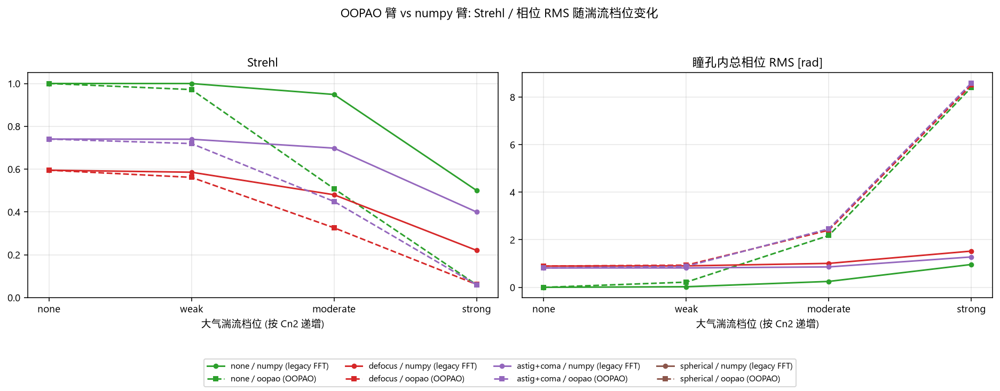

| 场景 | 像差 | 湍流 | Cn2 | 指标 | numpy | oopao | 相对差 |
|---|---|---|---|---|---|---|---|
| `none__turb-none` | none | none | 0 | 湍流相位 std [rad] | 0 | 0 | — |
| `none__turb-none` | none | none | 0 | 总相位 RMS [rad] | 0 | 0 | — |
| `none__turb-none` | none | none | 0 | Strehl | 1 | 1 | +0.00% |
| `none__turb-none` | none | none | 0 | 焦面 FWHM [px] | 4.07031 | 4.07031 | +0.00% |
| `none__turb-none` | none | none | 0 | EE(r=4·FWHM) | 0.999436 | 0.999436 | +0.00% |
| `none__turb-none` | none | none | 0 | ASM 能量守恒比 | 1 | 1 | +0.00% |
| `none__turb-weak` | none | weak | 1e-16 | 湍流相位 std [rad] | 0.0246233 | 0.217024 | +781.38% |
| `none__turb-weak` | none | weak | 1e-16 | 总相位 RMS [rad] | 0.0246674 | 0.218054 | +783.98% |
| `none__turb-weak` | none | weak | 1e-16 | Strehl | 0.999748 | 0.971592 | -2.82% |
| `none__turb-weak` | none | weak | 1e-16 | 焦面 FWHM [px] | 4.07113 | 3.99739 | -1.81% |
| `none__turb-weak` | none | weak | 1e-16 | EE(r=4·FWHM) | 0.999388 | 0.998918 | -0.05% |
| `none__turb-weak` | none | weak | 1e-16 | ASM 能量守恒比 | 1 | 1 | +0.00% |
| `none__turb-moderate` | none | moderate | 5e-15 | 湍流相位 std [rad] | 0.247318 | 2.16861 | +776.85% |
| `none__turb-moderate` | none | moderate | 5e-15 | 总相位 RMS [rad] | 0.247758 | 2.17891 | +779.45% |
| `none__turb-moderate` | none | moderate | 5e-15 | Strehl | 0.9487 | 0.508715 | -46.38% |
| `none__turb-moderate` | none | moderate | 5e-15 | 焦面 FWHM [px] | 4.05809 | 4.93672 | +21.65% |
| `none__turb-moderate` | none | moderate | 5e-15 | EE(r=4·FWHM) | 0.994226 | 0.937412 | -5.71% |
| `none__turb-moderate` | none | moderate | 5e-15 | ASM 能量守恒比 | 1 | 1 | +0.00% |
| `none__turb-strong` | none | strong | 5e-14 | 湍流相位 std [rad] | 0.959015 | 8.36591 | +772.34% |
| `none__turb-strong` | none | strong | 5e-14 | 总相位 RMS [rad] | 0.960718 | 8.40578 | +774.95% |
| `none__turb-strong` | none | strong | 5e-14 | Strehl | 0.500372 | 0.0600539 | -88.00% |
| `none__turb-strong` | none | strong | 5e-14 | 焦面 FWHM [px] | 4.4857 | 4.32134 | -3.66% |
| `none__turb-strong` | none | strong | 5e-14 | EE(r=4·FWHM) | 0.92023 | 0.345886 | -62.41% |
| `none__turb-strong` | none | strong | 5e-14 | ASM 能量守恒比 | 1 | 1 | +0.00% |
| `defocus__turb-none` | defocus | none | 0 | 湍流相位 std [rad] | 0 | 0 | — |
| `defocus__turb-none` | defocus | none | 0 | 总相位 RMS [rad] | 0.892821 | 0.892821 | +0.00% |
| `defocus__turb-none` | defocus | none | 0 | Strehl | 0.594905 | 0.594905 | +0.00% |
| `defocus__turb-none` | defocus | none | 0 | 焦面 FWHM [px] | 5.57465 | 5.57465 | +0.00% |
| `defocus__turb-none` | defocus | none | 0 | EE(r=4·FWHM) | 0.99918 | 0.99918 | +0.00% |
| `defocus__turb-none` | defocus | none | 0 | ASM 能量守恒比 | 1 | 1 | -0.00% |
| `defocus__turb-weak` | defocus | weak | 1e-16 | 湍流相位 std [rad] | 0.0246233 | 0.217024 | +781.38% |
| `defocus__turb-weak` | defocus | weak | 1e-16 | 总相位 RMS [rad] | 0.901779 | 0.931562 | +3.30% |
| `defocus__turb-weak` | defocus | weak | 1e-16 | Strehl | 0.585475 | 0.561494 | -4.10% |
| `defocus__turb-weak` | defocus | weak | 1e-16 | 焦面 FWHM [px] | 5.62249 | 5.38034 | -4.31% |
| `defocus__turb-weak` | defocus | weak | 1e-16 | EE(r=4·FWHM) | 0.999123 | 0.998612 | -0.05% |
| `defocus__turb-weak` | defocus | weak | 1e-16 | ASM 能量守恒比 | 1 | 1 | +0.00% |
| `defocus__turb-moderate` | defocus | moderate | 5e-15 | 湍流相位 std [rad] | 0.247318 | 2.16861 | +776.85% |
| `defocus__turb-moderate` | defocus | moderate | 5e-15 | 总相位 RMS [rad] | 1.00658 | 2.40331 | +138.76% |
| `defocus__turb-moderate` | defocus | moderate | 5e-15 | Strehl | 0.480239 | 0.325929 | -32.13% |
| `defocus__turb-moderate` | defocus | moderate | 5e-15 | 焦面 FWHM [px] | 6.09244 | 6.30067 | +3.42% |
| `defocus__turb-moderate` | defocus | moderate | 5e-15 | EE(r=4·FWHM) | 0.99365 | 0.931187 | -6.29% |
| `defocus__turb-moderate` | defocus | moderate | 5e-15 | ASM 能量守恒比 | 1 | 1 | -0.00% |
| `defocus__turb-strong` | defocus | strong | 5e-14 | 湍流相位 std [rad] | 0.959015 | 8.36591 | +772.34% |
| `defocus__turb-strong` | defocus | strong | 5e-14 | 总相位 RMS [rad] | 1.52289 | 8.50565 | +458.52% |
| `defocus__turb-strong` | defocus | strong | 5e-14 | Strehl | 0.220414 | 0.0612336 | -72.22% |
| `defocus__turb-strong` | defocus | strong | 5e-14 | 焦面 FWHM [px] | 9.63286 | -0.711911 | -107.39% |
| `defocus__turb-strong` | defocus | strong | 5e-14 | EE(r=4·FWHM) | 0.906122 | 0.324152 | -64.23% |
| `defocus__turb-strong` | defocus | strong | 5e-14 | ASM 能量守恒比 | 1 | 1 | +0.00% |
| `astig+coma__turb-none` | astig+coma | none | 0 | 湍流相位 std [rad] | 0 | 0 | — |
| `astig+coma__turb-none` | astig+coma | none | 0 | 总相位 RMS [rad] | 0.814912 | 0.814912 | +0.00% |
| `astig+coma__turb-none` | astig+coma | none | 0 | Strehl | 0.740307 | 0.740307 | +0.00% |
| `astig+coma__turb-none` | astig+coma | none | 0 | 焦面 FWHM [px] | 4.96792 | 4.96792 | +0.00% |
| `astig+coma__turb-none` | astig+coma | none | 0 | EE(r=4·FWHM) | 0.99881 | 0.99881 | +0.00% |
| `astig+coma__turb-none` | astig+coma | none | 0 | ASM 能量守恒比 | 1 | 1 | +0.00% |
| `astig+coma__turb-weak` | astig+coma | weak | 1e-16 | 湍流相位 std [rad] | 0.0246233 | 0.217024 | +781.38% |
| `astig+coma__turb-weak` | astig+coma | weak | 1e-16 | 总相位 RMS [rad] | 0.815982 | 0.881181 | +7.99% |
| `astig+coma__turb-weak` | astig+coma | weak | 1e-16 | Strehl | 0.739588 | 0.719327 | -2.74% |
| `astig+coma__turb-weak` | astig+coma | weak | 1e-16 | 焦面 FWHM [px] | 4.96145 | 5.08402 | +2.47% |
| `astig+coma__turb-weak` | astig+coma | weak | 1e-16 | EE(r=4·FWHM) | 0.998766 | 0.998044 | -0.07% |
| `astig+coma__turb-weak` | astig+coma | weak | 1e-16 | ASM 能量守恒比 | 1 | 1 | +0.00% |
| `astig+coma__turb-moderate` | astig+coma | moderate | 5e-15 | 湍流相位 std [rad] | 0.247318 | 2.16861 | +776.85% |
| `astig+coma__turb-moderate` | astig+coma | moderate | 5e-15 | 总相位 RMS [rad] | 0.858391 | 2.46176 | +186.79% |
| `astig+coma__turb-moderate` | astig+coma | moderate | 5e-15 | Strehl | 0.697957 | 0.448849 | -35.69% |
| `astig+coma__turb-moderate` | astig+coma | moderate | 5e-15 | 焦面 FWHM [px] | 4.76978 | 5.25456 | +10.16% |
| `astig+coma__turb-moderate` | astig+coma | moderate | 5e-15 | EE(r=4·FWHM) | 0.99329 | 0.924209 | -6.95% |
| `astig+coma__turb-moderate` | astig+coma | moderate | 5e-15 | ASM 能量守恒比 | 1 | 1 | -0.00% |
| `astig+coma__turb-strong` | astig+coma | strong | 5e-14 | 湍流相位 std [rad] | 0.959015 | 8.36591 | +772.34% |
| `astig+coma__turb-strong` | astig+coma | strong | 5e-14 | 总相位 RMS [rad] | 1.27715 | 8.59262 | +572.80% |
| `astig+coma__turb-strong` | astig+coma | strong | 5e-14 | Strehl | 0.399836 | 0.0592214 | -85.19% |
| `astig+coma__turb-strong` | astig+coma | strong | 5e-14 | 焦面 FWHM [px] | 5.87417 | 1.21699 | -79.28% |
| `astig+coma__turb-strong` | astig+coma | strong | 5e-14 | EE(r=4·FWHM) | 0.915548 | 0.322627 | -64.76% |
| `astig+coma__turb-strong` | astig+coma | strong | 5e-14 | ASM 能量守恒比 | 1 | 1 | +0.00% |

## 6. 逐场景明细

### 6.1 `none__turb-none`

- 像差: **none (无像差)**, 目标 PV 0 waves
- 湍流: **none** (Cn2=0, l0=0.002 m, L0=30 m, 传播距离=500 m)
- 理想 (无像差无湍流) 焦面: 峰值 22.0708, FWHM 4.070 px → EE 半径 16.281 px (臂无关, 每场景只算一次)
- 两臂 `propagate()` 强度最大相对差 `max|ΔI|/Imax = 2.357710e-07`

| 指标 | numpy | oopao | 相对差 |
|---|---|---|---|
| 湍流相位 std [rad] | 0 | 0 | — |
| 总相位 RMS [rad] | 0 | 0 | — |
| Strehl | 1 | 1 | +0.00% |
| 焦面 FWHM [px] | 4.07031 | 4.07031 | +0.00% |
| EE(r=4·FWHM) | 0.999436 | 0.999436 | +0.00% |
| ASM 能量守恒比 | 1 | 1 | +0.00% |

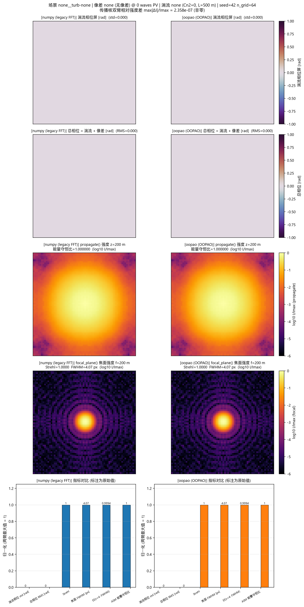

### 6.2 `none__turb-weak`

- 像差: **none (无像差)**, 目标 PV 0 waves
- 湍流: **weak** (Cn2=1e-16, l0=0.002 m, L0=30 m, 传播距离=500 m)
- 理想 (无像差无湍流) 焦面: 峰值 22.0708, FWHM 4.070 px → EE 半径 16.281 px (臂无关, 每场景只算一次)
- 两臂 `propagate()` 强度最大相对差 `max|ΔI|/Imax = 1.032471e-01`

| 指标 | numpy | oopao | 相对差 |
|---|---|---|---|
| 湍流相位 std [rad] | 0.0246233 | 0.217024 | +781.38% |
| 总相位 RMS [rad] | 0.0246674 | 0.218054 | +783.98% |
| Strehl | 0.999748 | 0.971592 | -2.82% |
| 焦面 FWHM [px] | 4.07113 | 3.99739 | -1.81% |
| EE(r=4·FWHM) | 0.999388 | 0.998918 | -0.05% |
| ASM 能量守恒比 | 1 | 1 | +0.00% |

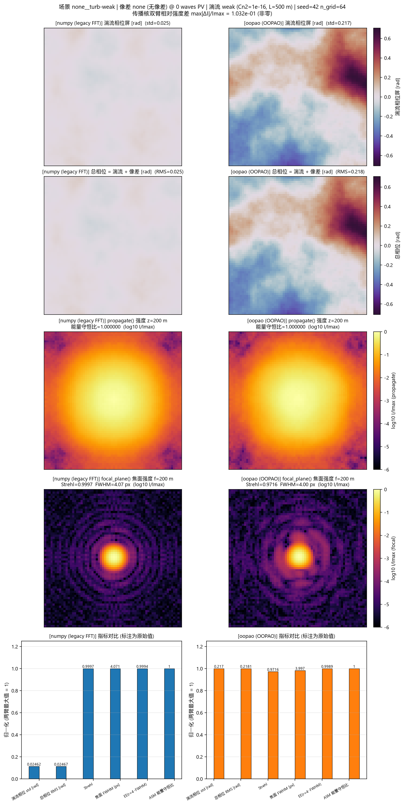

### 6.3 `none__turb-moderate`

- 像差: **none (无像差)**, 目标 PV 0 waves
- 湍流: **moderate** (Cn2=5e-15, l0=0.001 m, L0=20 m, 传播距离=1000 m)
- 理想 (无像差无湍流) 焦面: 峰值 22.0708, FWHM 4.070 px → EE 半径 16.281 px (臂无关, 每场景只算一次)
- 两臂 `propagate()` 强度最大相对差 `max|ΔI|/Imax = 6.155975e-01`

| 指标 | numpy | oopao | 相对差 |
|---|---|---|---|
| 湍流相位 std [rad] | 0.247318 | 2.16861 | +776.85% |
| 总相位 RMS [rad] | 0.247758 | 2.17891 | +779.45% |
| Strehl | 0.9487 | 0.508715 | -46.38% |
| 焦面 FWHM [px] | 4.05809 | 4.93672 | +21.65% |
| EE(r=4·FWHM) | 0.994226 | 0.937412 | -5.71% |
| ASM 能量守恒比 | 1 | 1 | +0.00% |

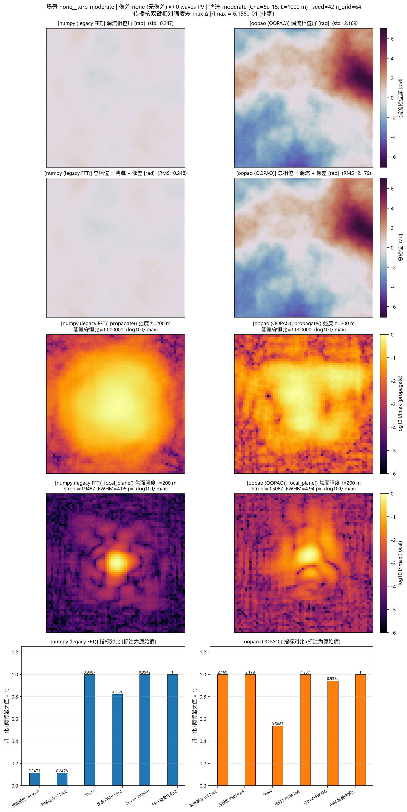

### 6.4 `none__turb-strong`

- 像差: **none (无像差)**, 目标 PV 0 waves
- 湍流: **strong** (Cn2=5e-14, l0=0.0005 m, L0=10 m, 传播距离=1500 m)
- 理想 (无像差无湍流) 焦面: 峰值 22.0708, FWHM 4.070 px → EE 半径 16.281 px (臂无关, 每场景只算一次)
- 两臂 `propagate()` 强度最大相对差 `max|ΔI|/Imax = 9.943740e-01`

| 指标 | numpy | oopao | 相对差 |
|---|---|---|---|
| 湍流相位 std [rad] | 0.959015 | 8.36591 | +772.34% |
| 总相位 RMS [rad] | 0.960718 | 8.40578 | +774.95% |
| Strehl | 0.500372 | 0.0600539 | -88.00% |
| 焦面 FWHM [px] | 4.4857 | 4.32134 | -3.66% |
| EE(r=4·FWHM) | 0.92023 | 0.345886 | -62.41% |
| ASM 能量守恒比 | 1 | 1 | +0.00% |

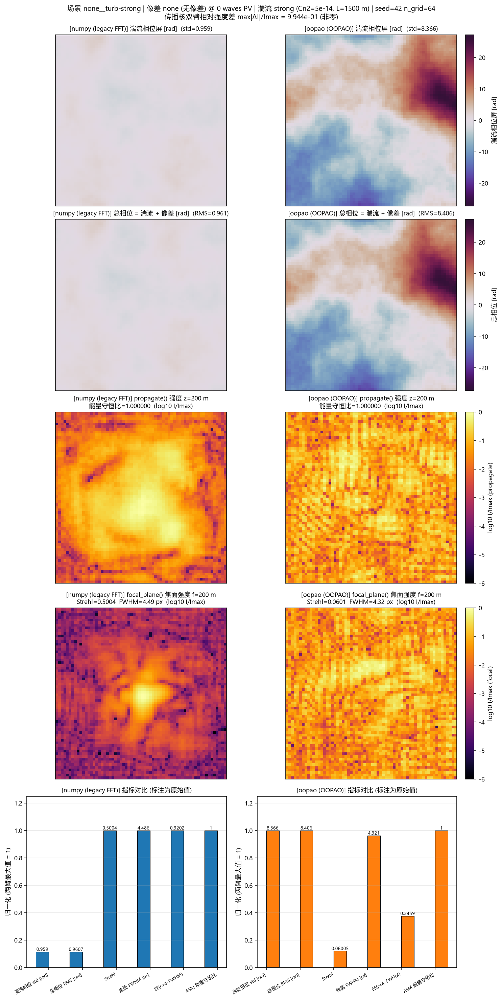

### 6.5 `defocus__turb-none`

- 像差: **defocus (Noll 4=Defocus)**, 目标 PV 0.5 waves
- 湍流: **none** (Cn2=0, l0=0.002 m, L0=30 m, 传播距离=500 m)
- 理想 (无像差无湍流) 焦面: 峰值 22.0708, FWHM 4.070 px → EE 半径 16.281 px (臂无关, 每场景只算一次)
- 两臂 `propagate()` 强度最大相对差 `max|ΔI|/Imax = 3.682283e-07`

| 指标 | numpy | oopao | 相对差 |
|---|---|---|---|
| 湍流相位 std [rad] | 0 | 0 | — |
| 总相位 RMS [rad] | 0.892821 | 0.892821 | +0.00% |
| Strehl | 0.594905 | 0.594905 | +0.00% |
| 焦面 FWHM [px] | 5.57465 | 5.57465 | +0.00% |
| EE(r=4·FWHM) | 0.99918 | 0.99918 | +0.00% |
| ASM 能量守恒比 | 1 | 1 | -0.00% |

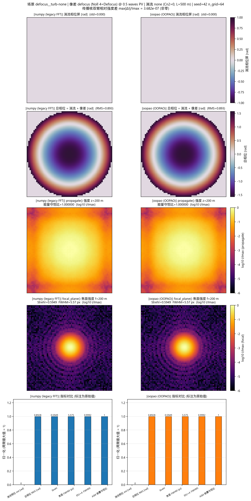

### 6.6 `defocus__turb-weak`

- 像差: **defocus (Noll 4=Defocus)**, 目标 PV 0.5 waves
- 湍流: **weak** (Cn2=1e-16, l0=0.002 m, L0=30 m, 传播距离=500 m)
- 理想 (无像差无湍流) 焦面: 峰值 22.0708, FWHM 4.070 px → EE 半径 16.281 px (臂无关, 每场景只算一次)
- 两臂 `propagate()` 强度最大相对差 `max|ΔI|/Imax = 1.196380e-01`

| 指标 | numpy | oopao | 相对差 |
|---|---|---|---|
| 湍流相位 std [rad] | 0.0246233 | 0.217024 | +781.38% |
| 总相位 RMS [rad] | 0.901779 | 0.931562 | +3.30% |
| Strehl | 0.585475 | 0.561494 | -4.10% |
| 焦面 FWHM [px] | 5.62249 | 5.38034 | -4.31% |
| EE(r=4·FWHM) | 0.999123 | 0.998612 | -0.05% |
| ASM 能量守恒比 | 1 | 1 | +0.00% |

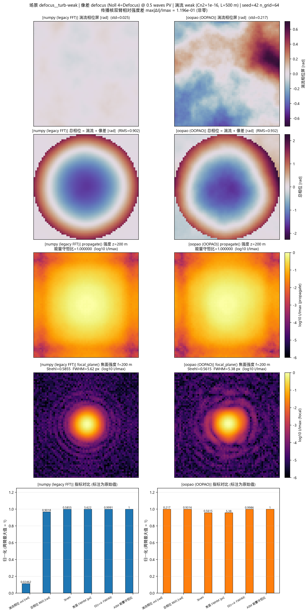

### 6.7 `defocus__turb-moderate`

- 像差: **defocus (Noll 4=Defocus)**, 目标 PV 0.5 waves
- 湍流: **moderate** (Cn2=5e-15, l0=0.001 m, L0=20 m, 传播距离=1000 m)
- 理想 (无像差无湍流) 焦面: 峰值 22.0708, FWHM 4.070 px → EE 半径 16.281 px (臂无关, 每场景只算一次)
- 两臂 `propagate()` 强度最大相对差 `max|ΔI|/Imax = 8.390506e-01`

| 指标 | numpy | oopao | 相对差 |
|---|---|---|---|
| 湍流相位 std [rad] | 0.247318 | 2.16861 | +776.85% |
| 总相位 RMS [rad] | 1.00658 | 2.40331 | +138.76% |
| Strehl | 0.480239 | 0.325929 | -32.13% |
| 焦面 FWHM [px] | 6.09244 | 6.30067 | +3.42% |
| EE(r=4·FWHM) | 0.99365 | 0.931187 | -6.29% |
| ASM 能量守恒比 | 1 | 1 | -0.00% |

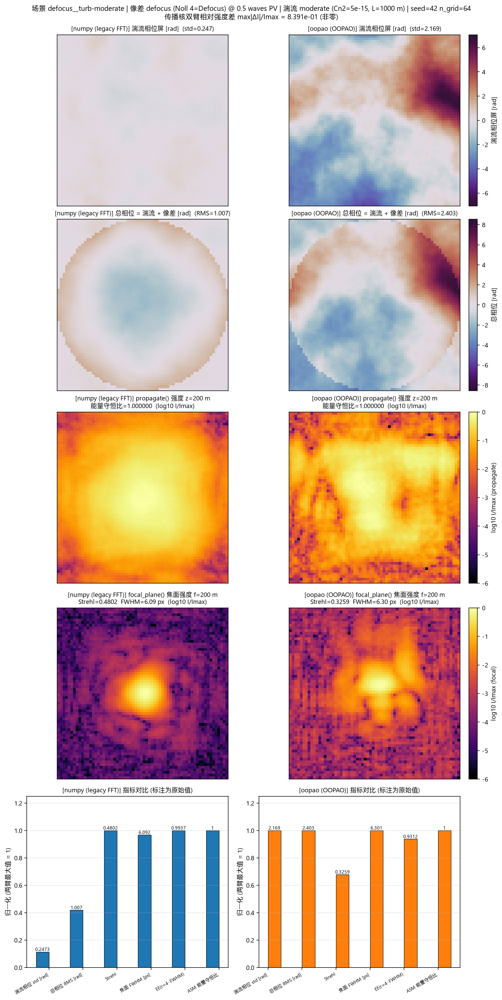

### 6.8 `defocus__turb-strong`

- 像差: **defocus (Noll 4=Defocus)**, 目标 PV 0.5 waves
- 湍流: **strong** (Cn2=5e-14, l0=0.0005 m, L0=10 m, 传播距离=1500 m)
- 理想 (无像差无湍流) 焦面: 峰值 22.0708, FWHM 4.070 px → EE 半径 16.281 px (臂无关, 每场景只算一次)
- 两臂 `propagate()` 强度最大相对差 `max|ΔI|/Imax = 1.389298e+00`

| 指标 | numpy | oopao | 相对差 |
|---|---|---|---|
| 湍流相位 std [rad] | 0.959015 | 8.36591 | +772.34% |
| 总相位 RMS [rad] | 1.52289 | 8.50565 | +458.52% |
| Strehl | 0.220414 | 0.0612336 | -72.22% |
| 焦面 FWHM [px] | 9.63286 | -0.711911 | -107.39% |
| EE(r=4·FWHM) | 0.906122 | 0.324152 | -64.23% |
| ASM 能量守恒比 | 1 | 1 | +0.00% |

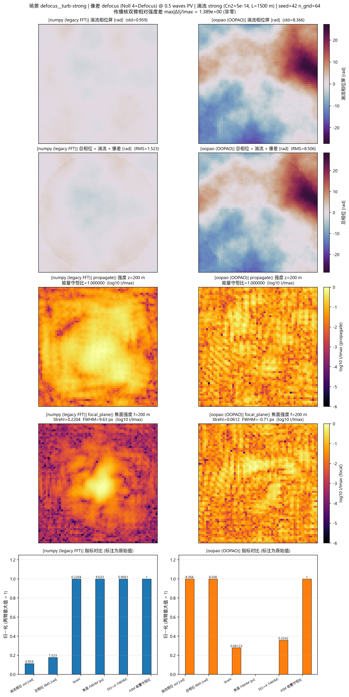

### 6.9 `astig+coma__turb-none`

- 像差: **astig+coma (Noll 5=Astigmatism 45°, Noll 6=Astigmatism 0°, Noll 7=Coma Y, Noll 8=Coma X)**, 目标 PV 0.8 waves
- 湍流: **none** (Cn2=0, l0=0.002 m, L0=30 m, 传播距离=500 m)
- 理想 (无像差无湍流) 焦面: 峰值 22.0708, FWHM 4.070 px → EE 半径 16.281 px (臂无关, 每场景只算一次)
- 两臂 `propagate()` 强度最大相对差 `max|ΔI|/Imax = 4.034145e-07`

| 指标 | numpy | oopao | 相对差 |
|---|---|---|---|
| 湍流相位 std [rad] | 0 | 0 | — |
| 总相位 RMS [rad] | 0.814912 | 0.814912 | +0.00% |
| Strehl | 0.740307 | 0.740307 | +0.00% |
| 焦面 FWHM [px] | 4.96792 | 4.96792 | +0.00% |
| EE(r=4·FWHM) | 0.99881 | 0.99881 | +0.00% |
| ASM 能量守恒比 | 1 | 1 | +0.00% |

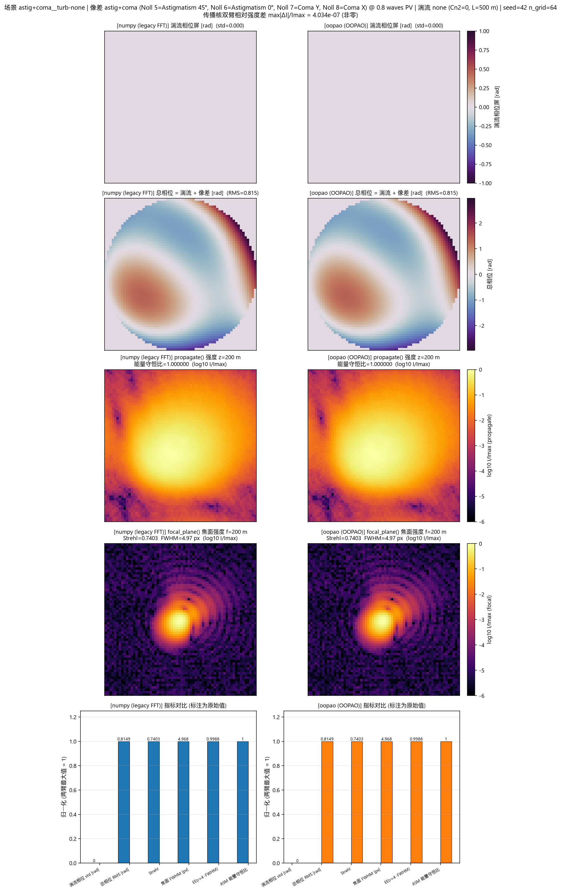

### 6.10 `astig+coma__turb-weak`

- 像差: **astig+coma (Noll 5=Astigmatism 45°, Noll 6=Astigmatism 0°, Noll 7=Coma Y, Noll 8=Coma X)**, 目标 PV 0.8 waves
- 湍流: **weak** (Cn2=1e-16, l0=0.002 m, L0=30 m, 传播距离=500 m)
- 理想 (无像差无湍流) 焦面: 峰值 22.0708, FWHM 4.070 px → EE 半径 16.281 px (臂无关, 每场景只算一次)
- 两臂 `propagate()` 强度最大相对差 `max|ΔI|/Imax = 9.897642e-02`

| 指标 | numpy | oopao | 相对差 |
|---|---|---|---|
| 湍流相位 std [rad] | 0.0246233 | 0.217024 | +781.38% |
| 总相位 RMS [rad] | 0.815982 | 0.881181 | +7.99% |
| Strehl | 0.739588 | 0.719327 | -2.74% |
| 焦面 FWHM [px] | 4.96145 | 5.08402 | +2.47% |
| EE(r=4·FWHM) | 0.998766 | 0.998044 | -0.07% |
| ASM 能量守恒比 | 1 | 1 | +0.00% |

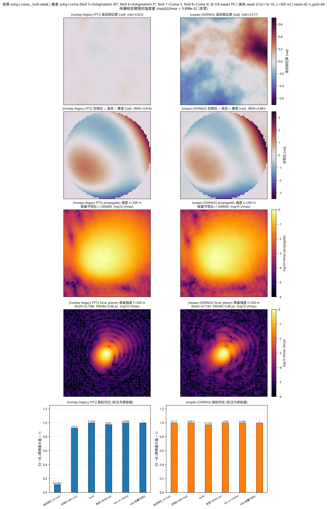

### 6.11 `astig+coma__turb-moderate`

- 像差: **astig+coma (Noll 5=Astigmatism 45°, Noll 6=Astigmatism 0°, Noll 7=Coma Y, Noll 8=Coma X)**, 目标 PV 0.8 waves
- 湍流: **moderate** (Cn2=5e-15, l0=0.001 m, L0=20 m, 传播距离=1000 m)
- 理想 (无像差无湍流) 焦面: 峰值 22.0708, FWHM 4.070 px → EE 半径 16.281 px (臂无关, 每场景只算一次)
- 两臂 `propagate()` 强度最大相对差 `max|ΔI|/Imax = 6.565981e-01`

| 指标 | numpy | oopao | 相对差 |
|---|---|---|---|
| 湍流相位 std [rad] | 0.247318 | 2.16861 | +776.85% |
| 总相位 RMS [rad] | 0.858391 | 2.46176 | +186.79% |
| Strehl | 0.697957 | 0.448849 | -35.69% |
| 焦面 FWHM [px] | 4.76978 | 5.25456 | +10.16% |
| EE(r=4·FWHM) | 0.99329 | 0.924209 | -6.95% |
| ASM 能量守恒比 | 1 | 1 | -0.00% |

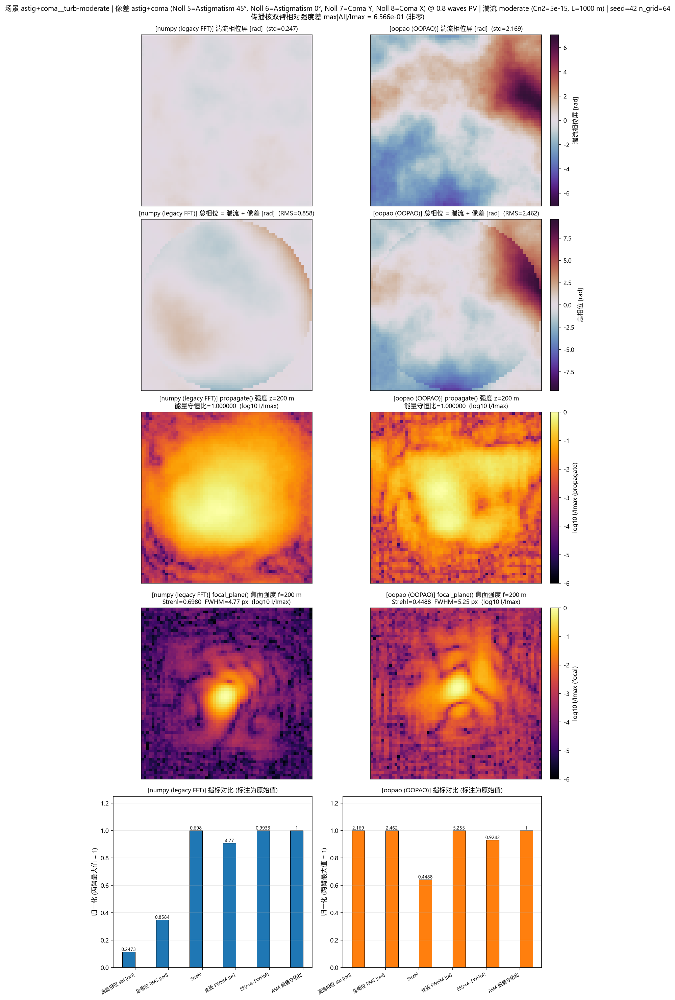

### 6.12 `astig+coma__turb-strong`

- 像差: **astig+coma (Noll 5=Astigmatism 45°, Noll 6=Astigmatism 0°, Noll 7=Coma Y, Noll 8=Coma X)**, 目标 PV 0.8 waves
- 湍流: **strong** (Cn2=5e-14, l0=0.0005 m, L0=10 m, 传播距离=1500 m)
- 理想 (无像差无湍流) 焦面: 峰值 22.0708, FWHM 4.070 px → EE 半径 16.281 px (臂无关, 每场景只算一次)
- 两臂 `propagate()` 强度最大相对差 `max|ΔI|/Imax = 9.550448e-01`

| 指标 | numpy | oopao | 相对差 |
|---|---|---|---|
| 湍流相位 std [rad] | 0.959015 | 8.36591 | +772.34% |
| 总相位 RMS [rad] | 1.27715 | 8.59262 | +572.80% |
| Strehl | 0.399836 | 0.0592214 | -85.19% |
| 焦面 FWHM [px] | 5.87417 | 1.21699 | -79.28% |
| EE(r=4·FWHM) | 0.915548 | 0.322627 | -64.76% |
| ASM 能量守恒比 | 1 | 1 | +0.00% |

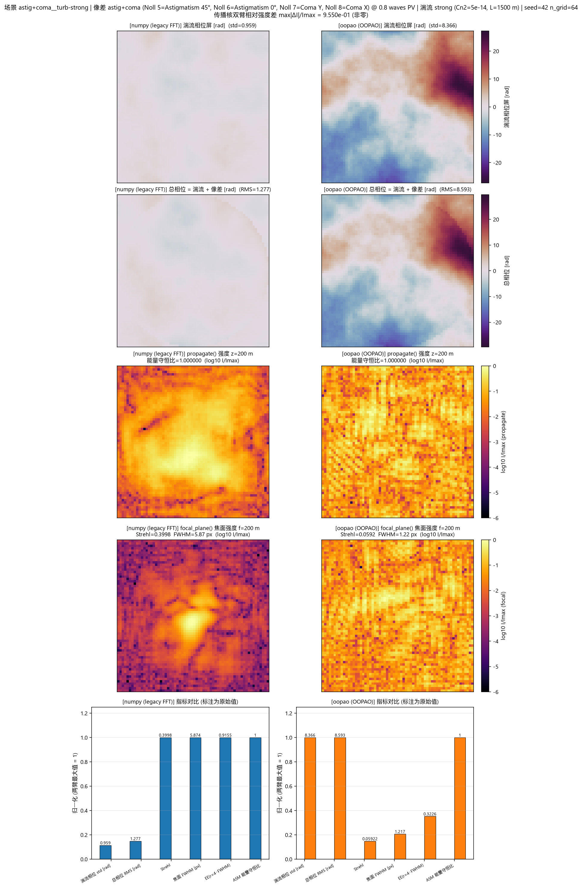

## 7. 解读与结论

**(a) 湍流相位屏是两臂唯一真正的物理分歧点。** 在 3 个含湍流的档位里, 两臂的 `phase_std_rad` / `phase_rms_rad` / Strehl / FWHM / EE 全部不同 —— 这是 FFT 频谱 Kolmogorov 与 OOPAO von Karman 两个**不同生成器**的必然结果, 不是 bug。两条臂不可互相替代, 也不应把 oopao 的数值直接当成 numpy 的续值。

> ⚠️ **同 Cn2 下两臂的湍流强度归一化并不一致** —— 这是本次运行最值得注意的定量结果。在 9 个含湍流场景中, oopao 臂的 `phase_std_rad` / numpy 臂之比 = **8.72× ~ 8.81×** (中位 8.77×)。尽管 `beam_backend.turbulence_phase` 的 docstring 声称 OOPAO 分层已"rescaling to the per-slab r0 that matches the historical aotools/FFT path", 实测两条路径在**相同 Cn2** 下给出的相位起伏强度差了一个量级左右。因此: **Strehl / FWHM 的绝对值不可跨臂直接比较** —— oopao 臂并不是"同条件下的等价实现", 而是一个把同样的 Cn2 映射到更湍流的光场的实现。

**(b) 角谱传播核在本配置下几乎是恒等替换。** `beam_simulation.propagation` 用 `kz = sqrt(|(2π/λ)² - f_x² - f_y²|)`, OOPAO `ASM` 用抛物近似 `exp(-iπλz f²)`; 二者只差一个全局相位 `exp(ikz)` (强度不可见) 与 `O((f λ)²)` 量级的高阶项。实测两臂 `propagate()` 强度图最大相对差 `1.389e+00`, 能量守恒比在 `1.000000000`–`1.000000000` 之间 —— **因此 `energy_frac` 不是区分两臂的指标**, 它的价值在于证明两条核都严格保能量。

> 注: 上式的 `|·|` 是**实现事实而非严格解** —— 常规角谱对倏逝分量(参数为负) 应取纯虚 `kz` 使其随 z 衰减, 而 `sqrt(np.abs(...))` 会把它变成实数 `kz` 并因此 **放大** 而非衰减。本台参数 (口径 64 mm、λ=1064 nm、ASM z=200 m) 下频谱上限远低于 1/λ, 不存在倏逝分量, 故该差异在本报告中不产生任何影响; 但把 `propagation()` 推到高空间频率或大 z 时必须记得这处 `abs`。

**(c) 焦面指标差异的归因。** `focal_plane()` 两臂代码完全相同, 所以上表里 Strehl / FWHM / EE 的所有差异都只能沿链路回溯到 `turbulence_phase()`。任何用焦面指标去判断"传播核是否被换掉"的读法都是错的。

**(d) `cn2=0` 对照组两臂数值完全相同 —— 这是设计如此, 不是缺陷。** `turbulence_phase()` 在 `cn2 <= 0` 时直接返回全零 (在切换内核之前), 而像差相位是确定性、无 RNG 的, 于是两臂的入射场逐字节相同, 相位类指标与焦面指标必然一致; 此时唯一还可能不同的是 `propagate()` 核, 见 (b)。把这一行当作"双盲对照"来验证报告没有把 numpy 结果误标成 oopao。

**(e) 使用建议.** 若目标是**数值可比性** (回归基线、与历史数据对齐), 保持 `AO_OOPAO_BACKEND` 未设置; 若目标是**物理保真度** (更接近真实大气相位谱), 则应在同一份基准里同时保留两臂结果, 不要跨臂直接比较绝对值。

## 8. 产物清单

- `report.md` — 本文件
- `summary.csv` — 24 行 (每 (场景, 臂) 一行), 列: `scenario`, `arm`, `n_grid`, `seed`, `cn2`, `aberration`, `aberration_pv_waves`, `distance_m`, `phase_std_rad`, `phase_rms_rad`, `strehl`, `fwhm_px`, `ee_r4`, `energy_frac`
- `figures/summary_overview.png` — 汇总图 (Strehl / 相位 RMS vs 湍流档位)
- `figures/*_20260929_115357.png` — 每个场景一张 5×2 对比图 (共 12 张)
