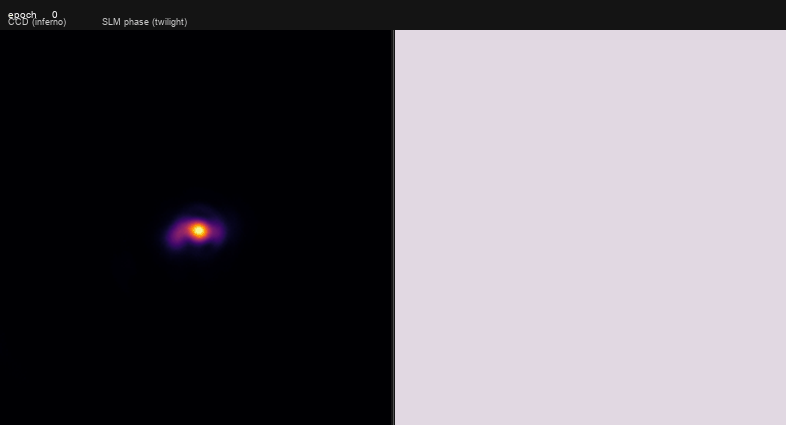
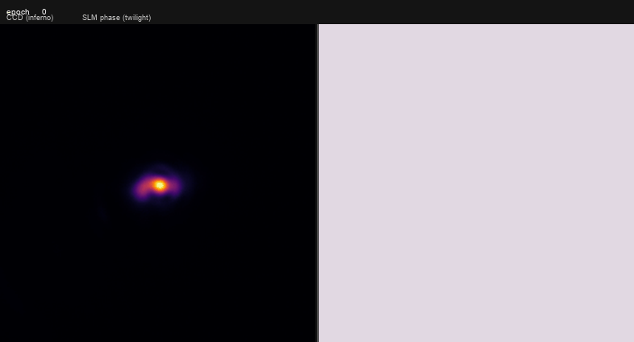
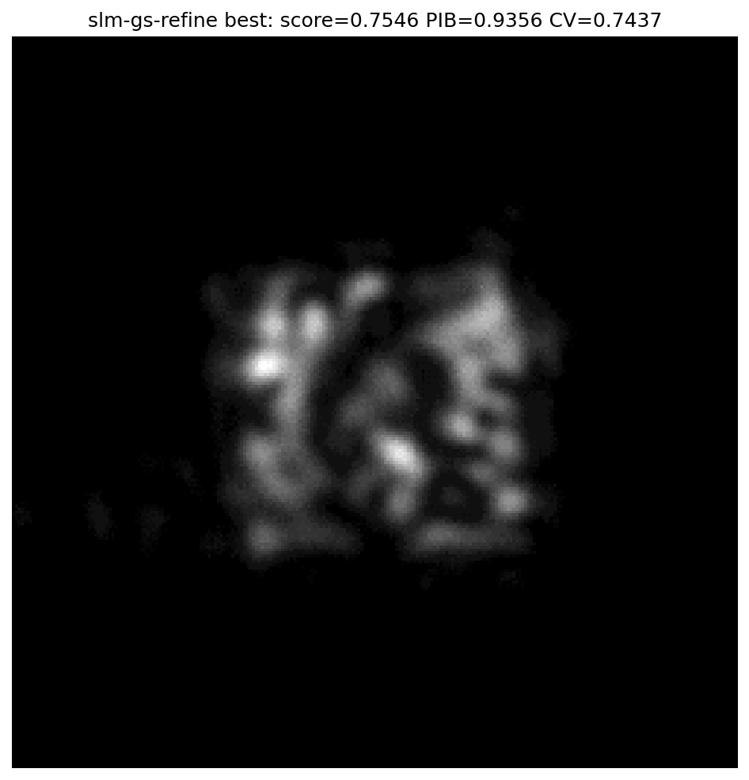
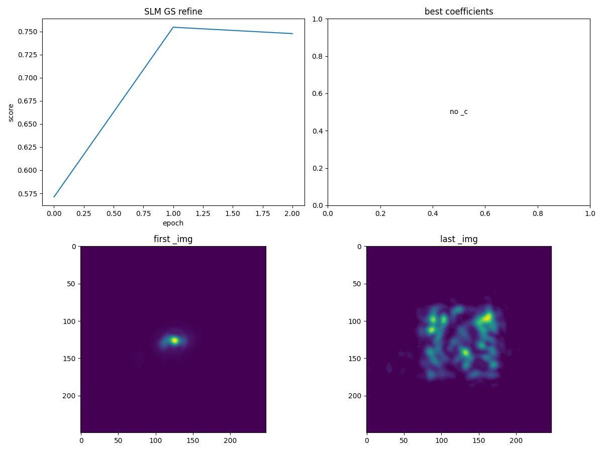

# 2026-10-10 在线方斑整形复测

Santec SLM `22030108` 与 Daheng CCD `FJB24112232` 在本次测试中均在线。
所有实机运行通过 `main.py` 子命令执行，使用固定 1 ms 曝光、100 x 100 像素目标；
优化测量每次平均 3 帧。各运行目录保存了标准 `--debug` PNG、PKL、JSON，
完整配置以目录中的 JSON 为准。SLM 在每次 GS 测试结束后恢复至原灰度 0。

## 已测结果

| 记录目录 | 条件与结果 |
| --- | --- |
| `device_flat_interleaved_average_20261010/` | 同一相机连接交错采集三帧批量均值和三次单帧软件均值，各五次。背景中位数都是 0.66667；CV 分别 2.93998/2.93873，箱内能量 0.69533/0.69461，Pearson 0.27406/0.27409。差异处于平场波动范围内；两组使用不同的实际帧。 |
| `hardware_fractional_baseline_20261010/` | `slm-pib spgd --objective shape --target-shape square --target-size 100 --n-max 15 --log-uniformity --w-uniformity 2 --epochs 24`，最佳轮次 5，shape 从 -2.453 升至 -1.918。 |
| `device_replay_wuniformity_paired_20261010/` | 均匀性权重 2 的相位重放 CV 2.240-2.265、Pearson 0.347-0.351、能量约 0.699；权重 4 的 CV 2.614-2.636、Pearson 0.302-0.304、能量约 0.688。提高权重没有帮助。 |
| `hardware_freeform_square_20261010/` | `spgd-square` 的 12 x 12 自由相位跑 24 轮，最佳仍为初始平场。该算法的 EE 与 `slm-pib` 箱内能量定义不同。 |
| `hardware_gs_centered_20261010/` | 全幅定位 0 级 `(x=668,y=1026)` 后再开 CCD 窗口。12 次 GS、padding 1：平场综合分 0.5726，GS 0.6880，PIB 0.8340、CV 0.8451。首次错误左上角开窗的运行已排除。 |
| `hardware_gs_100iter_20261010/` | padding 1 增至 100 次 GS，GS 分数 0.6803；增加迭代未优于 12 次。 |
| `hardware_gs_pad2_20261010/` | 12 次 GS、padding 2：平场 0.5713，GS 0.7195，一轮细化最佳 0.7225，PIB 0.8923、CV 0.8092。 |
| `hardware_gs_pad3_20261010/` | 12 次 GS、padding 3：平场 0.5712，GS 最佳 0.7546，PIB 0.9356、CV 0.7437。本批次最高综合分。 |
| `hardware_gs_pad4_20261010/` | 12 次 GS、padding 4：平场 0.5677，GS 0.7460，一轮细化最佳 0.7492，PIB 0.9217、CV 0.7336。综合分未继续提高。 |

## 图像与相位

以下 GIF 使用已有的 `scripts/generate_pearson_pkl_gif.py` 从对应 debug PKL 生成，
左侧为 CCD，右侧为 SLM 相位。GS 动画依次展示平场、GS、一次 SPGD 测量；
Zernike 动画从 24 轮中抽取 12 帧。该脚本**逐帧归一化 CCD 图像**，动画可用于观察
形状，不能用画面亮度跨帧比较能量。GS 使用 `--max-frames 3 --fps 2 --max-dim 512`，
Zernike 使用 `--max-frames 12 --fps 3 --max-dim 512`，输出目录均为 `figures/`。

GS 的最佳图像仍有分离的热点与空洞，**没有形成均匀的 100 x 100 像素方斑**。
GS 的 PIB/CV 综合分与 `slm-pib` 的 shape 分数不同，不跨算法直接排序；
各 padding 条件来自不同相机会话，也不能单凭分数归因。下一次应在同一连接内交错
重放平场与候选相位，并同时评价方框覆盖率、CV、PIB 和综合分。GS runner 的
`--debug`、相机开窗、原 SLM 显示状态恢复、正负测量记录和 GS 采纳提示已修复。
