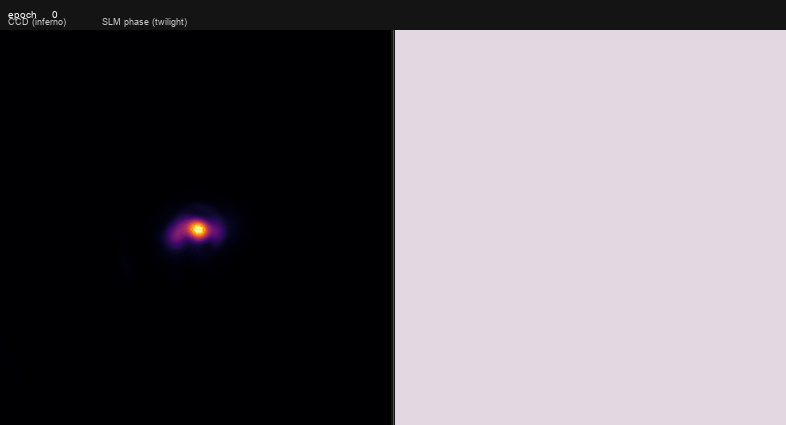
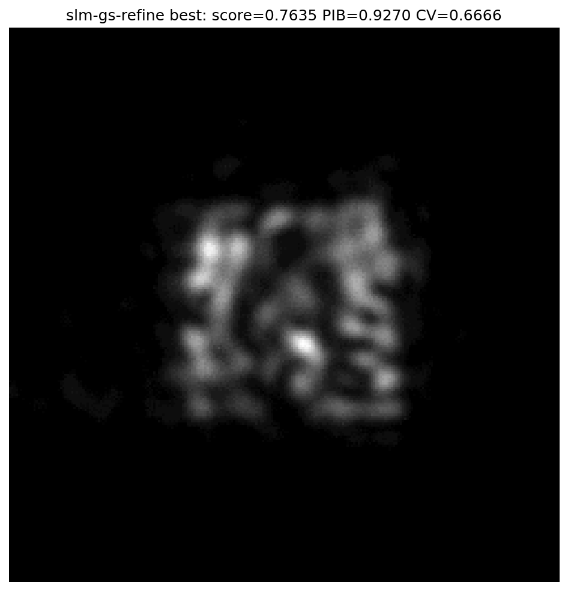
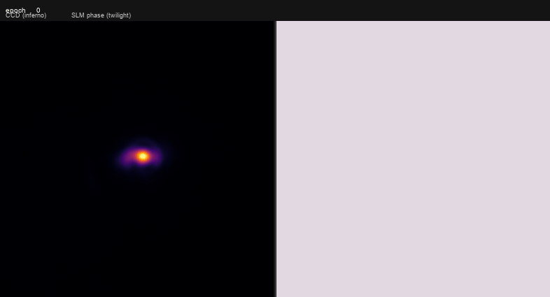
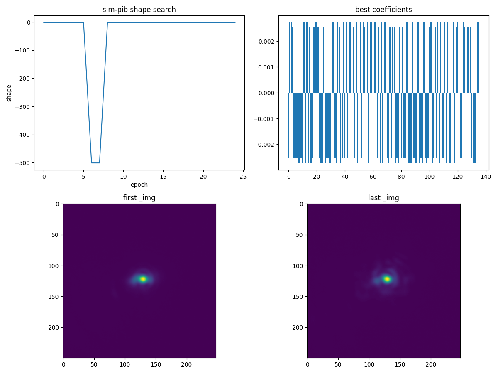

# 2026-10-10 在线方斑整形复测

Santec SLM `22030108` 与 Daheng CCD `FJB24112232` 在本次测试中均在线。
所有实机运行通过 `main.py` 子命令执行，使用固定 1 ms 曝光、100 x 100 像素目标；
优化测量每次平均 3 帧（`spgd-square` 的独立运行除外）。各运行目录保存了标准
`--debug` PNG、PKL、JSON，完整配置以目录中的 JSON 为准。SLM 在每次 GS 测试结束后
恢复至原灰度 0。

### 原始数据位置

本次隔离工作树中生成的实验原始数据已按原目录结构复制到主仓库
`report/shape_trials/`：55 个运行目录、216 个文件、4,595,377,197 字节。
包括本报告引用的 GS、Zernike SPGD、自由相位 SPGD，以及设备稳定性与相位重放记录。
迁移后逐文件核对了相对路径、字节数和 SHA-256，216 个文件全部一致。原始 PKL
受仓库 `*.pkl` 忽略规则约束，保存在主仓库工作目录中，**不随 Git 提交或推送**；
克隆仓库时只有报告和图像，离线复算需要这些本地数据。原目录仍保留作为迁移备份。

## 已测结果

| 记录目录 | 条件与结果 |
| --- | --- |
| `device_flat_interleaved_average_20261010/` | 同一相机连接交错采集三帧批量均值和三次单帧软件均值，各五次。背景中位数都是 0.66667；CV 分别 2.93998/2.93873，箱内能量 0.69533/0.69461，Pearson 0.27406/0.27409。差异处于平场波动范围内；两组使用不同的实际帧。 |
| `hardware_fractional_baseline_20261010/` | `slm-pib spgd --objective shape --target-shape square --target-size 100 --n-max 15 --log-uniformity --w-uniformity 2 --epochs 24`，最佳轮次 5，shape 从 -2.453 升至 -1.918。 |
| `device_replay_wuniformity_paired_20261010/` | 均匀性权重 2 的相位重放 CV 2.240-2.265、Pearson 0.347-0.351、能量约 0.699；权重 4 的 CV 2.614-2.636、Pearson 0.302-0.304、能量约 0.688。提高权重没有帮助。 |
| `hardware_freeform_square_20261010/` | `spgd-square` 的 12 x 12 自由相位跑 24 轮，最佳仍为初始平场。该算法的 EE 与 `slm-pib` 箱内能量定义不同。 |
| `hardware_gs_centered_20261010/` | 全幅定位 0 级 `(x=668,y=1026)` 后再开 CCD 窗口。12 次 GS、padding 1：平场综合分 0.5726，GS 0.6880，PIB 0.8340、CV 0.8451。首次错误左上角开窗的运行已排除。 |
| `hardware_gs_100iter_20261010/` | padding 1 增至 100 次 GS，GS 分数 0.6803；增加迭代未优于 12 次。 |
| `hardware_gs_pad2_20261010/` | 12 次 GS、padding 2：平场 0.5713，GS 0.7195，一轮细化最佳 0.7225，PIB 0.8923、CV 0.8092。 |
| `hardware_gs_pad3_20261010/` | 12 次 GS、padding 3：平场 0.5712，GS 0.7546，PIB 0.9356、CV 0.7437。旧 GIF 展示的就是这次 GS 帧。 |
| `hardware_gs_pad4_20261010/` | 12 次 GS、padding 4：平场 0.5677，GS 0.7460，一轮细化最佳 0.7492，PIB 0.9217、CV 0.7336。综合分未继续提高。 |
| `hardware_gs_pad3_refine24_20261010/` | 12 次 GS、padding 3、24 轮自由相位细化：平场 0.5720，GS 0.7509，细化第 19 轮最佳 0.7635，PIB 0.9270、CV 0.6666。这是本批次最高综合分，但图中仍有热点和空洞。 |
| `hardware_shape_coverage1_20261010/` | `slm-pib spgd`、5 x 5 覆盖率权重 1、24 轮：最佳 epoch 9，新 shape 分数 -1.6412，箱内能量 0.6610。按各帧最大点定位的分块覆盖率约 0.486，与旧权重 0 候选最佳帧的 0.486 基本相同；未见填框改善。 |

## 复现当前最佳记录

在完整项目环境、设备在线且光路保持本次状态时，从仓库根目录执行：

```powershell
uv run .\main.py --dir report/shape_trials/hardware_gs_pad3_refine24_20261010 --debug slm-gs-refine --cam-type daheng --cam-id 0 --exposure-time-ms 1 --cam-size 250 --slm-number 1 --slm-wavelength 1064 --target-side 100 --side-factor 1 --n-eval-frames 3 --gs-iters 12 --far-field-padding 3 --phase-grid 12 --epochs 24 --seed 0
```

旧 GIF 中视觉效果较好的 GS 帧使用相同参数，只把输出目录改为
`report/shape_trials/hardware_gs_pad3_20261010`，并将 `--epochs 24` 改为
`--epochs 1`。这两次属于不同相机会话，不能把分数差直接归因于细化轮数。
两次运行的完整参数均保存在各自 `debug/` 目录下的 JSON 中；随机种子只能固定
算法采样，不能消除硬件和光路状态变化。

## 图像与相位

以下 GIF 使用已有的 `scripts/generate_pearson_pkl_gif.py` 从对应 debug PKL 生成，
左侧为 CCD，右侧为 SLM 相位。GS 动画依次展示平场、GS、一次 SPGD 测量；
Zernike 动画从 24 轮中抽取 12 帧。该脚本**逐帧归一化 CCD 图像**，动画可用于观察
形状，不能用画面亮度跨帧比较能量。GS 使用 `--max-frames 3 --fps 2 --max-dim 512`，
Zernike 使用 `--max-frames 12 --fps 3 --max-dim 512`，输出目录均为 `figures/`。






新 GIF 由同一脚本以 `--max-frames 14 --fps 3 --max-dim 512` 生成。
用 debug PKL 的原始 CCD 数组，在各自固定的 100 x 100 像素目标框内计算：
旧 GIF 的 GS 帧有 4.2% 像素低于框内均值的 10%，26.9% 低于均值的 50%；
24 轮运行的最佳帧分别为 2.2% 和 26.1%。这些比例表明目标框已有较大范围受光，
但亮度分布仍不均匀。新运行的 5 x 5 分块能量重叠率为 0.859（1 为各块均匀），
不足以代表逐像素均匀。各帧曝光均为 1 ms、三帧平均。

## 待实机验证的评分项

对另一组 `hardware_fractional_baseline_20261010/` 原始 CCD 记录，四角背景中值约为
0.3333 count，占原始整帧积分约 20.2%–20.7%。按同一 ROI 扣背景并截零后，
epoch 0 的 CV 从 2.864 变为 3.004、盒内能量从 0.716 变为 0.825；
原最佳 epoch 5 的 CV 从 1.961 变为 2.058、盒内能量从 0.699 变为 0.807。
25 个记录的最佳轮次仍是 epoch 5。背景修正改变绝对量值，但没有单独解决均匀性。

新增的 `slm-pib spgd --w-coverage` 默认值为 0，仅在显式设定时为 `shape` 目标加入
5 x 5 分块覆盖率；该新增项先做四角背景中值扣除，旧评分不变。离线纯函数测试中，
均匀填满方框的覆盖率为 1，仅中心 20 x 20 像素亮斑为 0.04。
目标函数与工具测试 82 项、runner debug 测试 23 项、CLI 帮助测试 77 项均通过；
在线 24 轮测试确认该参数可运行，但**尚无填框改善证据**。旧运行最佳帧的
5 x 5 覆盖率约 0.486，新运行最佳帧约 0.486；两者来自不同会话，且新分数含额外
覆盖率奖励，不能直接比较两个 shape 分数。后续需在同一连接内交错重放权重 0/1
候选相位。新运行的 CCD 与 SLM 相位动画包含全部 25 条记录，debug 原始 PKL 留在
`hardware_shape_coverage1_20261010/`，未加入 Git。

```powershell
uv run .\main.py slm-pib spgd --dir report/shape_trials/hardware_shape_coverage1_20261010 --debug --cam-type daheng --cam-id 0 --exposure-time-ms 1 --cam-size 250 --slm-number 1 --objective shape --target-shape square --target-size 100 --n-max 15 --zernike-radius 600 --log-uniformity --w-uniformity 2 --w-coverage 1 --n-eval-frames 3 --epochs 24 --seed 0 --delta 0.05 --lr 1
```





运行时还发现 `slm-pib` 未继承顶层 `--debug/--dir`：首次把两项放在主命令前，
优化正常完成，但没有保存预期的 debug 文件。现已修复参数继承并补定向测试；
上面的复现命令仍把两项明确放在 `spgd` 后，适用于修复前后的版本。

GS 的最佳图像仍有分离的热点与空洞，**没有形成均匀的 100 x 100 像素方斑**。
GS 的 PIB/CV 综合分与 `slm-pib` 的 shape 分数不同，不跨算法直接排序；
各 padding 条件来自不同相机会话，也不能单凭分数归因。下一次应在同一连接内交错
重放平场与候选相位，并同时评价方框覆盖率、CV、PIB 和综合分。GS runner 的
`--debug`、相机开窗、原 SLM 显示状态恢复、正负测量记录和 GS 采纳提示已修复。

## 为什么本次 SPGD 没有达到 GS 的效果

为消除两套优化器内部分数定义不同的影响，统一从四组 debug PKL 的原始 CCD 数组
复算。每组以该组**平场帧的峰值**固定 100 x 100 像素目标框，之后同组所有帧沿用
该框；以四角中位数扣除背景并截零。比较各自原优化目标选出的最佳帧，而非重新挑选
最有利于某一指标的帧。四组均为 1 ms 曝光、每次平均 3 帧。

| 原始记录和候选帧 | 盒内能量 PIB | 框内 CV（越低越好） | 5 x 5 能量覆盖率 |
| --- | ---: | ---: | ---: |
| `hardware_fractional_baseline_20261010/`，Zernike SPGD epoch 5 | 0.8072 | 2.0587 | 0.4832 |
| `hardware_shape_coverage1_20261010/`，Zernike SPGD epoch 9 | 0.7811 | 2.3512 | 0.4857 |
| `hardware_gs_pad3_20261010/`，GS 帧 | 0.9356 | 0.7437 | 0.8368 |
| `hardware_gs_pad3_refine24_20261010/`，细化 epoch 19 | 0.9270 | 0.6666 | 0.8587 |

覆盖率把目标框划成 5 x 5 块，计算各块能量占比与均匀目标的重叠率；1 表示每块
各有 1/25 的框内能量。各组平场的覆盖率为 0.318–0.357。两次 Zernike SPGD
的最佳帧都比各自平场有所改善，但仍主要把能量集中于框中少数区域。加入覆盖率奖励
后，实测覆盖率从 0.4832 到 0.4857，跨会话差异不足以证明奖励有效。
以上数值可在主仓库根目录用只读脚本复算（读取本地原始 PKL，不连接设备）：

```powershell
uv run python scripts/compare_shape_debug.py report/shape_trials/hardware_fractional_baseline_20261010 report/shape_trials/hardware_shape_coverage1_20261010 report/shape_trials/hardware_gs_pad3_20261010 report/shape_trials/hardware_gs_pad3_refine24_20261010
```

最直接的算法差别是**起点和可表达相位**。GS 用已知的光路模型与目标方框做傅里叶
逆设计，在约 900 x 900 像素的受光瞳孔上生成自由相位，再经实测验收；Zernike SPGD
从平场出发，只搜索 `n_max=15` 的 136 个低阶模式。低阶平滑相位很难产生并独立
调节 100 x 100 方框的边缘和内部细节。24 轮随机正负扰动也远不足以证明该搜索
空间已收敛。12 x 12 自由相位的 `spgd-square` 虽有 144 个变量，本次同样从平场
只跑 24 轮，最佳仍为平场；这说明增加少量自由度本身也不能代替有物理先验的起点。

测量链路同样影响可辨认的梯度：GS 细化使用 3 帧平均和稳态判定，而本次
`spgd-square` 用单帧和固定等待。两者不是同等噪声条件。GS debug JSON 中的
`lr: 0.0` 是**自动学习率标记**，不是停更：`_lr_at()` 将其换算为初始 0.0525，
运行 CSV 记录随余弦调度降至 0.002625；24 轮细化确实更新了相位。
同次 GS 帧的综合分为 0.7509，细化最佳为 0.7635，差值约 0.0126；
最佳相位未做同会话重复测量，尚不能确认这点提升超过测量波动。

以上结果支持“GS 起点和相位表达能力是主要差别”，但四组来自不同相机会话，
不能把数值差全部归因于算法。下一轮实机应在同一连接中交错重放上述候选相位，
并测试以 GS 相位初始化、匹配帧数和稳态等待的自由相位 SPGD；目前设备下线，
尚未执行这一步。
