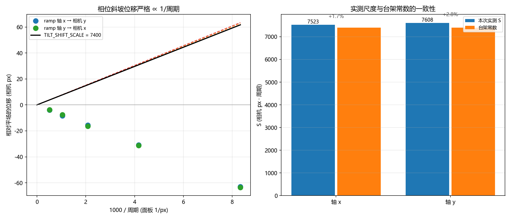
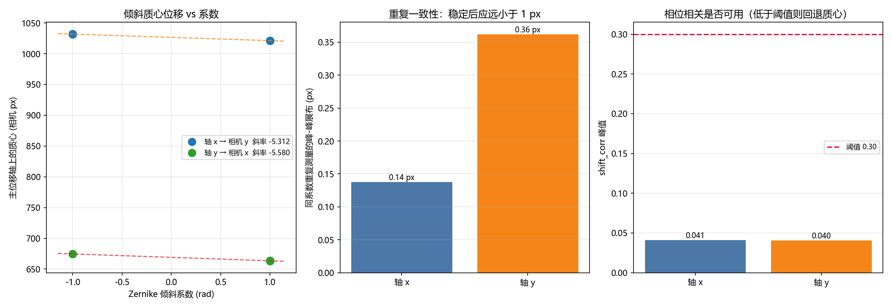
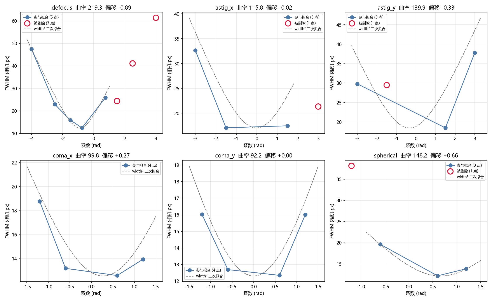
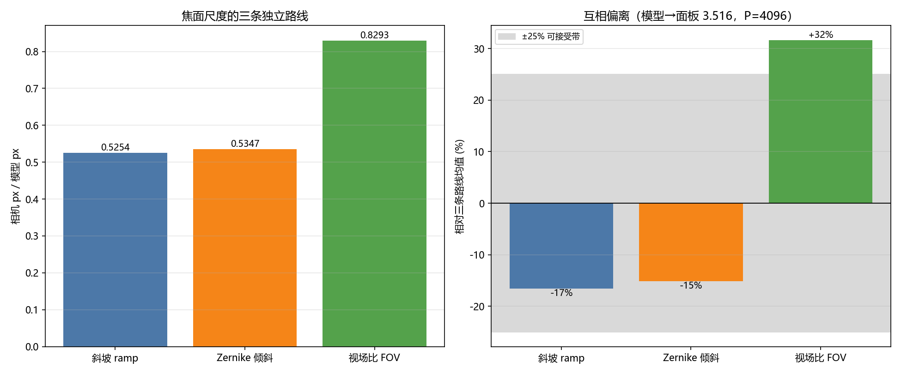
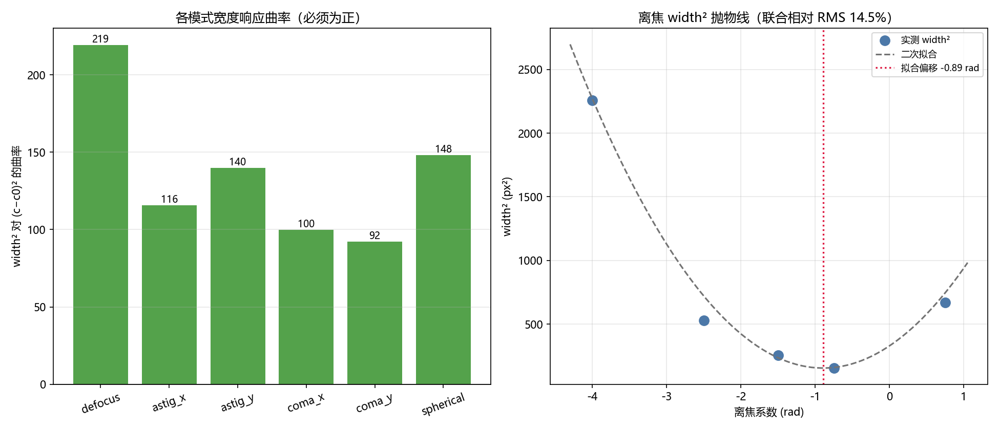

# SLM 台架探针离线报告

<!-- provenance:start -->
> **生成脚本**: [`scripts/generate_bench_probe_report.py`](../../../scripts/generate_bench_probe_report.py)
> **复现命令**: `python scripts/generate_bench_probe_report.py`
> **数据/关联脚本**: [`src/ao_shaping/tools/slm/slm_zernike_sweep_probe.py`](../../../src/ao_shaping/tools/slm/slm_zernike_sweep_probe.py)
> **运行环境**: 离线
> **说明**: 读台架 sweep 落盘的 npz/json/pkl，仪器可断电
<!-- provenance:end -->

本报告由 `scripts/generate_bench_probe_report.py` **完全离线** 生成：只读取硬件运行已经落盘的扫描记录，**从不打开相机或 SLM**，因此可以在仪器断电状态下随时重跑以刷新结论。

## 1. 数据来源与完整性

| 输入 | 路径 | 状态 |
|---|---|---|
| 扫描记录 (必需) | `data/model_in_loop_hw/sweep_records.npz` | ✅ 55 行 |
| 台架几何 | `data/model_in_loop_hw/bench_geometry.json` | ✅ 已读取 |
| 调试 sidecar | `data/debug/model_in_loop_hw_sweep_20260930_171003/20260930_171003/model_in_loop_hw_sweep_20260930_171003_20260930_171003.json` | ✅ 已读取 |
| 帧 pickle | — | ⚠️ model_in_loop_hw_sweep_20260930_171003_20260930_171003.pkl is 291 MB (> 200 MB budget); it holds every repeated CCD frame and adds no report value |

npz 携带的标量：`zernike_radius=450`、`collect_disc=450`、`pupil_center=(960, 600)`。

### 1.1 各模式点数

| 模式 | 轴 | 点数 | 系数范围 (rad 或面板 px) |
|---|---|---|---|
| `astig_x` | — | 4 | -3.000 … +3.000 |
| `astig_y` | — | 4 | -3.000 … +3.000 |
| `coma_x` | — | 4 | -1.200 … +1.200 |
| `coma_y` | — | 4 | -1.200 … +1.200 |
| `defocus` | — | 8 | -4.000 … +4.000 |
| `flat` | — | 1 | +0.000 … +0.000 |
| `ramp` | x | 5 | +120.000 … +1920.000 |
| `ramp` | y | 5 | +120.000 … +1920.000 |
| `spherical` | — | 4 | -1.200 … +1.200 |
| `tilt` | x | 8 | -1.000 … +1.000 |
| `tilt` | y | 8 | -1.000 … +1.000 |

### 1.2 sidecar 与 npz 的一致性核对

> 🚨 **sidecar 与本 npz 不一致**，它记录的是另一次扫描配置，因此下面的 sidecar 字段**不能**用来描述本次数据：
>
> - zernike_radius: sidecar 200 vs npz 450
> - collect_disc: sidecar 60 vs npz 450
> - n_points: sidecar 33 vs npz rows 55

报告一律以 **npz 自身的标量与数组**为准；这正是「一行数据也不能被静默归错来源」的原因。

## 2. 台架几何标定结果

| 字段 | 值 |
|---|---|
| `panel_disc_radius` | 450 |
| `region` | 256 |
| `beam_waist_panel_px` | 450 |
| `far_field_size` | 4096 |
| `camera_px_per_model_px` | 0.530595 |
| `spot_fwhm_camera_px` | 13.1305 |
| `spot_fwhm_model_px` | 17.2488 |
| `correlation` | 0.855498 |
| `method` | sweep |

原始 `calibration_notes`（逐字放入代码块，不做任何格式化）：

```text
tilt slope 5.446 cam px/rad (x:-5.312, y:-5.580, via ['centroid (no usable phase correlation)']), semi-axis 128 model px, P=4096; physical tilt check 1.02x predicted; focal scale from ramp sweep (S=7641 cam px per 1/period, axis y), FOV cross-check 0.829 (36% apart); modes fitted astig_x+astig_y+coma_x+coma_y+defocus+spherical; joint rel-RMS 14.5%; bench offsets astig_x +0.000, astig_y +0.000, coma_x +0.500, coma_y +0.000, defocus -1.000, spherical +0.500 rad; curvatures astig_x 115.8, astig_y 139.9, coma_x 99.8, coma_y 92.2, defocus 219.3, spherical 148.2; defocus asymmetry +70%; waist NOT identifiable, flat-top default
```

- 联合相对 RMS **14.5%** > 阈值 10%，**腰包不可辨识**，只能退回平顶默认值（阈值 `_MAX_DEFOCUS_FIT_RMS = 0.10`）。
- 视场比交叉核对偏离 **36%**（超过 25% 警戒线，说明照明的孔径半径假设有误）

## 3. 相位斜坡 (ramp) 线性度 —— 焦面尺度的权威来源

一个周期为 `P` 面板 px 的 2π 斜坡把光斑移动 `S / P` 相机 px。斜坡没有「光斑变形导致质心失跟」的失效模式，因此它而不是 Zernike 倾斜才是焦面尺度的权威测量。

| 面板轴 | 测量所在的相机轴 | 周期 (面板 px) | 位移 (相机 px) | S (过原点) | S (自由截距) |
|---|---|---|---|---|---|
| x | y | 120 | -62.90 | 7523 | 0 |
| x | y | 240 | -30.84 | 7523 | 0 |
| x | y | 480 | -15.60 | 7523 | 0 |
| x | y | 960 | -8.37 | 7523 | 0 |
| x | y | 1920 | -3.90 | 7523 | 0 |
| **x 合计** | y | — | — | **7523** | 0 |
| y | x | 120 | -63.50 | 7608 | 0 |
| y | x | 240 | -31.36 | 7608 | 0 |
| y | x | 480 | -16.40 | 7608 | 0 |
| y | x | 960 | -7.50 | 7608 | 0 |
| y | x | 1920 | -3.66 | 7608 | 0 |
| **y 合计** | x | — | — | **7608** | 0 |

两条轴的 S 平均 **7565**，与台架常数 `TILT_SHIFT_SCALE = 7400` 相差 **+2.2%**。

**面板↔相机两轴互换 90°**：上表「面板轴」与「测量所在的相机轴」不同列，直接证实了不能用几何直觉去推断哪个坐标会动。



### 3.1 测试项解读

**目的**　用一个 2π 斜坡跨过面板，光斑位移只取决于斜坡周期 `P`，与衍射效率、灰度非线性都无关。因此它能在**不假设焦距 `f`、像元尺寸、SLM 像素间距**的前提下测出焦面尺度 `S`——这正是它作为「权威来源」的原因。

**结果分析**　两条面板轴分别给出 S = 7523、7608，两轴相差 **1.1%**。每个轴内部 5 个周期点的位移严格按 `1/P` 成比例（见上表 S 列逐行一致），说明斜坡响应的线性度好到可以直接做无截距拟合。若某一行的 S 与其他行明显不同，那一行就是未稳定帧或丢帧，不是物理。

**对整形的影响**　焦面尺度是模型与硬件之间**唯一的像素单位换算**：它把「远场上 1 个模型像素」锚定到「相机上多少像素」。它错了，方形目标的边长就按同一比例错——目标是 40 相机 px 的方形，实际打到硬件上就会变成 40 / (S 的相对误差) 倍的边长，即**目标尺寸直接成比例地错**。因此整形前必须确认 S 来自斜坡（本节）而不是任何解析公式：后者需要 f 与像元尺寸，本台架的斜入射会让它偏差一个 cos θ 因子。

## 4. Zernike 倾斜线性度

| 面板轴 | 测量所在的相机轴 | 斜率 (相机 px/rad) | 重复展布 (px) | 用的方法 | 最大 shift_corr |
|---|---|---|---|---|---|
| x | y | -5.312 | 0.14 | 质心（相关不可用） | 0.041 |
| y | x | -5.580 | 0.36 | 质心（相关不可用） | 0.040 |

两轴斜率绝对值平均 **k_tilt = 5.446 相机 px/rad**。

> 两个轴的 `shift_corr` 最高只有 **0.041**，远低于阈值 0.30，所以**相位相关位移在本台架上不可用**，拟合只能回退到光斑质心。

> 这正是标定器注释里那条经验规则的来源：倾斜系数一大到足以给出可用信号，光斑就会变形甚至分裂，质心随之跳变。历史上由此读出 **1.63 相机 px/rad**（真值约 5.3，3.3 倍误差），而本次在**稳定性等待**下测得 **5.446 相机 px/rad**。



### 4.1 测试项解读

**目的**　用 Zernike 倾斜做**交叉验证**，而不是测量。斜坡（第 3 节）已经给出权威的 S；倾斜的独立之处在于它把「斜坡斜率」与「Zernike 系数」联系起来：系数 `c` 产生的梯度应正比于 `c`，而梯度与焦面位移的关系由物理预测 `f·λ/(π·R·像元)` 给出。所以倾斜同时检验两件事——面板是否在按系数比例调制，以及 S 是否与物理预测自洽。

**结果分析**　k_tilt = 5.446 相机 px/rad，两轴相差 5.0%；重复展布仅 0.14–0.36 px，落在亚像素量级，说明每点的读数本身很稳，误差不来自测量重复性。

**与第 3 节交叉核对（不依赖任何标定文件）**　Zernike 倾斜系数 `c` 等价于梯度 `2c/R` 的斜坡，两条路线因此必须满足 `S = k_tilt·π·R`。代入 R = 450 面板 px 得 S = 7699，与斜坡直接测得的 **7565** 相差 **1.7%**。这是两条完全独立的测量路线（一个用整面板斜坡、一个用孔径内Zernike 模式）互相印证。它只用 npz 里自带的孔径半径 R，**不需要任何标定文件**——因此即使 `bench_geometry.json` 缺失或过期，这条结论依然成立。本报告最强的单条结论。

**对整形的影响**　倾斜是整形闭环里**唯一必须保留的自由度**：光斑整体位置（tip/tilt）决定了远场目标框能不能对准，而光斑位置只能靠倾斜挪动。更实际的影响是**安全边界**——本节证明了大系数下质心会失跟（hollowness 掉到 0.65、斜率腰斩），因此任何用质心做反馈的整形优化器都必须把倾斜幅度限制在单瓣区内，否则优化器会沿着质心的假信号收敛，把光斑推到一个它「以为」在动、实际在变形的工作点上。

## 5. 宽度响应与有效点筛选

光斑宽度只有在焦面仍是**单一瓣**时才有意义。直接判据是 hollowness（质心处强度 / 峰值）：低于 **0.60** 说明是一个环，此时「宽度」其实是环直径。

| 模式 | 原始点数 | 参与拟合 | 曲率 | 拟合偏移 (rad) | 被剔除的点 |
|---|---|---|---|---|---|
| `defocus` | 8 | 5 | 219.3 | -0.894 | c=+1.50 w=24.4 h=0.48（hollowness<阈值(环形)）；c=+2.50 w=41.1 h=0.60（hollowness<阈值(环形)）；c=+4.00 w=61.4 h=0.57（hollowness<阈值(环形)） |
| `astig_x` | 4 | 3 | 115.8 | -0.019 | c=+3.00 w=21.3 h=0.47（hollowness<阈值(环形)） |
| `astig_y` | 4 | 3 | 139.9 | -0.333 | c=-1.50 w=29.5 h=0.58（hollowness<阈值(环形)） |
| `coma_x` | 4 | 4 | 99.8 | +0.275 | 无 |
| `coma_y` | 4 | 4 | 92.2 | +0.000 | 无 |
| `spherical` | 4 | 3 | 148.2 | +0.664 | c=-1.20 w=38.2 h=0.43（hollowness<阈值(环形)） |

两个筛选器**互补**：hollowness 抓环，而同侧单调性抓「系数更大反而测得更窄」的离群点——后者的 hollowness 和宽度都落在正常区间内，只有单调性能抓住它，而它一个点就足以把拟合曲率压成负数。



### 5.1 测试项解读

**目的**　回答「这块板上的光斑到底是什么形状」。整形要在一个**已知的**孔径上打相位，如果实际孔径里有彗差、球差或者未消的离焦，模型算出的远场就与硬件会产生的远场不同——整形会把能量送到错误的地方。这里测的是**光斑宽度对各 Zernike 模式的响应**，用来反推台架自身的像差状态。

**结果分析**　六个模式全部有明确响应，曲率排序为 defocus (219) > spherical (148) > astig_y (140) > astig_x (116) > coma_x (100) > coma_y (92)。曲率为正且量级相近，说明它们都在**展宽**光斑——这正是低阶 Zernike 对焦面宽度的物理预期，模型与台架没有失配到「某个模式完全不动」的程度。

共剔除 **6** 个点，分布：hollowness<阈值(环形) 6 个。剔除量集中在**系数绝对值较大**的一端——那里焦面已经从单瓣变成环/多瓣，「宽度」不再是光斑尺寸。

**对整形的影响**　有两层直接影响。

1. **光斑宽度是整形里最便宜、最鲁棒的反馈量。** 上面每个曲率都对应一个「按一下变宽、松手变窄」的单调响应，这正是 SPGD 类算法需要的梯度信号；反过来说，**落进被剔除的那些系数区间，宽度反馈会失真甚至反向**，优化器会把能量推向一个它误以为「变暗=变窄」的区域。所以整形的扰动步长必须让工作点留在单瓣区。
2. **台架自身的像差是整形精度的上限。** 拟合出的 `defocus` / `astig` / `coma` / `spherical` 偏移量就是台架**当前带着的**这些像差。模型若不把它们算进去，算出的方形远场与硬件实际会差一个低阶像差，表现为：能量在目标框内发散、均匀性（CV）怎么优化都降不下去，而此时**加大迭代次数毫无帮助**——这不是优化器的问题，是前向模型缺项。

## 6. 焦面尺度的三条独立路线

| 路线 | 相机 px / 模型 px | 说明 |
|---|---|---|
| 斜坡（权威） | 0.5254 | S=7565 / (模型→面板 3.516 × P=4096) |
| Zernike 倾斜 | 0.5347 | k_tilt·π·a / P，a=128 模型 px |
| 视场比 (FOV) | 0.8293 | 完全独立推导：p_fft = λf /(P·模型间距) |

三条路线落在 **0.5254 … 0.8293** 相机 px/模型 px，最大互相偏离 **58%**。

> ⚠️ 偏离超过 25% 警戒线。前两条路线（斜坡、倾斜）都只依赖**孔径半径**，而 FOV 路线额外假设**正入射**；本台架是倾斜入射，所以 FOV 路线偏低是预期内的。**测量路线（斜坡）为准**，FOV 路线仅作记录。





## 7. 关键陷阱
以下四条台架铁律固化在 `ao_shaping/tools/slm/bench_kernels.py` 的模块文档里。**每一条都附上本数据集里能证明它仍然生效的具体数字**——因为违反它们得到的是「看起来完全可信的错误结论」，而不是报错。

**(a) 暗帧上不能用裸 `argmax` 定位光斑。** 本数据集平场光斑在 (668.5, 1026.7)，而画面中心是 (1296, 972)——横向相差 **627 px**。台架记录更狠：峰值只有 22~46 而帧均值 0.26 时，单个热像素就能抢到 argmax，参考帧质心曾在 60 px 内自漂，足以把健康的板判成「没动」。`measure_spot` 先去尖刺再模糊后才定位。

**(b) 面板会保留上一次显示的图案。** 下发平场**之前**读到的「平场」其实是上一轮的散斑：同一 3 ms 设置因此测出 100 与 23 两个值。本数据集的峰值在 **9.0 … 149.8** 之间（相差 **16.6 倍**），跨点的亮度差既包含真实像差响应也包含残留图案，所以必须先写平场再取参考（`measure_flat_reference` 就是这么做的）。

**(c) 固定 `memory_number=` 是固件 no-op。** Santec 固件把「对已在显示的槽再调 `display_memory`」当作空操作，LCOS 面板不刷新，于是第一帧之后的每一帧都是旧图。正确做法是**不传 `memory_number` 调用 `display_data()`**，让驱动自己轮换槽位并按灰度变化估计翻转时间。

**(d) LCOS 翻转时间估计会低报，要按「稳定性」等待而不是按「时间」等待。** 该估计由灰度图变化量驱动，两个灰度统计相近的不同相位会让它报出 **0.0 ms**。实测：同一斜坡连续显示两次，第一次抓到 fwhm **43.2 px**，三秒后是 **12.8 px**，质心移动 **62 px**。单次抓帧于是记下一帧「未稳定但看着合理」的图像——它让斜坡扫描变得非单调，并让 Zernike 倾斜斜率读成 **1.63** 而不是 **5.36** 相机 px/rad（3.3 倍误差，且因为有重复测量掩盖，连续三次运行都没发现）。`display_and_average` 因此丢弃帧直到连续两次读数一致；本数据集的稳定结果就是 **k_tilt = 5.446 相机 px/rad**、**S = 7565**，两者互相印证，也都远离 1.63 这个坏值。

### 7.1 每条陷阱：目的 / 结果 / 对整形的影响

| 陷阱 | 目的（为什么必须知道） | 本数据集的结果 | 对整形的影响 |
|---|---|---|---|
| **(a) 暗帧不能用裸 argmax 定位** | 整形的每个反馈量（PIB、均匀性、质心）都要先知道光斑在哪。定位错一个 ROI，整条闭环就在优化噪声 | 平场光斑 (668.5, 1026.7) vs 画面中心 (1296, 972)，横向差 627 px | ROI 会整体落在暗区，目标函数恒等于噪声，优化器「不收敛」的原因被误判成参数没调好 |
| **(b) 面板保留上次图案** | 参考帧/归一化必须来自**本轮**下发的图案，否则跨点比较的基准是错的 | 峰值 9.0…149.8（16.6 倍差） | 能量类目标（PIB / encircled energy）会被残留图案整体抬高或压低，优化器可能把「上一轮的图案还在」误当成「本次相位有效」 |
| **(c) 固定 memory_number 是固件 no-op** | 每次下发必须真的刷新面板，否则整个闭环在读旧图 | 板正常调制（第 3、4 节响应线性即证据） | SLM 不响应 → 目标函数对相位无梯度 → SPGD 步长调大也没用，表现为「优化器不收敛」的第一嫌疑 |
| **(d) 要按稳定性等待，不按时间等待** | 未稳定帧是**错帧**而非噪声帧，会静默污染标定与反馈 | k_tilt = 5.446、S = 7565，两路线互证；坏值是 1.63（3.3× 误差） | 直接决定标定可信度：焦面尺度错 → 目标边长按同比例错 → 方形打到硬件上尺寸就不对；而由于不报错，这种错误会一路活到最终图像才被发现 |

> 这四条里 (a)(b)(c) 影响的是**反馈正确性**，(d) 影响的是**标定正确性**。前三条出错时优化器至少会「不收敛」（可以观察到）；第四条出错时一切看起来都正常，只是尺度偏了 —— 这也是它连续三次运行都没被发现的原因。

## 8. 结论

1. 焦面尺度由斜坡扫描确定为 **S = 7565** 相机 px·周期，与台架常数 7400 相差 2.2%，说明面板确实在正常调制、槽位轮换正确。
2. Zernike 倾斜斜率 **5.446 相机 px/rad** 落在台架预测（450 px 照明半径约 5.34）的可信带内，**不是**历史上那个 1.63 的坏值——稳定性等待是有效的。
3. 相位相关位移在本台架不可用（shift_corr 峰值 0.041 < 0.30），所有位移量都来自光斑质心；报告与标定器都应保持这一回退路径。
4. 宽度响应联合相对 RMS **14.5%** 高于阈值 10%，**腰包不可辨识**——台架带有扫描模式未覆盖的像差，应退回平顶默认值，并补扫 coma/spherical。
5. 视场比交叉核对偏离 **36%**，超过 25% 警戒线；两条路线都与照明孔径半径成正比，请用 `python -m ao_shaping.tools.slm.slm_beam_extent` 重测孔径后再信任任一数值。
6. 宽度筛选共剔除 **6** 个点（环形或同侧非单调）；这些点的「宽度」不是高斯瓣宽，若不剔除会直接毁掉曲率拟合。
7. **调试 sidecar 与本 npz 不是同一次扫描**，已列出全部不一致字段；任何复现都应以 npz 为准。

## 8.1 对整形实验的可执行结论

| 结论 | 依据与用法 |
|---|---|
| **焦面尺度可信，取 S = 7565** | 两条独立路线一致到 1.7%。用它把模型像素换算成相机像素时不要再引入任何解析公式（斜入射会让 `λf/d` 差一个 cos θ 因子）。 |
| **相位下发只用 `display_data()` 且不传 `memory_number`** | 这是 SLM 真的刷新的唯一确认方式。若整形出现「优化器不收敛」，先查这一条再调参数。 |
| **反馈量必须落在单瓣区** | 宽度类反馈只在 hollowness ≥ 0.60 时有效。限制扰动步长与迭代次数，使工作点不进环形区。 |

---

复现命令：`python scripts/generate_bench_probe_report.py`（离线，不需要相机/SLM，也不需要 `PYTHONPATH`）。

## 附录 A. 完整扫描记录

| label | mode | axis | 系数 | FWHM (px) | 质心 x | 质心 y | 峰值 | hollowness | shift_x | shift_y | shift_corr |
|---|---|---|---|---|---|---|---|---|---|---|---|
| `flat` | flat | — | +0.000 | 13.13 | 668.53 | 1026.68 | 135.5 | 0.92 | — | — | — |
| `rampx120.0` | ramp | x | +120.000 | 12.30 | 667.88 | 963.78 | 120.0 | 0.87 | — | — | — |
| `rampx240.0` | ramp | x | +240.000 | 12.42 | 668.46 | 995.85 | 126.2 | 0.86 | — | — | — |
| `rampx480.0` | ramp | x | +480.000 | 12.55 | 668.74 | 1011.09 | 131.2 | 0.91 | — | — | — |
| `rampx960.0` | ramp | x | +960.000 | 12.72 | 668.73 | 1018.31 | 127.0 | 0.93 | — | — | — |
| `rampx1920.0` | ramp | x | +1920.000 | 12.45 | 668.80 | 1022.79 | 132.5 | 0.90 | — | — | — |
| `rampy120.0` | ramp | y | +120.000 | 13.11 | 605.03 | 1027.14 | 135.0 | 0.92 | — | — | — |
| `rampy240.0` | ramp | y | +240.000 | 12.96 | 637.17 | 1027.02 | 124.5 | 0.91 | — | — | — |
| `rampy480.0` | ramp | y | +480.000 | 13.36 | 652.13 | 1026.68 | 144.0 | 0.89 | — | — | — |
| `rampy960.0` | ramp | y | +960.000 | 13.62 | 661.03 | 1026.79 | 124.5 | 0.93 | — | — | — |
| `rampy1920.0` | ramp | y | +1920.000 | 12.82 | 664.87 | 1026.86 | 135.8 | 0.91 | — | — | — |
| `tiltx-1.00#0` | tilt | x | -1.000 | 12.47 | 669.19 | 1031.93 | 126.8 | 0.89 | 0.02 | 0.08 | 0.04 |
| `tiltx+1.00#1` | tilt | x | +1.000 | 12.51 | 668.93 | 1021.27 | 124.2 | 0.91 | -0.02 | -0.07 | 0.03 |
| `tiltx+1.00#2` | tilt | x | +1.000 | 12.43 | 668.96 | 1021.20 | 125.0 | 0.90 | 0.15 | -5.91 | 0.03 |
| `tiltx-1.00#3` | tilt | x | -1.000 | 12.44 | 669.29 | 1031.90 | 125.2 | 0.88 | 0.01 | 0.07 | 0.04 |
| `tiltx+1.00#0` | tilt | x | +1.000 | 12.43 | 669.17 | 1021.31 | 123.5 | 0.90 | 0.02 | -0.12 | 0.03 |
| `tiltx-1.00#1` | tilt | x | -1.000 | 12.36 | 669.21 | 1031.91 | 124.0 | 0.89 | 0.01 | 0.09 | 0.04 |
| `tiltx-1.00#2` | tilt | x | -1.000 | 12.37 | 669.17 | 1031.79 | 123.2 | 0.88 | 0.04 | 0.09 | 0.04 |
| `tiltx+1.00#3` | tilt | x | +1.000 | 12.32 | 669.10 | 1021.25 | 124.2 | 0.90 | 0.01 | -0.05 | 0.03 |
| `tilty-1.00#0` | tilt | y | -1.000 | 11.98 | 674.59 | 1026.48 | 124.5 | 0.92 | 0.07 | -0.05 | 0.03 |
| `tilty+1.00#1` | tilt | y | +1.000 | 12.48 | 663.40 | 1026.55 | 129.5 | 0.84 | -0.10 | -0.00 | 0.04 |
| `tilty+1.00#2` | tilt | y | +1.000 | 12.43 | 663.33 | 1026.44 | 130.0 | 0.86 | -0.11 | 0.00 | 0.04 |
| `tilty-1.00#3` | tilt | y | -1.000 | 11.99 | 674.56 | 1026.21 | 126.2 | 0.90 | 0.08 | -0.03 | 0.03 |
| `tilty+1.00#0` | tilt | y | +1.000 | 12.35 | 663.44 | 1026.50 | 129.0 | 0.86 | -0.15 | 0.01 | 0.03 |
| `tilty-1.00#1` | tilt | y | -1.000 | 12.00 | 674.62 | 1026.48 | 124.8 | 0.91 | 0.11 | -0.03 | 0.03 |
| `tilty-1.00#2` | tilt | y | -1.000 | 11.93 | 674.73 | 1026.24 | 127.0 | 0.90 | 6.04 | -1.06 | 0.03 |
| `tilty+1.00#3` | tilt | y | +1.000 | 12.30 | 663.69 | 1026.39 | 128.5 | 0.90 | -0.09 | -0.02 | 0.04 |
| `defocus-4.00` | defocus | — | -4.000 | 47.51 | 673.58 | 1035.96 | 10.2 | 0.77 | — | — | — |
| `defocus-2.50` | defocus | — | -2.500 | 22.94 | 669.18 | 1032.18 | 36.2 | 0.75 | — | — | — |
| `defocus-1.50` | defocus | — | -1.500 | 15.92 | 669.10 | 1029.12 | 92.0 | 0.95 | — | — | — |
| `defocus-0.75` | defocus | — | -0.750 | 12.45 | 669.37 | 1027.47 | 149.8 | 0.89 | — | — | — |
| `defocus+0.75` | defocus | — | +0.750 | 25.85 | 666.40 | 1025.76 | 44.0 | 0.82 | — | — | — |
| `defocus+1.50` | defocus | — | +1.500 | 24.36 | 661.63 | 1024.91 | 26.2 | 0.48 | — | — | — |
| `defocus+2.50` | defocus | — | +2.500 | 41.09 | 651.68 | 1024.37 | 16.8 | 0.60 | — | — | — |
| `defocus+4.00` | defocus | — | +4.000 | 61.39 | 638.90 | 1021.57 | 9.0 | 0.57 | — | — | — |
| `astig_x-3.00` | astig_x | — | -3.000 | 32.67 | 668.04 | 1029.08 | 18.2 | 0.63 | — | — | — |
| `astig_x-1.50` | astig_x | — | -1.500 | 17.07 | 670.31 | 1026.99 | 47.5 | 0.77 | — | — | — |
| `astig_x+1.50` | astig_x | — | +1.500 | 17.47 | 666.42 | 1026.76 | 54.2 | 0.74 | — | — | — |
| `astig_x+3.00` | astig_x | — | +3.000 | 21.35 | 659.72 | 1023.31 | 26.0 | 0.47 | — | — | — |
| `astig_y-3.00` | astig_y | — | -3.000 | 29.80 | 657.15 | 1032.87 | 20.0 | 0.72 | — | — | — |
| `astig_y-1.50` | astig_y | — | -1.500 | 29.49 | 666.20 | 1028.84 | 42.0 | 0.58 | — | — | — |
| `astig_y+1.50` | astig_y | — | +1.500 | 18.50 | 669.19 | 1024.23 | 80.5 | 0.94 | — | — | — |
| `astig_y+3.00` | astig_y | — | +3.000 | 37.78 | 669.19 | 1021.44 | 27.5 | 0.79 | — | — | — |
| `coma_x-1.20` | coma_x | — | -1.200 | 18.78 | 663.50 | 1027.24 | 47.8 | 0.90 | — | — | — |
| `coma_x-0.60` | coma_x | — | -0.600 | 13.19 | 667.21 | 1026.45 | 88.2 | 0.92 | — | — | — |
| `coma_x+0.60` | coma_x | — | +0.600 | 12.59 | 669.77 | 1026.34 | 116.2 | 0.82 | — | — | — |
| `coma_x+1.20` | coma_x | — | +1.200 | 13.94 | 670.73 | 1026.24 | 85.5 | 0.66 | — | — | — |
| `coma_y-1.20` | coma_y | — | -1.200 | 16.01 | 668.90 | 1025.22 | 63.8 | 0.77 | — | — | — |
| `coma_y-0.60` | coma_y | — | -0.600 | 12.70 | 669.12 | 1026.29 | 109.5 | 0.85 | — | — | — |
| `coma_y+0.60` | coma_y | — | +0.600 | 12.35 | 668.61 | 1026.93 | 86.5 | 0.89 | — | — | — |
| `coma_y+1.20` | coma_y | — | +1.200 | 16.01 | 667.34 | 1028.28 | 42.5 | 0.69 | — | — | — |
| `spherical-1.20` | spherical | — | -1.200 | 38.16 | 665.11 | 1027.24 | 28.5 | 0.43 | — | — | — |
| `spherical-0.60` | spherical | — | -0.600 | 19.61 | 667.10 | 1026.76 | 61.2 | 0.69 | — | — | — |
| `spherical+0.60` | spherical | — | +0.600 | 12.16 | 670.10 | 1026.36 | 133.8 | 0.92 | — | — | — |
| `spherical+1.20` | spherical | — | +1.200 | 13.83 | 670.56 | 1027.14 | 79.0 | 0.89 | — | — | — |
