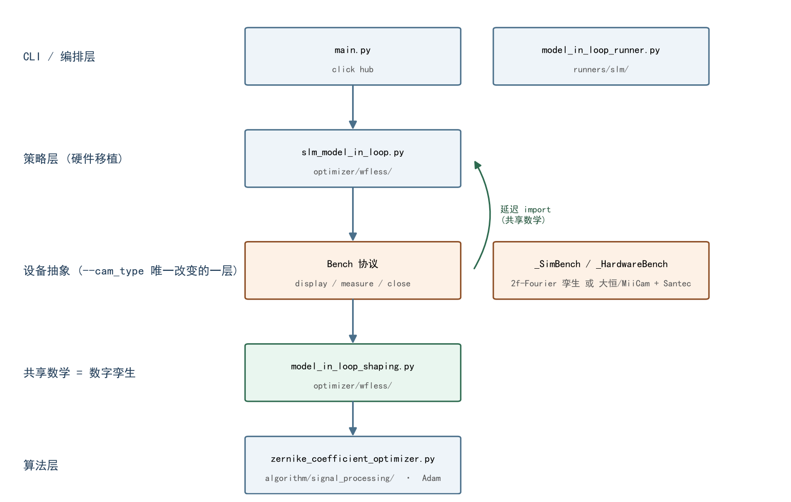
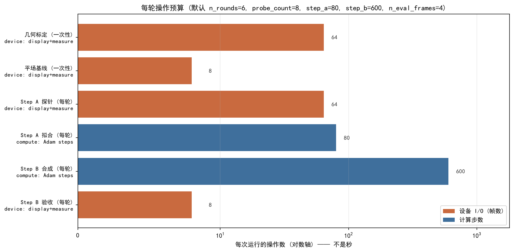
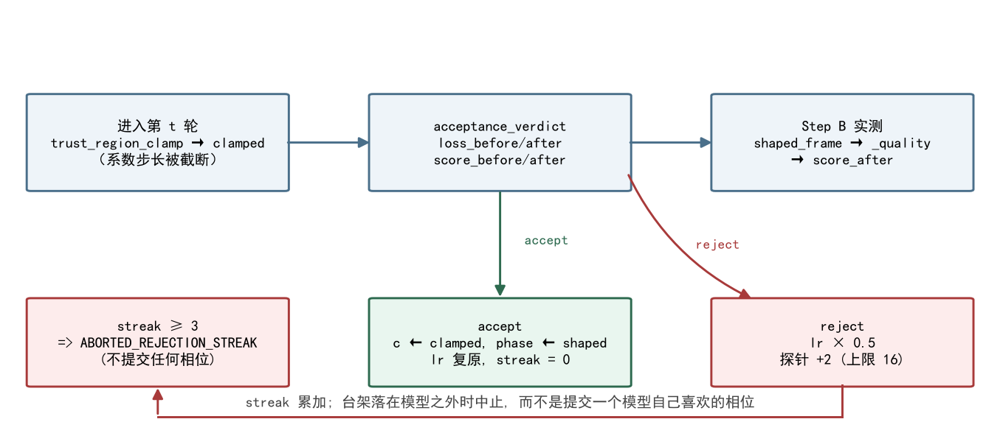

# 正向模型闭环整形 (slm-model-in-loop) —— 调用关系 / 计算时序 / 算法说明

<!-- provenance:start -->
> **生成脚本**: [`scripts/generate_model_in_loop_report.py`](../../scripts/generate_model_in_loop_report.py)
> **复现命令**: `python scripts/generate_model_in_loop_report.py`
> **运行环境**: 离线
> **说明**: slm-model-in-loop 的调用关系图 / 计算时序图 / 算法说明 (功能说明, 非测量); 图中符号对着源码 AST 校验, 默认值从 dataclass AST 读出, 故改名会使生成失败
<!-- provenance:end -->

本报告描述 `slm-model-in-loop` 的**结构与算法**, 不是一次测量的结论。
全文离线可重生成: 图中的每个符号都对着源码解析过, 表格里的默认值是从 dataclass
的 AST 里读出来的 —— 改名会让生成失败, 而不是留下一份看起来仍然权威的旧文档。

> **口径声明: 本报告不含任何壁钟耗时。** 每轮的设备往返次数与计算步数可由配置
> 推出, 因此给出; 耗时取决于台架, 在这里写就是编造。

## 1. 这条命令做什么

每轮交替两步, 用实测数据在闭环里持续修正正向模型, 再用修正后的模型合成相位:

1. **Step A —— 拟合正向模型.** 显示若干个**强随机探针**相位, 把每个探针的远场实测帧
   与正向模型的预测对比, 重拟合**一个共享的 Zernike 像差向量**。
2. **Step B —— 合成方形.** **冻结**刚拟合出的像差, 优化**全像素 SLM 相位**逼近方形目标,
   下发实测; 本轮相位成为下一轮的热启动。

两个守卫 (§6) 抑制两步互相追逐; 最终相位只有**实测优于平场基线**才提交。

## 2. 调用关系图

每个名字都是真实符号, 方括号标注它归哪一层。缩进行是一轮里的两个步骤。

```
main.py `slm-model-in-loop`                              click hub
 └─ runners/slm/model_in_loop_runner.py :: run            硬件编排层
     ├─ _parse_frozen_modes / _parse_point                CLI 文本 -> 类型化字段
     ├─ SlmModelInLoopConfig                              扁平 dataclass (runner_common)
     ├─ optimize_slm_model_in_loop(config)                ← 唯一公开入口
     │   │
     │   ├─ _open_bench(config)                           ──► Bench (Protocol)
     │   │     ├─ _SimBench                                cam_type=sim (数字孪生)
     │   │     └─ _HardwareBench                           daheng/miicam + Santec
     │   │        display(phase) / measure() / close()        设备 import 全部延迟
     │   │
     │   ├─ _calibrate_geometry(bench, config)             一次性几何 bake-off
     │   │     └─ calibrate_bench_geometry(...)           [孪生] sim 直接取真值
     │   │
     │   ├─ 平场基线: display(flat) -> _metrics_at -> _quality
     │   │
     │   └─ for index in range(n_rounds):
     │       │
     │       │  ── Step A: 重拟合一个共享像差 ─────────────────────────────
     │       ├─ coefficients = np.zeros(n_coeffs)           ← 唯一初始种子 (硬编码)
     │       ├─ _make_optimizer(config, coefficients)
     │       │     └─ ZernikeCoefficientOptimizer(initial_coefficients=...)
     │       │          zernike_coefficient_optimizer.py   Adam 作用在 Zernike 向量上
     │       ├─ for probe_index in range(probe_count):
     │       │     ├─ _probe_phase(region, probe_spread, seed)        [孪生]
     │       │     ├─ bench.display(probe) -> _prepare_frame(bench.measure())
     │       │     │                      _prepare_frame  <- slm_gs_refine
     │       │     └─ _to_model_grid(measured, roi_center, far_field_size, ...)
     │       ├─ _fit_aberration_at_probes(optimizer, frames, iters)  [孪生]
     │       │     └─ 所有探针轮流喂进**同一个** Adam 状态; 触发平台期则 rearm
     │       └─ trust_region_clamp(fitted, coefficients, trust_region_c_l2)
     │                                     限制 |c_{t+1} - c_t|
     │       │
     │       │  ── Step B: 冻结像差, 合成方形 ─────────────────────────────
     │       ├─ shape_phase_with_frozen_aberration(...)                 [孪生]
     │       ├─ bench.display(shaped) -> _prepare_frame
     │       │                        -> _metrics_at -> _quality
     │       ├─ phase = shaped                        成为下一轮的热启动
     │       └─ acceptance_verdict(loss_before, loss_after, score_before, score_after)
     │            accept -> coefficients/phase 前移, streak 清零
     │            reject -> 阻尼 lr / 加探针 / streak+1
     │                      streak >= max_rejection_streak -> ABORTED_REJECTION_STREAK
     │
     └─ save_recorder_debug_artifacts(recorder, ...)       utils/io/file.py
          data/debug/slm_model_in_loop_<ts>/<ts>/*.pkl      每次运行都写
```

### 分层与依赖方向



孪生与硬件的关系是这个模块的全部设计要点: 标 `[孪生]` 的行**不是**一份会腐烂的平行实现,
而是硬件层 import 进来的共享数学 (`model_in_loop_shaping`), 且 import 全部延迟到函数内 ——
`ao_shaping.drivers` 在 import 期就会碰硬件。于是 `--cam_type sim` 只替换 `Bench` 的实现,
其余数学逐位相同; 反过来, 仿真里验证过的 Step A/B 逻辑不会在硬件路径上悄悄漂移。

两个模块共享数学, 共享的**不是** config/result 类型 —— 孪生用
`ModelParams`/`StepAConfig`/`StepBConfig`/`ModelInLoopResult`, 硬件用扁平的
`SlmModelInLoopConfig`/`RoundRecord`/`ModelInLoopResult`, 因为硬件侧要把设备生命周期、
settle 判据和 recorder 行一并塞进一个可序列化的配置里。

## 3. 计算时序图

一轮的完整时序。`▓` 是设备 I/O, `░` 是计算, `│` 是状态变更。

```
时序图 (一轮;  ▓ = 设备 I/O   ░ = 计算   │ = 状态变更)   默认参数: 8 探针 / 80 / 600

  用户      main.py      runner          optimize_()      Bench(设备)     ZernikeOpt
    │          │            │                 │              │              │
    │ 命令行   │            │                 │              │              │
    ├─────────►│            │                 │              │              │
    │          ├───────────►│ 解析参数        │              │              │
    │          │            ├─ np.zeros(K) ──┼─ 种子 c_0 ──┼─────────────►│
    │          │            │                 ├─ _open_bench─┼─────────►    │
    │          │            │                 │        ▓ open device        │
    │          │            │                 │              │              │
    │          │            │        ┌────────┴─ 几何 bake-off (一次性) ───┐ │
    │          │            │        │ device: display+measure × n_calib_probe │ │
    │          │            │        │   calibrate_bench_geometry(...)   │ │
    │          │            │        │   相关度 < min_geometry_corr ⇒ 退出码 2│
    │          │            │        └──────────────────────────────────┘ │
    │          │            │                 ├─ ▓ display(flat) → 基线 score │
    │          │            │                 │              │              │
    ╞══════════╪════════════╪═════════════════╪══════════════╪══════════════╡ 第 t 轮
    │          │            │                 │              │              │
    │          │            │            ┌────┴─ Step A ────┼──────────────►│
    │          │            │            │ ▓▓ 探针 i=0..7 (display+measure)│
    │          │            │            │    _probe_phase / _prepare_frame│
    │          │            │            │    _to_model_grid → 模型网格    │
    │          │            │            │ ░ 80× Adam 前向+反向 (循环全部探针)
    │          │            │            │    → fitted, loss_before/after │
    │          │            │            │ ░ trust_region_clamp → clamped │
    │          │            │            │              │              │
    │          │            │            │            ┌──┴─ Step B ──────┼──►│
    │          │            │            │ ░ 600× 全像素相位 Adam (像差冻结)
    │          │            │            │ ▓ display(shaped) + measure     │
    │          │            │            │ ░ _metrics_at → _quality → after│
    │          │            │            │ ░ acceptance_verdict ────────────┤
    │          │            │                 │      │              │
    │          │            │      accept ────┼──────┘  c←clamped, phase←shaped
    │          │            │      reject ────┼──────► 阻尼 lr / 探针+escalate
    │          │            │                 │      streak=3 ⇒ ABORTED ─────►│
    │          │◄───────────┴─ CSV / pkl / best_phase.npy / bench_geometry.json
```

### 顺序里三个容易看漏的点

**几何标定在最前面, 且只做一次.** 它自己也要 display+measure, 但它解的是
`BenchGeometry` —— 没有它, Step A 的 loss 会把「模型预测错」和「几何标定错」混在同一个残差里,
梯度方向是错的。相关度低于 `min_geometry_correlation` 直接以退出码 2 中止, **不提交任何相位**。

**Step A 的所有探针喂进同一个 Adam 状态, 不是每帧各跑一次优化.** 焦面强度是瞳面相位的
非凸函数, 单个探针留下大量驻点, Adam 会停在它进去的那一个; 轮流喂多个独立探针提供的是
消掉这些驻点所需的*多样性*。另外 `update` 在连续 30 步无改善后会锁存
(`PLATEAU_PATIENCE`), 且没有任何东西清这个锁存 —— `reset()` 会把系数倒回 `__init__` 的值, 所以
re-arm 必须绕着**当前**系数重建优化器。

**Step B 只在最后测一次, 不在每次迭代里测.** Step B 是纯计算 (可微前向模型过 FFT),
硬件上不可微的只有「真实测量」本身, 所以梯度来自模型而不是测量; 实测只在末尾做一次,
交给验收测试。因此 `step_b_iterations=600` 不产生 600 次设备往返。



## 4. Step A 详细: 共享像差拟合

### 4.1 为什么必须用探针, 不能直接用整形相位

平瞳孔 (或光滑整形后的瞳孔) 聚焦成近似 δ 函数, 其**归一化**强度对光滑低阶像差几乎不响应 ——
像差因此不可辨识。探针相位 std 高于约 3 rad 时信号才越过 16-bit 量化本底两个数量级, 拟合才良态。
这也解释了 `probe_spread` 不是一个可以随手调小的正则项。

### 4.2 逐步

1. `_probe_phase(region, probe_spread, seed)` 生成零均值高斯**瞳面相位** (raw 未包裹弧度)。
2. `bench.display(probe)` 下发, `bench.measure()` 读一帧, `_prepare_frame` 逐帧去背景再裁剪
   —— 直接对原始帧算指标会被读出噪声污染 (对称读出噪声让约一半像素为负)。
3. `_to_model_grid` 把实测帧搬到**模型自己的网格**上。Step A 的 loss 比较的是
   「实测 CCD」与「模型预测」, 两者必须逐像素可比, 所以这一步的尺度关系必须由几何标定保证。
4. `_fit_aberration_at_probes` 把 `(实测远场, 探针相位)` 对**循环**喂进同一个
   `ZernikeCoefficientOptimizer` 的 `update`, 跑满 `step_a_iterations` 步。
5. 输出 `fitted` 与本轮 loss 首末值, 供验收测试使用。

### 4.3 冻结哪些模式, 以及为什么

`frozen_modes` 默认 `(1, 2, 3)`, 即 **Noll 1/2/3 = piston/tip/tilt**。它们**无法从远场
强度辨识**: piston 在瞳孔上是常数, 对焦面强度无贡献; tip/tilt 只是把 0 阶搬个位置。
放开它们的实测后果是 56% 的系数范数被灌进这些简并方向而**不带来任何收益** ——
即拟合在噪声方向上花掉了 trust region 的预算。

### 4.4 系数个数

`n_coefficients = calc_n_zernike_terms(n_orders)`, **含 piston**。
这与 `ml/zernike` 的离线约定**差一位**, 见 §8。

## 5. Step B 详细: 冻结像差下的全像素相位合成

`shape_phase_with_frozen_aberration(optimizer, clamped, target, warm_start, step_b_cfg)`:
像差 `clamped` 作为**固定**的物理项进入正向模型, 自由变量是**整个 region×region 的相位网格**。
梯度穿过相干传播 + FFT 解析求出 (torch autograd), 所以这 600 步是纯 GPU/CPU 计算。

**为什么必须是全像素而不是低阶 Zernike.** Zernike 是圆对称光滑基, 物理上无法合成方形远场
(方形需要类 sinc 的近场结构 / 高空间频率)。这是 `slm-gs-refine` / `slm-gsnet` 同样遵守的约定。

**目标函数必须含能量项.** `_quality` 组合 `w_efficiency`/`w_uniformity`;
`w_efficiency` 必须非零 —— 只优化 `-CV` 会把能量推出目标框 (硬件实测 EE → 0.002)。

**热启动.** `warm` 取上一轮 `phase` (`--no-warm-start` 则退回平场)。实测分数**没有**变好时,
验收测试会 reject 该轮, 于是 `phase` 不前移 —— 被 reject 的那一轮不会污染下一轮的热启动。

## 6. 两个守卫: 为什么必须有

Step A 产出 `c_t`; Step B 产出以 `c_t` 为条件的 `phi_t`; 下一轮又通过 `phi_t` 的校正去重拟合
`c_{t+1}`。放任两者互相追逐 —— 像差吸收一部分整形相位, 整形相位又补偿像差 —— 在硬件上
(漂移、LCOS 弛豫误差、读出噪声) 表现为**缓慢发散而不是崩溃**, 所以必须有廉价的上界。

**守卫 1 —— trust region.** 逐轮系数变化的 L2 范数被 `trust_region_c_l2` 截断。
**守卫 2 —— 逐轮验收.** `acceptance_verdict(loss_before, loss_after, score_before, score_after)`:
拟合 loss 变差、或实测综合分变差 (容差 `acceptance_score_eps`), 该轮就被 reject。



持续 reject 意味着台架落在模型描述之外 (瞳孔配准、面板倾斜、离面离焦、渐晕), 此时运行
**中止**而不是提交一个「模型自己喜欢」的相位。

## 7. 默认配置 (从 dataclass AST 读出, 非手抄)

| 项 | 值 |
|---|---|
| `n_rounds` | `6` |
| `probe_count / probe_spread` | `8 / 4.0 rad` |
| `step_a_iterations / step_a_lr` | `80 / 0.05` |
| `step_b_iterations / step_b_lr` | `600 / 0.05` |
| `n_orders` | `10` |
| `frozen_modes` | `(1, 2, 3)` |
| `region / far_field_padding` | `64 / 8` |
| `target_side` | `60` |
| `w_uniformity / w_efficiency` | `0.4 / 0.6` |
| `warm_start` | `True` |
| `n_calibration_probes` | `8` |
| `min_geometry_correlation` | `0.5` |
| `acceptance_loss_delta` | `0.0001` |
| `acceptance_score_eps` | `0.001` |
| `damp_lr_factor` | `0.5` |
| `escalate_probe_count / max_probe_count` | `2 / 16` |
| `max_rejection_streak` | `3` |
| `settle_discard / n_eval_frames` | `2 / 4` |
| `cam_type / cam_id / cam_size` | `daheng / 0 / 300` |
| `panel_span_px / pupil_center` | `900.0 / BEAM_CENTER_PANEL` |
| `camera_pixel_um / slm_pixel_um` | `2.2 / 8.0` |
| `wavelength_nm / focal_length_m` | `1064 / 0.0` |

孪生侧的 `region` 原生光斑腰 `native_w0(region)` 由 `TWIN_REGION = 512` 线性缩放;
硬件路径不强制这个等式 —— 它标定自己的几何。

## 8. 加载预训练权重: 现状与真正的障碍

**当前没有加载路径。** 硬件路径的 Step A 种子是硬编码的 `np.zeros(n_coeffs)`, 每轮在此之上
热启动; 没有 `--load`、没有 `torch.load`、没有 `state_dict`。

**有一个注入点, 但它不是加载器.** `model_in_loop_shaping.StepAConfig.initial_coefficients`
存在且带形状校验, 但: (a) 只被孪生的 `simulate_iterative_shaping` 读取, 硬件优化器不读;
(b) CLI 从不暴露它; (c) 它自己的 docstring 写的是「给一个故意错误的猜测, 让 fit→shape 的
迭代过程可观测」—— 它是**诊断旋钮**, 不是权重加载接口。接到硬件上属于改用途, 不是修 bug。

**离线 checkpoint 是真实存在的**, `logs/*/best_coefficients.pt`:

```python
{'coefficients': tensor(K, float64),   # 非 piston 的 Noll 序, 弧度
 'n_max': …, 'grid': …, 'observable': …, 'normalization': …,
 'far_field_padding': …, 'config': {...}}
```

**但两边差一位 piston, 这是会静默错位的坑.** 离线 `K = calc_n_zernike_terms(n_max) - 1`
(排除 Noll 1), 硬件 `n_coefficients = calc_n_zernike_terms(n_orders)` (包含 Noll 1):

| | 系数个数 |
|---|---|
| 离线 `n_max=4` → K | **14** |
| 硬件 `--n-orders 4` | **15** |

**14 用任何 `--n-orders` 都取不到** —— 形状校验要求恰好等于 `calc_n_zernike_terms(n_orders)`。
要对接必须**在前面补一个 `0.0`** 当 piston (两侧都是 Noll 序, 补完 Noll 2..15 精确对齐);
这恰好无害, 因为 `--frozen-modes` 默认已把 piston 冻在 0。

**两个会让加载白做的前提:**

- checkpoint 的 `observable` 应当是 `intensity`。本仓实测 `amplitude` 在三个 `n_max` 上都落后
  `intensity` 约 0.12 R²; 仓库里现成的 `logs/amp_wandb/` 恰好是 `amplitude`, 属较弱变体。
- Step A **每轮都从探针重拟合**, 所以预训练权重只缩短第 1 轮; 收益是「起步在正确的盆地」,
  不是「跳过拟合」。trust region 与验收测试仍然会审它。

## 9. 输出契约

- `data/slm_model_in_loop/<日期>/`: 逐轮历史 CSV、`best_phase.npy` (**raw 未包裹弧度**, 用
  `Santec.create_phase_from_array()` 下发)、`bench_geometry.json` (拟合出的几何, 供复现)、
  可选最优远场图 PNG。
- `data/debug/slm_model_in_loop_<ts>/<ts>/*.pkl`: **每次运行都写**, 不依赖 `--debug`。
  结构 `{epoch: record}`, 带 `_epoch` 索引键, 配 `.json` sidecar (含完整已解析配置)。
  ⚠️ 行内**只有标量** (由测试锁定), 逐帧图像不在其中; 最优帧另存 PNG。
  CSV 额外保留字符串列 `reason`, 它不能进 pkl 的标量集 (writer 用 `float()` 转换)。

## 10. 终止状态

| 状态 | 含义 |
|---|---|
| `completed` | 至少一轮被接受 (或正确地保留了平场) |
| `aborted_unidentifiable` | 几何标定从未达到要求的相关度 |
| `aborted_rejection_streak` | 连续 reject 达上限 —— 台架落在模型之外 |

退出码 `2` = 几何 bake-off 失败或持续落在模型之外, 该轮**没有**提交任何相位;
这种台架应改用 `slm-gs-refine`。

## 11. 本报告**不**主张什么

- **不含壁钟耗时。** §3 的图是操作数, 不是秒。
- **不含真机结论。** 环境是 `离线`; 本报告描述代码, 没有任何一次硬件运行的数据。
- **不含收敛保证。** Step A 是非凸拟合, 探针多样性降低但**不消除**局部驻点;
  报告不主张给定轮数内必然收敛。
- **孪生上的分数不可与硬件分数直接比较**: 孪生用 `TWIN_REGION = 512` 的
  解析光路, 硬件侧的标度来自 bake-off, 二者的绝对强度标度不同。
