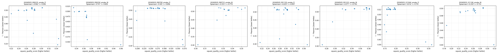
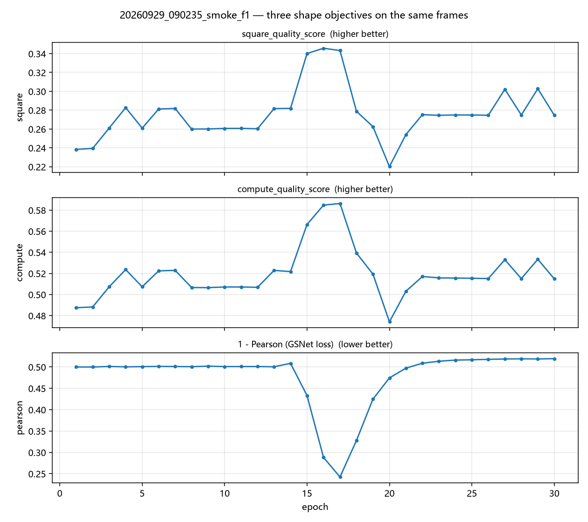
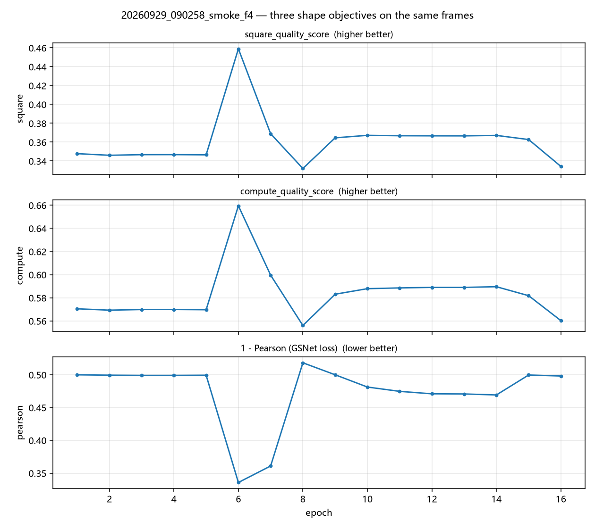
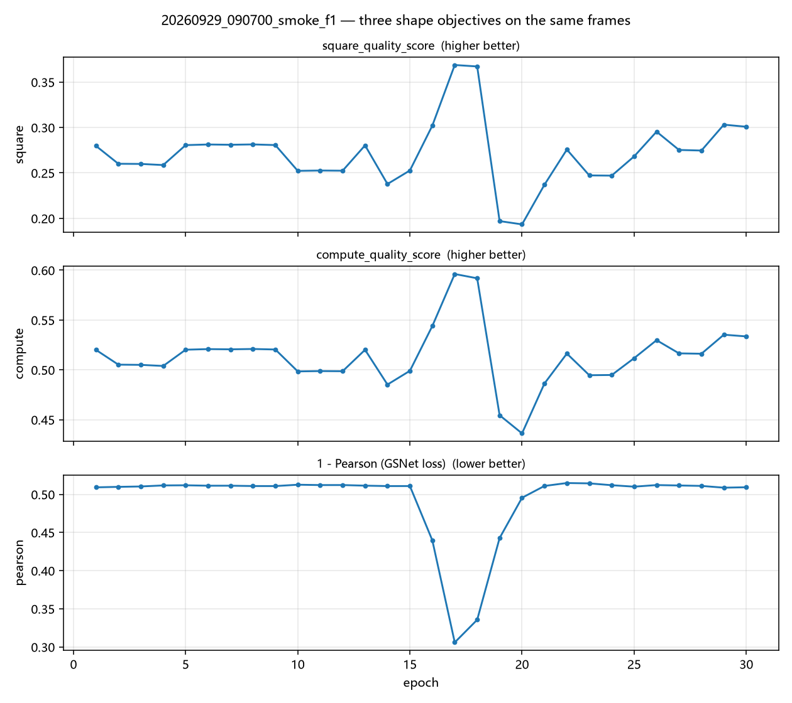
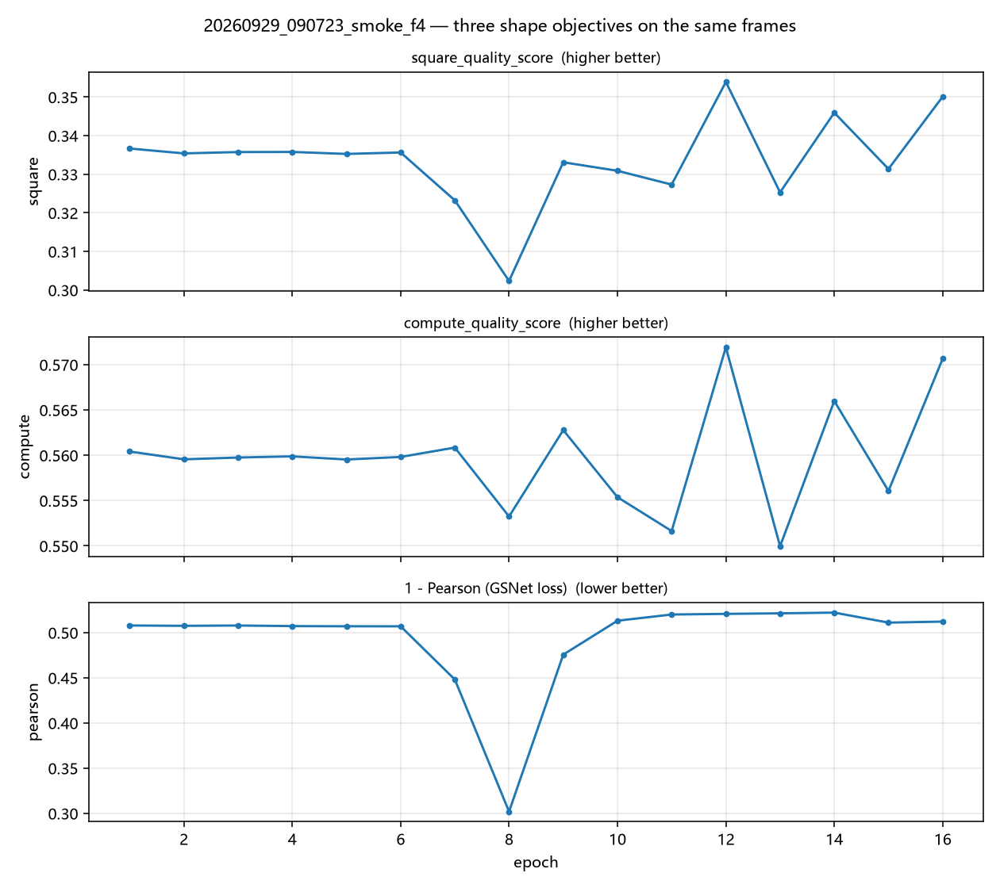
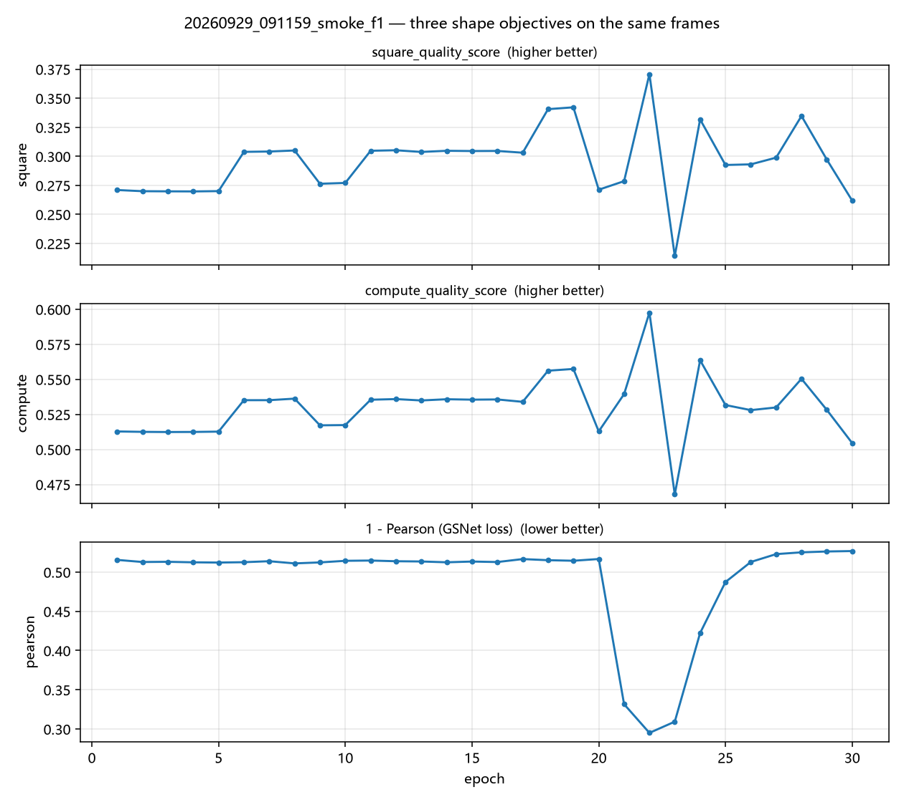
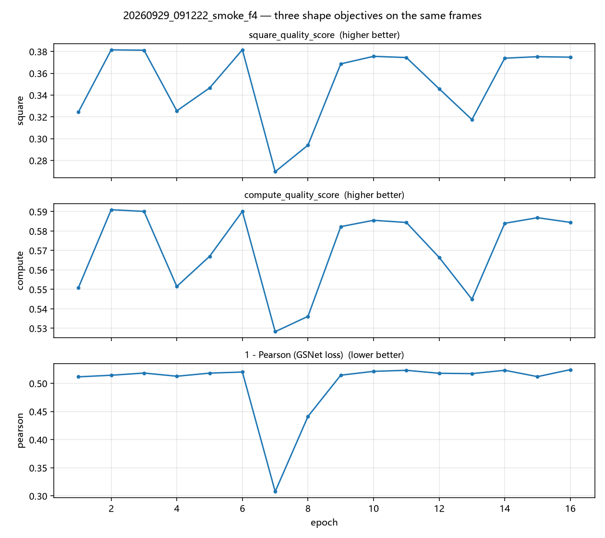
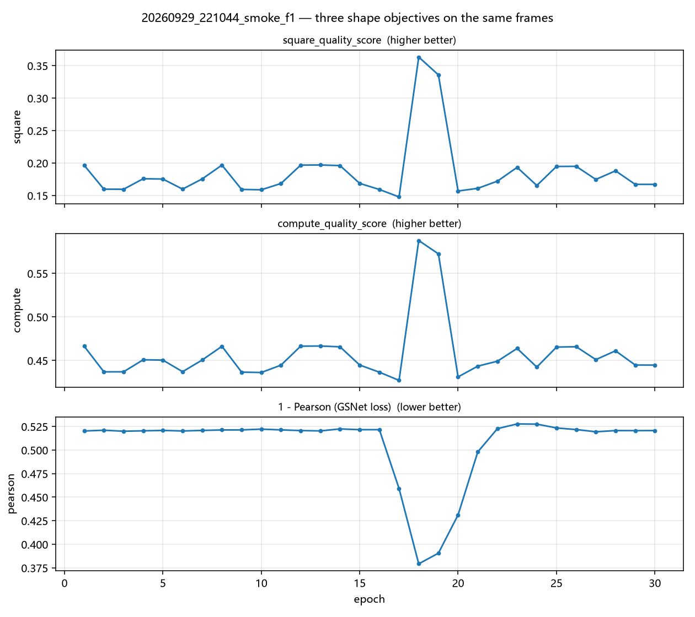
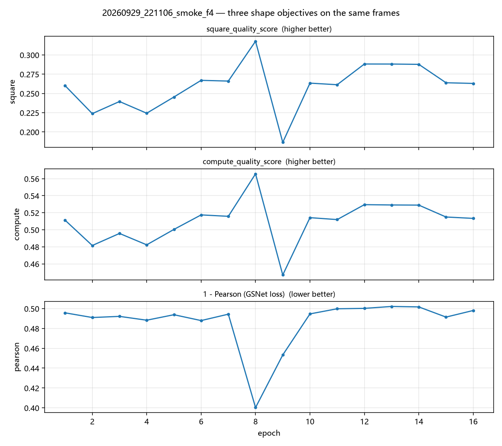

# 整形目标函数对比报告

在 **同一组** 真实 CCD 帧上离线对比三种整形目标函数，这些帧由 `slm-pib` 在线套件记录 (目标: 正方形, 边长 50 px, 以优化前帧 `argmax` 为锚点)。

> **溯源.** 优先使用 `summary_*.json` 显式记录 `cam_type` / `cam_id` / `exposure_time_ms` 的运行 —— `slm_pib_runner` 现在会写入这些字段，因此此类产物是自我溯源的。旧运行仅记录 `delta` / `epochs` / `lr`，相机后端是从运行配置**推断**而非从产物读回；对此类运行，请将后端归属视为暂定。下面各运行章节列出了实际找到的 sidecar 内容，使该区别可见。

| 目标函数 | 来源 | 极性 | 取值范围 |
|---|---|---|---|
| `square_quality_score` | `optimizer/wfless/slm_square_shaping.py` | 越大越好 | `[0, 1]` |
| `compute_quality_score` | `utils/image/beam_metrics.py` | 越大越好 | `[0, 1]` |
| `1 - Pearson` | `utils/image/target/metrics.py` (FourierGSNet `shaping_loss`) | 越小越好 | `[0, 2]` (有效帧); `1e3` 哨兵值用于无效帧 |

## 1. 排序一致性

将 GSNet loss 迁移到硬件上仅当它对候选光斑的排序与手工调优分数一致时才合理。Spearman 相关系数是关键的一致性指标 (Pearson loss 是*损失*，所以与越大越好的 分数呈**负**相关才是预期的一致性信号)。

| run | n frames | Spearman(square, pearson) | Spearman(metrics, pearson) | Spearman(square, metrics) |
|---|---|---|---|---|
| 20260929_090235_smoke_f1 | 30 | +0.0616 | -0.0781 | +0.9635 |
| 20260929_090258_smoke_f4 | 16 | -0.7412 | -0.7824 | +0.9588 |
| 20260929_090700_smoke_f1 | 30 | -0.3055 | -0.3117 | +0.9982 |
| 20260929_090723_smoke_f4 | 16 | +0.3529 | +0.0000 | +0.7412 |
| 20260929_091159_smoke_f1 | 30 | +0.0291 | -0.1266 | +0.9444 |
| 20260929_091222_smoke_f4 | 16 | +0.5706 | +0.5265 | +0.9941 |
| 20260929_221044_smoke_f1 | 30 | -0.0158 | -0.0621 | +0.9924 |
| 20260929_221106_smoke_f4 | 16 | +0.3500 | +0.3500 | +1.0000 |

## 2. 判定

**风险 — Pearson loss 与手工调优复合指标对帧的排序不一致。**

- `square_quality_score` vs `1 - Pearson`: 仅 **3/8** 次运行呈预期的 *负*秩相关 (mean |rho| = 0.329)。
- `compute_quality_score` vs `1 - Pearson`: **5/8** 次运行呈预期负相关。
- 对照 — 两复合指标互相一致 **8/8** 次 (mean rho = +0.949)，故帧集与锚点无误；不稳定性专属于 Pearson 项。

**读法:** 相关*符号在运行间翻转*，因此在任一运行中 Pearson loss 可能以与复合指标相反的顺序排列候选。因此将其作为**额外、显式选择**的 目标函数暴露是安全的 (如 `slm-gsnet` / `slm-pib` 所做)，但不可静默替代 `quality`/`shape`，且在硬件上重新核对符号前不可将其作为收敛信号信任。

## 3. 数值范围

| run | square_quality_score | compute_quality_score | 1 - Pearson |
|---|---|---|---|
| 20260929_090235_smoke_f1 | 0.2201 .. 0.3457 | 0.4741 .. 0.5863 | 0.2422 .. 0.5194 |
| 20260929_090258_smoke_f4 | 0.3320 .. 0.4589 | 0.5560 .. 0.6595 | 0.3357 .. 0.5181 |
| 20260929_090700_smoke_f1 | 0.1933 .. 0.3687 | 0.4362 .. 0.5961 | 0.3059 .. 0.5148 |
| 20260929_090723_smoke_f4 | 0.3023 .. 0.3539 | 0.5499 .. 0.5719 | 0.3018 .. 0.5220 |
| 20260929_091159_smoke_f1 | 0.2142 .. 0.3707 | 0.4679 .. 0.5976 | 0.2951 .. 0.5268 |
| 20260929_091222_smoke_f4 | 0.2696 .. 0.3816 | 0.5282 .. 0.5910 | 0.3076 .. 0.5243 |
| 20260929_221044_smoke_f1 | 0.1477 .. 0.3633 | 0.4272 .. 0.5878 | 0.3793 .. 0.5277 |
| 20260929_221106_smoke_f4 | 0.1865 .. 0.3178 | 0.4470 .. 0.5657 | 0.4003 .. 0.5021 |

两复合指标有界于 `[0, 1]`，故无法表达帧**有多差** —— 会饱和。Pearson loss **不**无界：去均值后相关落在 `[-1, 1]`，有效帧得 `1 - corr` 落在 `[0, 2]`，常数 (零方差) 帧恰落在 `1.0`。其唯一越界值是针对暗帧 / NaN / 非可归一化帧或目标离帧 返回的离散 `1e3` 哨兵 —— 正是该哨兵而非连续尾部，让门控能直接拒绝此类 epoch。

实际鸿沟因此**不在动态范围而在各目标函数能看见什么**。去均值使 Pearson loss 对全局强度尺度与任意加性 DC 偏移不变，所以单用它**对绝对能量盲**，可通过把光推出目标框来改善。这正是硬件路径将其与 ROI 能量门控配对、而非视为直接替代品的原因。



















## 4. 逐运行目标函数轨迹

### 20260929_090235_smoke_f1

- frames: **30** (epochs 1-30)
- 目标锚点 `(x, y)` = (125, 124), 来自优化前 (第 0 行) 帧 `argmax`
- 记录的运行配置: `delta`=0.0005, `n_eval_frames`=1
- 门控判定: unknown=30

| epoch | gate | square_quality_score | 1 - Pearson | 分歧 |
|---|---|---|---|---|
| 29 | unknown | 0.3027 | 0.5187 | 0.6556 |
| 27 | unknown | 0.3021 | 0.5187 | 0.6509 |
| 15 | unknown | 0.3401 | 0.4329 | 0.6437 |
| 14 | unknown | 0.2819 | 0.5085 | 0.4526 |
| 28 | unknown | 0.2748 | 0.5190 | 0.4348 |

### 20260929_090258_smoke_f4

- frames: **16** (epochs 1-16)
- 目标锚点 `(x, y)` = (125, 125), 来自优化前 (第 0 行) 帧 `argmax`
- 记录的运行配置: `delta`=0.0005, `n_eval_frames`=4
- 门控判定: unknown=16

| epoch | gate | square_quality_score | 1 - Pearson | 分歧 |
|---|---|---|---|---|
| 7 | unknown | 0.3689 | 0.3609 | 0.5709 |
| 9 | unknown | 0.3646 | 0.4999 | 0.1564 |
| 15 | unknown | 0.3627 | 0.4995 | 0.1401 |
| 16 | unknown | 0.3342 | 0.4980 | 0.0930 |
| 10 | unknown | 0.3672 | 0.4812 | 0.0746 |

### 20260929_090700_smoke_f1

- frames: **30** (epochs 1-30)
- 目标锚点 `(x, y)` = (125, 125), 来自优化前 (第 0 行) 帧 `argmax`
- 记录的运行配置: `delta`=0.0005, `n_eval_frames`=1
- 门控判定: applied=4, fold=3, noise=23

| epoch | gate | square_quality_score | 1 - Pearson | 分歧 |
|---|---|---|---|---|
| 29 | noise | 0.3030 | 0.5087 | 0.5965 |
| 30 | noise | 0.3008 | 0.5093 | 0.5860 |
| 26 | noise | 0.2953 | 0.5121 | 0.5690 |
| 6 | noise | 0.2812 | 0.5113 | 0.4845 |
| 5 | noise | 0.2805 | 0.5119 | 0.4831 |

### 20260929_090723_smoke_f4

- frames: **16** (epochs 1-16)
- 目标锚点 `(x, y)` = (125, 125), 来自优化前 (第 0 行) 帧 `argmax`
- 记录的运行配置: `delta`=0.0005, `n_eval_frames`=4
- 门控判定: applied=4, fold=2, noise=10

| epoch | gate | square_quality_score | 1 - Pearson | 分歧 |
|---|---|---|---|---|
| 8 | fold | 0.3023 | 0.3018 | 1.0000 |
| 12 | noise | 0.3539 | 0.5206 | 0.9936 |
| 16 | noise | 0.3501 | 0.5121 | 0.8811 |
| 14 | noise | 0.3459 | 0.5220 | 0.8457 |
| 1 | applied | 0.3366 | 0.5078 | 0.6010 |

### 20260929_091159_smoke_f1

- frames: **30** (epochs 1-30)
- 目标锚点 `(x, y)` = (126, 124), 来自优化前 (第 0 行) 帧 `argmax`
- 记录的运行配置: `delta`=0.0005, `n_eval_frames`=1
- 门控判定: applied=6, fold=3, noise=21

| epoch | gate | square_quality_score | 1 - Pearson | 分歧 |
|---|---|---|---|---|
| 23 | fold | 0.2142 | 0.3094 | 0.9383 |
| 19 | noise | 0.3422 | 0.5144 | 0.7643 |
| 28 | noise | 0.3347 | 0.5252 | 0.7629 |
| 18 | noise | 0.3406 | 0.5151 | 0.7572 |
| 29 | noise | 0.2971 | 0.5262 | 0.5277 |

### 20260929_091222_smoke_f4

- frames: **16** (epochs 1-16)
- 目标锚点 `(x, y)` = (125, 125), 来自优化前 (第 0 行) 帧 `argmax`
- 记录的运行配置: `delta`=0.0005, `n_eval_frames`=4
- 门控判定: applied=4, fold=1, noise=11

| epoch | gate | square_quality_score | 1 - Pearson | 分歧 |
|---|---|---|---|---|
| 7 | fold | 0.2696 | 0.3076 | 1.0000 |
| 6 | applied | 0.3816 | 0.5201 | 0.9806 |
| 3 | noise | 0.3812 | 0.5183 | 0.9683 |
| 2 | applied | 0.3815 | 0.5144 | 0.9532 |
| 16 | noise | 0.3748 | 0.5243 | 0.9390 |

### 20260929_221044_smoke_f1

- frames: **30** (epochs 1-30)
- 目标锚点 `(x, y)` = (125, 126), 来自优化前 (第 0 行) 帧 `argmax`
- 记录的运行配置: `delta`=0.0005, `n_eval_frames`=1
- 门控判定: applied=5, fold=3, noise=22

| epoch | gate | square_quality_score | 1 - Pearson | 分歧 |
|---|---|---|---|---|
| 20 | applied | 0.1569 | 0.4312 | 0.6076 |
| 17 | fold | 0.1477 | 0.4591 | 0.4618 |
| 23 | noise | 0.1933 | 0.5277 | 0.2113 |
| 25 | noise | 0.1947 | 0.5234 | 0.1892 |
| 14 | noise | 0.1960 | 0.5224 | 0.1885 |

### 20260929_221106_smoke_f4

- frames: **16** (epochs 1-16)
- 目标锚点 `(x, y)` = (123, 127), 来自优化前 (第 0 行) 帧 `argmax`
- 记录的运行配置: `delta`=0.0005, `n_eval_frames`=4
- 门控判定: fold=16

| epoch | gate | square_quality_score | 1 - Pearson | 分歧 |
|---|---|---|---|---|
| 13 | fold | 0.2882 | 0.5021 | 0.7744 |
| 14 | fold | 0.2878 | 0.5017 | 0.7668 |
| 12 | fold | 0.2882 | 0.5002 | 0.7557 |
| 11 | fold | 0.2613 | 0.4998 | 0.5470 |
| 16 | fold | 0.2630 | 0.4981 | 0.5428 |

## 5. 复现

```bash
python scripts/generate_shape_objective_comparison.py
```
