# SLM-PIB 在线验收报告 (Daheng CCD)

从 `data/debug/slm_pib_online/` 生成的离线报告。未打开硬件；下述所有数值均来自 `AO_RUN_HARDWARE=1` 在线套件写入的保存 recorder pickle 与 summary JSON。

分析运行: **11** (3 次 SNR 扫描, 8 次 smoke)。

## 1. 发现

- **20260929_085851** — 噪声地板 sigma_J=3.709e-04; 最佳 SNR 1.911 at delta=0.001 (unusable).
-   - 20260929_085851 是一个 **全不可用** epoch: J 测量噪声地板在每个 delta 上都主导了梯度信号。
- **20260929_091112** — 噪声地板 sigma_J=8.175e-05; 最佳 SNR 3.056 at delta=0.001 (strong).
-   - 20260929_091112 在 delta=0.0005, 0.001, 0.01 达到可用梯度。
- **20260929_220954** — 噪声地板 sigma_J=1.725e-05; 最佳 SNR 4.927 at delta=0.001 (strong).
-   - 20260929_220954 在 delta=0.0005, 0.001, 0.01 达到可用梯度。
- **20260929_090235** (smoke_f1, delta=0.0005, n_eval_frames=1) — 26/30 个 epoch 采纳了梯度 (87%), 4 个 fold 门控, 0 个 noise 门控。
-   - J 与 max_brt 相关性为 **-0.9836** — 目标在追踪环境光斑漂移，而非系数。
- **20260929_090258** (smoke_f4, delta=0.0005, n_eval_frames=4) — 15/16 个 epoch 采纳了梯度 (94%), 1 个 fold 门控, 0 个 noise 门控。
- **20260929_090700** (smoke_f1, delta=0.0005, n_eval_frames=1) — 4/30 个 epoch 采纳了梯度 (13%), 3 个 fold 门控, 23 个 noise 门控。
-   - J 与 max_brt 相关性为 **-0.9493** — 目标在追踪环境光斑漂移，而非系数。
- **20260929_090723** (smoke_f4, delta=0.0005, n_eval_frames=4) — 4/16 个 epoch 采纳了梯度 (25%), 2 个 fold 门控, 10 个 noise 门控。
-   - J 与 max_brt 相关性为 **-0.9496** — 目标在追踪环境光斑漂移，而非系数。
- **20260929_091159** (smoke_f1, delta=0.0005, n_eval_frames=1) — 6/30 个 epoch 采纳了梯度 (20%), 3 个 fold 门控, 21 个 noise 门控。
-   - J 与 max_brt 相关性为 **-0.9922** — 目标在追踪环境光斑漂移，而非系数。
- **20260929_091222** (smoke_f4, delta=0.0005, n_eval_frames=4) — 4/16 个 epoch 采纳了梯度 (25%), 1 个 fold 门控, 11 个 noise 门控。
-   - J 与 max_brt 相关性为 **-0.9510** — 目标在追踪环境光斑漂移，而非系数。
- **20260929_221044** (smoke_f1, delta=0.0005, n_eval_frames=1) — 5/30 个 epoch 采纳了梯度 (17%), 3 个 fold 门控, 22 个 noise 门控。
-   - J 与 max_brt 相关性为 **-0.9800** — 目标在追踪环境光斑漂移，而非系数。
- **20260929_221106** (smoke_f4, delta=0.0005, n_eval_frames=4) — 0/16 个 epoch 采纳了梯度 (0%), 16 个 fold 门控, 0 个 noise 门控。
-   - J 与 max_brt 相关性为 **-0.9790** — 目标在追踪环境光斑漂移，而非系数。

## 2. 噪声地板 / SNR 判定

`sigma_J` 是固定 (平场) 相位下 15 帧重复测量中被追踪目标的标准差 —— 纯测量噪声地板。SNR 是 `+delta`/`-delta` 对的平均 |J| 响应除以噪声地板。

| run | center | sigma_J | SNR@delta=0.0005 | SNR@delta=0.001 | SNR@delta=0.01 |
|---|---|---|---|---|---|
| 20260929_085851 | 665,1031 | 3.7088e-04 | 1.347 (unusable) | 1.911 (unusable) | 1.381 (unusable) |
| 20260929_091112 | 664,1029 | 8.1749e-05 | 2.854 (usable) | 3.056 (strong) | 2.788 (usable) |
| 20260929_220954 | 664,1029 | 1.7249e-05 | 3.255 (strong) | 4.927 (strong) | 4.062 (strong) |

判定带: `unusable` < 2.0 <= `usable` < 2.5 <= `strong`。

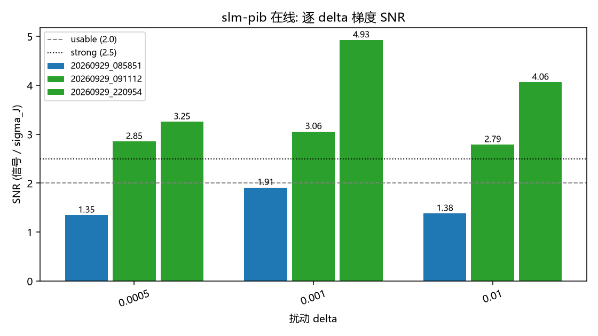

## 3. 门控可观测性

优化器在私有 ``_gate`` 键下记录逐 epoch 判定：`applied` (采纳梯度), `fold` (框内能量坍缩 — 放弃评估), `noise` (梯度低于噪声门控 — 系数冻结)。

第 0 行基线不带判定，仅计入 ``rows``，故不变式为 ``applied + stalled + 1 == rows``。

| run | tag | delta | n_eval_frames | rows | applied | fold | noise | gate 来源 |
|---|---|---|---|---|---|---|---|---|
| 20260929_090235 | smoke_f1 | 0.0005 | 1 | 31 | 26 | 4 | 0 | 旧版启发式 |
| 20260929_090258 | smoke_f4 | 0.0005 | 4 | 17 | 15 | 1 | 0 | 旧版启发式 |
| 20260929_090700 | smoke_f1 | 0.0005 | 1 | 31 | 4 | 3 | 23 | 显式 `_gate` |
| 20260929_090723 | smoke_f4 | 0.0005 | 4 | 17 | 4 | 2 | 10 | 显式 `_gate` |
| 20260929_091159 | smoke_f1 | 0.0005 | 1 | 31 | 6 | 3 | 21 | 显式 `_gate` |
| 20260929_091222 | smoke_f4 | 0.0005 | 4 | 17 | 4 | 1 | 11 | 显式 `_gate` |
| 20260929_221044 | smoke_f1 | 0.0005 | 1 | 31 | 5 | 3 | 22 | 显式 `_gate` |
| 20260929_221106 | smoke_f4 | 0.0005 | 4 | 17 | 0 | 16 | 0 | 显式 `_gate` |

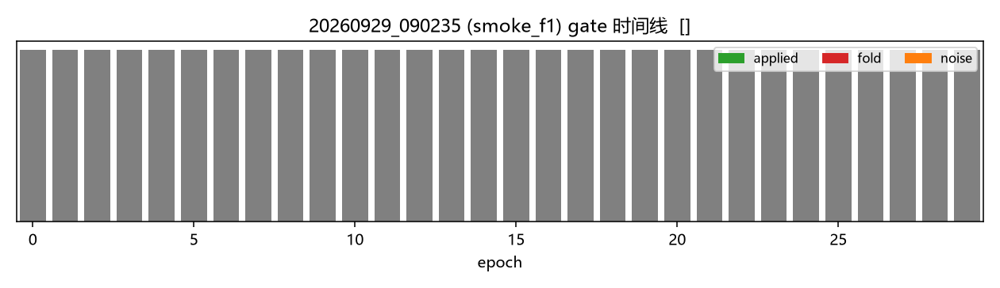

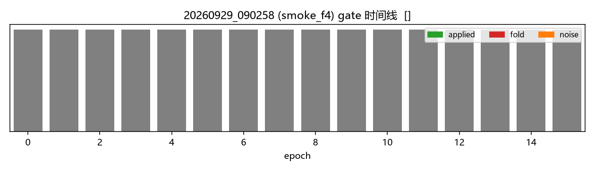

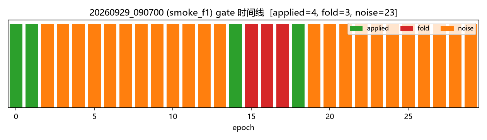

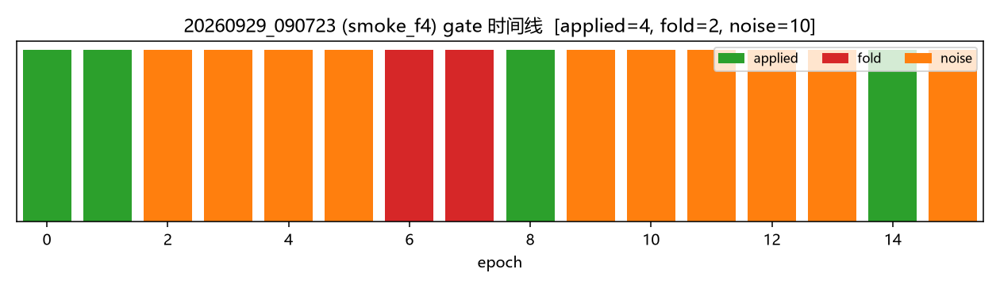

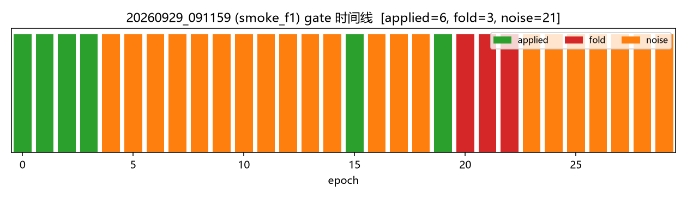

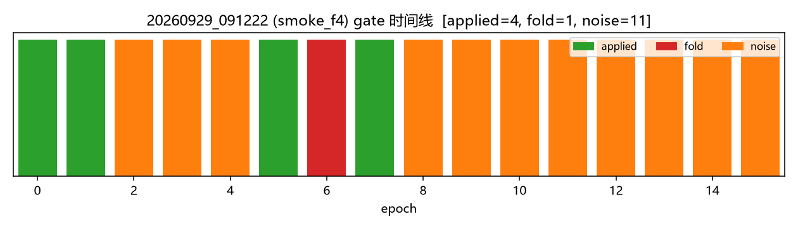

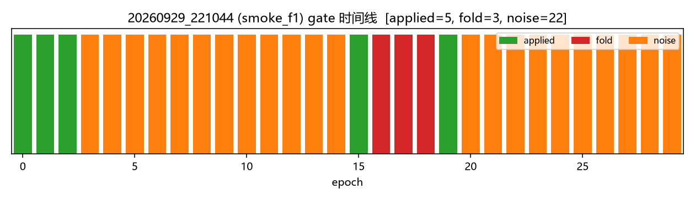

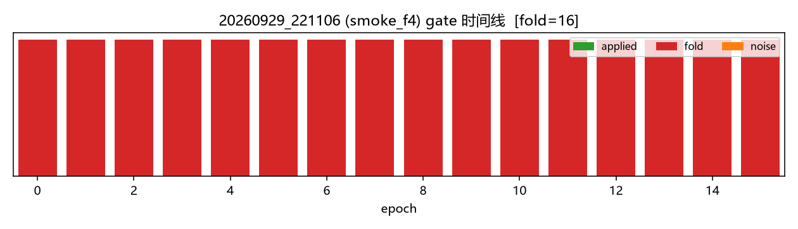

## 4. 环境漂移诊断

历史 ep15 不稳定性源于环境而非系数驱动：光斑在传感器上漂移，导致 ``J`` 与 帧峰值 ``max_brt`` 共同移动。此处强 |corr| 意味着被追踪目标在跟随漂移而非整形质量。

| run | tag | corr(J, max_brt) | 斜率 dJ/d(max_brt) | J 范围 |
|---|---|---|---|---|
| 20260929_090235 | smoke_f1 | -0.9836 | -0.006421 | -1.231 .. -0.7825 |
| 20260929_090258 | smoke_f4 | -0.5391 | -0.00117 | -1.031 .. -0.9576 |
| 20260929_090700 | smoke_f1 | -0.9493 | -0.004284 | -1.224 .. -0.8788 |
| 20260929_090723 | smoke_f4 | -0.9496 | -0.006406 | -1.053 .. -0.8371 |
| 20260929_091159 | smoke_f1 | -0.9922 | -0.005779 | -1.253 .. -0.843 |
| 20260929_091222 | smoke_f4 | -0.9510 | -0.003221 | -1.071 .. -0.8565 |
| 20260929_221044 | smoke_f1 | -0.9800 | -0.02253 | -1.354 .. -0.816 |
| 20260929_221106 | smoke_f4 | -0.9790 | -0.01492 | -1.214 .. -0.9065 |

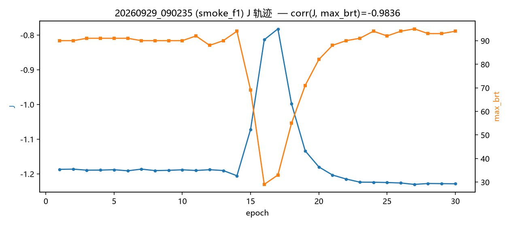

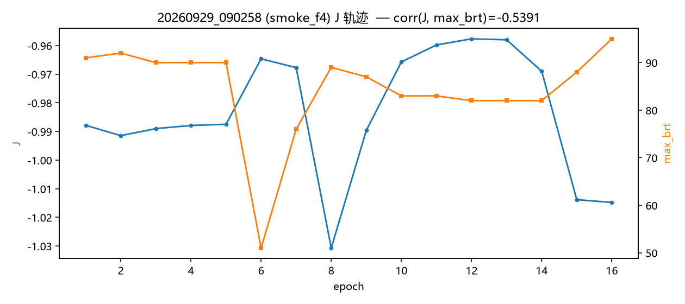

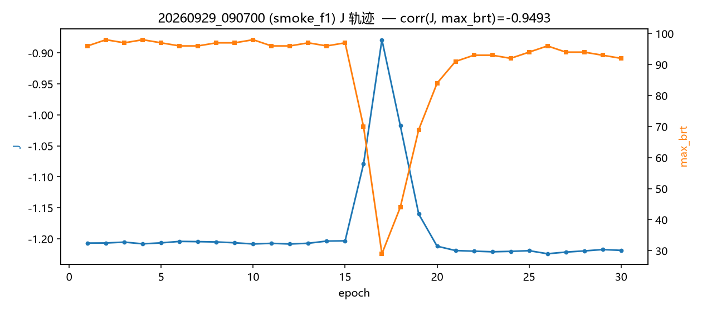

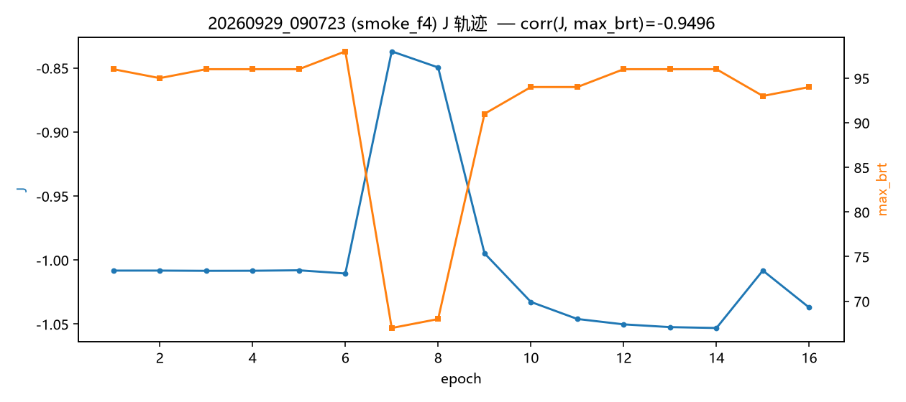

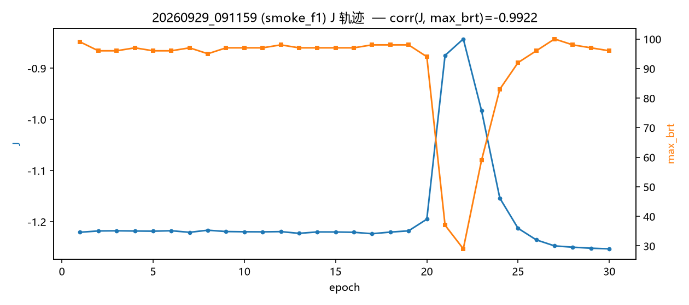

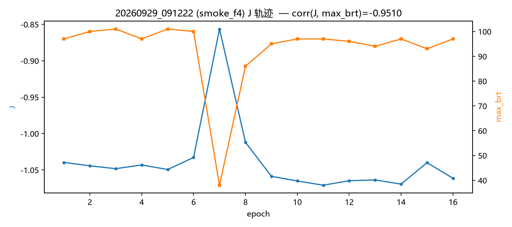

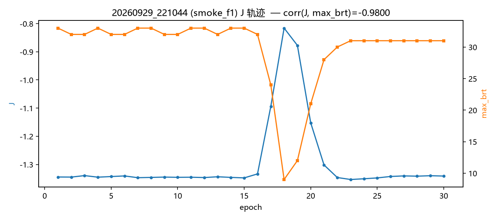

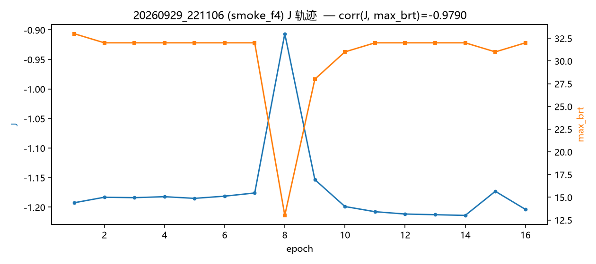

## 5. 逐运行详情

### 20260929_085851 — snr

- `center`: `[665.0, 1031.0]`
- `sigma_j`: `0.0003708758931648585`
- `noise_mean_j`: `0.018301369834196526`
- `signals`: `{'0.0005': 0.0004996174378146244, '0.001': 0.0007087386903874467, '0.01': 0.0005121911190759636}`
- `snr_by_delta`: `{'0.0005': 1.347128371033107, '0.001': 1.9109861370051475, '0.01': 1.3810310362994902}`
- `verdict`: `{'0.0005': 'unusable', '0.001': 'unusable', '0.01': 'unusable'}`
- `note`: `hardware measurement, not an assertion: at delta<0.001 a sub-2 SNR is the expected honest-stall regime (h6a).`
- ⚠️ `recorder_*.pkl` holds `None` (this sweep does not drive a Recorder); all reported values come from the summary JSON

### 20260929_090235 — smoke_f1

- `rows`: `31`
- `applied`: `26`
- `stalled`: `4`
- `fold`: `4`
- `noise`: `0`
- `objective_key`: `shape`
- `best_objective`: `-0.7824980810100854`
- `delta`: `0.0005`
- `n_eval_frames`: `1`
- ⚠️ records predate the explicit `_gate` verdict; gate counts fall back to the `_c`-stagnation heuristic and over-count `applied`

### 20260929_090258 — smoke_f4

- `rows`: `17`
- `applied`: `15`
- `stalled`: `1`
- `fold`: `1`
- `noise`: `0`
- `objective_key`: `shape`
- `best_objective`: `-0.7777673755307932`
- `delta`: `0.0005`
- `n_eval_frames`: `4`
- ⚠️ records predate the explicit `_gate` verdict; gate counts fall back to the `_c`-stagnation heuristic and over-count `applied`

### 20260929_090700 — smoke_f1

- `rows`: `31`
- `applied`: `4`
- `stalled`: `26`
- `fold`: `3`
- `noise`: `23`
- `objective_key`: `shape`
- `best_objective`: `-0.8787997196958208`
- `delta`: `0.0005`
- `n_eval_frames`: `1`

### 20260929_090723 — smoke_f4

- `rows`: `17`
- `applied`: `4`
- `stalled`: `12`
- `fold`: `2`
- `noise`: `10`
- `objective_key`: `shape`
- `best_objective`: `-0.837064555687089`
- `delta`: `0.0005`
- `n_eval_frames`: `4`

### 20260929_091112 — snr

- `center`: `[664.0, 1029.0]`
- `sigma_j`: `8.17486240144268e-05`
- `noise_mean_j`: `0.014776016674102197`
- `signals`: `{'0.0005': 0.00023326989434864614, '0.001': 0.0002497997107720427, '0.01': 0.00022789337239149826}`
- `snr_by_delta`: `{'0.0005': 2.8535023942112985, '0.001': 3.055705386893835, '0.01': 2.7877334345258236}`
- `verdict`: `{'0.0005': 'usable', '0.001': 'strong', '0.01': 'usable'}`
- `note`: `hardware measurement, not an assertion: at delta<0.001 a sub-2 SNR is the expected honest-stall regime (h6a).`
- ⚠️ `recorder_*.pkl` holds `None` (this sweep does not drive a Recorder); all reported values come from the summary JSON

### 20260929_091159 — smoke_f1

- `rows`: `31`
- `applied`: `6`
- `stalled`: `24`
- `fold`: `3`
- `noise`: `21`
- `objective_key`: `shape`
- `best_objective`: `-0.8429990435611792`
- `delta`: `0.0005`
- `n_eval_frames`: `1`

### 20260929_091222 — smoke_f4

- `rows`: `17`
- `applied`: `4`
- `stalled`: `12`
- `fold`: `1`
- `noise`: `11`
- `objective_key`: `shape`
- `best_objective`: `-0.8565343635526448`
- `delta`: `0.0005`
- `n_eval_frames`: `4`

### 20260929_220954 — snr

- `center`: `[664.0, 1029.0]`
- `sigma_j`: `1.7249198159363478e-05`
- `noise_mean_j`: `0.0038537004699555097`
- `signals`: `{'0.0005': 5.614252508640005e-05, '0.001': 8.49888777710715e-05, '0.01': 7.007146258447242e-05}`
- `snr_by_delta`: `{'0.0005': 3.2547904295437577, '0.001': 4.927120494869874, '0.01': 4.0623026031175336}`
- `verdict`: `{'0.0005': 'strong', '0.001': 'strong', '0.01': 'strong'}`
- `note`: `hardware measurement, not an assertion: at delta<0.001 a sub-2 SNR is the expected honest-stall regime (h6a).`
- ⚠️ `recorder_*.pkl` holds `None` (this sweep does not drive a Recorder); all reported values come from the summary JSON

### 20260929_221044 — smoke_f1

- `rows`: `31`
- `applied`: `5`
- `stalled`: `25`
- `fold`: `3`
- `noise`: `22`
- `objective_key`: `shape`
- `best_objective`: `-0.8160216337796915`
- `delta`: `0.0005`
- `n_eval_frames`: `1`

### 20260929_221106 — smoke_f4

- `rows`: `17`
- `applied`: `0`
- `stalled`: `16`
- `fold`: `16`
- `noise`: `0`
- `objective_key`: `shape`
- `best_objective`: `-0.906459806916249`
- `delta`: `0.0005`
- `n_eval_frames`: `4`

## 6. 复现

```bash
# 重新生成此报告 (离线)
python scripts/generate_slm_pib_online_report.py

# 重跑硬件套件 (需 AO_RUN_HARDWARE=1 + 在线设备)
AO_RUN_HARDWARE=1 uv run pytest tests/ao_shaping/optimizer/wfless/test_slm_zernike_pib_online.py -v
```
