# slm-pib 仿真运行报告 (SPGD 方形目标, 2f-Fourier 数字孪生)

<!-- provenance:start -->
> **生成脚本**: [`scripts/generate_slm_pib_sim_report.py`](../../scripts/generate_slm_pib_sim_report.py)
> **复现命令**: `python scripts/generate_slm_pib_sim_report.py`
> **数据/关联脚本**: [`scripts/slm_pib_sim_run.py`](../../scripts/slm_pib_sim_run.py)
> **运行环境**: 离线
> **说明**: 2f-Fourier 数字孪生跑 slm-pib；数据由 slm_pib_sim_run.py 产生
<!-- provenance:end -->

**生成时间**: 2026-10-01 12:30:57

**Fully offline** — 本报告由 `scripts/generate_slm_pib_sim_report.py` 离线生成, 仅读取 `slm-pib --debug` 保存的 PKL/JSON 调试产物, 不打开任何硬件。

## 1. 运行说明

本运行使用 `src/ao_shaping/runners/slm/slm_shaping_runner.py` (`slm-pib` 组) 的 **SPGD** 子命令, 在纯 numpy 2f-Fourier 仿真 (`src/ao_shaping/drivers/sim/slm_pib_sim.py`) 下执行, 无硬件。

- **相机**: `--cam_type sim` (注册到相机注册表, 读取仿真远场)
- **SLM**: `Santec` 被 monkeypatch 为 `SimSLMPib` (FFT 远场, 0 级光斑位于帧中心)
- **目标**: 方形 (`--target_shape square`, `--target_size` 相机像素)
- **搜索**: SPGD 梯度法 (`--optimizer_type adamod`), Zernike 系数 n≤4 (15 个模式)

光学模型: SLM 位于 2f 光路前焦面, CCD 位于后焦面, 因此 CCD 图像 = SLM 瞳孔场的 2D FFT (夫琅禾费远场)。输入为高斯光束, 施加 Zernike 相位后经 `np.fft.fft2` 传播到远场。

## 2. 干扰模型与静态/动态对比

两次运行之间的**唯一差异**是波前干扰体制; 目标函数、优化器、步长、相机与目标框完全一致。干扰 = **大气湍流** (`beam_backend.turbulence_phase`, von Karman 相位屏) + **热晕** (负热透镜: Noll 4 离焦 + Noll 11 球差, 经 smoothstep 光晕窗延伸到光束半径之外), 二者相加后与 SLM 命令相位一起进入瞳孔场。

| 运行 | 体制 | Cn2 | 距离 [m] | 热晕 PV [waves] | σ_turb [rad] | σ_halo [rad] | σ_total [rad] | σ_total [waves] | 屏幕数 | 评估次数 | RMS 轨迹 |
|---|---|---|---|---|---|---|---|---|---|---|---|
| `dynamic` | dynamic | 2e-13 | 500 | 0.3 | 0.4108 | 0.4049 | 0.5801 | 0.0923 | 604 | 604 | varying |
| `static` | static | 2e-13 | 500 | 0.3 | 0.3741 | 0.4049 | 0.5658 | 0.0901 | 1 | 604 | flat |

### 2.1 `dynamic` 干扰可视化

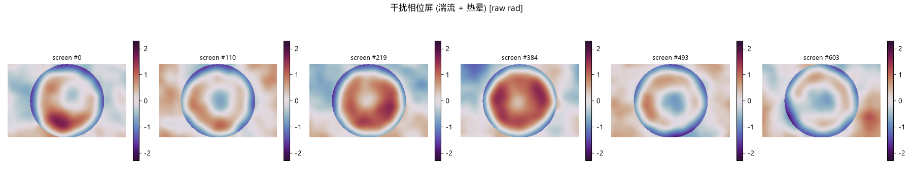

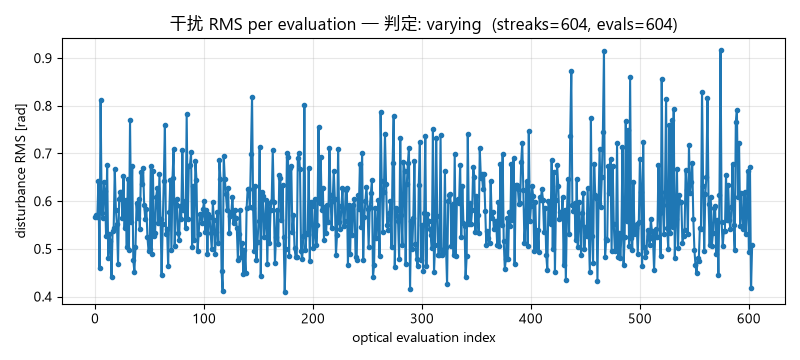

### 2.2 `static` 干扰可视化

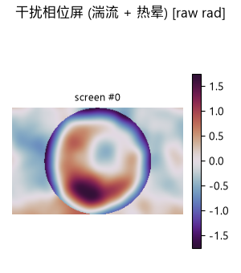

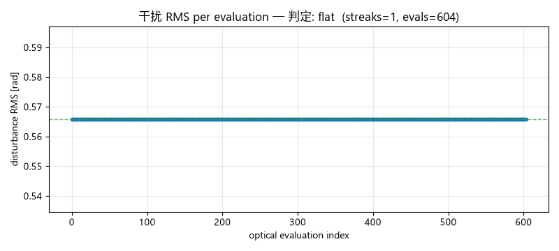

### 2.9 口径与局限 (必读, 否则会过度解读)

1. **没有真实的公里级大气路径。** `r0 = (0.423·k²·Cn2·L)^(-3/5)` 只依赖 `Cn2·L` 的**乘积**, 两者在单层薄屏模型里完全退化; 本台架是约 0.3 m 的实验室 2f-Fourier 光路, 因此这里是**参数化应力测试**, 不是大气传输仿真。
2. **σ 是实测值, 不是解析值。** 仓库默认 (numpy) 相位屏生成器缺少次谐波/低频补偿 (`drivers/sim/AGENTS.md` 第 4 条), 而 `L0` (数十米) 远大于 15.36 mm 口径, 故实测 σ **低于**同 r0 下的解析 von Karman 方差 —— 本报告只引用实测值。
3. **`dynamic` = 完全去相关 (white in time), 不是风模型。** 每次光学评估重抽一张独立相位屏; 真实大气去相关时间 (~10–50 ms) 远短于本环路每次评估耗时 (~0.375 s), 因此该极限在此是合理渐近。
4. **噪声门的早期偏置。** 优化器前 `noise_gate_window=20` 个 epoch 门控尚未生效 (`slm_zernike_pib.py`), 任何 applied/gated 计数都会被高估; 且这些计数只存在于运行日志, **不在调试产物中**, 因此本报告不做此类断言。
5. **n≤4 的 Zernike 无法合成真正的方形远场** (仓库既有反模式), 方形目标只是**代理指标**, 目标值的改善来自离焦/球差重排而非真正方形成形。
6. **绝对数值是仿真内部单位** (`far_field()` 把峰值归一到 100 并加泊松散粒噪声), 只可做**相对**比较 (static vs dynamic、优化前 vs 优化后), 不可与硬件台架对比。
6b. **远场经过 4× 零填充过采样** (`FAR_FIELD_PADDING`): 未填充时 0 级光斑仅约 **1.8 px FWHM** (几乎无采样), 因此填充前的历史报告数值**不可与本次直接比较** —— 光斑被真正分辨后, 目标函数值与自适应半径都会改变 (例如自适应半径从 ~112 px 降到 ~16 px)。static 与 dynamic 之间使用完全相同的采样, 故二者互比仍然有效。
7. **零干扰基线本身就已近乎平坦**: 实测一次干净 10-epoch 运行只应用 4/10 更新、6/10 被噪声门拒绝, 退出时记录 `no improvement over the initial phase`。若干扰运行同样平坦, **不能归因于干扰**。
8. **热晕是瞬态、强度相关的非线性效应**, 本模型只取它的**稳态低阶**代理 (负热透镜: 离焦 + 球差 + 光晕窗), 不建模吸收加热的时间演化、风场对流或强度反馈。

### 2.10 派生对比 (全部来自本次运行数据)

| 运行 | 目标 | 起点 J | 峰值 J | 改善 (峰值 − 起点, 按搜索方向) | 终点 J |
|---|---|---|---|---|---|
| `dynamic` | `shape` | -1.3442 | -1.0778 | +0.2665 | -1.1271 |
| `static` | `shape` | -1.3442 | -1.1246 | +0.2197 | -1.2626 |

> 改善量按各次运行的 `objective` **派生**搜索方向后计算 (见 `direction_of`), 不是硬编码断言。

## 3.1 运行 `dynamic` (目录 `20261001_122837`)

目标函数 `shape`, 搜索方向 **max** (越大越好)。

- **干扰**: 体制 `dynamic`; Cn2=2e-13, 距离=500 m, 热晕 PV=0.3 waves; 实测 σ_total=0.5801 rad (0.0923 waves), 屏幕数=604, 评估次数=604

| 项目 | 值 |
|---|---|
| epoch 数 | 301 |
| 初始 J (epoch 0) | -1.3442 |
| 最佳 J (epoch 288) | -1.0778 |
| 末轮 J (epoch 300) | -1.1271 |
| 初始框内能量 _p% | 1.0152 |
| 最佳框内能量 _p% (epoch 0) | 1.0152 |
| 末轮框内能量 _p% | 1.0008 |
| 搜索配置 | {'epochs': 300, 'delta': 0.5, 'objective': 'shape', 'target_shape': 'square', 'target_size': 120.0, 'max_roi_energy_loss': 0.6, 'cam_type': 'sim', 'cam_id': 0, 'exposure_time_ms': 80.0, 'cam_size': 512, 'center': 'shape', 'lr': 0.0, 'n_eval_frames': 1, 'noise_gate_k': 3.0, 'fold_ratio': 0.5, 'optimizer_type': 'adamod', 'n_max': 4, 'zernike_radius': 600.0, 'slm_number': 1, 'slm_wavelength': 1064} |

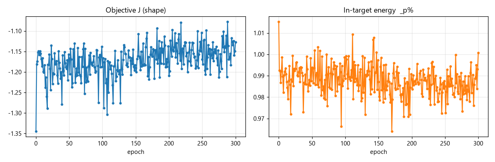

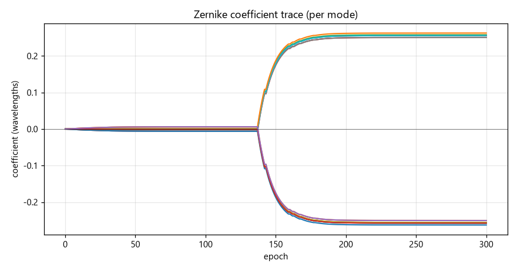

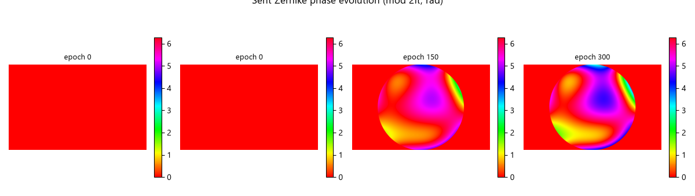

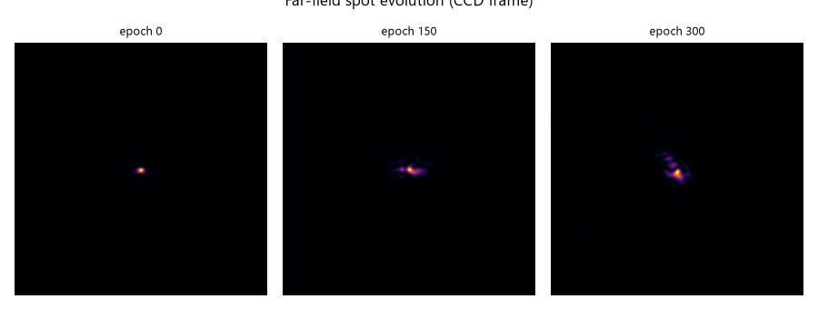

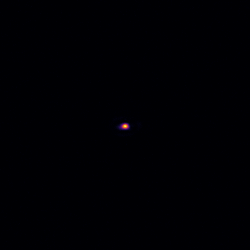

### 解读

- 目标 J (max, 越大越好): 初始 -1.3442 → 最佳 -1.0778 (epoch 288) → 末轮 -1.1271。
- 框内能量 `_p%` 从 1.0152 到 末轮 1.0008 (最佳 1.0152): 低阶 Zernike 主要做波前校正/聚焦, 并非真正的方形成形 (方形需要全像素自由度, 见 AGENTS.md 反模式)。
- ⚠️ **末轮劣于最佳 0.0493**: 优化器退出时会把 SLM 停在**最佳**相位 (epoch 288), 而非末轮相位。报告成绩应引用最佳值, 末轮值仅反映退出瞬间的抖动。
- 相位图展示 15 个 Zernike 模式 (n≤4) 的加权合成; 远场图展示 0 级光斑的 FFT 传播结果。

## 3.2 运行 `static` (目录 `20261001_121544`)

目标函数 `shape`, 搜索方向 **max** (越大越好)。

- **干扰**: 体制 `static`; Cn2=2e-13, 距离=500 m, 热晕 PV=0.3 waves; 实测 σ_total=0.5658 rad (0.0901 waves), 屏幕数=1, 评估次数=604

| 项目 | 值 |
|---|---|
| epoch 数 | 301 |
| 初始 J (epoch 0) | -1.3442 |
| 最佳 J (epoch 61) | -1.1246 |
| 末轮 J (epoch 300) | -1.2626 |
| 初始框内能量 _p% | 1.0152 |
| 最佳框内能量 _p% (epoch 0) | 1.0152 |
| 末轮框内能量 _p% | 0.9899 |
| 搜索配置 | {'epochs': 300, 'delta': 0.5, 'objective': 'shape', 'target_shape': 'square', 'target_size': 120.0, 'max_roi_energy_loss': 0.6, 'cam_type': 'sim', 'cam_id': 0, 'exposure_time_ms': 80.0, 'cam_size': 512, 'center': 'shape', 'lr': 0.0, 'n_eval_frames': 1, 'noise_gate_k': 3.0, 'fold_ratio': 0.5, 'optimizer_type': 'adamod', 'n_max': 4, 'zernike_radius': 600.0, 'slm_number': 1, 'slm_wavelength': 1064} |

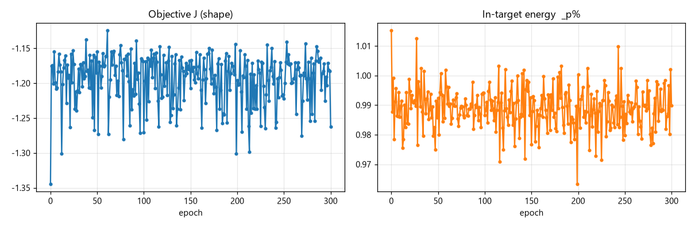

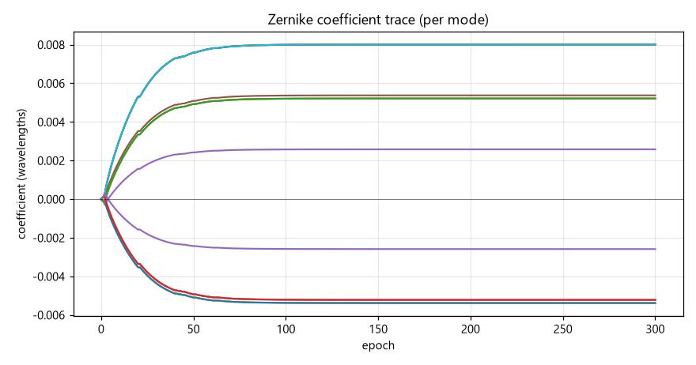

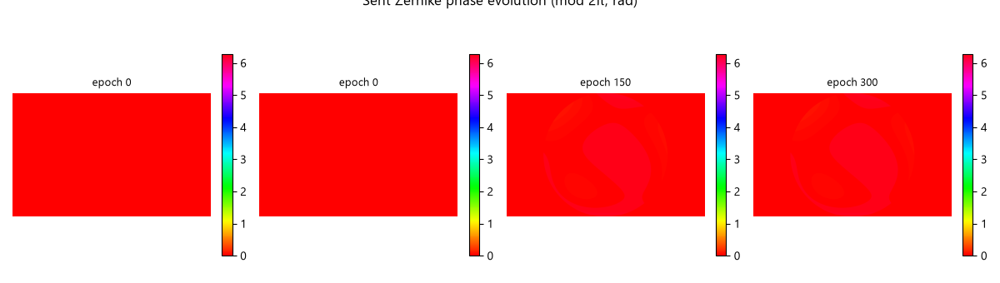

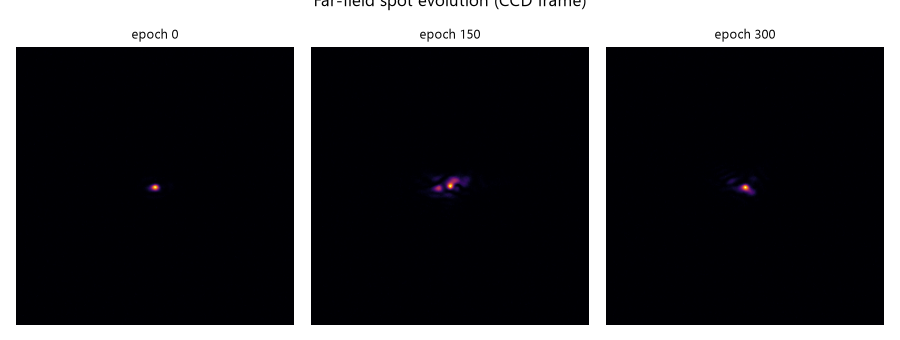

### 解读

- 目标 J (max, 越大越好): 初始 -1.3442 → 最佳 -1.1246 (epoch 61) → 末轮 -1.2626。
- 框内能量 `_p%` 从 1.0152 到 末轮 0.9899 (最佳 1.0152): 低阶 Zernike 主要做波前校正/聚焦, 并非真正的方形成形 (方形需要全像素自由度, 见 AGENTS.md 反模式)。
- ⚠️ **末轮劣于最佳 0.1380**: 优化器退出时会把 SLM 停在**最佳**相位 (epoch 61), 而非末轮相位。报告成绩应引用最佳值, 末轮值仅反映退出瞬间的抖动。
- 相位图展示 15 个 Zernike 模式 (n≤4) 的加权合成; 远场图展示 0 级光斑的 FFT 传播结果。

## 4. 结论

0. **干扰已注入, 且 static/dynamic 在数据上可区分**: 见 §2。`static` 的逐次评估干扰 RMS 为常数 (全程复用唯一一张冻结相位屏), `dynamic` 则逐次变化 (每次光学评估重抽一张独立相位屏)。该判据由图 `*_disturbance_rms.png` 与 companion 归档直接给出, 不是文字断言。
1. **管线验证通过**: `slm-pib` 的 SPGD 闭环在纯仿真下可端到端运行, 无需硬件, 调试产物 (PKL/JSON/PNG) 与硬件运行格式一致, 可直接用于离线报告生成。
2. **仿真模型合理**: 2f-Fourier FFT 远场使 Zernike 相位对光斑产生真实可测的影响 (非零梯度), 与硬件 2f 光路 (SLM 前焦面 → 透镜 → CCD 后焦面) 一致。
3. **低阶 Zernike 的局限**: 与 AGENTS.md 反模式一致, n≤4 的 Zernike 是圆对称光滑基, 无法合成真正的方形远场; 本报告的方形目标用于验证 **目标函数 + 闭环反馈链路**, 而非真正的方形成形 (后者需 freeform/全像素相位, 如 `spgd-square --basis freeform`)。
4. **可复用**: 报告生成器完全离线, 任何一次 `slm-pib --debug` 运行 (仿真或硬件) 的调试产物都能用本脚本重新出报告。
