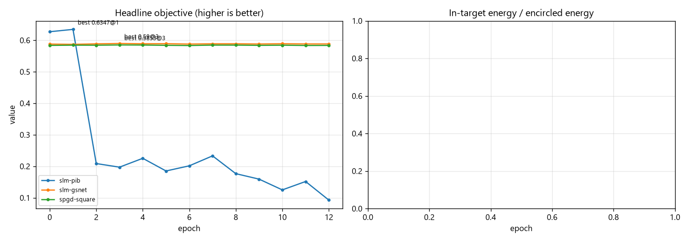
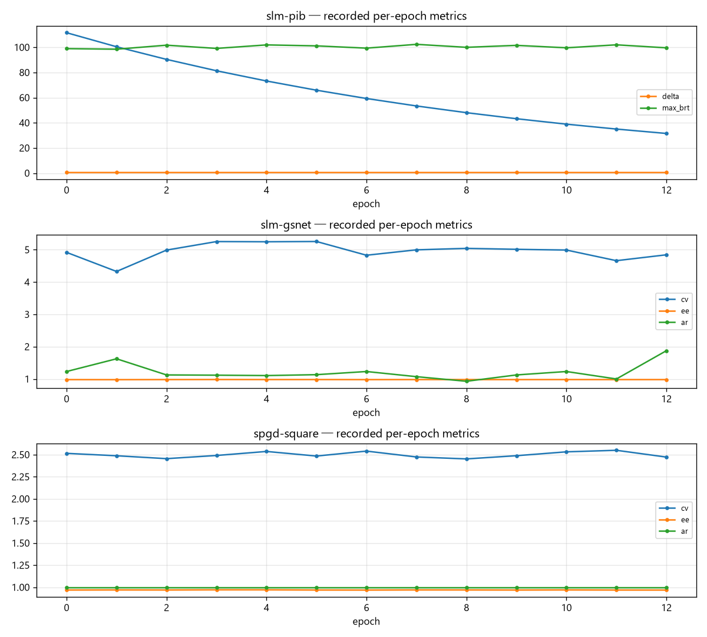
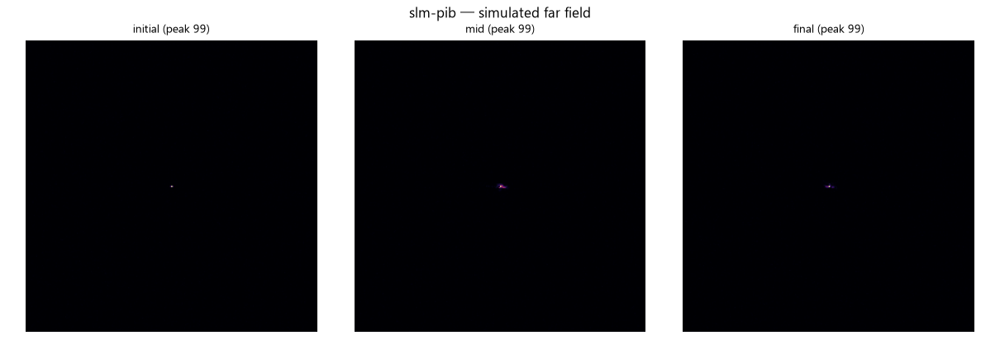
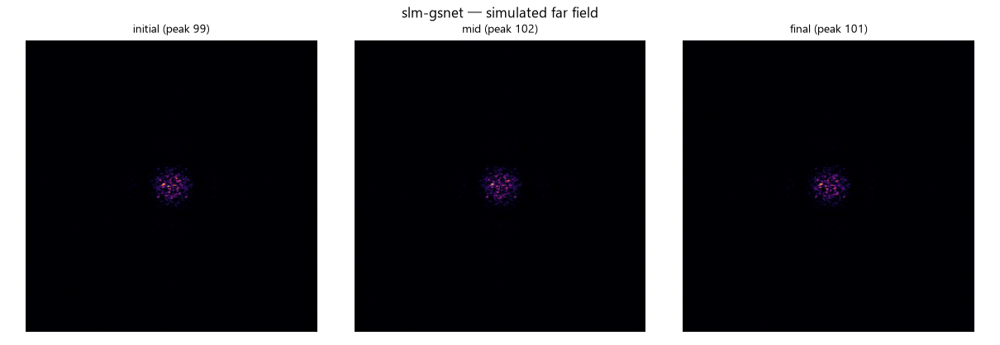

# SLM 整形仿真运行报告 (2f-Fourier 数字孪生)

<!-- provenance:start -->
> **生成脚本**: [`scripts/generate_slm_shaping_sim_report.py`](../../scripts/generate_slm_shaping_sim_report.py)
> **复现命令**: `python scripts/generate_slm_shaping_sim_report.py`
> **数据/关联脚本**: [`scripts/run_sim_bench.py`](../../scripts/run_sim_bench.py)
> **运行环境**: 离线
> **说明**: SLM+CCD 整形仿真: 三个 SLM 族 runner 的收敛与 DM 族烟测对照
<!-- provenance:end -->

**生成时间**: 2026-10-01 07:50:18

**Fully offline** — 本报告由 `scripts/generate_slm_shaping_sim_report.py` 离线生成, 仅读取磁盘上的调试产物 (PKL / CSV), 不打开任何硬件、不重跑优化。

## 1. 光学模型与适用范围

SLM 位于 2f 光路前焦面, CCD 位于后焦面, 因此 CCD 图像 = SLM 瞳孔场的 2D FFT(夫琅禾费远场), 0 级光斑位于帧中心。

本报告**只覆盖 SLM 驱动的 3 个 runner**。`pib` / `combined` 驱动的是 DM, 而 `SimPibSystem` 中**没有任何代码把 DM 电压映射为相位** —— 它们的循环能跑完, 但目标函数与 DM 无关(纯噪声)。因此这两个 runner **只作为控制环冒烟测试列出, 不画收敛曲线**, 详见 `drivers/sim/AGENTS.md`。

## 2. 运行结果 (SLM 家族)

> ⚠️ **本次为冒烟预算 (最短仅 13 epoch), 不构成收敛性结论。** 「最佳」一列取的是噪声驱动的单点最大值, 常常落在第 0~3 个 epoch; 判断算法是否真的收敛需要把 `--epochs` 提高到数百以上再复跑。

| runner | epoch 数 | 指标 | 初始 | 最佳 | 最佳 epoch | 末轮 |
|---|---|---|---|---|---|---|
| `slm-pib` | 13 | `_p%` | 0.6272 | **0.6347** | 1 | 0.09282 |
| `slm-gsnet` | 13 | `quality` | 0.588 | **0.59** | 3 | 0.5884 |
| `spgd-square` | 13 | `quality` | 0.5838 | **0.5853** | 3 | 0.5837 |

- `slm-pib` 末轮附加指标: `_max_r` 末轮 31.52; `delta` 末轮 0.5; `max_brt` 末轮 99.58
- `slm-gsnet` 末轮附加指标: `cv` 末轮 4.843; `ee` 末轮 0.9807; `ar` 末轮 1.875
- `spgd-square` 末轮附加指标: `cv` 末轮 2.472; `ee` 末轮 0.9682; `ar` 末轮 1

## 3. DM 家族 (仅控制环冒烟测试, 不代表优化性能)

| runner | 状态 | 耗时 (s) | 产物数 | 说明 |
|---|---|---|---|---|
| `combined` | ok | 6.73 | 1 | DM voltage is not mapped to phase by SimPibSystem, so the objective is uncoupled; control-loop smoke test only |
| `pib` | ok | 33.78 | 1 | DM voltage is not mapped to phase by SimPibSystem, so the objective is uncoupled; control-loop smoke test only |

> ⚠️ 这些数字**不能**解读为 "SPGD 在 DM-PIB 上不收敛"。真实原因是仿真模型未接入 DM。若要得到有物理意义的 DM 结果, 需用 OOPAO `DeformableMirror` 的影响力函数构建电压→相位矩阵后再跑。

## 4. 结论

1. **SLM 家族 3 个 runner 均可在纯仿真下端到端跑通**, 调试产物与硬件运行同格式, 因此离线报告可在断电状态下重生成。
2. **仿真链路对相位调制是有响应的** —— 上表初始与最佳值可见优化器确实在改变远场, 这与 DM 家族形成对比。
3. **DM 家族(pib / combined)目前只有控制环可执行性, 没有物理意义**, 在补上 DM→相位耦合前不应据此评估算法。
