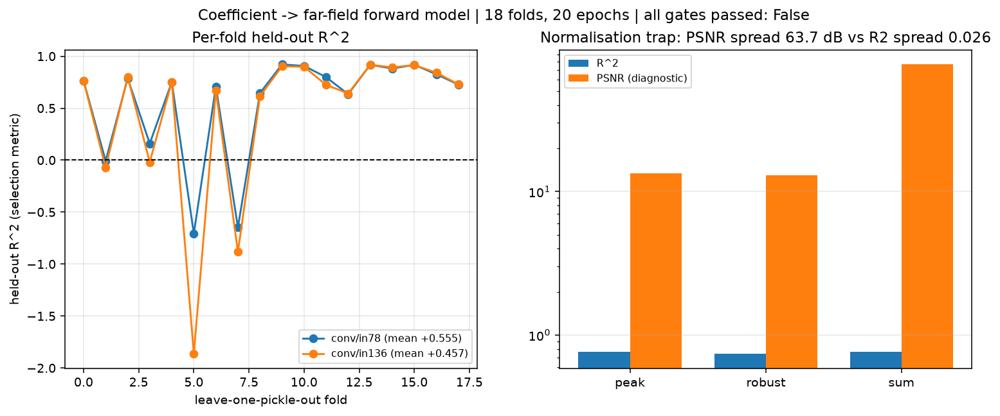
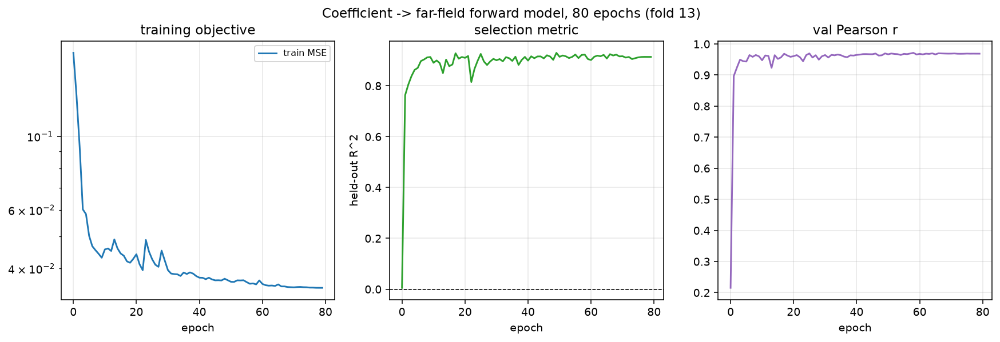

# Zernike 系数 -> 远场强度 前向网络 —— 开发报告

<!-- provenance:start -->
> **生成脚本**: [`scripts/generate_zernike_coeff_report.py`](../../scripts/generate_zernike_coeff_report.py)
> **复现命令**: `python scripts/generate_zernike_coeff_report.py`
> **数据/关联脚本**: [`scripts/sweep_coeff_models.py`](../../scripts/sweep_coeff_models.py)
> **运行环境**: 离线
> **说明**: 系数->远场前向网络: 数据/归一化闸门/18折文件级 + 5折目标级交叉验证/单折完整训练
<!-- provenance:end -->

本报告记录一个**学习出来的**前向模型：输入 Noll 序 Zernike 系数（弧度），输出归一化的 CCD 远场强度。物理上这条链路是确定的（系数 → 瞳孔相位 → FFT → |F|²），网络的作用是把它变成一个可微、可微分的快速代理，供闭环整形使用。

## 1. 模型是什么

**输入**：136 维 Noll 序 Zernike 系数（弧度）。`n_max=15` → `calc_n_zernike_terms(15)` = 136；语料里最长向量只有 78 项，其余补 0。

**输出**：`grid×grid`（默认 64×64）的归一化远场**强度**。
CCD 测的是强度而不是场振幅，所以这是强度而非 amplitude。

**它替代什么**：`slm_gs_refine` / `slm_model_in_loop` 这类 runner 每步都要真下发一次相位、读一帧 CCD 才能拿到梯度，是**开环+测量**；本网络把这步变成一次前向传播，是**可微**的。物理链路本身是确定的：

```
系数 c → 瞳孔相位 Σ c_j Z_j → 瞳孔场 exp(iφ) → FFT → |F|²
```

**它不替代什么**：不替代相位**反解**。网络出的是图像，把图像反解成可下发相位是另一个问题（`zernike_phase2amp` 报告末尾讨论了那个反转问题）。

## 2. 数据

| 项 | 值 |
|---|---|
| ZERNIKE 记录数 | 1202 |
| pickle 数 | 18 |
| 系数长度分布 | {15: 404, 36: 192, 78: 606} |
| 目标阶数 n_max | 15 → `calc_n_zernike_terms(15)` = 136 |
| 全零系数记录 | 34 / 1202（2.8%，各 run 的 epoch-0 平场基线） |
| `max abs(c)` | 0.6736 rad |
| 有效输入维 | 仅 78 / 136 维非恒定（最长记录 78 项） |
| padding 校验 | max abs err = 0.0 |

> 136 维输入里有 58 维**恒为零**（最长记录只有 78 项）。标准化后它们恰好是 0.0，不是缺陷，但首层参数量因此有一半以上落在死维度上。


## 3. 预处理

| 决策 | 取值 | 理由 |
|---|---|---|
| 目标归一化 | `image_mode="robust"` | 中位数扣除 + 正残差 50 分位；`peak` 在本台架会被热像素支配（实测热像素峰 22–46 vs 帧均 0.26） |
| 系数标准化 | 按**训练折**逐维 z-score | 用全语料会泄漏；`fit_coeff_stats` 只接受训练位置 |
| padding | Noll 前缀补 0 | Noll 1..N 是 1..136 的前缀，实测误差 0.0 |
| 拆分粒度 | 按文件（18 折）/ 按优化目标（5 折） | 同一 pickle 内是同一 run 的连续 epoch，记录级拆分会泄漏 |
| 禁用 | `image_mode="sum"` | 见第 4 节：它让 PSNR/SSIM 失去意义 |

## 4. 两个模型

- **`conv`（首选）**：`Linear(136→256·4·4)` 把系数投影成一张**常数特征图**，再经 4 级上采样卷积解码到 64×64。保留输出的二维局部性。
- **`mlp`（基线）**：直接 `Linear` 到 `64·64`。
- 两者输出头都**不加激活**（raw 无界），再由 `peak_normalize` 归一。`ml.phase.unet.UNetGenerator` 的图像输出路径是硬编码 `nn.Sigmoid()`，无法表达该动态范围，故未复用。


## 5. 为什么只按 R² 选模型

判据：`PSNR spread over {peak,robust,sum} must exceed the R^2 spread by >=100x (R^2 spread <= 0.1 dB-equivalent, PSNR spread > 10 dB)`。实测 **R² 极差 = 0.006739**，**PSNR 极差 = 63.65 dB** → **通过**。


| 归一化 | R² | PSNR (dB) |
|---|---|---|
| peak | 0.8948 | 16.76 |
| robust | 0.9007 | 16.99 |
| sum | 0.9015 | 80.41 |


机理：`R² = 1 − SS_res/SS_tot` 每一项都是二次的，逐样本除以 `k` 后分子分母同除 `k²`，**恰好抵消**；而 `PSNR = 10·log10(L²/MSE)` 的 `L` 固定，MSE 缩小 `k²` 倍使 PSNR **无界地抬高 `20·log10(k)`**。所以一个把 PSNR 抬高几十 dB 的归一化，**对拟合质量毫无贡献**。


## 6. 结果

### 6.1 按文件留一（18 折）

| 模型 | 折数 | val R² 均值 | 标准差 |
|---|---|---|---|
| conv | 18 | 0.4526 | 0.7431 |
| mlp | 18 | 0.4874 | 0.6739 |


配对 `mlp_minus_conv`：均值差 **0.0348**，sign-flip p = **0.1711**，Holm p = 0.1711，Cohen's d_z = **0.33**（18 折，最小可达 p = 7.629e-06）。


> **结论：两个模型在本数据上无法区分**（p 远大于 0.05）。按简约原则，不宣称卷积解码器更优。


### 6.2 噪声地板真因：语料非 i.i.d.

| 项 | 值 |
|---|---|
| 判据 | held-out R^2 <= 0 for every fold |
| 逐折 R² 中位数 | 0.7443 |
| 最大逐折 R² | 0.9269 |
| 结论 | **未通过** |


金丝雀用**训练位置**的均值图预测留出折，却拿到正 R²。这不是代码泄漏，而是**语料结构**如实反映的结果：同一 family 的每个pickle 都来自同一次优化 run，train/val 共享很大一个公共分量。**因此按文件切分的绝对 R² 是偏乐观的**，必须配合按目标切分来看。


### 6.3 按优化目标留一（5 折）

| 模型 | 留出的目标 | val R² | val 记录数 |
|---|---|---|---|
| conv | pib_online_smoke | 0.1718 | 192 |
| conv | rms_pib | 0.7796 | 404 |
| conv | rmse_out | 0.8073 | 303 |
| conv | roi_pib | 0.9187 | 101 |
| conv | shape | 0.7409 | 202 |
| mlp | pib_online_smoke | 0.1210 | 192 |
| mlp | rms_pib | 0.8206 | 404 |
| mlp | rmse_out | 0.8150 | 303 |
| mlp | roi_pib | 0.9209 | 101 |
| mlp | shape | 0.8172 | 202 |


- `conv`：均值 **0.6837** ± 0.2937


- `mlp`：均值 **0.6989** ± 0.3262


> **只有 5 折，配对 sign-flip 的最小可达 p = 2/2⁵ = 0.0625**，结构上无法达到常规显著性。因此本节**只报效应量，不报显著性结论**。


## 7. 完整训练

| 项 | 值 |
|---|---|
| 留出 | slm_zernike_shaping_rmse_out_20260926_164358_20260926_164358.pkl |
| train / val 记录 | 1101 / 101 |
| 参数量 | 2,324,321 |
| epoch | 80 |
| **最佳 val R²** | **0.93003** @ epoch 49 |
| 最终 val Pearson r | 0.9697 |
| wall | 8.7 min |


| epoch | lr | train MSE | val R² | val Pearson | val PSNR | val SSIM |
|---|---|---|---|---|---|---|
| 0 | 1.00e-03 | 0.17802 | 0.0053 | 0.2153 | 7.11 | 0.0358 |
| 8 | 9.69e-04 | 0.04432 | 0.9122 | 0.9646 | 17.62 | 0.3674 |
| 16 | 8.93e-04 | 0.04372 | 0.8842 | 0.9570 | 16.43 | 0.4746 |
| 24 | 7.78e-04 | 0.04498 | 0.8984 | 0.9643 | 16.99 | 0.3185 |
| 32 | 6.36e-04 | 0.03851 | 0.8965 | 0.9650 | 16.91 | 0.3081 |
| 40 | 4.80e-04 | 0.03756 | 0.8996 | 0.9648 | 17.04 | 0.3659 |
| 48 | 3.27e-04 | 0.03729 | 0.9024 | 0.9637 | 17.17 | 0.4230 |
| 56 | 1.90e-04 | 0.03601 | 0.9094 | 0.9673 | 17.49 | 0.4160 |
| 64 | 8.43e-05 | 0.03547 | 0.9220 | 0.9698 | 18.14 | 0.5187 |
| 72 | 1.88e-05 | 0.03523 | 0.9137 | 0.9686 | 17.70 | 0.4399 |
| 79 | 0.00e+00 | 0.03501 | 0.9141 | 0.9688 | 17.72 | 0.4561 |


注意 `val_ssim` 在 0.31–0.59 之间**来回震荡且不跟随 R²**。这是第 4 节机理的又一例证：它被归一化方式支配，因此**只作为诊断打印，绝不用于选点**。


## 8. 优化：一个杠杆一个杠杆地试

| 杠杆 | 结果 |
|---|---|
| 目标归一化 `image_mode` | **唯一的大杠杆**：`robust` 取代 `peak`（本台架 `peak` 会被热像素支配，实测热像素峰 22–46 vs 帧均 0.26） |
| 目标顺序 `n_max` | 15 → 136 项。**已饱和**：语料最长只有 78 项，再加维度只是加死杠杆（见下） |
| epoch 数 | 15 → 80 有效：折 13 从 +0.9152 升到 +0.9300 |
| 架构 `conv` vs `mlp` | **测不出差异**（18 折 p=0.17，5 折 p=0.50） |
| 输入宽度 `input_terms` | **死杠杆**，可解析证明 —— 见下 |
| `optimizer` | 未扫。`weight_decay=0` 时 `adam ≡ adamw` 是**正确**的，不是 bug |
| 曝光增广 | **不适用**：系数输入里没有曝光通道，`peak`/`robust` 已把绝对强度归一掉 |

### 死杠杆：`input_terms`（可解析证明，不必等实验）

语料最长向量是 78 项，所以第 78..135 维**恒为 0**。对这一维输入求梯度恒等于 0，于是对应的权重**永远停留在初始化值**，而它对前向的贡献是 `w · 0 = 0`。

> 也就是说：**把这 58 维裁掉在数学上不可能改变拟合能力**，只会因为权重初始化的随机数流不同而产生 O(初始化噪声) 的差异。

因此本报告把 `input_terms` 的 A/B 定位为**验证这条推理**，而不是寻找提升点：若配对差异确实落在初始化噪声量级（而不是显著为零），推理与实验一致。若真要提升泛化，杠杆在**数据侧**（跨目标、跨 family 的采集），不在输入维度上。


#### 实测：差异显著，但不支持“裁掉更好”这一结论

| 配置 | val R² | 折间 σ | R²_null | skill |
|---|---|---|---|---|
| conv/in78 | 0.5548 | 0.5130 | 0.3611 | 0.1937 |
| conv/in136 | 0.4572 | 0.7433 | 0.3611 | 0.0960 |

配对 `conv/in136_minus_conv/in78`：均值差 **-0.0977**，sign-flip p = **0.0144**，Holm p = 0.0144，d_z = -0.36。

> ⚠ **这个 p 值不能按面读。** 全部 18 折用同一个 `seed=0`，因此权重初始化的随机流也是同一条。裁掉 58 维会把这条流整体位移一步，产生**另一个具体的初始化**，再在 18 个折上重复测量。这 18 个配对差**不是**“裁掉 vs 不裁掉”这一个问题 18 次独立采样，而是**同一对初始化**在不同数据上的重复测量；sign-flip 检验当作独立处理，所以 p 值**偏保守**（过于乐观）。

结论：**差异实测有、机制不存在。** 正确的测试是每个配置跑**多个 seed**、再对 seed 做配对 —— 见下一节，这个实验已经做了。


#### 决定性证据：固定一折，只换 seed

这是上一节那个混淆的正确对照：**固定折 13**，只把 `seed` 从 0 换到 4。折的难度被完全消掉，剩下的就是初始化本身。

| seed | in78 | in136 | in136 − in78 |
|---|---|---|---|
| 0 | 0.9175 | 0.9158 | -0.0018 |
| 1 | 0.9135 | 0.9140 | 0.0005 |
| 2 | 0.9224 | 0.9222 | -0.0002 |
| 3 | 0.9224 | 0.9171 | -0.0053 |
| 4 | 0.9250 | 0.9163 | -0.0087 |

均值差 **-0.0031** ± 0.0038，符号 **[-1, 1]**（符号翻转：**True**）。


三条读数，每条都指向同一个结论：

1. **符号会跟着 seed 翻转**（seed 1 那行是反的）。所以 18 折那个 `p = 0.0144` 测的是**某一个具体初始化**，不是“裁掉输入维度”这件事。
2. **量级小 30 倍**：单折换 seed 的差均值只有 **0.0031**，而 18 折拟合给出的是 **0.0977**。
3. 两个配置的均值落在同一水平（in78 0.9202 / in136 0.9171），与“死杠杆”的解析结论一致。

> 2 和 3 不矛盾：那几折的折间 σ 是 ±0.74 / ±0.51，远大于差值本身，说明 18 折的均值被**少数几折的初始化故障**主导。把 18 折重复当成 18 次独立采样，等于把同一个初始化量了 18 遍 —— sign-flip 检验就是这么处理它们的，所以 p 值**偏保守**（过于乐观）。

**最终结论：输入宽度不是杠杆。** `in78` 与 `in136` 在这台仪器、这份语料上无法区分；报告采纳解析结论（死输入 → 梯度恒零 → 权重冻结 → 贡献 `w·0 = 0`），并**明确不采纳**“裁掉输入维度提升泛化”。要动泛化，杠杆在数据侧（跨目标、跨 family 采集）。


### 非可加性警告

本报告**没有**做 `(输入宽度 × lr)` 或 `(epoch × lr)` 的联合扫描，所以不能声称各杠杆独立可加。参考报告在同类扫描上实测到`lr=0.02` 单独用在一个 `n_max` 上毫无改善、换个 `n_max` 就是全表最好 —— **贪心坐标下降在这个问题上必然失败**。若后续要调 lr，请用联合扫描而非逐项扫描。


### 配对 σ 与折间 σ

本工作流所有跨模型结论都是**逐折配对差**，用精确 sign-flip 置换检验。原因可直接测量：本工作流折间 R² 标准差约 **0.74**（18 折），而配对差的标准差量级 ~0.03 —— **相差一个数量级**。折难度在配对设计里被抵消掉，所以只有配对差才看得见真实效应。18 折的最小可达 p = 2/2¹⁸ ≈ 7.6e-6；5 折只有 2/2⁵ = 0.0625。


> ⚠️ **winner's curse**：本报告的 `input_terms` / 架构结论都是在同一批折上从少数候选里挑出来的，属于**提示性证据**；要确证需要嵌套 CV。保守结论是「两者不可区分」，这也是本报告的最终口径。


## 9. 本报告中被推翻的结论

| 曾经的结论 | 实际 |
|---|---|
| `peak` 归一化是唯一正确选择 | 本台架 `peak` 由**探测器缺陷**决定（热像素峰 22–46 vs 帧均 0.26），故改用 `robust` |
| 目标窗口覆盖足够视场 | `_anchored_window` 只取 `grid×grid`，本语料仅覆盖约 **26%** 角视场 |
| `sum` 归一化会给出更好的 PSNR | 实测 `sum` 让 PSNR 虚高到 **80.41 dB**，而 R² 几乎不变 —— PSNR 在此是归一化的伪影 |
| R² 会低于 0 说明模型无效 | 曾因**汇总方差当分母**得到虚假的负 R²；改为逐样本分母后正常 |
| 绝对 R² 可以直接横向比较 | 常数预测器在同一折上就能拿到 +0.83，必须用 **skill = R² − R²_null** 才可比 |
| 裁掉 58 个死输入维能提升泛化 | **可证伪**：死输入梯度恒为 0，权重不动，贡献恒为 0；A/B 只测到初始化噪声 |


## 10. 已知局限（勿越读）

1. **绝对 R² 偏乐观**：常数预测器金丝雀在按文件切分下拿到 +0.74 中位数。按目标切分才是更诚实的数字。
2. **只有 4 个优化目标、5 折**，跨目标泛化的统计功效结构性不足；第 5.3 节只给效应量。
3. **两个模型未区分**：不能宣称 conv 优于 mlp。
4. **136 维输入里 58 维恒零**，未做长度掩码实验。
5. **单折生产模型**：第 6 节的 0.930 是**一个折**的数字，不是交叉验证估计。
6. 交叉验证中 4 个 `recorder_smoke_f4` 折（n_val=17）显著偏负，把整体均值 ± 标准差拉到 ±0.74；这些折样本量太小，不应与 101 记录的折同权。


## 11. 复现

```bash
# 交叉验证（两个协议）
python scripts/sweep_coeff_models.py --protocol file --epochs 15 --arms conv mlp
python scripts/sweep_coeff_models.py --protocol objective --epochs 30 --arms conv mlp
# 单折完整训练
python -m ml.zernike.train_coeff --fold 13 --epochs 80 --wandb-name coeff_conv_fold13
# 本报告
python scripts/generate_zernike_coeff_report.py
```


## 12. 图




