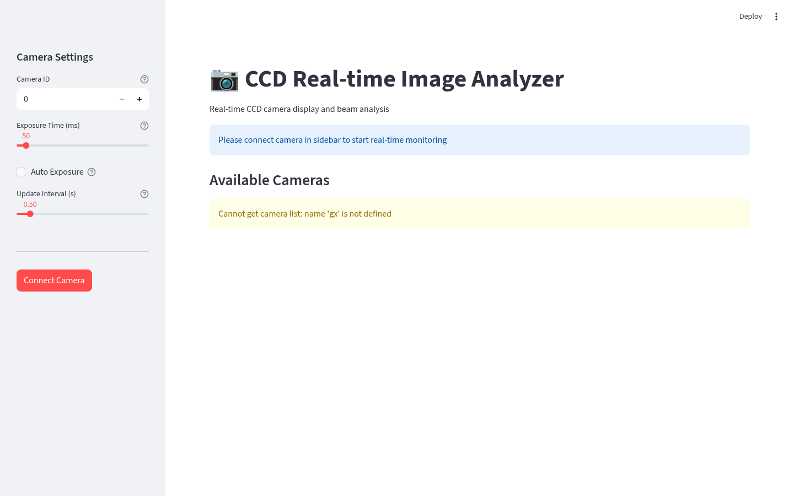

# CCD 包 (`ccd/`)

CCD 相机实时图像分析的 Streamlit 界面。

## 文件说明

| 文件 | 作用 |
|------|------|
| `ccd_analyzer.py` | CCD 实时图像分析：相机连接、实时显示、光束分析 |

## 运行

```bash
streamlit run src/ao_shaping/gui/streamlit_helper/ccd/ccd_analyzer.py
```

## 依赖

- 需要大恒相机 SDK（`gxipy`，位于 `libs/`）或 MIICAM SDK。缺少 SDK 时界面仍可加载，但相机列表不可用（显示 `Cannot get camera list`）。

## 界面截图


