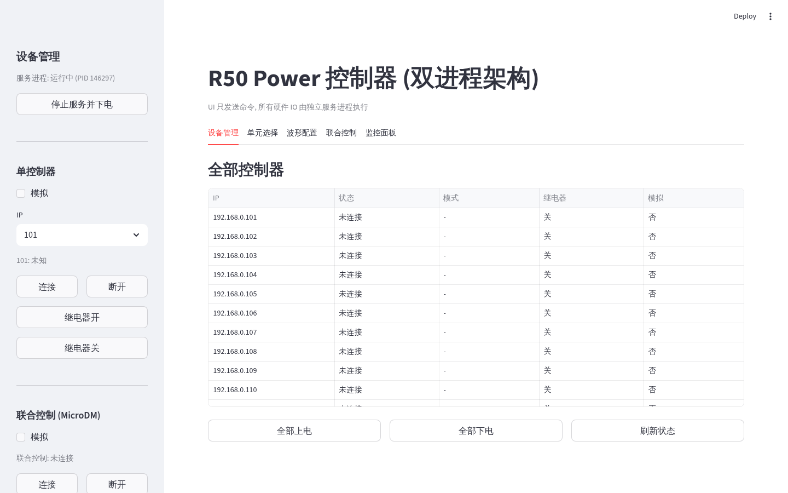
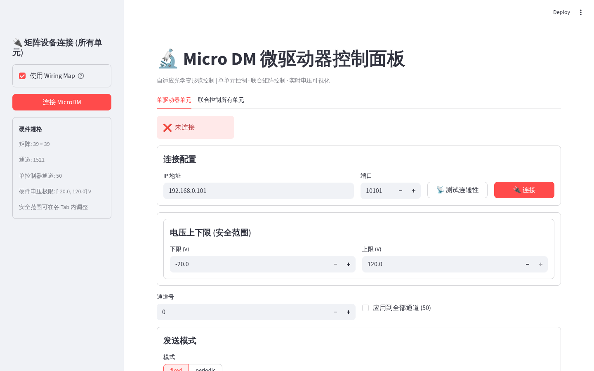
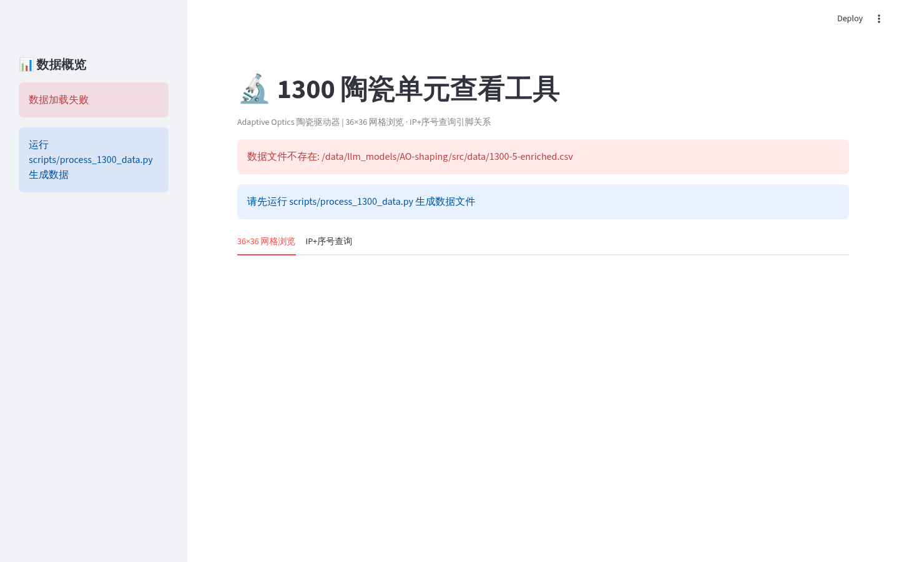

# R50 控制器包 (`r50_controller/`)

R50Power 控制器（MicroDM / 50通道高压电源）的 Streamlit 控制界面与双进程控制服务。

## 架构：双进程

```text
┌─────────────────────────────┐        mp.Queue         ┌──────────────────────────────┐
│  Streamlit UI 进程           │ ──────ServiceCommand──▶ │  R50ControlService 子进程      │
│  r50_controller_ui.py        │ ◀─────ServiceStatus──── │  r50_control_service.py       │
│  · 只发命令 / 只读状态        │                         │  · 独占全部硬件 IO (TCP)       │
│  · 不直接访问硬件            │                         │  · 波形引擎 / 继电器 / 36×36   │
└─────────────────────────────┘                         └──────────────────────────────┘
```

- **UI 进程** (`r50_controller_ui.py`)：通过 `R50ServiceClient` 发送 `ServiceCommand`、轮询 `ServiceStatus`，零硬件逻辑。
- **服务进程** (`r50_control_service.py`)：由 `start_service()` 以 `spawn` 方式启动，独占 R50Power TCP 连接、波形循环、继电器与联合 36×36 矩阵。

### 安全保证（内置）

1. 断开设备前先下电继电器（`power_off_and_close`）。
2. 波形停止时自动向目标单元发送 0V。
3. 命令看门狗：波形运行中 30s 无命令 → 自动停止波形并全部下电。
4. 父进程看门狗：UI 进程退出后服务自动安全关闭，不留孤儿进程、不残留上电设备。

## 文件说明

| 文件 | 作用 |
|------|------|
| `r50_controller_ui.py` | **新主界面**（5 个页签：设备管理 / 单元选择 / 波形配置 / 联合控制 / 监控面板），`st.fragment(run_every=0.5)` 实时刷新 |
| `r50_service_client.py` | UI 侧命令发送 + 状态轮询封装 |
| `r50_control_service.py` | 服务进程：`ServiceCommand`/`ServiceStatus`/`WaveformConfig` 数据类、`WaveformEngine`、三种 `ControllerAdapter`、`start_service()` |
| `r50_channel_select.py` | 配置常量、CSV 接线索引 (1300-5-enriched.csv)、通道选择模型 |
| `r50_connection.py` | 控制器工厂、模拟控制器（`SimulatedR50Controller`/`SimulatedMicroDM`）、下电安全、连通性探测 |
| `r50_voltage_send.py` | 电压下发工具与旧波形循环（新波形引擎在 service 中，此处保留兼容） |
| `micro_dm_ui.py` | 旧单体 MicroDM UI（原样保留） |
| `ceramic_viewer.py` | 陶瓷件查看器 |

> `streamlit_helper/` 旧路径的迁移前单体文件已删除；所有应用与逻辑均位于各子包内（`r50_controller/`、`slm/`、`zernike/`、`ccd/`）。

## 运行

```bash
# 新双进程主界面
streamlit run src/ao_shaping/gui/streamlit_helper/r50_controller/r50_controller_ui.py

# 旧版单体界面（原样保留）
streamlit run src/ao_shaping/gui/streamlit_helper/r50_controller/micro_dm_ui.py
```

左侧栏可分别连接 单控制器 / 联合控制(MicroDM) / 组控制 三种模式（支持模拟开关），波形与下发命令按目标 IP 自动路由到对应适配器。

## 测试

```bash
pytest tests/ao_shaping/gui/streamlit_helper/r50_controller/
```

覆盖：波形引擎纯数学、三种适配器（模拟硬件）、服务命令处理、真实 spawn 进程端到端。

## 界面截图






