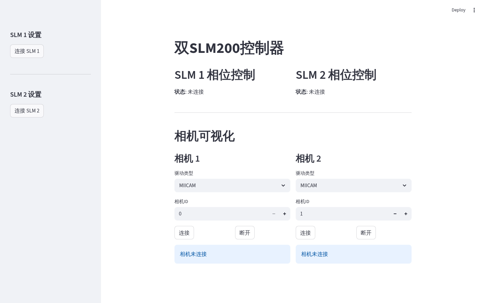
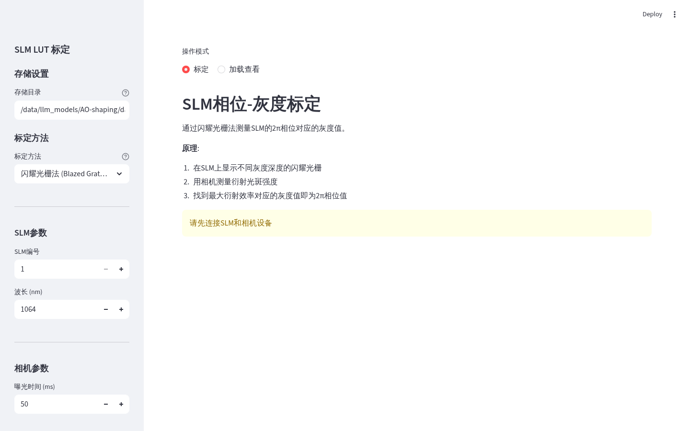

# SLM 包 (`slm/`)

Santec SLM200 空间光调制器相关的 Streamlit 界面。

## 文件说明

| 文件 | 作用 |
|------|------|
| `multi_slm_controller.py` | 多 SLM 控制界面：灰度相位生成、SLM 写入 |
| `slm_calibration_ui.py` | SLM 校准界面 |

## 运行

```bash
streamlit run src/ao_shaping/gui/streamlit_helper/slm/multi_slm_controller.py
streamlit run src/ao_shaping/gui/streamlit_helper/slm/slm_calibration_ui.py
```

## ⚠️ SLM 使用关键规则（详见根 README / AGENTS.md）

1. **平场灰度路径**：平场相位必须用 `np.full((h, w), gray, dtype=np.uint16)` 直接下发，**禁止**经过 `create_phase_from_array()`（该函数按弧度处理，会静默损坏 uint16 灰度值）。
2. **内存槽轮换**：连续写相位时轮换不同内存槽（如 `itertools.cycle([3,4,5])`）。对正在显示的槽再次 `display_memory(slot)` 是 no-op，LCOS 面板不会刷新。

## 界面截图




