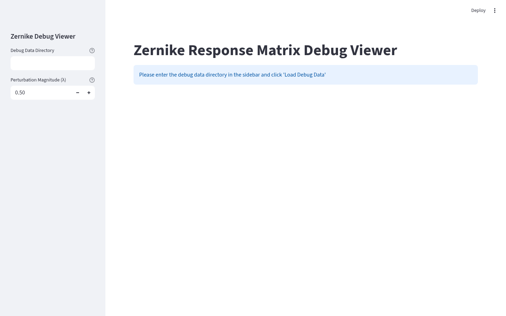

# Zernike 包 (`zernike/`)

Zernike 响应矩阵与调试相关的 Streamlit 界面。

## 文件说明

| 文件 | 作用 |
|------|------|
| `zernike_response_matrix_ui.py` | Zernike 响应矩阵校准界面（⚠️ 当前有预置导入问题，见下） |
| `zernike_debug_viewer.py` | Zernike 调试数据查看器（需要 `plotly`，属于 `disp` extra） |

## 运行

```bash
streamlit run src/ao_shaping/gui/streamlit_helper/zernike/zernike_debug_viewer.py
```

## 已知问题

- `zernike_response_matrix_ui.py` 顶部 `from ao_shaping.drivers.wfs.ThorlabWFS import WFSManager` 引用了不存在的模块名（实际模块为 `thorlab_wfs.py`），该问题在本次包重组**之前**就已存在（文件为原样移动）。修复需将导入改为 `ao_shaping.drivers.wfs.thorlab_wfs`。
- `zernike_debug_viewer.py` 依赖 `plotly`：`uv sync --extra disp` 或 `uv pip install plotly` 后可用。

## 界面截图


